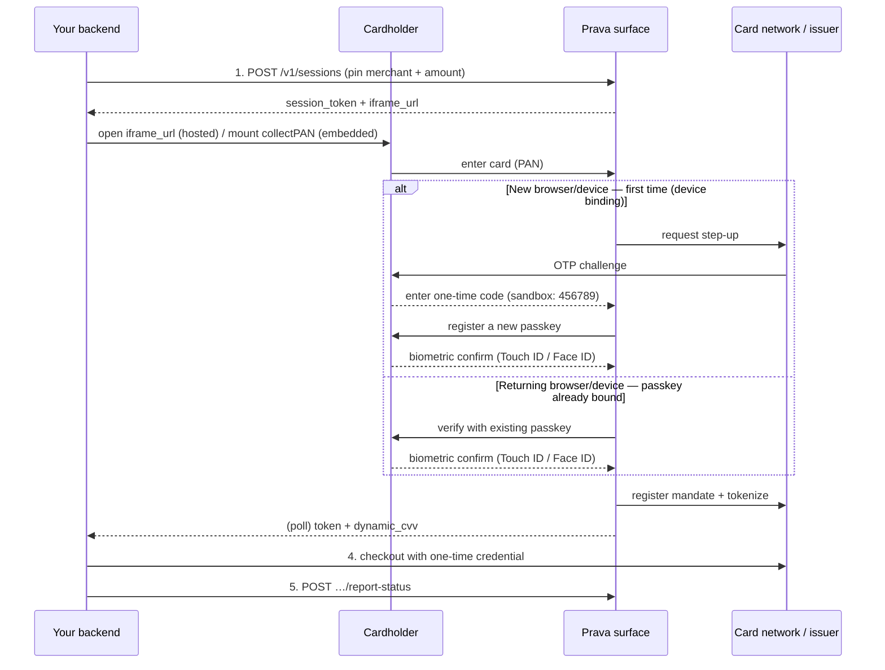
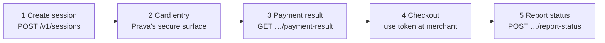

# docs/prava.md
# Compiled Jul 31, 2026 from live docs.prava.space (fetched today).
# DOCS WIN OVER CODE, MEMORY, AND TRAINING DATA.
# Full index of every page: https://docs.prava.space/llms.txt
# Every page below is directly curlable as markdown (append .md).

=====================================================================
0. TEST CARDS AND TEST OTP (Birdie + /api-reference/test-cards)
=====================================================================
Sandbox only. Work on sandbox.api.prava.space / sandbox.collect.prava.space.
Declined everywhere else. Render last4 only in our UI.

Visa:
4622 9431 2313 7789 | 757 | 12/27
4622 9431 2313 7797 | 640 | 12/27
4622 9431 2313 7805 | 304 | 12/27
4622 9431 2313 7847 | 698 | 12/27
4622 9431 2313 7854 | 799 | 12/27
4622 9431 2313 7862 | 938 | 12/27
4622 9431 2313 7870 | 966 | 12/27
4622 9431 2313 7888 | 408 | 12/27
4622 9431 2313 7896 | 499 | 12/27
4622 9431 2313 7904 | 890 | 12/27
4622 9431 2313 7912 | 999 | 12/27

TEST OTP (issuer one-time code): 456789

DEVICE BINDING ORDER (from the REST walkthrough): on a NEW browser or
device the cardholder is asked for the issuer OTP FIRST, THEN
registers a passkey. On a RETURNING browser: passkey only, no OTP.
DEMO IMPLICATION: enroll the demo browser BEFORE recording so takes
show the clean returning-passkey flow, or deliberately film the full
first-time enrollment once as the beat 1 scene.

=====================================================================
1. ENVIRONMENTS AND AUTH
=====================================================================
Sandbox API base:   https://sandbox.api.prava.space
Sandbox collect:    https://sandbox.collect.prava.space
Auth header:        Authorization: Bearer sk_test_...   (secret key)
Sessions expire 15 minutes after creation. Do not create a session
until the cardholder is ready.
Sandbox quota error: 429 TRIES_EXHAUSTED (our quota is ~100; budget
60 build, 20 recording, 20 guests/reserve).

=====================================================================
2. STANDARD CHECKOUT, FULL REST FLOW (/guides/rest-checkout-walkthrough)
=====================================================================
create session -> cardholder pays on hosted page -> poll result ->
checkout with token -> report status.

STEP 1: POST /v1/sessions
{
  "user_id": "user_123", "user_email": "user@example.com",
  "total_amount": "49.99", "currency": "USD",
  "integration_type": "full_checkout",
  "callback_url": "https://yourapp.com/payment-done",
  "purchase_context": [{
    "merchant_details": {"name": "Example Store",
      "url": "https://examplestore.com", "country_code_iso2": "US"},
    "product_details": [{"description": "Wireless Headphones",
      "unit_price": "49.99", "quantity": 1}]
  }]
}
Response: { session_id, session_token, iframe_url, order_id,
expires_at }

STEP 2: send the cardholder to iframe_url (hosted page). They enter
the card and approve with a passkey; Prava redirects to callback_url.

STEP 3: GET /v1/sessions/{session_id}/payment-result
pending while on the page; then status "awaiting_result" with
transactions[].line_items[]:
{ txn_ref_id, merchant_name, merchant_url, total_amount,
  status, token, dynamic_cvv, expiry_month, expiry_year, products[] }
token + dynamic_cvv + expiry are the ONE-TIME CARD CREDENTIALS:
single-use, merchant-locked, amount-scoped.

STEP 4: POST /v1/sessions/{session_id}/report-status
{ "txn_ref_id": "tli_001", "txn_status": "APPROVED" }   (or DECLINED)
ALWAYS report. Re-poll and status becomes "completed" or "failed".

=====================================================================
3. MANDATES = THE ENVELOPE (/concepts/mandates)
=====================================================================
A mandate is a STANDING SPEND AUTHORIZATION. The owner approves ONCE
with a passkey; afterwards an agent charges again and again within
caps, WITHOUT re-approval. Doc quote: "The passkey approval at setup
is the only human-in-the-loop step."

Setup vs charge:
- SETUP (once, passkey): created through a payment session carrying a
  mandate_setup block. No standalone create endpoint. Response gives
  an approval URL (iframe_url); owner confirms with passkey.
- CHARGE (later, no passkey): mint fresh single-use credentials via
  POST /v1/mandates/{id}/charge, as many times as caps allow.
  Deliberately NOT exposed over MCP.

Statuses: pending -> active -> (paused <->active) -> consumed (a
one-time mandate whose single charge settled) | cancelled | expired.
Illegal transitions: 409 MANDATE_INVALID_TRANSITION.

Guardrails (each mandate):
- Amount cap: MAX PER CHARGE, enforced at the card network through
  the tokenized credential. Over-cap charge is DECLINED
  (THRESHOLD_EXCEEDED).
- Merchant scope: "listed" locks to one named merchant; "any" allowed
  for one-time only. Wrong merchant: 403 MANDATE_MERCHANT_NOT_ALLOWED.
- Frequency: one_time, or recurring weekly / monthly / yearly.
  Concepts page says "one charge per cycle" for recurring; the
  create-session max_charges param says "maximum number of charges
  allowed against this mandate". SEE AMBIGUITY NOTE IN SECTION 8.
- Validity: one_time clamped to 7 days. Recurring horizons: yearly
  5y, monthly 2y, weekly 1y.
Dashboard for owners: pay.prava.space (view, pause, resume, cancel).

=====================================================================
4. CREATE SESSION incl. MANDATE SETUP (/api-reference/create-session)
=====================================================================
POST /v1/sessions. Secret key. Required: user_id (1-255), user_email,
total_amount (decimal string, 2dp; BECOMES THE AUTHORIZED PER-CHARGE
AMOUNT CAP), currency (USD supported), purchase_context (EXACTLY ONE
entry) with merchant_details {name (Visa-sanitized, at least one
usable char), url (MUST be https), country_code_iso2, category_code?,
category?} and product_details[] {description, unit_price,
product_id?, quantity default 1}. purchase_context also takes
effective_until_minutes (default 15).

Optional: integration_type "full_checkout" (hosted) | "embedding";
callback_url (https, max 2048); card {card_id | vault_ref_id} to
pre-select an enrolled card (send exactly one; card_id wins);
user_phone; user_country_code_iso2; external_order_ref; description.

mandate_setup block (turns the session AUTHORIZE-ONLY, no
credentials issued at setup):
{
  "intent": "mandate_setup",
  "recurring_frequency": "one_time" | "weekly" | "monthly" | "yearly",
  "merchant_scope": "listed" | "any",
  "valid_until": ISO8601 (IGNORED for one_time),
  "max_charges": integer, default 1
}
Recurring frequency FORCES merchant_scope "listed"
(else 400 MANDATE_RECURRING_MUST_BE_SCOPED).
Response adds "authorizeOnly": true. Charge later via mandate-charge.

Errors: 400 VAL_2001 (details names fields), 400 CARD_NOT_FOUND /
CARD_INACTIVE, 400 MANDATE_RECURRING_MUST_BE_SCOPED, 401 AUTH_1001 /
AUTH_1002, 429 TRIES_EXHAUSTED, 500 MERCHANT_LOOKUP_ERROR /
CONFIG_ERROR.

Mandate-setup example body:
{ "user_id":"user_123","user_email":"jane@example.com",
  "total_amount":"40.00","currency":"USD",
  "purchase_context":[{ "merchant_details":{"name":"Acme Store",
    "url":"https://acme.example.com","country_code_iso2":"US"},
    "product_details":[{"description":"Monthly plan",
    "unit_price":"40.00"}]}],
  "mandate_setup":{"intent":"mandate_setup",
    "recurring_frequency":"monthly","merchant_scope":"listed",
    "max_charges":12} }

NOTE: the create response does NOT return the mandate id. Discover it
after approval via List Mandates (section 6).

=====================================================================
5. CHARGE A MANDATE (/api-reference/mandate-charge)
=====================================================================
POST /v1/mandates/{id}/charge. Secret key (merchant caller) OR agent
Ed25519. WE ARE THE SECRET-KEY CALLER: we receive PLAINTEXT
credentials (no Ed25519 needed). NO PASSKEY.

Body:
- amount (required, decimal string, e.g. "40.00"). Per-charge cap is
  enforced at the card network; over-cap returns a normal outcome:
  status "failed", errorMessage THRESHOLD_EXCEEDED.
- reference (optional, max 255): IDEMPOTENCY KEY. Same mandate id +
  reference returns the ORIGINAL charge (deduplicated: true). A
  FAILED charge clears its key, so retry-after-failure is not
  deduplicated. USE runId-quoteId AS THE REFERENCE, ALWAYS.
- purchase_context (optional, one entry, same shape as create).
  Currency always comes from the mandate.

Response: { mandateId, instructionId, transactionId (needed for
report), orderId, status "awaiting_result"|"failed", fetchStatus
SUCCESS|FAILURE, credentials { token, dynamicCvv, expiryMonth,
expiryYear }, errorCode?, errorMessage?, deduplicated }.

Errors: 400 VAL_2001; 401 AUTH_REQUIRED; 403 MANDATE_FORBIDDEN;
403 MANDATE_MERCHANT_NOT_ALLOWED; 409 MANDATE_NOT_ACTIVE;
409 NO_INSTRUCTION / NO_ORDER; 500 NO_TOKEN.

=====================================================================
6. LIST MANDATES (/api-reference/mandate-list)
=====================================================================
GET /v1/mandates?customer_id={external user_id}&standing_only=true
Secret key. standing_only=true excludes the transient per-checkout
mandates every ordinary checkout creates internally.
Mandate fields: id (mdt_...), agentId, customerId, externalUserId,
state (available|consumed|expired), status, recurringFrequency,
merchantScope, merchantName, approvedAmount (AUTHORIZED PER-CHARGE
CAP), remaining ("remaining spend this window; indicative for
display; the enforced ceiling is the amount cap at the card-network
level"), currency, validUntil, renewsAt, lastCharge {status, at},
createdAt, updatedAt.
THIS IS HOW WE DISCOVER THE MANDATE ID AFTER PASSKEY APPROVAL:
poll this endpoint post-callback and take the newest active one for
our customer_id.

=====================================================================
7. REPORT A MANDATE CHARGE (/api-reference/mandate-report)
=====================================================================
POST /v1/mandates/{id}/charges/{txnId}/report   (txnId =
transactionId from the charge call). Secret key.
Body: { "txn_status": "APPROVED"|"DECLINED", "txn_type": "PURCHASE",
  "authorization_code"?, "response_code"?, "amount_paid"? }
Response: { mandateId, transactionId, orderId, status
"completed"|"failed", mandateStatus, visaConfirmation
"SUCCESS"|"FAILURE" }.
KEY RULE: reporting a ONE-TIME mandate charge as APPROVED moves the
mandate to CONSUMED; RECURRING mandates STAY ACTIVE. Always report
after settling with Agent B.
Errors: 404 MANDATE_NOT_FOUND / CHARGE_NOT_FOUND; 409
CHARGE_NOT_REPORTABLE / CHARGE_NO_TLI / NO_INSTRUCTION; 502
VISA_CONFIRMATION_FAILED.

=====================================================================
8. QUARTERMASTER MAPPING (decisions + the one open ambiguity)
=====================================================================
ENVELOPE = one Prava mandate, created in beat 1:
  mandate_setup: { intent: "mandate_setup",
    recurring_frequency: "weekly", merchant_scope: "listed",
    max_charges: 4, valid_until: +7 days }
  total_amount: "60.00"  <- Prava's per-charge NETWORK cap; must be
    >= the amended $47 charge. Our arbiter's $40 policy cap and $120
    cumulative cap are STRICTER and OURS. Render both layers
    honestly: "Prava network cap $60/charge, 4 charges max.
    Quartermaster policy $40/charge (amendable), $120 cumulative."
  merchant_details = Agent B (https URL of the Fly host).
WHY NOT one_time: report-APPROVED moves one_time to CONSUMED after
the FIRST charge, killing beat 11. Recurring stays active.

THE ONE OPEN AMBIGUITY: concepts says recurring = "one charge per
cycle"; create-session's max_charges says "maximum number of charges
against this mandate"; the team said multiple charges up to the
approved amount work. If per-cycle=1 is enforced, our second
same-night charge blocks. RESOLUTION: scripts/verify-envelope.ts is
the FIRST thing run (weekly + max_charges 4, two charges back to
back). If charge 2 is blocked: (a) ask the track channel the exact
question: "does max_charges override the one-charge-per-cycle rule
for weekly mandates?"; (b) demo fallback: approve a second mandate in
the same beat 1 evening scene (still one scene, two taps) and beat 11
draws on it, still zero-touch at 3 AM.

CHARGE (beats 9 and 11): POST /v1/mandates/{mdt}/charge
  { amount: "47.00" | "18.00", reference: `${runId}-${quoteId}` }
  -> plaintext credentials -> deliver to Agent B /orders ->
  POST .../charges/{txnId}/report { APPROVED, PURCHASE, amount_paid }.
MANDATE ID: poll GET /v1/mandates?customer_id=user_saran&
  standing_only=true after the beat 1 callback.
ENVELOPE METER: primary source is OUR ledger (the roadmap-layer
story); cross-check against remaining from List Mandates and show
both if they agree.
SESSION EXPIRY: 15 min. Create the beat 1 session only when the
owner is on camera and ready.

=====================================================================
9. GAPS: complete locally with these commands
=====================================================================
curl -s https://docs.prava.space/api-reference/mandate-get.md >> docs/prava.md
curl -s https://docs.prava.space/api-reference/mandate-lifecycle.md >> docs/prava.md
curl -s https://docs.prava.space/api-reference/testing.md >> docs/prava.md
curl -s https://docs.prava.space/api-reference/errors.md >> docs/prava.md
curl -s https://docs.prava.space/api-reference/get-payment-result.md >> docs/prava.md
curl -s https://docs.prava.space/concepts/checkout-flow.md >> docs/prava.md
curl -s https://docs.prava.space/concepts/guardrails.md >> docs/prava.md
curl -s https://docs.prava.space/concepts/payments.md >> docs/prava.md
curl -s https://docs.prava.space/authentication.md >> docs/prava.md
curl -s https://docs.prava.space/developer-faq.md >> docs/prava.md
Also of interest (not required): /integration/overview.md (Agentic
Commerce merchant side), /integration/merchants.md, /use-cases.md,
/api-reference/openapi.json (full spec).
> ## Documentation Index
> Fetch the complete documentation index at: https://docs.prava.space/llms.txt
> Use this file to discover all available pages before exploring further.

# Get a Mandate

> Retrieve one mandate with its balance and full charge history.

Retrieve one mandate with its derived balance and full charge history.

`GET /v1/mandates/{id}` · Authenticated with your secret key.

Need to **create** a mandate? Mandate creation is part of the Session APIs — [create a mandate](/api-reference/create-session#mandate-setup) with a `mandate_setup` block on Create Session.

## Path parameters

<ParamField path="id" type="string" required>The mandate id.</ParamField>

## Response

Everything in the [List Mandates](/api-reference/mandate-list) mandate object, plus:

<ResponseField name="spent" type="string">Cumulative amount charged.</ResponseField>

<ResponseField name="chargeCount" type="integer" />

<ResponseField name="charges" type="object[]">
  <Expandable title="charge properties">
    <ResponseField name="transactionId" type="string" />

    <ResponseField name="amount" type="string" />

    <ResponseField name="currency" type="string" />

    <ResponseField name="status" type="string" />

    <ResponseField name="reference" type="string | null">Idempotency reference supplied at charge time.</ResponseField>

    <ResponseField name="createdAt" type="string" />
  </Expandable>
</ResponseField>

## Error responses

| Status | Code                | Cause                            |
| ------ | ------------------- | -------------------------------- |
| 401    | `AUTH_REQUIRED`     | Missing or invalid credentials   |
| 403    | `MANDATE_FORBIDDEN` | Caller does not own this mandate |
| 404    | `MANDATE_NOT_FOUND` | No such mandate                  |

<RequestExample>
  ```bash cURL theme={null}
  curl "https://sandbox.api.prava.space/v1/mandates/mdt_123" \
    -H "Authorization: Bearer sk_test_..."
  ```

  ```python Python theme={null}
  import requests

  resp = requests.get(
      "https://sandbox.api.prava.space/v1/mandates/mdt_123",
      headers={"Authorization": "Bearer sk_test_..."},
  )
  ```

  ```javascript JavaScript theme={null}
  const resp = await fetch("https://sandbox.api.prava.space/v1/mandates/mdt_123", {
    headers: {
      Authorization: "Bearer sk_test_...",
    },
  });
  ```
</RequestExample>

<ResponseExample>
  ```json 200 Success theme={null}
  {
    "id": "mdt_123",
    "status": "active",
    "approvedAmount": "40.00",
    "currency": "USD",
    "spent": "40.00",
    "chargeCount": 1,
    "charges": [
      { "transactionId": "txn_9", "amount": "40.00", "currency": "USD", "status": "completed", "reference": "invoice_2026_07", "createdAt": "2026-07-26T00:00:00Z" }
    ]
  }
  ```

  ```json 403 Forbidden theme={null}
  {
    "error": { "code": "MANDATE_FORBIDDEN", "message": "Caller does not own this mandate" }
  }
  ```

  ```json 404 Not Found theme={null}
  {
    "error": { "code": "MANDATE_NOT_FOUND", "message": "No such mandate" }
  }
  ```
</ResponseExample>
> ## Documentation Index
> Fetch the complete documentation index at: https://docs.prava.space/llms.txt
> Use this file to discover all available pages before exploring further.

# Get a Mandate

> Retrieve one mandate with its balance and full charge history.

Retrieve one mandate with its derived balance and full charge history.

`GET /v1/mandates/{id}` · Authenticated with your secret key.

Need to **create** a mandate? Mandate creation is part of the Session APIs — [create a mandate](/api-reference/create-session#mandate-setup) with a `mandate_setup` block on Create Session.

## Path parameters

<ParamField path="id" type="string" required>The mandate id.</ParamField>

## Response

Everything in the [List Mandates](/api-reference/mandate-list) mandate object, plus:

<ResponseField name="spent" type="string">Cumulative amount charged.</ResponseField>

<ResponseField name="chargeCount" type="integer" />

<ResponseField name="charges" type="object[]">
  <Expandable title="charge properties">
    <ResponseField name="transactionId" type="string" />

    <ResponseField name="amount" type="string" />

    <ResponseField name="currency" type="string" />

    <ResponseField name="status" type="string" />

    <ResponseField name="reference" type="string | null">Idempotency reference supplied at charge time.</ResponseField>

    <ResponseField name="createdAt" type="string" />
  </Expandable>
</ResponseField>

## Error responses

| Status | Code                | Cause                            |
| ------ | ------------------- | -------------------------------- |
| 401    | `AUTH_REQUIRED`     | Missing or invalid credentials   |
| 403    | `MANDATE_FORBIDDEN` | Caller does not own this mandate |
| 404    | `MANDATE_NOT_FOUND` | No such mandate                  |

<RequestExample>
  ```bash cURL theme={null}
  curl "https://sandbox.api.prava.space/v1/mandates/mdt_123" \
    -H "Authorization: Bearer sk_test_..."
  ```

  ```python Python theme={null}
  import requests

  resp = requests.get(
      "https://sandbox.api.prava.space/v1/mandates/mdt_123",
      headers={"Authorization": "Bearer sk_test_..."},
  )
  ```

  ```javascript JavaScript theme={null}
  const resp = await fetch("https://sandbox.api.prava.space/v1/mandates/mdt_123", {
    headers: {
      Authorization: "Bearer sk_test_...",
    },
  });
  ```
</RequestExample>

<ResponseExample>
  ```json 200 Success theme={null}
  {
    "id": "mdt_123",
    "status": "active",
    "approvedAmount": "40.00",
    "currency": "USD",
    "spent": "40.00",
    "chargeCount": 1,
    "charges": [
      { "transactionId": "txn_9", "amount": "40.00", "currency": "USD", "status": "completed", "reference": "invoice_2026_07", "createdAt": "2026-07-26T00:00:00Z" }
    ]
  }
  ```

  ```json 403 Forbidden theme={null}
  {
    "error": { "code": "MANDATE_FORBIDDEN", "message": "Caller does not own this mandate" }
  }
  ```

  ```json 404 Not Found theme={null}
  {
    "error": { "code": "MANDATE_NOT_FOUND", "message": "No such mandate" }
  }
  ```
</ResponseExample>
> ## Documentation Index
> Fetch the complete documentation index at: https://docs.prava.space/llms.txt
> Use this file to discover all available pages before exploring further.

# Get a Mandate

> Retrieve one mandate with its balance and full charge history.

Retrieve one mandate with its derived balance and full charge history.

`GET /v1/mandates/{id}` · Authenticated with your secret key.

Need to **create** a mandate? Mandate creation is part of the Session APIs — [create a mandate](/api-reference/create-session#mandate-setup) with a `mandate_setup` block on Create Session.

## Path parameters

<ParamField path="id" type="string" required>The mandate id.</ParamField>

## Response

Everything in the [List Mandates](/api-reference/mandate-list) mandate object, plus:

<ResponseField name="spent" type="string">Cumulative amount charged.</ResponseField>

<ResponseField name="chargeCount" type="integer" />

<ResponseField name="charges" type="object[]">
  <Expandable title="charge properties">
    <ResponseField name="transactionId" type="string" />

    <ResponseField name="amount" type="string" />

    <ResponseField name="currency" type="string" />

    <ResponseField name="status" type="string" />

    <ResponseField name="reference" type="string | null">Idempotency reference supplied at charge time.</ResponseField>

    <ResponseField name="createdAt" type="string" />
  </Expandable>
</ResponseField>

## Error responses

| Status | Code                | Cause                            |
| ------ | ------------------- | -------------------------------- |
| 401    | `AUTH_REQUIRED`     | Missing or invalid credentials   |
| 403    | `MANDATE_FORBIDDEN` | Caller does not own this mandate |
| 404    | `MANDATE_NOT_FOUND` | No such mandate                  |

<RequestExample>
  ```bash cURL theme={null}
  curl "https://sandbox.api.prava.space/v1/mandates/mdt_123" \
    -H "Authorization: Bearer sk_test_..."
  ```

  ```python Python theme={null}
  import requests

  resp = requests.get(
      "https://sandbox.api.prava.space/v1/mandates/mdt_123",
      headers={"Authorization": "Bearer sk_test_..."},
  )
  ```

  ```javascript JavaScript theme={null}
  const resp = await fetch("https://sandbox.api.prava.space/v1/mandates/mdt_123", {
    headers: {
      Authorization: "Bearer sk_test_...",
    },
  });
  ```
</RequestExample>

<ResponseExample>
  ```json 200 Success theme={null}
  {
    "id": "mdt_123",
    "status": "active",
    "approvedAmount": "40.00",
    "currency": "USD",
    "spent": "40.00",
    "chargeCount": 1,
    "charges": [
      { "transactionId": "txn_9", "amount": "40.00", "currency": "USD", "status": "completed", "reference": "invoice_2026_07", "createdAt": "2026-07-26T00:00:00Z" }
    ]
  }
  ```

  ```json 403 Forbidden theme={null}
  {
    "error": { "code": "MANDATE_FORBIDDEN", "message": "Caller does not own this mandate" }
  }
  ```

  ```json 404 Not Found theme={null}
  {
    "error": { "code": "MANDATE_NOT_FOUND", "message": "No such mandate" }
  }
  ```
</ResponseExample>
> ## Documentation Index
> Fetch the complete documentation index at: https://docs.prava.space/llms.txt
> Use this file to discover all available pages before exploring further.

# Get a Mandate

> Retrieve one mandate with its balance and full charge history.

Retrieve one mandate with its derived balance and full charge history.

`GET /v1/mandates/{id}` · Authenticated with your secret key.

Need to **create** a mandate? Mandate creation is part of the Session APIs — [create a mandate](/api-reference/create-session#mandate-setup) with a `mandate_setup` block on Create Session.

## Path parameters

<ParamField path="id" type="string" required>The mandate id.</ParamField>

## Response

Everything in the [List Mandates](/api-reference/mandate-list) mandate object, plus:

<ResponseField name="spent" type="string">Cumulative amount charged.</ResponseField>

<ResponseField name="chargeCount" type="integer" />

<ResponseField name="charges" type="object[]">
  <Expandable title="charge properties">
    <ResponseField name="transactionId" type="string" />

    <ResponseField name="amount" type="string" />

    <ResponseField name="currency" type="string" />

    <ResponseField name="status" type="string" />

    <ResponseField name="reference" type="string | null">Idempotency reference supplied at charge time.</ResponseField>

    <ResponseField name="createdAt" type="string" />
  </Expandable>
</ResponseField>

## Error responses

| Status | Code                | Cause                            |
| ------ | ------------------- | -------------------------------- |
| 401    | `AUTH_REQUIRED`     | Missing or invalid credentials   |
| 403    | `MANDATE_FORBIDDEN` | Caller does not own this mandate |
| 404    | `MANDATE_NOT_FOUND` | No such mandate                  |

<RequestExample>
  ```bash cURL theme={null}
  curl "https://sandbox.api.prava.space/v1/mandates/mdt_123" \
    -H "Authorization: Bearer sk_test_..."
  ```

  ```python Python theme={null}
  import requests

  resp = requests.get(
      "https://sandbox.api.prava.space/v1/mandates/mdt_123",
      headers={"Authorization": "Bearer sk_test_..."},
  )
  ```

  ```javascript JavaScript theme={null}
  const resp = await fetch("https://sandbox.api.prava.space/v1/mandates/mdt_123", {
    headers: {
      Authorization: "Bearer sk_test_...",
    },
  });
  ```
</RequestExample>

<ResponseExample>
  ```json 200 Success theme={null}
  {
    "id": "mdt_123",
    "status": "active",
    "approvedAmount": "40.00",
    "currency": "USD",
    "spent": "40.00",
    "chargeCount": 1,
    "charges": [
      { "transactionId": "txn_9", "amount": "40.00", "currency": "USD", "status": "completed", "reference": "invoice_2026_07", "createdAt": "2026-07-26T00:00:00Z" }
    ]
  }
  ```

  ```json 403 Forbidden theme={null}
  {
    "error": { "code": "MANDATE_FORBIDDEN", "message": "Caller does not own this mandate" }
  }
  ```

  ```json 404 Not Found theme={null}
  {
    "error": { "code": "MANDATE_NOT_FOUND", "message": "No such mandate" }
  }
  ```
</ResponseExample>
> ## Documentation Index
> Fetch the complete documentation index at: https://docs.prava.space/llms.txt
> Use this file to discover all available pages before exploring further.

# Get a Mandate

> Retrieve one mandate with its balance and full charge history.

Retrieve one mandate with its derived balance and full charge history.

`GET /v1/mandates/{id}` · Authenticated with your secret key.

Need to **create** a mandate? Mandate creation is part of the Session APIs — [create a mandate](/api-reference/create-session#mandate-setup) with a `mandate_setup` block on Create Session.

## Path parameters

<ParamField path="id" type="string" required>The mandate id.</ParamField>

## Response

Everything in the [List Mandates](/api-reference/mandate-list) mandate object, plus:

<ResponseField name="spent" type="string">Cumulative amount charged.</ResponseField>

<ResponseField name="chargeCount" type="integer" />

<ResponseField name="charges" type="object[]">
  <Expandable title="charge properties">
    <ResponseField name="transactionId" type="string" />

    <ResponseField name="amount" type="string" />

    <ResponseField name="currency" type="string" />

    <ResponseField name="status" type="string" />

    <ResponseField name="reference" type="string | null">Idempotency reference supplied at charge time.</ResponseField>

    <ResponseField name="createdAt" type="string" />
  </Expandable>
</ResponseField>

## Error responses

| Status | Code                | Cause                            |
| ------ | ------------------- | -------------------------------- |
| 401    | `AUTH_REQUIRED`     | Missing or invalid credentials   |
| 403    | `MANDATE_FORBIDDEN` | Caller does not own this mandate |
| 404    | `MANDATE_NOT_FOUND` | No such mandate                  |

<RequestExample>
  ```bash cURL theme={null}
  curl "https://sandbox.api.prava.space/v1/mandates/mdt_123" \
    -H "Authorization: Bearer sk_test_..."
  ```

  ```python Python theme={null}
  import requests

  resp = requests.get(
      "https://sandbox.api.prava.space/v1/mandates/mdt_123",
      headers={"Authorization": "Bearer sk_test_..."},
  )
  ```

  ```javascript JavaScript theme={null}
  const resp = await fetch("https://sandbox.api.prava.space/v1/mandates/mdt_123", {
    headers: {
      Authorization: "Bearer sk_test_...",
    },
  });
  ```
</RequestExample>

<ResponseExample>
  ```json 200 Success theme={null}
  {
    "id": "mdt_123",
    "status": "active",
    "approvedAmount": "40.00",
    "currency": "USD",
    "spent": "40.00",
    "chargeCount": 1,
    "charges": [
      { "transactionId": "txn_9", "amount": "40.00", "currency": "USD", "status": "completed", "reference": "invoice_2026_07", "createdAt": "2026-07-26T00:00:00Z" }
    ]
  }
  ```

  ```json 403 Forbidden theme={null}
  {
    "error": { "code": "MANDATE_FORBIDDEN", "message": "Caller does not own this mandate" }
  }
  ```

  ```json 404 Not Found theme={null}
  {
    "error": { "code": "MANDATE_NOT_FOUND", "message": "No such mandate" }
  }
  ```
</ResponseExample>
> ## Documentation Index
> Fetch the complete documentation index at: https://docs.prava.space/llms.txt
> Use this file to discover all available pages before exploring further.

# Get a Mandate

> Retrieve one mandate with its balance and full charge history.

Retrieve one mandate with its derived balance and full charge history.

`GET /v1/mandates/{id}` · Authenticated with your secret key.

Need to **create** a mandate? Mandate creation is part of the Session APIs — [create a mandate](/api-reference/create-session#mandate-setup) with a `mandate_setup` block on Create Session.

## Path parameters

<ParamField path="id" type="string" required>The mandate id.</ParamField>

## Response

Everything in the [List Mandates](/api-reference/mandate-list) mandate object, plus:

<ResponseField name="spent" type="string">Cumulative amount charged.</ResponseField>

<ResponseField name="chargeCount" type="integer" />

<ResponseField name="charges" type="object[]">
  <Expandable title="charge properties">
    <ResponseField name="transactionId" type="string" />

    <ResponseField name="amount" type="string" />

    <ResponseField name="currency" type="string" />

    <ResponseField name="status" type="string" />

    <ResponseField name="reference" type="string | null">Idempotency reference supplied at charge time.</ResponseField>

    <ResponseField name="createdAt" type="string" />
  </Expandable>
</ResponseField>

## Error responses

| Status | Code                | Cause                            |
| ------ | ------------------- | -------------------------------- |
| 401    | `AUTH_REQUIRED`     | Missing or invalid credentials   |
| 403    | `MANDATE_FORBIDDEN` | Caller does not own this mandate |
| 404    | `MANDATE_NOT_FOUND` | No such mandate                  |

<RequestExample>
  ```bash cURL theme={null}
  curl "https://sandbox.api.prava.space/v1/mandates/mdt_123" \
    -H "Authorization: Bearer sk_test_..."
  ```

  ```python Python theme={null}
  import requests

  resp = requests.get(
      "https://sandbox.api.prava.space/v1/mandates/mdt_123",
      headers={"Authorization": "Bearer sk_test_..."},
  )
  ```

  ```javascript JavaScript theme={null}
  const resp = await fetch("https://sandbox.api.prava.space/v1/mandates/mdt_123", {
    headers: {
      Authorization: "Bearer sk_test_...",
    },
  });
  ```
</RequestExample>

<ResponseExample>
  ```json 200 Success theme={null}
  {
    "id": "mdt_123",
    "status": "active",
    "approvedAmount": "40.00",
    "currency": "USD",
    "spent": "40.00",
    "chargeCount": 1,
    "charges": [
      { "transactionId": "txn_9", "amount": "40.00", "currency": "USD", "status": "completed", "reference": "invoice_2026_07", "createdAt": "2026-07-26T00:00:00Z" }
    ]
  }
  ```

  ```json 403 Forbidden theme={null}
  {
    "error": { "code": "MANDATE_FORBIDDEN", "message": "Caller does not own this mandate" }
  }
  ```

  ```json 404 Not Found theme={null}
  {
    "error": { "code": "MANDATE_NOT_FOUND", "message": "No such mandate" }
  }
  ```
</ResponseExample>
> ## Documentation Index
> Fetch the complete documentation index at: https://docs.prava.space/llms.txt
> Use this file to discover all available pages before exploring further.

# Get a Mandate

> Retrieve one mandate with its balance and full charge history.

Retrieve one mandate with its derived balance and full charge history.

`GET /v1/mandates/{id}` · Authenticated with your secret key.

Need to **create** a mandate? Mandate creation is part of the Session APIs — [create a mandate](/api-reference/create-session#mandate-setup) with a `mandate_setup` block on Create Session.

## Path parameters

<ParamField path="id" type="string" required>The mandate id.</ParamField>

## Response

Everything in the [List Mandates](/api-reference/mandate-list) mandate object, plus:

<ResponseField name="spent" type="string">Cumulative amount charged.</ResponseField>

<ResponseField name="chargeCount" type="integer" />

<ResponseField name="charges" type="object[]">
  <Expandable title="charge properties">
    <ResponseField name="transactionId" type="string" />

    <ResponseField name="amount" type="string" />

    <ResponseField name="currency" type="string" />

    <ResponseField name="status" type="string" />

    <ResponseField name="reference" type="string | null">Idempotency reference supplied at charge time.</ResponseField>

    <ResponseField name="createdAt" type="string" />
  </Expandable>
</ResponseField>

## Error responses

| Status | Code                | Cause                            |
| ------ | ------------------- | -------------------------------- |
| 401    | `AUTH_REQUIRED`     | Missing or invalid credentials   |
| 403    | `MANDATE_FORBIDDEN` | Caller does not own this mandate |
| 404    | `MANDATE_NOT_FOUND` | No such mandate                  |

<RequestExample>
  ```bash cURL theme={null}
  curl "https://sandbox.api.prava.space/v1/mandates/mdt_123" \
    -H "Authorization: Bearer sk_test_..."
  ```

  ```python Python theme={null}
  import requests

  resp = requests.get(
      "https://sandbox.api.prava.space/v1/mandates/mdt_123",
      headers={"Authorization": "Bearer sk_test_..."},
  )
  ```

  ```javascript JavaScript theme={null}
  const resp = await fetch("https://sandbox.api.prava.space/v1/mandates/mdt_123", {
    headers: {
      Authorization: "Bearer sk_test_...",
    },
  });
  ```
</RequestExample>

<ResponseExample>
  ```json 200 Success theme={null}
  {
    "id": "mdt_123",
    "status": "active",
    "approvedAmount": "40.00",
    "currency": "USD",
    "spent": "40.00",
    "chargeCount": 1,
    "charges": [
      { "transactionId": "txn_9", "amount": "40.00", "currency": "USD", "status": "completed", "reference": "invoice_2026_07", "createdAt": "2026-07-26T00:00:00Z" }
    ]
  }
  ```

  ```json 403 Forbidden theme={null}
  {
    "error": { "code": "MANDATE_FORBIDDEN", "message": "Caller does not own this mandate" }
  }
  ```

  ```json 404 Not Found theme={null}
  {
    "error": { "code": "MANDATE_NOT_FOUND", "message": "No such mandate" }
  }
  ```
</ResponseExample>
> ## Documentation Index
> Fetch the complete documentation index at: https://docs.prava.space/llms.txt
> Use this file to discover all available pages before exploring further.

# Get a Mandate

> Retrieve one mandate with its balance and full charge history.

Retrieve one mandate with its derived balance and full charge history.

`GET /v1/mandates/{id}` · Authenticated with your secret key.

Need to **create** a mandate? Mandate creation is part of the Session APIs — [create a mandate](/api-reference/create-session#mandate-setup) with a `mandate_setup` block on Create Session.

## Path parameters

<ParamField path="id" type="string" required>The mandate id.</ParamField>

## Response

Everything in the [List Mandates](/api-reference/mandate-list) mandate object, plus:

<ResponseField name="spent" type="string">Cumulative amount charged.</ResponseField>

<ResponseField name="chargeCount" type="integer" />

<ResponseField name="charges" type="object[]">
  <Expandable title="charge properties">
    <ResponseField name="transactionId" type="string" />

    <ResponseField name="amount" type="string" />

    <ResponseField name="currency" type="string" />

    <ResponseField name="status" type="string" />

    <ResponseField name="reference" type="string | null">Idempotency reference supplied at charge time.</ResponseField>

    <ResponseField name="createdAt" type="string" />
  </Expandable>
</ResponseField>

## Error responses

| Status | Code                | Cause                            |
| ------ | ------------------- | -------------------------------- |
| 401    | `AUTH_REQUIRED`     | Missing or invalid credentials   |
| 403    | `MANDATE_FORBIDDEN` | Caller does not own this mandate |
| 404    | `MANDATE_NOT_FOUND` | No such mandate                  |

<RequestExample>
  ```bash cURL theme={null}
  curl "https://sandbox.api.prava.space/v1/mandates/mdt_123" \
    -H "Authorization: Bearer sk_test_..."
  ```

  ```python Python theme={null}
  import requests

  resp = requests.get(
      "https://sandbox.api.prava.space/v1/mandates/mdt_123",
      headers={"Authorization": "Bearer sk_test_..."},
  )
  ```

  ```javascript JavaScript theme={null}
  const resp = await fetch("https://sandbox.api.prava.space/v1/mandates/mdt_123", {
    headers: {
      Authorization: "Bearer sk_test_...",
    },
  });
  ```
</RequestExample>

<ResponseExample>
  ```json 200 Success theme={null}
  {
    "id": "mdt_123",
    "status": "active",
    "approvedAmount": "40.00",
    "currency": "USD",
    "spent": "40.00",
    "chargeCount": 1,
    "charges": [
      { "transactionId": "txn_9", "amount": "40.00", "currency": "USD", "status": "completed", "reference": "invoice_2026_07", "createdAt": "2026-07-26T00:00:00Z" }
    ]
  }
  ```

  ```json 403 Forbidden theme={null}
  {
    "error": { "code": "MANDATE_FORBIDDEN", "message": "Caller does not own this mandate" }
  }
  ```

  ```json 404 Not Found theme={null}
  {
    "error": { "code": "MANDATE_NOT_FOUND", "message": "No such mandate" }
  }
  ```
</ResponseExample>
> ## Documentation Index
> Fetch the complete documentation index at: https://docs.prava.space/llms.txt
> Use this file to discover all available pages before exploring further.

# Get a Mandate

> Retrieve one mandate with its balance and full charge history.

Retrieve one mandate with its derived balance and full charge history.

`GET /v1/mandates/{id}` · Authenticated with your secret key.

Need to **create** a mandate? Mandate creation is part of the Session APIs — [create a mandate](/api-reference/create-session#mandate-setup) with a `mandate_setup` block on Create Session.

## Path parameters

<ParamField path="id" type="string" required>The mandate id.</ParamField>

## Response

Everything in the [List Mandates](/api-reference/mandate-list) mandate object, plus:

<ResponseField name="spent" type="string">Cumulative amount charged.</ResponseField>

<ResponseField name="chargeCount" type="integer" />

<ResponseField name="charges" type="object[]">
  <Expandable title="charge properties">
    <ResponseField name="transactionId" type="string" />

    <ResponseField name="amount" type="string" />

    <ResponseField name="currency" type="string" />

    <ResponseField name="status" type="string" />

    <ResponseField name="reference" type="string | null">Idempotency reference supplied at charge time.</ResponseField>

    <ResponseField name="createdAt" type="string" />
  </Expandable>
</ResponseField>

## Error responses

| Status | Code                | Cause                            |
| ------ | ------------------- | -------------------------------- |
| 401    | `AUTH_REQUIRED`     | Missing or invalid credentials   |
| 403    | `MANDATE_FORBIDDEN` | Caller does not own this mandate |
| 404    | `MANDATE_NOT_FOUND` | No such mandate                  |

<RequestExample>
  ```bash cURL theme={null}
  curl "https://sandbox.api.prava.space/v1/mandates/mdt_123" \
    -H "Authorization: Bearer sk_test_..."
  ```

  ```python Python theme={null}
  import requests

  resp = requests.get(
      "https://sandbox.api.prava.space/v1/mandates/mdt_123",
      headers={"Authorization": "Bearer sk_test_..."},
  )
  ```

  ```javascript JavaScript theme={null}
  const resp = await fetch("https://sandbox.api.prava.space/v1/mandates/mdt_123", {
    headers: {
      Authorization: "Bearer sk_test_...",
    },
  });
  ```
</RequestExample>

<ResponseExample>
  ```json 200 Success theme={null}
  {
    "id": "mdt_123",
    "status": "active",
    "approvedAmount": "40.00",
    "currency": "USD",
    "spent": "40.00",
    "chargeCount": 1,
    "charges": [
      { "transactionId": "txn_9", "amount": "40.00", "currency": "USD", "status": "completed", "reference": "invoice_2026_07", "createdAt": "2026-07-26T00:00:00Z" }
    ]
  }
  ```

  ```json 403 Forbidden theme={null}
  {
    "error": { "code": "MANDATE_FORBIDDEN", "message": "Caller does not own this mandate" }
  }
  ```

  ```json 404 Not Found theme={null}
  {
    "error": { "code": "MANDATE_NOT_FOUND", "message": "No such mandate" }
  }
  ```
</ResponseExample>
> ## Documentation Index
> Fetch the complete documentation index at: https://docs.prava.space/llms.txt
> Use this file to discover all available pages before exploring further.

# Get a Mandate

> Retrieve one mandate with its balance and full charge history.

Retrieve one mandate with its derived balance and full charge history.

`GET /v1/mandates/{id}` · Authenticated with your secret key.

Need to **create** a mandate? Mandate creation is part of the Session APIs — [create a mandate](/api-reference/create-session#mandate-setup) with a `mandate_setup` block on Create Session.

## Path parameters

<ParamField path="id" type="string" required>The mandate id.</ParamField>

## Response

Everything in the [List Mandates](/api-reference/mandate-list) mandate object, plus:

<ResponseField name="spent" type="string">Cumulative amount charged.</ResponseField>

<ResponseField name="chargeCount" type="integer" />

<ResponseField name="charges" type="object[]">
  <Expandable title="charge properties">
    <ResponseField name="transactionId" type="string" />

    <ResponseField name="amount" type="string" />

    <ResponseField name="currency" type="string" />

    <ResponseField name="status" type="string" />

    <ResponseField name="reference" type="string | null">Idempotency reference supplied at charge time.</ResponseField>

    <ResponseField name="createdAt" type="string" />
  </Expandable>
</ResponseField>

## Error responses

| Status | Code                | Cause                            |
| ------ | ------------------- | -------------------------------- |
| 401    | `AUTH_REQUIRED`     | Missing or invalid credentials   |
| 403    | `MANDATE_FORBIDDEN` | Caller does not own this mandate |
| 404    | `MANDATE_NOT_FOUND` | No such mandate                  |

<RequestExample>
  ```bash cURL theme={null}
  curl "https://sandbox.api.prava.space/v1/mandates/mdt_123" \
    -H "Authorization: Bearer sk_test_..."
  ```

  ```python Python theme={null}
  import requests

  resp = requests.get(
      "https://sandbox.api.prava.space/v1/mandates/mdt_123",
      headers={"Authorization": "Bearer sk_test_..."},
  )
  ```

  ```javascript JavaScript theme={null}
  const resp = await fetch("https://sandbox.api.prava.space/v1/mandates/mdt_123", {
    headers: {
      Authorization: "Bearer sk_test_...",
    },
  });
  ```
</RequestExample>

<ResponseExample>
  ```json 200 Success theme={null}
  {
    "id": "mdt_123",
    "status": "active",
    "approvedAmount": "40.00",
    "currency": "USD",
    "spent": "40.00",
    "chargeCount": 1,
    "charges": [
      { "transactionId": "txn_9", "amount": "40.00", "currency": "USD", "status": "completed", "reference": "invoice_2026_07", "createdAt": "2026-07-26T00:00:00Z" }
    ]
  }
  ```

  ```json 403 Forbidden theme={null}
  {
    "error": { "code": "MANDATE_FORBIDDEN", "message": "Caller does not own this mandate" }
  }
  ```

  ```json 404 Not Found theme={null}
  {
    "error": { "code": "MANDATE_NOT_FOUND", "message": "No such mandate" }
  }
  ```
</ResponseExample>
> ## Documentation Index
> Fetch the complete documentation index at: https://docs.prava.space/llms.txt
> Use this file to discover all available pages before exploring further.

# Pause, Resume & Cancel

> Lifecycle actions for a mandate — suspend, reactivate, or revoke.

Three lifecycle actions change a mandate's status. Each is a `POST` to the mandate by id, takes no body (dashboard callers pass `dashboard_user_id`), and returns the updated [mandate](/api-reference/mandate-list).

`POST /v1/mandates/{id}/pause` · `/resume` · `/cancel` — control-plane operations.

Need to **create** a mandate? Mandate creation is part of the Session APIs — [create a mandate](/api-reference/create-session#mandate-setup) with a `mandate_setup` block on Create Session.

## Endpoints

| Action     | Endpoint                        | Allowed from       | Result                                            |
| ---------- | ------------------------------- | ------------------ | ------------------------------------------------- |
| **Pause**  | `POST /v1/mandates/{id}/pause`  | `active`           | `paused` — no charges until resumed               |
| **Resume** | `POST /v1/mandates/{id}/resume` | `paused`           | `active`                                          |
| **Cancel** | `POST /v1/mandates/{id}/cancel` | `active`, `paused` | `cancelled` (terminal) — stops all future charges |

## Path parameters

<ParamField path="id" type="string" required>The mandate id.</ParamField>

## Response

Returns the updated mandate object (see [List Mandates](/api-reference/mandate-list)).

## Notes

* Legal transitions only: pause from `active`, resume from `paused`, cancel from `active` or `paused`. Any other transition returns `409 MANDATE_INVALID_TRANSITION`.
* `cancel` is terminal and local to Prava — it revokes the authorization so no further charges can be minted. **Past charges are unaffected.**
* Only the mandate's owner can act on it — a mismatched caller gets `403 MANDATE_FORBIDDEN`.
* The same actions are available to owners in the dashboard at [pay.prava.space](https://pay.prava.space) and to agents via [`prava mandate cancel`](/prava-pay/mandates#prava-mandate-cancel) / the [MCP tools](/mcp/tools#mandates).

## Error responses

| Status | Code                         | Cause                                            |
| ------ | ---------------------------- | ------------------------------------------------ |
| 403    | `MANDATE_FORBIDDEN`          | Caller does not own this mandate                 |
| 409    | `MANDATE_INVALID_TRANSITION` | The mandate's current status forbids this action |

<RequestExample>
  ```bash Pause theme={null}
  curl -X POST https://sandbox.api.prava.space/v1/mandates/mdt_123/pause \
    -H "Authorization: Bearer sk_test_..."
  ```

  ```bash Resume theme={null}
  curl -X POST https://sandbox.api.prava.space/v1/mandates/mdt_123/resume \
    -H "Authorization: Bearer sk_test_..."
  ```

  ```bash Cancel theme={null}
  curl -X POST https://sandbox.api.prava.space/v1/mandates/mdt_123/cancel \
    -H "Authorization: Bearer sk_test_..."
  ```

  ```python Python theme={null}
  import requests

  resp = requests.post(
      "https://sandbox.api.prava.space/v1/mandates/mdt_123/pause",
      headers={"Authorization": "Bearer sk_test_..."},
  )
  ```

  ```javascript JavaScript theme={null}
  const resp = await fetch("https://sandbox.api.prava.space/v1/mandates/mdt_123/pause", {
    method: "POST",
    headers: {
      Authorization: "Bearer sk_test_...",
    },
  });
  ```
</RequestExample>

<ResponseExample>
  ```json 200 Success theme={null}
  { "id": "mdt_123", "status": "paused", "state": "available", "merchantScope": "listed", "approvedAmount": "40.00", "currency": "USD" }
  ```

  ```json 403 Forbidden theme={null}
  {
    "error": { "code": "MANDATE_FORBIDDEN", "message": "Caller does not own this mandate" }
  }
  ```

  ```json 409 Invalid Transition theme={null}
  {
    "error": { "code": "MANDATE_INVALID_TRANSITION", "message": "The mandate's current status forbids this action" }
  }
  ```
> ## Documentation Index
> Fetch the complete documentation index at: https://docs.prava.space/llms.txt
> Use this file to discover all available pages before exploring further.

# Pause, Resume & Cancel

> Lifecycle actions for a mandate — suspend, reactivate, or revoke.

Three lifecycle actions change a mandate's status. Each is a `POST` to the mandate by id, takes no body (dashboard callers pass `dashboard_user_id`), and returns the updated [mandate](/api-reference/mandate-list).

`POST /v1/mandates/{id}/pause` · `/resume` · `/cancel` — control-plane operations.

Need to **create** a mandate? Mandate creation is part of the Session APIs — [create a mandate](/api-reference/create-session#mandate-setup) with a `mandate_setup` block on Create Session.

## Endpoints

| Action     | Endpoint                        | Allowed from       | Result                                            |
| ---------- | ------------------------------- | ------------------ | ------------------------------------------------- |
| **Pause**  | `POST /v1/mandates/{id}/pause`  | `active`           | `paused` — no charges until resumed               |
| **Resume** | `POST /v1/mandates/{id}/resume` | `paused`           | `active`                                          |
| **Cancel** | `POST /v1/mandates/{id}/cancel` | `active`, `paused` | `cancelled` (terminal) — stops all future charges |

## Path parameters

<ParamField path="id" type="string" required>The mandate id.</ParamField>

## Response

Returns the updated mandate object (see [List Mandates](/api-reference/mandate-list)).

## Notes

* Legal transitions only: pause from `active`, resume from `paused`, cancel from `active` or `paused`. Any other transition returns `409 MANDATE_INVALID_TRANSITION`.
* `cancel` is terminal and local to Prava — it revokes the authorization so no further charges can be minted. **Past charges are unaffected.**
* Only the mandate's owner can act on it — a mismatched caller gets `403 MANDATE_FORBIDDEN`.
* The same actions are available to owners in the dashboard at [pay.prava.space](https://pay.prava.space) and to agents via [`prava mandate cancel`](/prava-pay/mandates#prava-mandate-cancel) / the [MCP tools](/mcp/tools#mandates).

## Error responses

| Status | Code                         | Cause                                            |
| ------ | ---------------------------- | ------------------------------------------------ |
| 403    | `MANDATE_FORBIDDEN`          | Caller does not own this mandate                 |
| 409    | `MANDATE_INVALID_TRANSITION` | The mandate's current status forbids this action |

<RequestExample>
  ```bash Pause theme={null}
  curl -X POST https://sandbox.api.prava.space/v1/mandates/mdt_123/pause \
    -H "Authorization: Bearer sk_test_..."
  ```

  ```bash Resume theme={null}
  curl -X POST https://sandbox.api.prava.space/v1/mandates/mdt_123/resume \
    -H "Authorization: Bearer sk_test_..."
  ```

  ```bash Cancel theme={null}
  curl -X POST https://sandbox.api.prava.space/v1/mandates/mdt_123/cancel \
    -H "Authorization: Bearer sk_test_..."
  ```

  ```python Python theme={null}
  import requests

  resp = requests.post(
      "https://sandbox.api.prava.space/v1/mandates/mdt_123/pause",
      headers={"Authorization": "Bearer sk_test_..."},
  )
  ```

  ```javascript JavaScript theme={null}
  const resp = await fetch("https://sandbox.api.prava.space/v1/mandates/mdt_123/pause", {
    method: "POST",
    headers: {
      Authorization: "Bearer sk_test_...",
    },
  });
  ```
</RequestExample>

<ResponseExample>
  ```json 200 Success theme={null}
  { "id": "mdt_123", "status": "paused", "state": "available", "merchantScope": "listed", "approvedAmount": "40.00", "currency": "USD" }
  ```

  ```json 403 Forbidden theme={null}
  {
    "error": { "code": "MANDATE_FORBIDDEN", "message": "Caller does not own this mandate" }
  }
  ```

  ```json 409 Invalid Transition theme={null}
  {
    "error": { "code": "MANDATE_INVALID_TRANSITION", "message": "The mandate's current status forbids this action" }
  }
  ```
> ## Documentation Index
> Fetch the complete documentation index at: https://docs.prava.space/llms.txt
> Use this file to discover all available pages before exploring further.

# Pause, Resume & Cancel

> Lifecycle actions for a mandate — suspend, reactivate, or revoke.

Three lifecycle actions change a mandate's status. Each is a `POST` to the mandate by id, takes no body (dashboard callers pass `dashboard_user_id`), and returns the updated [mandate](/api-reference/mandate-list).

`POST /v1/mandates/{id}/pause` · `/resume` · `/cancel` — control-plane operations.

Need to **create** a mandate? Mandate creation is part of the Session APIs — [create a mandate](/api-reference/create-session#mandate-setup) with a `mandate_setup` block on Create Session.

## Endpoints

| Action     | Endpoint                        | Allowed from       | Result                                            |
| ---------- | ------------------------------- | ------------------ | ------------------------------------------------- |
| **Pause**  | `POST /v1/mandates/{id}/pause`  | `active`           | `paused` — no charges until resumed               |
| **Resume** | `POST /v1/mandates/{id}/resume` | `paused`           | `active`                                          |
| **Cancel** | `POST /v1/mandates/{id}/cancel` | `active`, `paused` | `cancelled` (terminal) — stops all future charges |

## Path parameters

<ParamField path="id" type="string" required>The mandate id.</ParamField>

## Response

Returns the updated mandate object (see [List Mandates](/api-reference/mandate-list)).

## Notes

* Legal transitions only: pause from `active`, resume from `paused`, cancel from `active` or `paused`. Any other transition returns `409 MANDATE_INVALID_TRANSITION`.
* `cancel` is terminal and local to Prava — it revokes the authorization so no further charges can be minted. **Past charges are unaffected.**
* Only the mandate's owner can act on it — a mismatched caller gets `403 MANDATE_FORBIDDEN`.
* The same actions are available to owners in the dashboard at [pay.prava.space](https://pay.prava.space) and to agents via [`prava mandate cancel`](/prava-pay/mandates#prava-mandate-cancel) / the [MCP tools](/mcp/tools#mandates).

## Error responses

| Status | Code                         | Cause                                            |
| ------ | ---------------------------- | ------------------------------------------------ |
| 403    | `MANDATE_FORBIDDEN`          | Caller does not own this mandate                 |
| 409    | `MANDATE_INVALID_TRANSITION` | The mandate's current status forbids this action |

<RequestExample>
  ```bash Pause theme={null}
  curl -X POST https://sandbox.api.prava.space/v1/mandates/mdt_123/pause \
    -H "Authorization: Bearer sk_test_..."
  ```

  ```bash Resume theme={null}
  curl -X POST https://sandbox.api.prava.space/v1/mandates/mdt_123/resume \
    -H "Authorization: Bearer sk_test_..."
  ```

  ```bash Cancel theme={null}
  curl -X POST https://sandbox.api.prava.space/v1/mandates/mdt_123/cancel \
    -H "Authorization: Bearer sk_test_..."
  ```

  ```python Python theme={null}
  import requests

  resp = requests.post(
      "https://sandbox.api.prava.space/v1/mandates/mdt_123/pause",
      headers={"Authorization": "Bearer sk_test_..."},
  )
  ```

  ```javascript JavaScript theme={null}
  const resp = await fetch("https://sandbox.api.prava.space/v1/mandates/mdt_123/pause", {
    method: "POST",
    headers: {
      Authorization: "Bearer sk_test_...",
    },
  });
  ```
</RequestExample>

<ResponseExample>
  ```json 200 Success theme={null}
  { "id": "mdt_123", "status": "paused", "state": "available", "merchantScope": "listed", "approvedAmount": "40.00", "currency": "USD" }
  ```

  ```json 403 Forbidden theme={null}
  {
    "error": { "code": "MANDATE_FORBIDDEN", "message": "Caller does not own this mandate" }
  }
  ```

  ```json 409 Invalid Transition theme={null}
  {
    "error": { "code": "MANDATE_INVALID_TRANSITION", "message": "The mandate's current status forbids this action" }
  }
  ```
> ## Documentation Index
> Fetch the complete documentation index at: https://docs.prava.space/llms.txt
> Use this file to discover all available pages before exploring further.

# Pause, Resume & Cancel

> Lifecycle actions for a mandate — suspend, reactivate, or revoke.

Three lifecycle actions change a mandate's status. Each is a `POST` to the mandate by id, takes no body (dashboard callers pass `dashboard_user_id`), and returns the updated [mandate](/api-reference/mandate-list).

`POST /v1/mandates/{id}/pause` · `/resume` · `/cancel` — control-plane operations.

Need to **create** a mandate? Mandate creation is part of the Session APIs — [create a mandate](/api-reference/create-session#mandate-setup) with a `mandate_setup` block on Create Session.

## Endpoints

| Action     | Endpoint                        | Allowed from       | Result                                            |
| ---------- | ------------------------------- | ------------------ | ------------------------------------------------- |
| **Pause**  | `POST /v1/mandates/{id}/pause`  | `active`           | `paused` — no charges until resumed               |
| **Resume** | `POST /v1/mandates/{id}/resume` | `paused`           | `active`                                          |
| **Cancel** | `POST /v1/mandates/{id}/cancel` | `active`, `paused` | `cancelled` (terminal) — stops all future charges |

## Path parameters

<ParamField path="id" type="string" required>The mandate id.</ParamField>

## Response

Returns the updated mandate object (see [List Mandates](/api-reference/mandate-list)).

## Notes

* Legal transitions only: pause from `active`, resume from `paused`, cancel from `active` or `paused`. Any other transition returns `409 MANDATE_INVALID_TRANSITION`.
* `cancel` is terminal and local to Prava — it revokes the authorization so no further charges can be minted. **Past charges are unaffected.**
* Only the mandate's owner can act on it — a mismatched caller gets `403 MANDATE_FORBIDDEN`.
* The same actions are available to owners in the dashboard at [pay.prava.space](https://pay.prava.space) and to agents via [`prava mandate cancel`](/prava-pay/mandates#prava-mandate-cancel) / the [MCP tools](/mcp/tools#mandates).

## Error responses

| Status | Code                         | Cause                                            |
| ------ | ---------------------------- | ------------------------------------------------ |
| 403    | `MANDATE_FORBIDDEN`          | Caller does not own this mandate                 |
| 409    | `MANDATE_INVALID_TRANSITION` | The mandate's current status forbids this action |

<RequestExample>
  ```bash Pause theme={null}
  curl -X POST https://sandbox.api.prava.space/v1/mandates/mdt_123/pause \
    -H "Authorization: Bearer sk_test_..."
  ```

  ```bash Resume theme={null}
  curl -X POST https://sandbox.api.prava.space/v1/mandates/mdt_123/resume \
    -H "Authorization: Bearer sk_test_..."
  ```

  ```bash Cancel theme={null}
  curl -X POST https://sandbox.api.prava.space/v1/mandates/mdt_123/cancel \
    -H "Authorization: Bearer sk_test_..."
  ```

  ```python Python theme={null}
  import requests

  resp = requests.post(
      "https://sandbox.api.prava.space/v1/mandates/mdt_123/pause",
      headers={"Authorization": "Bearer sk_test_..."},
  )
  ```

  ```javascript JavaScript theme={null}
  const resp = await fetch("https://sandbox.api.prava.space/v1/mandates/mdt_123/pause", {
    method: "POST",
    headers: {
      Authorization: "Bearer sk_test_...",
    },
  });
  ```
</RequestExample>

<ResponseExample>
  ```json 200 Success theme={null}
  { "id": "mdt_123", "status": "paused", "state": "available", "merchantScope": "listed", "approvedAmount": "40.00", "currency": "USD" }
  ```

  ```json 403 Forbidden theme={null}
  {
    "error": { "code": "MANDATE_FORBIDDEN", "message": "Caller does not own this mandate" }
  }
  ```

  ```json 409 Invalid Transition theme={null}
  {
    "error": { "code": "MANDATE_INVALID_TRANSITION", "message": "The mandate's current status forbids this action" }
  }
  ```
> ## Documentation Index
> Fetch the complete documentation index at: https://docs.prava.space/llms.txt
> Use this file to discover all available pages before exploring further.

# Pause, Resume & Cancel

> Lifecycle actions for a mandate — suspend, reactivate, or revoke.

Three lifecycle actions change a mandate's status. Each is a `POST` to the mandate by id, takes no body (dashboard callers pass `dashboard_user_id`), and returns the updated [mandate](/api-reference/mandate-list).

`POST /v1/mandates/{id}/pause` · `/resume` · `/cancel` — control-plane operations.

Need to **create** a mandate? Mandate creation is part of the Session APIs — [create a mandate](/api-reference/create-session#mandate-setup) with a `mandate_setup` block on Create Session.

## Endpoints

| Action     | Endpoint                        | Allowed from       | Result                                            |
| ---------- | ------------------------------- | ------------------ | ------------------------------------------------- |
| **Pause**  | `POST /v1/mandates/{id}/pause`  | `active`           | `paused` — no charges until resumed               |
| **Resume** | `POST /v1/mandates/{id}/resume` | `paused`           | `active`                                          |
| **Cancel** | `POST /v1/mandates/{id}/cancel` | `active`, `paused` | `cancelled` (terminal) — stops all future charges |

## Path parameters

<ParamField path="id" type="string" required>The mandate id.</ParamField>

## Response

Returns the updated mandate object (see [List Mandates](/api-reference/mandate-list)).

## Notes

* Legal transitions only: pause from `active`, resume from `paused`, cancel from `active` or `paused`. Any other transition returns `409 MANDATE_INVALID_TRANSITION`.
* `cancel` is terminal and local to Prava — it revokes the authorization so no further charges can be minted. **Past charges are unaffected.**
* Only the mandate's owner can act on it — a mismatched caller gets `403 MANDATE_FORBIDDEN`.
* The same actions are available to owners in the dashboard at [pay.prava.space](https://pay.prava.space) and to agents via [`prava mandate cancel`](/prava-pay/mandates#prava-mandate-cancel) / the [MCP tools](/mcp/tools#mandates).

## Error responses

| Status | Code                         | Cause                                            |
| ------ | ---------------------------- | ------------------------------------------------ |
| 403    | `MANDATE_FORBIDDEN`          | Caller does not own this mandate                 |
| 409    | `MANDATE_INVALID_TRANSITION` | The mandate's current status forbids this action |

<RequestExample>
  ```bash Pause theme={null}
  curl -X POST https://sandbox.api.prava.space/v1/mandates/mdt_123/pause \
    -H "Authorization: Bearer sk_test_..."
  ```

  ```bash Resume theme={null}
  curl -X POST https://sandbox.api.prava.space/v1/mandates/mdt_123/resume \
    -H "Authorization: Bearer sk_test_..."
  ```

  ```bash Cancel theme={null}
  curl -X POST https://sandbox.api.prava.space/v1/mandates/mdt_123/cancel \
    -H "Authorization: Bearer sk_test_..."
  ```

  ```python Python theme={null}
  import requests

  resp = requests.post(
      "https://sandbox.api.prava.space/v1/mandates/mdt_123/pause",
      headers={"Authorization": "Bearer sk_test_..."},
  )
  ```

  ```javascript JavaScript theme={null}
  const resp = await fetch("https://sandbox.api.prava.space/v1/mandates/mdt_123/pause", {
    method: "POST",
    headers: {
      Authorization: "Bearer sk_test_...",
    },
  });
  ```
</RequestExample>

<ResponseExample>
  ```json 200 Success theme={null}
  { "id": "mdt_123", "status": "paused", "state": "available", "merchantScope": "listed", "approvedAmount": "40.00", "currency": "USD" }
  ```

  ```json 403 Forbidden theme={null}
  {
    "error": { "code": "MANDATE_FORBIDDEN", "message": "Caller does not own this mandate" }
  }
  ```

  ```json 409 Invalid Transition theme={null}
  {
    "error": { "code": "MANDATE_INVALID_TRANSITION", "message": "The mandate's current status forbids this action" }
  }
  ```
> ## Documentation Index
> Fetch the complete documentation index at: https://docs.prava.space/llms.txt
> Use this file to discover all available pages before exploring further.

# Pause, Resume & Cancel

> Lifecycle actions for a mandate — suspend, reactivate, or revoke.

Three lifecycle actions change a mandate's status. Each is a `POST` to the mandate by id, takes no body (dashboard callers pass `dashboard_user_id`), and returns the updated [mandate](/api-reference/mandate-list).

`POST /v1/mandates/{id}/pause` · `/resume` · `/cancel` — control-plane operations.

Need to **create** a mandate? Mandate creation is part of the Session APIs — [create a mandate](/api-reference/create-session#mandate-setup) with a `mandate_setup` block on Create Session.

## Endpoints

| Action     | Endpoint                        | Allowed from       | Result                                            |
| ---------- | ------------------------------- | ------------------ | ------------------------------------------------- |
| **Pause**  | `POST /v1/mandates/{id}/pause`  | `active`           | `paused` — no charges until resumed               |
| **Resume** | `POST /v1/mandates/{id}/resume` | `paused`           | `active`                                          |
| **Cancel** | `POST /v1/mandates/{id}/cancel` | `active`, `paused` | `cancelled` (terminal) — stops all future charges |

## Path parameters

<ParamField path="id" type="string" required>The mandate id.</ParamField>

## Response

Returns the updated mandate object (see [List Mandates](/api-reference/mandate-list)).

## Notes

* Legal transitions only: pause from `active`, resume from `paused`, cancel from `active` or `paused`. Any other transition returns `409 MANDATE_INVALID_TRANSITION`.
* `cancel` is terminal and local to Prava — it revokes the authorization so no further charges can be minted. **Past charges are unaffected.**
* Only the mandate's owner can act on it — a mismatched caller gets `403 MANDATE_FORBIDDEN`.
* The same actions are available to owners in the dashboard at [pay.prava.space](https://pay.prava.space) and to agents via [`prava mandate cancel`](/prava-pay/mandates#prava-mandate-cancel) / the [MCP tools](/mcp/tools#mandates).

## Error responses

| Status | Code                         | Cause                                            |
| ------ | ---------------------------- | ------------------------------------------------ |
| 403    | `MANDATE_FORBIDDEN`          | Caller does not own this mandate                 |
| 409    | `MANDATE_INVALID_TRANSITION` | The mandate's current status forbids this action |

<RequestExample>
  ```bash Pause theme={null}
  curl -X POST https://sandbox.api.prava.space/v1/mandates/mdt_123/pause \
    -H "Authorization: Bearer sk_test_..."
  ```

  ```bash Resume theme={null}
  curl -X POST https://sandbox.api.prava.space/v1/mandates/mdt_123/resume \
    -H "Authorization: Bearer sk_test_..."
  ```

  ```bash Cancel theme={null}
  curl -X POST https://sandbox.api.prava.space/v1/mandates/mdt_123/cancel \
    -H "Authorization: Bearer sk_test_..."
  ```

  ```python Python theme={null}
  import requests

  resp = requests.post(
      "https://sandbox.api.prava.space/v1/mandates/mdt_123/pause",
      headers={"Authorization": "Bearer sk_test_..."},
  )
  ```

  ```javascript JavaScript theme={null}
  const resp = await fetch("https://sandbox.api.prava.space/v1/mandates/mdt_123/pause", {
    method: "POST",
    headers: {
      Authorization: "Bearer sk_test_...",
    },
  });
  ```
</RequestExample>

<ResponseExample>
  ```json 200 Success theme={null}
  { "id": "mdt_123", "status": "paused", "state": "available", "merchantScope": "listed", "approvedAmount": "40.00", "currency": "USD" }
  ```

  ```json 403 Forbidden theme={null}
  {
    "error": { "code": "MANDATE_FORBIDDEN", "message": "Caller does not own this mandate" }
  }
  ```

  ```json 409 Invalid Transition theme={null}
  {
    "error": { "code": "MANDATE_INVALID_TRANSITION", "message": "The mandate's current status forbids this action" }
  }
  ```
> ## Documentation Index
> Fetch the complete documentation index at: https://docs.prava.space/llms.txt
> Use this file to discover all available pages before exploring further.

# Pause, Resume & Cancel

> Lifecycle actions for a mandate — suspend, reactivate, or revoke.

Three lifecycle actions change a mandate's status. Each is a `POST` to the mandate by id, takes no body (dashboard callers pass `dashboard_user_id`), and returns the updated [mandate](/api-reference/mandate-list).

`POST /v1/mandates/{id}/pause` · `/resume` · `/cancel` — control-plane operations.

Need to **create** a mandate? Mandate creation is part of the Session APIs — [create a mandate](/api-reference/create-session#mandate-setup) with a `mandate_setup` block on Create Session.

## Endpoints

| Action     | Endpoint                        | Allowed from       | Result                                            |
| ---------- | ------------------------------- | ------------------ | ------------------------------------------------- |
| **Pause**  | `POST /v1/mandates/{id}/pause`  | `active`           | `paused` — no charges until resumed               |
| **Resume** | `POST /v1/mandates/{id}/resume` | `paused`           | `active`                                          |
| **Cancel** | `POST /v1/mandates/{id}/cancel` | `active`, `paused` | `cancelled` (terminal) — stops all future charges |

## Path parameters

<ParamField path="id" type="string" required>The mandate id.</ParamField>

## Response

Returns the updated mandate object (see [List Mandates](/api-reference/mandate-list)).

## Notes

* Legal transitions only: pause from `active`, resume from `paused`, cancel from `active` or `paused`. Any other transition returns `409 MANDATE_INVALID_TRANSITION`.
* `cancel` is terminal and local to Prava — it revokes the authorization so no further charges can be minted. **Past charges are unaffected.**
* Only the mandate's owner can act on it — a mismatched caller gets `403 MANDATE_FORBIDDEN`.
* The same actions are available to owners in the dashboard at [pay.prava.space](https://pay.prava.space) and to agents via [`prava mandate cancel`](/prava-pay/mandates#prava-mandate-cancel) / the [MCP tools](/mcp/tools#mandates).

## Error responses

| Status | Code                         | Cause                                            |
| ------ | ---------------------------- | ------------------------------------------------ |
| 403    | `MANDATE_FORBIDDEN`          | Caller does not own this mandate                 |
| 409    | `MANDATE_INVALID_TRANSITION` | The mandate's current status forbids this action |

<RequestExample>
  ```bash Pause theme={null}
  curl -X POST https://sandbox.api.prava.space/v1/mandates/mdt_123/pause \
    -H "Authorization: Bearer sk_test_..."
  ```

  ```bash Resume theme={null}
  curl -X POST https://sandbox.api.prava.space/v1/mandates/mdt_123/resume \
    -H "Authorization: Bearer sk_test_..."
  ```

  ```bash Cancel theme={null}
  curl -X POST https://sandbox.api.prava.space/v1/mandates/mdt_123/cancel \
    -H "Authorization: Bearer sk_test_..."
  ```

  ```python Python theme={null}
  import requests

  resp = requests.post(
      "https://sandbox.api.prava.space/v1/mandates/mdt_123/pause",
      headers={"Authorization": "Bearer sk_test_..."},
  )
  ```

  ```javascript JavaScript theme={null}
  const resp = await fetch("https://sandbox.api.prava.space/v1/mandates/mdt_123/pause", {
    method: "POST",
    headers: {
      Authorization: "Bearer sk_test_...",
    },
  });
  ```
</RequestExample>

<ResponseExample>
  ```json 200 Success theme={null}
  { "id": "mdt_123", "status": "paused", "state": "available", "merchantScope": "listed", "approvedAmount": "40.00", "currency": "USD" }
  ```

  ```json 403 Forbidden theme={null}
  {
    "error": { "code": "MANDATE_FORBIDDEN", "message": "Caller does not own this mandate" }
  }
  ```

  ```json 409 Invalid Transition theme={null}
  {
    "error": { "code": "MANDATE_INVALID_TRANSITION", "message": "The mandate's current status forbids this action" }
  }
  ```
> ## Documentation Index
> Fetch the complete documentation index at: https://docs.prava.space/llms.txt
> Use this file to discover all available pages before exploring further.

# Pause, Resume & Cancel

> Lifecycle actions for a mandate — suspend, reactivate, or revoke.

Three lifecycle actions change a mandate's status. Each is a `POST` to the mandate by id, takes no body (dashboard callers pass `dashboard_user_id`), and returns the updated [mandate](/api-reference/mandate-list).

`POST /v1/mandates/{id}/pause` · `/resume` · `/cancel` — control-plane operations.

Need to **create** a mandate? Mandate creation is part of the Session APIs — [create a mandate](/api-reference/create-session#mandate-setup) with a `mandate_setup` block on Create Session.

## Endpoints

| Action     | Endpoint                        | Allowed from       | Result                                            |
| ---------- | ------------------------------- | ------------------ | ------------------------------------------------- |
| **Pause**  | `POST /v1/mandates/{id}/pause`  | `active`           | `paused` — no charges until resumed               |
| **Resume** | `POST /v1/mandates/{id}/resume` | `paused`           | `active`                                          |
| **Cancel** | `POST /v1/mandates/{id}/cancel` | `active`, `paused` | `cancelled` (terminal) — stops all future charges |

## Path parameters

<ParamField path="id" type="string" required>The mandate id.</ParamField>

## Response

Returns the updated mandate object (see [List Mandates](/api-reference/mandate-list)).

## Notes

* Legal transitions only: pause from `active`, resume from `paused`, cancel from `active` or `paused`. Any other transition returns `409 MANDATE_INVALID_TRANSITION`.
* `cancel` is terminal and local to Prava — it revokes the authorization so no further charges can be minted. **Past charges are unaffected.**
* Only the mandate's owner can act on it — a mismatched caller gets `403 MANDATE_FORBIDDEN`.
* The same actions are available to owners in the dashboard at [pay.prava.space](https://pay.prava.space) and to agents via [`prava mandate cancel`](/prava-pay/mandates#prava-mandate-cancel) / the [MCP tools](/mcp/tools#mandates).

## Error responses

| Status | Code                         | Cause                                            |
| ------ | ---------------------------- | ------------------------------------------------ |
| 403    | `MANDATE_FORBIDDEN`          | Caller does not own this mandate                 |
| 409    | `MANDATE_INVALID_TRANSITION` | The mandate's current status forbids this action |

<RequestExample>
  ```bash Pause theme={null}
  curl -X POST https://sandbox.api.prava.space/v1/mandates/mdt_123/pause \
    -H "Authorization: Bearer sk_test_..."
  ```

  ```bash Resume theme={null}
  curl -X POST https://sandbox.api.prava.space/v1/mandates/mdt_123/resume \
    -H "Authorization: Bearer sk_test_..."
  ```

  ```bash Cancel theme={null}
  curl -X POST https://sandbox.api.prava.space/v1/mandates/mdt_123/cancel \
    -H "Authorization: Bearer sk_test_..."
  ```

  ```python Python theme={null}
  import requests

  resp = requests.post(
      "https://sandbox.api.prava.space/v1/mandates/mdt_123/pause",
      headers={"Authorization": "Bearer sk_test_..."},
  )
  ```

  ```javascript JavaScript theme={null}
  const resp = await fetch("https://sandbox.api.prava.space/v1/mandates/mdt_123/pause", {
    method: "POST",
    headers: {
      Authorization: "Bearer sk_test_...",
    },
  });
  ```
</RequestExample>

<ResponseExample>
  ```json 200 Success theme={null}
  { "id": "mdt_123", "status": "paused", "state": "available", "merchantScope": "listed", "approvedAmount": "40.00", "currency": "USD" }
  ```

  ```json 403 Forbidden theme={null}
  {
    "error": { "code": "MANDATE_FORBIDDEN", "message": "Caller does not own this mandate" }
  }
  ```

  ```json 409 Invalid Transition theme={null}
  {
    "error": { "code": "MANDATE_INVALID_TRANSITION", "message": "The mandate's current status forbids this action" }
  }
  ```
> ## Documentation Index
> Fetch the complete documentation index at: https://docs.prava.space/llms.txt
> Use this file to discover all available pages before exploring further.

# Pause, Resume & Cancel

> Lifecycle actions for a mandate — suspend, reactivate, or revoke.

Three lifecycle actions change a mandate's status. Each is a `POST` to the mandate by id, takes no body (dashboard callers pass `dashboard_user_id`), and returns the updated [mandate](/api-reference/mandate-list).

`POST /v1/mandates/{id}/pause` · `/resume` · `/cancel` — control-plane operations.

Need to **create** a mandate? Mandate creation is part of the Session APIs — [create a mandate](/api-reference/create-session#mandate-setup) with a `mandate_setup` block on Create Session.

## Endpoints

| Action     | Endpoint                        | Allowed from       | Result                                            |
| ---------- | ------------------------------- | ------------------ | ------------------------------------------------- |
| **Pause**  | `POST /v1/mandates/{id}/pause`  | `active`           | `paused` — no charges until resumed               |
| **Resume** | `POST /v1/mandates/{id}/resume` | `paused`           | `active`                                          |
| **Cancel** | `POST /v1/mandates/{id}/cancel` | `active`, `paused` | `cancelled` (terminal) — stops all future charges |

## Path parameters

<ParamField path="id" type="string" required>The mandate id.</ParamField>

## Response

Returns the updated mandate object (see [List Mandates](/api-reference/mandate-list)).

## Notes

* Legal transitions only: pause from `active`, resume from `paused`, cancel from `active` or `paused`. Any other transition returns `409 MANDATE_INVALID_TRANSITION`.
* `cancel` is terminal and local to Prava — it revokes the authorization so no further charges can be minted. **Past charges are unaffected.**
* Only the mandate's owner can act on it — a mismatched caller gets `403 MANDATE_FORBIDDEN`.
* The same actions are available to owners in the dashboard at [pay.prava.space](https://pay.prava.space) and to agents via [`prava mandate cancel`](/prava-pay/mandates#prava-mandate-cancel) / the [MCP tools](/mcp/tools#mandates).

## Error responses

| Status | Code                         | Cause                                            |
| ------ | ---------------------------- | ------------------------------------------------ |
| 403    | `MANDATE_FORBIDDEN`          | Caller does not own this mandate                 |
| 409    | `MANDATE_INVALID_TRANSITION` | The mandate's current status forbids this action |

<RequestExample>
  ```bash Pause theme={null}
  curl -X POST https://sandbox.api.prava.space/v1/mandates/mdt_123/pause \
    -H "Authorization: Bearer sk_test_..."
  ```

  ```bash Resume theme={null}
  curl -X POST https://sandbox.api.prava.space/v1/mandates/mdt_123/resume \
    -H "Authorization: Bearer sk_test_..."
  ```

  ```bash Cancel theme={null}
  curl -X POST https://sandbox.api.prava.space/v1/mandates/mdt_123/cancel \
    -H "Authorization: Bearer sk_test_..."
  ```

  ```python Python theme={null}
  import requests

  resp = requests.post(
      "https://sandbox.api.prava.space/v1/mandates/mdt_123/pause",
      headers={"Authorization": "Bearer sk_test_..."},
  )
  ```

  ```javascript JavaScript theme={null}
  const resp = await fetch("https://sandbox.api.prava.space/v1/mandates/mdt_123/pause", {
    method: "POST",
    headers: {
      Authorization: "Bearer sk_test_...",
    },
  });
  ```
</RequestExample>

<ResponseExample>
  ```json 200 Success theme={null}
  { "id": "mdt_123", "status": "paused", "state": "available", "merchantScope": "listed", "approvedAmount": "40.00", "currency": "USD" }
  ```

  ```json 403 Forbidden theme={null}
  {
    "error": { "code": "MANDATE_FORBIDDEN", "message": "Caller does not own this mandate" }
  }
  ```

  ```json 409 Invalid Transition theme={null}
  {
    "error": { "code": "MANDATE_INVALID_TRANSITION", "message": "The mandate's current status forbids this action" }
  }
  ```
> ## Documentation Index
> Fetch the complete documentation index at: https://docs.prava.space/llms.txt
> Use this file to discover all available pages before exploring further.

# Pause, Resume & Cancel

> Lifecycle actions for a mandate — suspend, reactivate, or revoke.

Three lifecycle actions change a mandate's status. Each is a `POST` to the mandate by id, takes no body (dashboard callers pass `dashboard_user_id`), and returns the updated [mandate](/api-reference/mandate-list).

`POST /v1/mandates/{id}/pause` · `/resume` · `/cancel` — control-plane operations.

Need to **create** a mandate? Mandate creation is part of the Session APIs — [create a mandate](/api-reference/create-session#mandate-setup) with a `mandate_setup` block on Create Session.

## Endpoints

| Action     | Endpoint                        | Allowed from       | Result                                            |
| ---------- | ------------------------------- | ------------------ | ------------------------------------------------- |
| **Pause**  | `POST /v1/mandates/{id}/pause`  | `active`           | `paused` — no charges until resumed               |
| **Resume** | `POST /v1/mandates/{id}/resume` | `paused`           | `active`                                          |
| **Cancel** | `POST /v1/mandates/{id}/cancel` | `active`, `paused` | `cancelled` (terminal) — stops all future charges |

## Path parameters

<ParamField path="id" type="string" required>The mandate id.</ParamField>

## Response

Returns the updated mandate object (see [List Mandates](/api-reference/mandate-list)).

## Notes

* Legal transitions only: pause from `active`, resume from `paused`, cancel from `active` or `paused`. Any other transition returns `409 MANDATE_INVALID_TRANSITION`.
* `cancel` is terminal and local to Prava — it revokes the authorization so no further charges can be minted. **Past charges are unaffected.**
* Only the mandate's owner can act on it — a mismatched caller gets `403 MANDATE_FORBIDDEN`.
* The same actions are available to owners in the dashboard at [pay.prava.space](https://pay.prava.space) and to agents via [`prava mandate cancel`](/prava-pay/mandates#prava-mandate-cancel) / the [MCP tools](/mcp/tools#mandates).

## Error responses

| Status | Code                         | Cause                                            |
| ------ | ---------------------------- | ------------------------------------------------ |
| 403    | `MANDATE_FORBIDDEN`          | Caller does not own this mandate                 |
| 409    | `MANDATE_INVALID_TRANSITION` | The mandate's current status forbids this action |

<RequestExample>
  ```bash Pause theme={null}
  curl -X POST https://sandbox.api.prava.space/v1/mandates/mdt_123/pause \
    -H "Authorization: Bearer sk_test_..."
  ```

  ```bash Resume theme={null}
  curl -X POST https://sandbox.api.prava.space/v1/mandates/mdt_123/resume \
    -H "Authorization: Bearer sk_test_..."
  ```

  ```bash Cancel theme={null}
  curl -X POST https://sandbox.api.prava.space/v1/mandates/mdt_123/cancel \
    -H "Authorization: Bearer sk_test_..."
  ```

  ```python Python theme={null}
  import requests

  resp = requests.post(
      "https://sandbox.api.prava.space/v1/mandates/mdt_123/pause",
      headers={"Authorization": "Bearer sk_test_..."},
  )
  ```

  ```javascript JavaScript theme={null}
  const resp = await fetch("https://sandbox.api.prava.space/v1/mandates/mdt_123/pause", {
    method: "POST",
    headers: {
      Authorization: "Bearer sk_test_...",
    },
  });
  ```
</RequestExample>

<ResponseExample>
  ```json 200 Success theme={null}
  { "id": "mdt_123", "status": "paused", "state": "available", "merchantScope": "listed", "approvedAmount": "40.00", "currency": "USD" }
  ```

  ```json 403 Forbidden theme={null}
  {
    "error": { "code": "MANDATE_FORBIDDEN", "message": "Caller does not own this mandate" }
  }
  ```

  ```json 409 Invalid Transition theme={null}
  {
    "error": { "code": "MANDATE_INVALID_TRANSITION", "message": "The mandate's current status forbids this action" }
  }
  ```
</ResponseExample>
</ResponseExample>
</ResponseExample>
</ResponseExample>
</ResponseExample>
</ResponseExample>
</ResponseExample>
</ResponseExample>
</ResponseExample>
</ResponseExample>
> ## Documentation Index
> Fetch the complete documentation index at: https://docs.prava.space/llms.txt
> Use this file to discover all available pages before exploring further.

# Testing in Sandbox

> How to exercise the full payment flow in sandbox before going live.

Sandbox is **self-serve**: sign up at [dashboard.prava.space](https://dashboard.prava.space), create
`pk_test_*`/`sk_test_*` keys, and you can create sessions immediately against
`https://sandbox.api.prava.space`.

## Health check

Confirm connectivity before anything else:

```bash theme={null}
curl https://sandbox.api.prava.space/health
# → { "status": "ok", "timestamp": "…" }
```

## Test cards

Test card numbers and the test OTP live on their own reference page, organized by card network:
[Test Cards](/api-reference/test-cards).

## What behaves differently in sandbox

| Area           | Sandbox behavior                                                                                                                       |
| -------------- | -------------------------------------------------------------------------------------------------------------------------------------- |
| **Charges**    | No real money moves; the card network runs in test mode                                                                                |
| **Card entry** | The secure surface is served from `sandbox.collect.prava.space`                                                                        |
| **Passkeys**   | Real WebAuthn prompts: you'll use actual Touch ID / Face ID / a security key. Supported: Chrome 80+, Safari 14+, Firefox 80+, Edge 80+ |
| **Sessions**   | Same 15-minute expiry as production                                                                                                    |
| **Keys**       | Only `sk_test_*` / `pk_test_*` work on the sandbox host                                                                                |

<Note>
  **Prava Pay (CLI) has no separate sandbox host.** The CLI talks to the live API; agent-linked
  payments use real cards. Sandbox environments apply to the **SDK/API integration path**.
</Note>

## A full sandbox test run

1. [Create a session](/api-reference/create-session) with your `sk_test_*` key.
2. Open the returned `iframe_url` (hosted) or mount [`collectPAN`](/sdk/cards/collect-pan) (embedded)
   and enter a [test card](/api-reference/test-cards).
3. Approve with a passkey when prompted.
4. Poll [Get Payment Result](/api-reference/get-payment-result) until `status` is `awaiting_result`;
   the line items now carry `token` + `dynamic_cvv`.
5. [Report Status](/api-reference/report-status) with `APPROVED` or `DECLINED`.
6. Verify the final state: payment result `status` becomes `completed` (or `failed`).

Anything unexpected? Check [Errors](/api-reference/errors).
> ## Documentation Index
> Fetch the complete documentation index at: https://docs.prava.space/llms.txt
> Use this file to discover all available pages before exploring further.

# Testing in Sandbox

> How to exercise the full payment flow in sandbox before going live.

Sandbox is **self-serve**: sign up at [dashboard.prava.space](https://dashboard.prava.space), create
`pk_test_*`/`sk_test_*` keys, and you can create sessions immediately against
`https://sandbox.api.prava.space`.

## Health check

Confirm connectivity before anything else:

```bash theme={null}
curl https://sandbox.api.prava.space/health
# → { "status": "ok", "timestamp": "…" }
```

## Test cards

Test card numbers and the test OTP live on their own reference page, organized by card network:
[Test Cards](/api-reference/test-cards).

## What behaves differently in sandbox

| Area           | Sandbox behavior                                                                                                                       |
| -------------- | -------------------------------------------------------------------------------------------------------------------------------------- |
| **Charges**    | No real money moves; the card network runs in test mode                                                                                |
| **Card entry** | The secure surface is served from `sandbox.collect.prava.space`                                                                        |
| **Passkeys**   | Real WebAuthn prompts: you'll use actual Touch ID / Face ID / a security key. Supported: Chrome 80+, Safari 14+, Firefox 80+, Edge 80+ |
| **Sessions**   | Same 15-minute expiry as production                                                                                                    |
| **Keys**       | Only `sk_test_*` / `pk_test_*` work on the sandbox host                                                                                |

<Note>
  **Prava Pay (CLI) has no separate sandbox host.** The CLI talks to the live API; agent-linked
  payments use real cards. Sandbox environments apply to the **SDK/API integration path**.
</Note>

## A full sandbox test run

1. [Create a session](/api-reference/create-session) with your `sk_test_*` key.
2. Open the returned `iframe_url` (hosted) or mount [`collectPAN`](/sdk/cards/collect-pan) (embedded)
   and enter a [test card](/api-reference/test-cards).
3. Approve with a passkey when prompted.
4. Poll [Get Payment Result](/api-reference/get-payment-result) until `status` is `awaiting_result`;
   the line items now carry `token` + `dynamic_cvv`.
5. [Report Status](/api-reference/report-status) with `APPROVED` or `DECLINED`.
6. Verify the final state: payment result `status` becomes `completed` (or `failed`).

Anything unexpected? Check [Errors](/api-reference/errors).
> ## Documentation Index
> Fetch the complete documentation index at: https://docs.prava.space/llms.txt
> Use this file to discover all available pages before exploring further.

# Testing in Sandbox

> How to exercise the full payment flow in sandbox before going live.

Sandbox is **self-serve**: sign up at [dashboard.prava.space](https://dashboard.prava.space), create
`pk_test_*`/`sk_test_*` keys, and you can create sessions immediately against
`https://sandbox.api.prava.space`.

## Health check

Confirm connectivity before anything else:

```bash theme={null}
curl https://sandbox.api.prava.space/health
# → { "status": "ok", "timestamp": "…" }
```

## Test cards

Test card numbers and the test OTP live on their own reference page, organized by card network:
[Test Cards](/api-reference/test-cards).

## What behaves differently in sandbox

| Area           | Sandbox behavior                                                                                                                       |
| -------------- | -------------------------------------------------------------------------------------------------------------------------------------- |
| **Charges**    | No real money moves; the card network runs in test mode                                                                                |
| **Card entry** | The secure surface is served from `sandbox.collect.prava.space`                                                                        |
| **Passkeys**   | Real WebAuthn prompts: you'll use actual Touch ID / Face ID / a security key. Supported: Chrome 80+, Safari 14+, Firefox 80+, Edge 80+ |
| **Sessions**   | Same 15-minute expiry as production                                                                                                    |
| **Keys**       | Only `sk_test_*` / `pk_test_*` work on the sandbox host                                                                                |

<Note>
  **Prava Pay (CLI) has no separate sandbox host.** The CLI talks to the live API; agent-linked
  payments use real cards. Sandbox environments apply to the **SDK/API integration path**.
</Note>

## A full sandbox test run

1. [Create a session](/api-reference/create-session) with your `sk_test_*` key.
2. Open the returned `iframe_url` (hosted) or mount [`collectPAN`](/sdk/cards/collect-pan) (embedded)
   and enter a [test card](/api-reference/test-cards).
3. Approve with a passkey when prompted.
4. Poll [Get Payment Result](/api-reference/get-payment-result) until `status` is `awaiting_result`;
   the line items now carry `token` + `dynamic_cvv`.
5. [Report Status](/api-reference/report-status) with `APPROVED` or `DECLINED`.
6. Verify the final state: payment result `status` becomes `completed` (or `failed`).

Anything unexpected? Check [Errors](/api-reference/errors).
> ## Documentation Index
> Fetch the complete documentation index at: https://docs.prava.space/llms.txt
> Use this file to discover all available pages before exploring further.

# Testing in Sandbox

> How to exercise the full payment flow in sandbox before going live.

Sandbox is **self-serve**: sign up at [dashboard.prava.space](https://dashboard.prava.space), create
`pk_test_*`/`sk_test_*` keys, and you can create sessions immediately against
`https://sandbox.api.prava.space`.

## Health check

Confirm connectivity before anything else:

```bash theme={null}
curl https://sandbox.api.prava.space/health
# → { "status": "ok", "timestamp": "…" }
```

## Test cards

Test card numbers and the test OTP live on their own reference page, organized by card network:
[Test Cards](/api-reference/test-cards).

## What behaves differently in sandbox

| Area           | Sandbox behavior                                                                                                                       |
| -------------- | -------------------------------------------------------------------------------------------------------------------------------------- |
| **Charges**    | No real money moves; the card network runs in test mode                                                                                |
| **Card entry** | The secure surface is served from `sandbox.collect.prava.space`                                                                        |
| **Passkeys**   | Real WebAuthn prompts: you'll use actual Touch ID / Face ID / a security key. Supported: Chrome 80+, Safari 14+, Firefox 80+, Edge 80+ |
| **Sessions**   | Same 15-minute expiry as production                                                                                                    |
| **Keys**       | Only `sk_test_*` / `pk_test_*` work on the sandbox host                                                                                |

<Note>
  **Prava Pay (CLI) has no separate sandbox host.** The CLI talks to the live API; agent-linked
  payments use real cards. Sandbox environments apply to the **SDK/API integration path**.
</Note>

## A full sandbox test run

1. [Create a session](/api-reference/create-session) with your `sk_test_*` key.
2. Open the returned `iframe_url` (hosted) or mount [`collectPAN`](/sdk/cards/collect-pan) (embedded)
   and enter a [test card](/api-reference/test-cards).
3. Approve with a passkey when prompted.
4. Poll [Get Payment Result](/api-reference/get-payment-result) until `status` is `awaiting_result`;
   the line items now carry `token` + `dynamic_cvv`.
5. [Report Status](/api-reference/report-status) with `APPROVED` or `DECLINED`.
6. Verify the final state: payment result `status` becomes `completed` (or `failed`).

Anything unexpected? Check [Errors](/api-reference/errors).
> ## Documentation Index
> Fetch the complete documentation index at: https://docs.prava.space/llms.txt
> Use this file to discover all available pages before exploring further.

# Testing in Sandbox

> How to exercise the full payment flow in sandbox before going live.

Sandbox is **self-serve**: sign up at [dashboard.prava.space](https://dashboard.prava.space), create
`pk_test_*`/`sk_test_*` keys, and you can create sessions immediately against
`https://sandbox.api.prava.space`.

## Health check

Confirm connectivity before anything else:

```bash theme={null}
curl https://sandbox.api.prava.space/health
# → { "status": "ok", "timestamp": "…" }
```

## Test cards

Test card numbers and the test OTP live on their own reference page, organized by card network:
[Test Cards](/api-reference/test-cards).

## What behaves differently in sandbox

| Area           | Sandbox behavior                                                                                                                       |
| -------------- | -------------------------------------------------------------------------------------------------------------------------------------- |
| **Charges**    | No real money moves; the card network runs in test mode                                                                                |
| **Card entry** | The secure surface is served from `sandbox.collect.prava.space`                                                                        |
| **Passkeys**   | Real WebAuthn prompts: you'll use actual Touch ID / Face ID / a security key. Supported: Chrome 80+, Safari 14+, Firefox 80+, Edge 80+ |
| **Sessions**   | Same 15-minute expiry as production                                                                                                    |
| **Keys**       | Only `sk_test_*` / `pk_test_*` work on the sandbox host                                                                                |

<Note>
  **Prava Pay (CLI) has no separate sandbox host.** The CLI talks to the live API; agent-linked
  payments use real cards. Sandbox environments apply to the **SDK/API integration path**.
</Note>

## A full sandbox test run

1. [Create a session](/api-reference/create-session) with your `sk_test_*` key.
2. Open the returned `iframe_url` (hosted) or mount [`collectPAN`](/sdk/cards/collect-pan) (embedded)
   and enter a [test card](/api-reference/test-cards).
3. Approve with a passkey when prompted.
4. Poll [Get Payment Result](/api-reference/get-payment-result) until `status` is `awaiting_result`;
   the line items now carry `token` + `dynamic_cvv`.
5. [Report Status](/api-reference/report-status) with `APPROVED` or `DECLINED`.
6. Verify the final state: payment result `status` becomes `completed` (or `failed`).

Anything unexpected? Check [Errors](/api-reference/errors).
> ## Documentation Index
> Fetch the complete documentation index at: https://docs.prava.space/llms.txt
> Use this file to discover all available pages before exploring further.

# Testing in Sandbox

> How to exercise the full payment flow in sandbox before going live.

Sandbox is **self-serve**: sign up at [dashboard.prava.space](https://dashboard.prava.space), create
`pk_test_*`/`sk_test_*` keys, and you can create sessions immediately against
`https://sandbox.api.prava.space`.

## Health check

Confirm connectivity before anything else:

```bash theme={null}
curl https://sandbox.api.prava.space/health
# → { "status": "ok", "timestamp": "…" }
```

## Test cards

Test card numbers and the test OTP live on their own reference page, organized by card network:
[Test Cards](/api-reference/test-cards).

## What behaves differently in sandbox

| Area           | Sandbox behavior                                                                                                                       |
| -------------- | -------------------------------------------------------------------------------------------------------------------------------------- |
| **Charges**    | No real money moves; the card network runs in test mode                                                                                |
| **Card entry** | The secure surface is served from `sandbox.collect.prava.space`                                                                        |
| **Passkeys**   | Real WebAuthn prompts: you'll use actual Touch ID / Face ID / a security key. Supported: Chrome 80+, Safari 14+, Firefox 80+, Edge 80+ |
| **Sessions**   | Same 15-minute expiry as production                                                                                                    |
| **Keys**       | Only `sk_test_*` / `pk_test_*` work on the sandbox host                                                                                |

<Note>
  **Prava Pay (CLI) has no separate sandbox host.** The CLI talks to the live API; agent-linked
  payments use real cards. Sandbox environments apply to the **SDK/API integration path**.
</Note>

## A full sandbox test run

1. [Create a session](/api-reference/create-session) with your `sk_test_*` key.
2. Open the returned `iframe_url` (hosted) or mount [`collectPAN`](/sdk/cards/collect-pan) (embedded)
   and enter a [test card](/api-reference/test-cards).
3. Approve with a passkey when prompted.
4. Poll [Get Payment Result](/api-reference/get-payment-result) until `status` is `awaiting_result`;
   the line items now carry `token` + `dynamic_cvv`.
5. [Report Status](/api-reference/report-status) with `APPROVED` or `DECLINED`.
6. Verify the final state: payment result `status` becomes `completed` (or `failed`).

Anything unexpected? Check [Errors](/api-reference/errors).
> ## Documentation Index
> Fetch the complete documentation index at: https://docs.prava.space/llms.txt
> Use this file to discover all available pages before exploring further.

# Testing in Sandbox

> How to exercise the full payment flow in sandbox before going live.

Sandbox is **self-serve**: sign up at [dashboard.prava.space](https://dashboard.prava.space), create
`pk_test_*`/`sk_test_*` keys, and you can create sessions immediately against
`https://sandbox.api.prava.space`.

## Health check

Confirm connectivity before anything else:

```bash theme={null}
curl https://sandbox.api.prava.space/health
# → { "status": "ok", "timestamp": "…" }
```

## Test cards

Test card numbers and the test OTP live on their own reference page, organized by card network:
[Test Cards](/api-reference/test-cards).

## What behaves differently in sandbox

| Area           | Sandbox behavior                                                                                                                       |
| -------------- | -------------------------------------------------------------------------------------------------------------------------------------- |
| **Charges**    | No real money moves; the card network runs in test mode                                                                                |
| **Card entry** | The secure surface is served from `sandbox.collect.prava.space`                                                                        |
| **Passkeys**   | Real WebAuthn prompts: you'll use actual Touch ID / Face ID / a security key. Supported: Chrome 80+, Safari 14+, Firefox 80+, Edge 80+ |
| **Sessions**   | Same 15-minute expiry as production                                                                                                    |
| **Keys**       | Only `sk_test_*` / `pk_test_*` work on the sandbox host                                                                                |

<Note>
  **Prava Pay (CLI) has no separate sandbox host.** The CLI talks to the live API; agent-linked
  payments use real cards. Sandbox environments apply to the **SDK/API integration path**.
</Note>

## A full sandbox test run

1. [Create a session](/api-reference/create-session) with your `sk_test_*` key.
2. Open the returned `iframe_url` (hosted) or mount [`collectPAN`](/sdk/cards/collect-pan) (embedded)
   and enter a [test card](/api-reference/test-cards).
3. Approve with a passkey when prompted.
4. Poll [Get Payment Result](/api-reference/get-payment-result) until `status` is `awaiting_result`;
   the line items now carry `token` + `dynamic_cvv`.
5. [Report Status](/api-reference/report-status) with `APPROVED` or `DECLINED`.
6. Verify the final state: payment result `status` becomes `completed` (or `failed`).

Anything unexpected? Check [Errors](/api-reference/errors).
> ## Documentation Index
> Fetch the complete documentation index at: https://docs.prava.space/llms.txt
> Use this file to discover all available pages before exploring further.

# Testing in Sandbox

> How to exercise the full payment flow in sandbox before going live.

Sandbox is **self-serve**: sign up at [dashboard.prava.space](https://dashboard.prava.space), create
`pk_test_*`/`sk_test_*` keys, and you can create sessions immediately against
`https://sandbox.api.prava.space`.

## Health check

Confirm connectivity before anything else:

```bash theme={null}
curl https://sandbox.api.prava.space/health
# → { "status": "ok", "timestamp": "…" }
```

## Test cards

Test card numbers and the test OTP live on their own reference page, organized by card network:
[Test Cards](/api-reference/test-cards).

## What behaves differently in sandbox

| Area           | Sandbox behavior                                                                                                                       |
| -------------- | -------------------------------------------------------------------------------------------------------------------------------------- |
| **Charges**    | No real money moves; the card network runs in test mode                                                                                |
| **Card entry** | The secure surface is served from `sandbox.collect.prava.space`                                                                        |
| **Passkeys**   | Real WebAuthn prompts: you'll use actual Touch ID / Face ID / a security key. Supported: Chrome 80+, Safari 14+, Firefox 80+, Edge 80+ |
| **Sessions**   | Same 15-minute expiry as production                                                                                                    |
| **Keys**       | Only `sk_test_*` / `pk_test_*` work on the sandbox host                                                                                |

<Note>
  **Prava Pay (CLI) has no separate sandbox host.** The CLI talks to the live API; agent-linked
  payments use real cards. Sandbox environments apply to the **SDK/API integration path**.
</Note>

## A full sandbox test run

1. [Create a session](/api-reference/create-session) with your `sk_test_*` key.
2. Open the returned `iframe_url` (hosted) or mount [`collectPAN`](/sdk/cards/collect-pan) (embedded)
   and enter a [test card](/api-reference/test-cards).
3. Approve with a passkey when prompted.
4. Poll [Get Payment Result](/api-reference/get-payment-result) until `status` is `awaiting_result`;
   the line items now carry `token` + `dynamic_cvv`.
5. [Report Status](/api-reference/report-status) with `APPROVED` or `DECLINED`.
6. Verify the final state: payment result `status` becomes `completed` (or `failed`).

Anything unexpected? Check [Errors](/api-reference/errors).
> ## Documentation Index
> Fetch the complete documentation index at: https://docs.prava.space/llms.txt
> Use this file to discover all available pages before exploring further.

# Testing in Sandbox

> How to exercise the full payment flow in sandbox before going live.

Sandbox is **self-serve**: sign up at [dashboard.prava.space](https://dashboard.prava.space), create
`pk_test_*`/`sk_test_*` keys, and you can create sessions immediately against
`https://sandbox.api.prava.space`.

## Health check

Confirm connectivity before anything else:

```bash theme={null}
curl https://sandbox.api.prava.space/health
# → { "status": "ok", "timestamp": "…" }
```

## Test cards

Test card numbers and the test OTP live on their own reference page, organized by card network:
[Test Cards](/api-reference/test-cards).

## What behaves differently in sandbox

| Area           | Sandbox behavior                                                                                                                       |
| -------------- | -------------------------------------------------------------------------------------------------------------------------------------- |
| **Charges**    | No real money moves; the card network runs in test mode                                                                                |
| **Card entry** | The secure surface is served from `sandbox.collect.prava.space`                                                                        |
| **Passkeys**   | Real WebAuthn prompts: you'll use actual Touch ID / Face ID / a security key. Supported: Chrome 80+, Safari 14+, Firefox 80+, Edge 80+ |
| **Sessions**   | Same 15-minute expiry as production                                                                                                    |
| **Keys**       | Only `sk_test_*` / `pk_test_*` work on the sandbox host                                                                                |

<Note>
  **Prava Pay (CLI) has no separate sandbox host.** The CLI talks to the live API; agent-linked
  payments use real cards. Sandbox environments apply to the **SDK/API integration path**.
</Note>

## A full sandbox test run

1. [Create a session](/api-reference/create-session) with your `sk_test_*` key.
2. Open the returned `iframe_url` (hosted) or mount [`collectPAN`](/sdk/cards/collect-pan) (embedded)
   and enter a [test card](/api-reference/test-cards).
3. Approve with a passkey when prompted.
4. Poll [Get Payment Result](/api-reference/get-payment-result) until `status` is `awaiting_result`;
   the line items now carry `token` + `dynamic_cvv`.
5. [Report Status](/api-reference/report-status) with `APPROVED` or `DECLINED`.
6. Verify the final state: payment result `status` becomes `completed` (or `failed`).

Anything unexpected? Check [Errors](/api-reference/errors).
> ## Documentation Index
> Fetch the complete documentation index at: https://docs.prava.space/llms.txt
> Use this file to discover all available pages before exploring further.

# Testing in Sandbox

> How to exercise the full payment flow in sandbox before going live.

Sandbox is **self-serve**: sign up at [dashboard.prava.space](https://dashboard.prava.space), create
`pk_test_*`/`sk_test_*` keys, and you can create sessions immediately against
`https://sandbox.api.prava.space`.

## Health check

Confirm connectivity before anything else:

```bash theme={null}
curl https://sandbox.api.prava.space/health
# → { "status": "ok", "timestamp": "…" }
```

## Test cards

Test card numbers and the test OTP live on their own reference page, organized by card network:
[Test Cards](/api-reference/test-cards).

## What behaves differently in sandbox

| Area           | Sandbox behavior                                                                                                                       |
| -------------- | -------------------------------------------------------------------------------------------------------------------------------------- |
| **Charges**    | No real money moves; the card network runs in test mode                                                                                |
| **Card entry** | The secure surface is served from `sandbox.collect.prava.space`                                                                        |
| **Passkeys**   | Real WebAuthn prompts: you'll use actual Touch ID / Face ID / a security key. Supported: Chrome 80+, Safari 14+, Firefox 80+, Edge 80+ |
| **Sessions**   | Same 15-minute expiry as production                                                                                                    |
| **Keys**       | Only `sk_test_*` / `pk_test_*` work on the sandbox host                                                                                |

<Note>
  **Prava Pay (CLI) has no separate sandbox host.** The CLI talks to the live API; agent-linked
  payments use real cards. Sandbox environments apply to the **SDK/API integration path**.
</Note>

## A full sandbox test run

1. [Create a session](/api-reference/create-session) with your `sk_test_*` key.
2. Open the returned `iframe_url` (hosted) or mount [`collectPAN`](/sdk/cards/collect-pan) (embedded)
   and enter a [test card](/api-reference/test-cards).
3. Approve with a passkey when prompted.
4. Poll [Get Payment Result](/api-reference/get-payment-result) until `status` is `awaiting_result`;
   the line items now carry `token` + `dynamic_cvv`.
5. [Report Status](/api-reference/report-status) with `APPROVED` or `DECLINED`.
6. Verify the final state: payment result `status` becomes `completed` (or `failed`).

Anything unexpected? Check [Errors](/api-reference/errors).
> ## Documentation Index
> Fetch the complete documentation index at: https://docs.prava.space/llms.txt
> Use this file to discover all available pages before exploring further.

# Errors

> Every error code the Prava API can return — status, cause, and how to recover.

All errors share one envelope:

```json theme={null}
{
  "error": {
    "code": "ERROR_CODE",
    "message": "Human-readable error message",
    "details": {}
  }
}
```

`details` is optional; it's included for validation errors to specify which fields failed. Every response
also carries an `X-Response-ID` header; include it when contacting
[support@prava.space](mailto:support@prava.space).

## Authentication & validation

These can occur on **any** endpoint:

| Status | Code              | Cause                                                       | Recovery                                                                           |
| ------ | ----------------- | ----------------------------------------------------------- | ---------------------------------------------------------------------------------- |
| 401    | `AUTH_1001`       | Invalid or missing API key                                  | Use `Authorization: Bearer sk_…` with a valid secret key for the right environment |
| 401    | `AUTH_1002`       | Missing or invalid Authorization header                     | Include the header exactly as `Bearer sk_…`                                        |
| 401    | `AUTH_1003`       | Session has expired                                         | Create a new session                                                               |
| 401    | `AUTH_1004`       | Session has been revoked                                    | Create a new session                                                               |
| 400    | `VAL_2001`        | Request failed schema validation                            | Check `details` for the failing fields                                             |
| 400    | `INVALID_REQUEST` | A required field is missing (e.g. `customer_id`, `card_id`) | Include the named field                                                            |

## Create Session — `POST /v1/sessions`

| Status | Code                    | Cause                                             | Recovery                                                               |
| ------ | ----------------------- | ------------------------------------------------- | ---------------------------------------------------------------------- |
| 429    | `TRIES_EXHAUSTED`       | Your account's session allowance is depleted      | Contact [support@prava.space](mailto:support@prava.space)              |
| 500    | `MERCHANT_LOOKUP_ERROR` | Your merchant account couldn't be resolved        | Retry; if persistent, contact support with the `X-Response-ID`         |
| 500    | `CONFIG_ERROR`          | Merchant account is missing payment configuration | Contact support; this is an account-setup issue, not a request problem |
| 400    | `CARD_NOT_FOUND`        | A pre-selected card doesn't exist                 | Verify via [List Cards](/api-reference/list-cards)                     |
| 400    | `CARD_INACTIVE`         | A pre-selected card is not active                 | Choose an active card                                                  |
| 500    | `SESSION_CREATE_ERROR`  | Internal failure creating the session             | Retry; then support                                                    |

## Payment Result — `GET /v1/sessions/{sessionId}/payment-result`

| Status | Code        | Cause                                                | Recovery                                       |
| ------ | ----------- | ---------------------------------------------------- | ---------------------------------------------- |
| 404    | `NOT_FOUND` | Session not found, or it belongs to another merchant | Verify the session ID and which key created it |

## Report Status — `POST /v1/sessions/{sessionId}/report-status`

| Status | Code                       | Cause               > ## Documentation Index
> Fetch the complete documentation index at: https://docs.prava.space/llms.txt
> Use this file to discover all available pages before exploring further.

# Errors

> Every error code the Prava API can return — status, cause, and how to recover.

All errors share one envelope:

```json theme={null}
{
  "error": {
    "code": "ERROR_CODE",
    "message": "Human-readable error message",
    "details": {}
  }
}
```

`details` is optional; it's included for validation errors to specify which fields failed. Every response
also carries an `X-Response-ID` header; include it when contacting
[support@prava.space](mailto:support@prava.space).

## Authentication & validation

These can occur on **any** endpoint:

| Status | Code              | Cause                                                       | Recovery                                                                           |
| ------ | ----------------- | ----------------------------------------------------------- | ---------------------------------------------------------------------------------- |
| 401    | `AUTH_1001`       | Invalid or missing API key                                  | Use `Authorization: Bearer sk_…` with a valid secret key for the right environment |
| 401    | `AUTH_1002`       | Missing or invalid Authorization header                     | Include the header exactly as `Bearer sk_…`                                        |
| 401    | `AUTH_1003`       | Session has expired                                         | Create a new session                                                               |
| 401    | `AUTH_1004`       | Session has been revoked                                    | Create a new session                                                               |
| 400    | `VAL_2001`        | Request failed schema validation                            | Check `details` for the failing fields                                             |
| 400    | `INVALID_REQUEST` | A required field is missing (e.g. `customer_id`, `card_id`) | Include the named field                                                            |

## Create Session — `POST /v1/sessions`

| Status | Code                    | Cause                                             | Recovery                                                               |
| ------ | ----------------------- | ------------------------------------------------- | ---------------------------------------------------------------------- |
| 429    | `TRIES_EXHAUSTED`       | Your account's session allowance is depleted      | Contact [support@prava.space](mailto:support@prava.space)              |
| 500    | `MERCHANT_LOOKUP_ERROR` | Your merchant account couldn't be resolved        | Retry; if persistent, contact support with the `X-Response-ID`         |
| 500    | `CONFIG_ERROR`          | Merchant account is missing payment configuration | Contact support; this is an account-setup issue, not a request problem |
| 400    | `CARD_NOT_FOUND`        | A pre-selected card doesn't exist                 | Verify via [List Cards](/api-reference/list-cards)                     |
| 400    | `CARD_INACTIVE`         | A pre-selected card is not active                 | Choose an active card                                                  |
| 500    | `SESSION_CREATE_ERROR`  | Internal failure creating the session             | Retry; then support                                                    |

## Payment Result — `GET /v1/sessions/{sessionId}/payment-result`

| Status | Code        | Cause                                                | Recovery                                       |
| ------ | ----------- | ---------------------------------------------------- | ---------------------------------------------- |
| 404    | `NOT_FOUND` | Session not found, or it belongs to another merchant | Verify the session ID and which key created it |

## Report Status — `POST /v1/sessions/{sessionId}/report-status`

| Status | Code                       | Cause               > ## Documentation Index
> Fetch the complete documentation index at: https://docs.prava.space/llms.txt
> Use this file to discover all available pages before exploring further.

# Errors

> Every error code the Prava API can return — status, cause, and how to recover.

All errors share one envelope:

```json theme={null}
{
  "error": {
    "code": "ERROR_CODE",
    "message": "Human-readable error message",
    "details": {}
  }
}
```

`details` is optional; it's included for validation errors to specify which fields failed. Every response
also carries an `X-Response-ID` header; include it when contacting
[support@prava.space](mailto:support@prava.space).

## Authentication & validation

These can occur on **any** endpoint:

| Status | Code              | Cause                                                       | Recovery                                                                           |
| ------ | ----------------- | ----------------------------------------------------------- | ---------------------------------------------------------------------------------- |
| 401    | `AUTH_1001`       | Invalid or missing API key                                  | Use `Authorization: Bearer sk_…` with a valid secret key for the right environment |
| 401    | `AUTH_1002`       | Missing or invalid Authorization header                     | Include the header exactly as `Bearer sk_…`                                        |
| 401    | `AUTH_1003`       | Session has expired                                         | Create a new session                                                               |
| 401    | `AUTH_1004`       | Session has been revoked                                    | Create a new session                                                               |
| 400    | `VAL_2001`        | Request failed schema validation                            | Check `details` for the failing fields                                             |
| 400    | `INVALID_REQUEST` | A required field is missing (e.g. `customer_id`, `card_id`) | Include the named field                                                            |

## Create Session — `POST /v1/sessions`

| Status | Code                    | Cause                                             | Recovery                                                               |
| ------ | ----------------------- | ------------------------------------------------- | ---------------------------------------------------------------------- |
| 429    | `TRIES_EXHAUSTED`       | Your account's session allowance is depleted      | Contact [support@prava.space](mailto:support@prava.space)              |
| 500    | `MERCHANT_LOOKUP_ERROR` | Your merchant account couldn't be resolved        | Retry; if persistent, contact support with the `X-Response-ID`         |
| 500    | `CONFIG_ERROR`          | Merchant account is missing payment configuration | Contact support; this is an account-setup issue, not a request problem |
| 400    | `CARD_NOT_FOUND`        | A pre-selected card doesn't exist                 | Verify via [List Cards](/api-reference/list-cards)                     |
| 400    | `CARD_INACTIVE`         | A pre-selected card is not active                 | Choose an active card                                                  |
| 500    | `SESSION_CREATE_ERROR`  | Internal failure creating the session             | Retry; then support                                                    |

## Payment Result — `GET /v1/sessions/{sessionId}/payment-result`

| Status | Code        | Cause                                                | Recovery                                       |
| ------ | ----------- | ---------------------------------------------------- | ---------------------------------------------- |
| 404    | `NOT_FOUND` | Session not found, or it belongs to another merchant | Verify the session ID and which key created it |

## Report Status — `POST /v1/sessions/{sessionId}/report-status`

| Status | Code                       | Cause               > ## Documentation Index
> Fetch the complete documentation index at: https://docs.prava.space/llms.txt
> Use this file to discover all available pages before exploring further.

# Errors

> Every error code the Prava API can return — status, cause, and how to recover.

All errors share one envelope:

```json theme={null}
{
  "error": {
    "code": "ERROR_CODE",
    "message": "Human-readable error message",
    "details": {}
  }
}
```

`details` is optional; it's included for validation errors to specify which fields failed. Every response
also carries an `X-Response-ID` header; include it when contacting
[support@prava.space](mailto:support@prava.space).

## Authentication & validation

These can occur on **any** endpoint:

| Status | Code              | Cause                                                       | Recovery                                                                           |
| ------ | ----------------- | ----------------------------------------------------------- | ---------------------------------------------------------------------------------- |
| 401    | `AUTH_1001`       | Invalid or missing API key                                  | Use `Authorization: Bearer sk_…` with a valid secret key for the right environment |
| 401    | `AUTH_1002`       | Missing or invalid Authorization header                     | Include the header exactly as `Bearer sk_…`                                        |
| 401    | `AUTH_1003`       | Session has expired                                         | Create a new session                                                               |
| 401    | `AUTH_1004`       | Session has been revoked                                    | Create a new session                                                               |
| 400    | `VAL_2001`        | Request failed schema validation                            | Check `details` for the failing fields                                             |
| 400    | `INVALID_REQUEST` | A required field is missing (e.g. `customer_id`, `card_id`) | Include the named field                                                            |

## Create Session — `POST /v1/sessions`

| Status | Code                    | Cause                                             | Recovery                                                               |
| ------ | ----------------------- | ------------------------------------------------- | ---------------------------------------------------------------------- |
| 429    | `TRIES_EXHAUSTED`       | Your account's session allowance is depleted      | Contact [support@prava.space](mailto:support@prava.space)              |
| 500    | `MERCHANT_LOOKUP_ERROR` | Your merchant account couldn't be resolved        | Retry; if persistent, contact support with the `X-Response-ID`         |
| 500    | `CONFIG_ERROR`          | Merchant account is missing payment configuration | Contact support; this is an account-setup issue, not a request problem |
| 400    | `CARD_NOT_FOUND`        | A pre-selected card doesn't exist                 | Verify via [List Cards](/api-reference/list-cards)                     |
| 400    | `CARD_INACTIVE`         | A pre-selected card is not active                 | Choose an active card                                                  |
| 500    | `SESSION_CREATE_ERROR`  | Internal failure creating the session             | Retry; then support                                                    |

## Payment Result — `GET /v1/sessions/{sessionId}/payment-result`

| Status | Code        | Cause                                                | Recovery                                       |
| ------ | ----------- | ---------------------------------------------------- | ---------------------------------------------- |
| 404    | `NOT_FOUND` | Session not found, or it belongs to another merchant | Verify the session ID and which key created it |

## Report Status — `POST /v1/sessions/{sessionId}/report-status`

| Status | Code                       | Cause               > ## Documentation Index
> Fetch the complete documentation index at: https://docs.prava.space/llms.txt
> Use this file to discover all available pages before exploring further.

# Errors

> Every error code the Prava API can return — status, cause, and how to recover.

All errors share one envelope:

```json theme={null}
{
  "error": {
    "code": "ERROR_CODE",
    "message": "Human-readable error message",
    "details": {}
  }
}
```

`details` is optional; it's included for validation errors to specify which fields failed. Every response
also carries an `X-Response-ID` header; include it when contacting
[support@prava.space](mailto:support@prava.space).

## Authentication & validation

These can occur on **any** endpoint:

| Status | Code              | Cause                                                       | Recovery                                                                           |
| ------ | ----------------- | ----------------------------------------------------------- | ---------------------------------------------------------------------------------- |
| 401    | `AUTH_1001`       | Invalid or missing API key                                  | Use `Authorization: Bearer sk_…` with a valid secret key for the right environment |
| 401    | `AUTH_1002`       | Missing or invalid Authorization header                     | Include the header exactly as `Bearer sk_…`                                        |
| 401    | `AUTH_1003`       | Session has expired                                         | Create a new session                                                               |
| 401    | `AUTH_1004`       | Session has been revoked                                    | Create a new session                                                               |
| 400    | `VAL_2001`        | Request failed schema validation                            | Check `details` for the failing fields                                             |
| 400    | `INVALID_REQUEST` | A required field is missing (e.g. `customer_id`, `card_id`) | Include the named field                                                            |

## Create Session — `POST /v1/sessions`

| Status | Code                    | Cause                                             | Recovery                                                               |
| ------ | ----------------------- | ------------------------------------------------- | ---------------------------------------------------------------------- |
| 429    | `TRIES_EXHAUSTED`       | Your account's session allowance is depleted      | Contact [support@prava.space](mailto:support@prava.space)              |
| 500    | `MERCHANT_LOOKUP_ERROR` | Your merchant account couldn't be resolved        | Retry; if persistent, contact support with the `X-Response-ID`         |
| 500    | `CONFIG_ERROR`          | Merchant account is missing payment configuration | Contact support; this is an account-setup issue, not a request problem |
| 400    | `CARD_NOT_FOUND`        | A pre-selected card doesn't exist                 | Verify via [List Cards](/api-reference/list-cards)                     |
| 400    | `CARD_INACTIVE`         | A pre-selected card is not active                 | Choose an active card                                                  |
| 500    | `SESSION_CREATE_ERROR`  | Internal failure creating the session             | Retry; then support                                                    |

## Payment Result — `GET /v1/sessions/{sessionId}/payment-result`

| Status | Code        | Cause                                                | Recovery                                       |
| ------ | ----------- | ---------------------------------------------------- | ---------------------------------------------- |
| 404    | `NOT_FOUND` | Session not found, or it belongs to another merchant | Verify the session ID and which key created it |

## Report Status — `POST /v1/sessions/{sessionId}/report-status`

| Status | Code                       | Cause               > ## Documentation Index
> Fetch the complete documentation index at: https://docs.prava.space/llms.txt
> Use this file to discover all available pages before exploring further.

# Errors

> Every error code the Prava API can return — status, cause, and how to recover.

All errors share one envelope:

```json theme={null}
{
  "error": {
    "code": "ERROR_CODE",
    "message": "Human-readable error message",
    "details": {}
  }
}
```

`details` is optional; it's included for validation errors to specify which fields failed. Every response
also carries an `X-Response-ID` header; include it when contacting
[support@prava.space](mailto:support@prava.space).

## Authentication & validation

These can occur on **any** endpoint:

| Status | Code              | Cause                                                       | Recovery                                                                           |
| ------ | ----------------- | ----------------------------------------------------------- | ---------------------------------------------------------------------------------- |
| 401    | `AUTH_1001`       | Invalid or missing API key                                  | Use `Authorization: Bearer sk_…` with a valid secret key for the right environment |
| 401    | `AUTH_1002`       | Missing or invalid Authorization header                     | Include the header exactly as `Bearer sk_…`                                        |
| 401    | `AUTH_1003`       | Session has expired                                         | Create a new session                                                               |
| 401    | `AUTH_1004`       | Session has been revoked                                    | Create a new session                                                               |
| 400    | `VAL_2001`        | Request failed schema validation                            | Check `details` for the failing fields                                             |
| 400    | `INVALID_REQUEST` | A required field is missing (e.g. `customer_id`, `card_id`) | Include the named field                                                            |

## Create Session — `POST /v1/sessions`

| Status | Code                    | Cause                                             | Recovery                                                               |
| ------ | ----------------------- | ------------------------------------------------- | ---------------------------------------------------------------------- |
| 429    | `TRIES_EXHAUSTED`       | Your account's session allowance is depleted      | Contact [support@prava.space](mailto:support@prava.space)              |
| 500    | `MERCHANT_LOOKUP_ERROR` | Your merchant account couldn't be resolved        | Retry; if persistent, contact support with the `X-Response-ID`         |
| 500    | `CONFIG_ERROR`          | Merchant account is missing payment configuration | Contact support; this is an account-setup issue, not a request problem |
| 400    | `CARD_NOT_FOUND`        | A pre-selected card doesn't exist                 | Verify via [List Cards](/api-reference/list-cards)                     |
| 400    | `CARD_INACTIVE`         | A pre-selected card is not active                 | Choose an active card                                                  |
| 500    | `SESSION_CREATE_ERROR`  | Internal failure creating the session             | Retry; then support                                                    |

## Payment Result — `GET /v1/sessions/{sessionId}/payment-result`

| Status | Code        | Cause                                                | Recovery                                       |
| ------ | ----------- | ---------------------------------------------------- | ---------------------------------------------- |
| 404    | `NOT_FOUND` | Session not found, or it belongs to another merchant | Verify the session ID and which key created it |

## Report Status — `POST /v1/sessions/{sessionId}/report-status`

| Status | Code                       | Cause               > ## Documentation Index
> Fetch the complete documentation index at: https://docs.prava.space/llms.txt
> Use this file to discover all available pages before exploring further.

# Errors

> Every error code the Prava API can return — status, cause, and how to recover.

All errors share one envelope:

```json theme={null}
{
  "error": {
    "code": "ERROR_CODE",
    "message": "Human-readable error message",
    "details": {}
  }
}
```

`details` is optional; it's included for validation errors to specify which fields failed. Every response
also carries an `X-Response-ID` header; include it when contacting
[support@prava.space](mailto:support@prava.space).

## Authentication & validation

These can occur on **any** endpoint:

| Status | Code              | Cause                                                       | Recovery                                                                           |
| ------ | ----------------- | ----------------------------------------------------------- | ---------------------------------------------------------------------------------- |
| 401    | `AUTH_1001`       | Invalid or missing API key                                  | Use `Authorization: Bearer sk_…` with a valid secret key for the right environment |
| 401    | `AUTH_1002`       | Missing or invalid Authorization header                     | Include the header exactly as `Bearer sk_…`                                        |
| 401    | `AUTH_1003`       | Session has expired                                         | Create a new session                                                               |
| 401    | `AUTH_1004`       | Session has been revoked                                    | Create a new session                                                               |
| 400    | `VAL_2001`        | Request failed schema validation                            | Check `details` for the failing fields                                             |
| 400    | `INVALID_REQUEST` | A required field is missing (e.g. `customer_id`, `card_id`) | Include the named field                                                            |

## Create Session — `POST /v1/sessions`

| Status | Code                    | Cause                                             | Recovery                                                               |
| ------ | ----------------------- | ------------------------------------------------- | ---------------------------------------------------------------------- |
| 429    | `TRIES_EXHAUSTED`       | Your account's session allowance is depleted      | Contact [support@prava.space](mailto:support@prava.space)              |
| 500    | `MERCHANT_LOOKUP_ERROR` | Your merchant account couldn't be resolved        | Retry; if persistent, contact support with the `X-Response-ID`         |
| 500    | `CONFIG_ERROR`          | Merchant account is missing payment configuration | Contact support; this is an account-setup issue, not a request problem |
| 400    | `CARD_NOT_FOUND`        | A pre-selected card doesn't exist                 | Verify via [List Cards](/api-reference/list-cards)                     |
| 400    | `CARD_INACTIVE`         | A pre-selected card is not active                 | Choose an active card                                                  |
| 500    | `SESSION_CREATE_ERROR`  | Internal failure creating the session             | Retry; then support                                                    |

## Payment Result — `GET /v1/sessions/{sessionId}/payment-result`

| Status | Code        | Cause                                                | Recovery                                       |
| ------ | ----------- | ---------------------------------------------------- | ---------------------------------------------- |
| 404    | `NOT_FOUND` | Session not found, or it belongs to another merchant | Verify the session ID and which key created it |

## Report Status — `POST /v1/sessions/{sessionId}/report-status`

| Status | Code                       | Cause               > ## Documentation Index
> Fetch the complete documentation index at: https://docs.prava.space/llms.txt
> Use this file to discover all available pages before exploring further.

# Errors

> Every error code the Prava API can return — status, cause, and how to recover.

All errors share one envelope:

```json theme={null}
{
  "error": {
    "code": "ERROR_CODE",
    "message": "Human-readable error message",
    "details": {}
  }
}
```

`details` is optional; it's included for validation errors to specify which fields failed. Every response
also carries an `X-Response-ID` header; include it when contacting
[support@prava.space](mailto:support@prava.space).

## Authentication & validation

These can occur on **any** endpoint:

| Status | Code              | Cause                                                       | Recovery                                                                           |
| ------ | ----------------- | ----------------------------------------------------------- | ---------------------------------------------------------------------------------- |
| 401    | `AUTH_1001`       | Invalid or missing API key                                  | Use `Authorization: Bearer sk_…` with a valid secret key for the right environment |
| 401    | `AUTH_1002`       | Missing or invalid Authorization header                     | Include the header exactly as `Bearer sk_…`                                        |
| 401    | `AUTH_1003`       | Session has expired                                         | Create a new session                                                               |
| 401    | `AUTH_1004`       | Session has been revoked                                    | Create a new session                                                               |
| 400    | `VAL_2001`        | Request failed schema validation                            | Check `details` for the failing fields                                             |
| 400    | `INVALID_REQUEST` | A required field is missing (e.g. `customer_id`, `card_id`) | Include the named field                                                            |

## Create Session — `POST /v1/sessions`

| Status | Code                    | Cause                                             | Recovery                                                               |
| ------ | ----------------------- | ------------------------------------------------- | ---------------------------------------------------------------------- |
| 429    | `TRIES_EXHAUSTED`       | Your account's session allowance is depleted      | Contact [support@prava.space](mailto:support@prava.space)              |
| 500    | `MERCHANT_LOOKUP_ERROR` | Your merchant account couldn't be resolved        | Retry; if persistent, contact support with the `X-Response-ID`         |
| 500    | `CONFIG_ERROR`          | Merchant account is missing payment configuration | Contact support; this is an account-setup issue, not a request problem |
| 400    | `CARD_NOT_FOUND`        | A pre-selected card doesn't exist                 | Verify via [List Cards](/api-reference/list-cards)                     |
| 400    | `CARD_INACTIVE`         | A pre-selected card is not active                 | Choose an active card                                                  |
| 500    | `SESSION_CREATE_ERROR`  | Internal failure creating the session             | Retry; then support                                                    |

## Payment Result — `GET /v1/sessions/{sessionId}/payment-result`

| Status | Code        | Cause                                                | Recovery                                       |
| ------ | ----------- | ---------------------------------------------------- | ---------------------------------------------- |
| 404    | `NOT_FOUND` | Session not found, or it belongs to another merchant | Verify the session ID and which key created it |

## Report Status — `POST /v1/sessions/{sessionId}/report-status`

| Status | Code                       | Cause               > ## Documentation Index
> Fetch the complete documentation index at: https://docs.prava.space/llms.txt
> Use this file to discover all available pages before exploring further.

# Errors

> Every error code the Prava API can return — status, cause, and how to recover.

All errors share one envelope:

```json theme={null}
{
  "error": {
    "code": "ERROR_CODE",
    "message": "Human-readable error message",
    "details": {}
  }
}
```

`details` is optional; it's included for validation errors to specify which fields failed. Every response
also carries an `X-Response-ID` header; include it when contacting
[support@prava.space](mailto:support@prava.space).

## Authentication & validation

These can occur on **any** endpoint:

| Status | Code              | Cause                                                       | Recovery                                                                           |
| ------ | ----------------- | ----------------------------------------------------------- | ---------------------------------------------------------------------------------- |
| 401    | `AUTH_1001`       | Invalid or missing API key                                  | Use `Authorization: Bearer sk_…` with a valid secret key for the right environment |
| 401    | `AUTH_1002`       | Missing or invalid Authorization header                     | Include the header exactly as `Bearer sk_…`                                        |
| 401    | `AUTH_1003`       | Session has expired                                         | Create a new session                                                               |
| 401    | `AUTH_1004`       | Session has been revoked                                    | Create a new session                                                               |
| 400    | `VAL_2001`        | Request failed schema validation                            | Check `details` for the failing fields                                             |
| 400    | `INVALID_REQUEST` | A required field is missing (e.g. `customer_id`, `card_id`) | Include the named field                                                            |

## Create Session — `POST /v1/sessions`

| Status | Code                    | Cause                                             | Recovery                                                               |
| ------ | ----------------------- | ------------------------------------------------- | ---------------------------------------------------------------------- |
| 429    | `TRIES_EXHAUSTED`       | Your account's session allowance is depleted      | Contact [support@prava.space](mailto:support@prava.space)              |
| 500    | `MERCHANT_LOOKUP_ERROR` | Your merchant account couldn't be resolved        | Retry; if persistent, contact support with the `X-Response-ID`         |
| 500    | `CONFIG_ERROR`          | Merchant account is missing payment configuration | Contact support; this is an account-setup issue, not a request problem |
| 400    | `CARD_NOT_FOUND`        | A pre-selected card doesn't exist                 | Verify via [List Cards](/api-reference/list-cards)                     |
| 400    | `CARD_INACTIVE`         | A pre-selected card is not active                 | Choose an active card                                                  |
| 500    | `SESSION_CREATE_ERROR`  | Internal failure creating the session             | Retry; then support                                                    |

## Payment Result — `GET /v1/sessions/{sessionId}/payment-result`

| Status | Code        | Cause                                                | Recovery                                       |
| ------ | ----------- | ---------------------------------------------------- | ---------------------------------------------- |
| 404    | `NOT_FOUND` | Session not found, or it belongs to another merchant | Verify the session ID and which key created it |

## Report Status — `POST /v1/sessions/{sessionId}/report-status`

| Status | Code                       | Cause               > ## Documentation Index
> Fetch the complete documentation index at: https://docs.prava.space/llms.txt
> Use this file to discover all available pages before exploring further.

# Errors

> Every error code the Prava API can return — status, cause, and how to recover.

All errors share one envelope:

```json theme={null}
{
  "error": {
    "code": "ERROR_CODE",
    "message": "Human-readable error message",
    "details": {}
  }
}
```

`details` is optional; it's included for validation errors to specify which fields failed. Every response
also carries an `X-Response-ID` header; include it when contacting
[support@prava.space](mailto:support@prava.space).

## Authentication & validation

These can occur on **any** endpoint:

| Status | Code              | Cause                                                       | Recovery                                                                           |
| ------ | ----------------- | ----------------------------------------------------------- | ---------------------------------------------------------------------------------- |
| 401    | `AUTH_1001`       | Invalid or missing API key                                  | Use `Authorization: Bearer sk_…` with a valid secret key for the right environment |
| 401    | `AUTH_1002`       | Missing or invalid Authorization header                     | Include the header exactly as `Bearer sk_…`                                        |
| 401    | `AUTH_1003`       | Session has expired                                         | Create a new session                                                               |
| 401    | `AUTH_1004`       | Session has been revoked                                    | Create a new session                                                               |
| 400    | `VAL_2001`        | Request failed schema validation                            | Check `details` for the failing fields                                             |
| 400    | `INVALID_REQUEST` | A required field is missing (e.g. `customer_id`, `card_id`) | Include the named field                                                            |

## Create Session — `POST /v1/sessions`

| Status | Code                    | Cause                                             | Recovery                                                               |
| ------ | ----------------------- | ------------------------------------------------- | ---------------------------------------------------------------------- |
| 429    | `TRIES_EXHAUSTED`       | Your account's session allowance is depleted      | Contact [support@prava.space](mailto:support@prava.space)              |
| 500    | `MERCHANT_LOOKUP_ERROR` | Your merchant account couldn't be resolved        | Retry; if persistent, contact support with the `X-Response-ID`         |
| 500    | `CONFIG_ERROR`          | Merchant account is missing payment configuration | Contact support; this is an account-setup issue, not a request problem |
| 400    | `CARD_NOT_FOUND`        | A pre-selected card doesn't exist                 | Verify via [List Cards](/api-reference/list-cards)                     |
| 400    | `CARD_INACTIVE`         | A pre-selected card is not active                 | Choose an active card                                                  |
| 500    | `SESSION_CREATE_ERROR`  | Internal failure creating the session             | Retry; then support                                                    |

## Payment Result — `GET /v1/sessions/{sessionId}/payment-result`

| Status | Code        | Cause                                                | Recovery                                       |
| ------ | ----------- | ---------------------------------------------------- | ---------------------------------------------- |
| 404    | `NOT_FOUND` | Session not found, or it belongs to another merchant | Verify the session ID and which key created it |

## Report Status — `POST /v1/sessions/{sessionId}/report-status`

| Status | Code                       | Cause                                             | Recovery                                                      |
| ------ | -------------------------- | ------------------------------------------------- | ------------------------------------------------------------- |
| 404    | `NOT_FOUND`                | Session / order / transaction reference not found | Verify the session ID and `txn_ref_id`                        |
| 400    | `INVALID_STATE`            | No transaction awaiting a result                  | It may already be reported, or the cardholder hasn't finished |
| 400    | `MANDATE_EXPIRED`          | The mandate has expired                           | Create a new session                                          |
| 400    | `PRODUCT_NOT_FOUND`        | Product not found by the given ID                 | Verify `product_id` / `product_ref_id`                        |
| 502    | `VISA_CONFIRMATION_FAILED` | Card-network confirmation failed                  | Retry; then support                                           |
| 500    | `REPORT_STATUS_ERROR`      | Internal error                                    | Contact support with the `X-Response-ID`                      |

## Cards — `GET /v1/listCards` · `POST /v1/deleteCard`

| Status | Code                    | Cause                                 | Recovery                                                          |
| ------ | ----------------------- | ------------------------------------- | ----------------------------------------------------------------- |
| 404    | `CUSTOMER_NOT_FOUND`    | No customer for the given identifier  | Verify `customer_id` (the `user_id` you used at session creation) |
| 404    | `NOT_FOUND`             | Card not found (delete)               | Verify `card_id` via [List Cards](/api-reference/list-cards)      |
| 502    | `NETWORK_DELETE_FAILED` | Card-network deletion failed (delete) | Retry                                                             |

## Revoke Session — `POST /v1/sessions/{id}/revoke`

| Status | Code            | Cause                            | Recovery                               |
| ------ | --------------- | -------------------------------- | -------------------------------------- |
| 404    | `NOT_FOUND`     | Session not found                | Verify the session ID                  |
| 400    | `INVALID_STATE` | Session not in a revocable state | It may already be completed or expired |

## Mandates — `/v1/mandates/*`

Mandate routes authenticate with a secret key **or** an agent Ed25519 signature; a missing/invalid credential returns `401 AUTH_REQUIRED`.

| Status | Code                           | Cause                                                                  | Recovery                                                               |
| ------ | ------------------------------ | ---------------------------------------------------------------------- | ---------------------------------------------------------------------- |
| 401    | `AUTH_REQUIRED`                | Missing or invalid credentials                                         | Send a valid secret key or agent signature                             |
| 403    | `MANDATE_FORBIDDEN`            | The caller doesn't own this mandate                                    | Act only on mandates owned by the calling agent/merchant               |
| 403    | `MANDATE_MERCHANT_NOT_ALLOWED` | A charge fell outside a `listed` mandate's merchant                    | Charge only at the mandate's merchant, or use an `any`-scope mandate   |
| 404    | `MANDATE_NOT_FOUND`            | No mandate with that id for the caller                                 | Verify the mandate id via [List Mandates](/api-reference/mandate-list) |
| 409    | `MANDATE_NOT_ACTIVE`           | Charged a mandate that isn't `active` (e.g. paused, consumed, expired) | Resume it, or set up a new mandate                                     |
| 409    | `MANDATE_INVALID_TRANSITION`   | An illegal lifecycle change (e.g. resume a cancelled mandate)          | Only pause `active`,                               | Recovery                                                      |
| ------ | -------------------------- | ------------------------------------------------- | ------------------------------------------------------------- |
| 404    | `NOT_FOUND`                | Session / order / transaction reference not found | Verify the session ID and `txn_ref_id`                        |
| 400    | `INVALID_STATE`            | No transaction awaiting a result                  | It may already be reported, or the cardholder hasn't finished |
| 400    | `MANDATE_EXPIRED`          | The mandate has expired                           | Create a new session                                          |
| 400    | `PRODUCT_NOT_FOUND`        | Product not found by the given ID                 | Verify `product_id` / `product_ref_id`                        |
| 502    | `VISA_CONFIRMATION_FAILED` | Card-network confirmation failed                  | Retry; then support                                           |
| 500    | `REPORT_STATUS_ERROR`      | Internal error                                    | Contact support with the `X-Response-ID`                      |

## Cards — `GET /v1/listCards` · `POST /v1/deleteCard`

| Status | Code                    | Cause                                 | Recovery                                                          |
| ------ | ----------------------- | ------------------------------------- | ----------------------------------------------------------------- |
| 404    | `CUSTOMER_NOT_FOUND`    | No customer for the given identifier  | Verify `customer_id` (the `user_id` you used at session creation) |
| 404    | `NOT_FOUND`             | Card not found (delete)               | Verify `card_id` via [List Cards](/api-reference/list-cards)      |
| 502    | `NETWORK_DELETE_FAILED` | Card-network deletion failed (delete) | Retry                                                             |

## Revoke Session — `POST /v1/sessions/{id}/revoke`

| Status | Code            | Cause                            | Recovery                               |
| ------ | --------------- | -------------------------------- | -------------------------------------- |
| 404    | `NOT_FOUND`     | Session not found                | Verify the session ID                  |
| 400    | `INVALID_STATE` | Session not in a revocable state | It may already be completed or expired |

## Mandates — `/v1/mandates/*`

Mandate routes authenticate with a secret key **or** an agent Ed25519 signature; a missing/invalid credential returns `401 AUTH_REQUIRED`.

| Status | Code                           | Cause                                                                  | Recovery                                                               |
| ------ | ------------------------------ | ---------------------------------------------------------------------- | ---------------------------------------------------------------------- |
| 401    | `AUTH_REQUIRED`                | Missing or invalid credentials                                         | Send a valid secret key or agent signature                             |
| 403    | `MANDATE_FORBIDDEN`            | The caller doesn't own this mandate                                    | Act only on mandates owned by the calling agent/merchant               |
| 403    | `MANDATE_MERCHANT_NOT_ALLOWED` | A charge fell outside a `listed` mandate's merchant                    | Charge only at the mandate's merchant, or use an `any`-scope mandate   |
| 404    | `MANDATE_NOT_FOUND`            | No mandate with that id for the caller                                 | Verify the mandate id via [List Mandates](/api-reference/mandate-list) |
| 409    | `MANDATE_NOT_ACTIVE`           | Charged a mandate that isn't `active` (e.g. paused, consumed, expired) | Resume it, or set up a new mandate                                     |
| 409    | `MANDATE_INVALID_TRANSITION`   | An illegal lifecycle change (e.g. resume a cancelled mandate)          | Only pause `active`,                               | Recovery                                                      |
| ------ | -------------------------- | ------------------------------------------------- | ------------------------------------------------------------- |
| 404    | `NOT_FOUND`                | Session / order / transaction reference not found | Verify the session ID and `txn_ref_id`                        |
| 400    | `INVALID_STATE`            | No transaction awaiting a result                  | It may already be reported, or the cardholder hasn't finished |
| 400    | `MANDATE_EXPIRED`          | The mandate has expired                           | Create a new session                                          |
| 400    | `PRODUCT_NOT_FOUND`        | Product not found by the given ID                 | Verify `product_id` / `product_ref_id`                        |
| 502    | `VISA_CONFIRMATION_FAILED` | Card-network confirmation failed                  | Retry; then support                                           |
| 500    | `REPORT_STATUS_ERROR`      | Internal error                                    | Contact support with the `X-Response-ID`                      |

## Cards — `GET /v1/listCards` · `POST /v1/deleteCard`

| Status | Code                    | Cause                                 | Recovery                                                          |
| ------ | ----------------------- | ------------------------------------- | ----------------------------------------------------------------- |
| 404    | `CUSTOMER_NOT_FOUND`    | No customer for the given identifier  | Verify `customer_id` (the `user_id` you used at session creation) |
| 404    | `NOT_FOUND`             | Card not found (delete)               | Verify `card_id` via [List Cards](/api-reference/list-cards)      |
| 502    | `NETWORK_DELETE_FAILED` | Card-network deletion failed (delete) | Retry                                                             |

## Revoke Session — `POST /v1/sessions/{id}/revoke`

| Status | Code            | Cause                            | Recovery                               |
| ------ | --------------- | -------------------------------- | -------------------------------------- |
| 404    | `NOT_FOUND`     | Session not found                | Verify the session ID                  |
| 400    | `INVALID_STATE` | Session not in a revocable state | It may already be completed or expired |

## Mandates — `/v1/mandates/*`

Mandate routes authenticate with a secret key **or** an agent Ed25519 signature; a missing/invalid credential returns `401 AUTH_REQUIRED`.

| Status | Code                           | Cause                                                                  | Recovery                                                               |
| ------ | ------------------------------ | ---------------------------------------------------------------------- | ---------------------------------------------------------------------- |
| 401    | `AUTH_REQUIRED`                | Missing or invalid credentials                                         | Send a valid secret key or agent signature                             |
| 403    | `MANDATE_FORBIDDEN`            | The caller doesn't own this mandate                                    | Act only on mandates owned by the calling agent/merchant               |
| 403    | `MANDATE_MERCHANT_NOT_ALLOWED` | A charge fell outside a `listed` mandate's merchant                    | Charge only at the mandate's merchant, or use an `any`-scope mandate   |
| 404    | `MANDATE_NOT_FOUND`            | No mandate with that id for the caller                                 | Verify the mandate id via [List Mandates](/api-reference/mandate-list) |
| 409    | `MANDATE_NOT_ACTIVE`           | Charged a mandate that isn't `active` (e.g. paused, consumed, expired) | Resume it, or set up a new mandate                                     |
| 409    | `MANDATE_INVALID_TRANSITION`   | An illegal lifecycle change (e.g. resume a cancelled mandate)          | Only pause `active`,                               | Recovery                                                      |
| ------ | -------------------------- | ------------------------------------------------- | ------------------------------------------------------------- |
| 404    | `NOT_FOUND`                | Session / order / transaction reference not found | Verify the session ID and `txn_ref_id`                        |
| 400    | `INVALID_STATE`            | No transaction awaiting a result                  | It may already be reported, or the cardholder hasn't finished |
| 400    | `MANDATE_EXPIRED`          | The mandate has expired                           | Create a new session                                          |
| 400    | `PRODUCT_NOT_FOUND`        | Product not found by the given ID                 | Verify `product_id` / `product_ref_id`                        |
| 502    | `VISA_CONFIRMATION_FAILED` | Card-network confirmation failed                  | Retry; then support                                           |
| 500    | `REPORT_STATUS_ERROR`      | Internal error                                    | Contact support with the `X-Response-ID`                      |

## Cards — `GET /v1/listCards` · `POST /v1/deleteCard`

| Status | Code                    | Cause                                 | Recovery                                                          |
| ------ | ----------------------- | ------------------------------------- | ----------------------------------------------------------------- |
| 404    | `CUSTOMER_NOT_FOUND`    | No customer for the given identifier  | Verify `customer_id` (the `user_id` you used at session creation) |
| 404    | `NOT_FOUND`             | Card not found (delete)               | Verify `card_id` via [List Cards](/api-reference/list-cards)      |
| 502    | `NETWORK_DELETE_FAILED` | Card-network deletion failed (delete) | Retry                                                             |

## Revoke Session — `POST /v1/sessions/{id}/revoke`

| Status | Code            | Cause                            | Recovery                               |
| ------ | --------------- | -------------------------------- | -------------------------------------- |
| 404    | `NOT_FOUND`     | Session not found                | Verify the session ID                  |
| 400    | `INVALID_STATE` | Session not in a revocable state | It may already be completed or expired |

## Mandates — `/v1/mandates/*`

Mandate routes authenticate with a secret key **or** an agent Ed25519 signature; a missing/invalid credential returns `401 AUTH_REQUIRED`.

| Status | Code                           | Cause                                                                  | Recovery                                                               |
| ------ | ------------------------------ | ---------------------------------------------------------------------- | ---------------------------------------------------------------------- |
| 401    | `AUTH_REQUIRED`                | Missing or invalid credentials                                         | Send a valid secret key or agent signature                             |
| 403    | `MANDATE_FORBIDDEN`            | The caller doesn't own this mandate                                    | Act only on mandates owned by the calling agent/merchant               |
| 403    | `MANDATE_MERCHANT_NOT_ALLOWED` | A charge fell outside a `listed` mandate's merchant                    | Charge only at the mandate's merchant, or use an `any`-scope mandate   |
| 404    | `MANDATE_NOT_FOUND`            | No mandate with that id for the caller                                 | Verify the mandate id via [List Mandates](/api-reference/mandate-list) |
| 409    | `MANDATE_NOT_ACTIVE`           | Charged a mandate that isn't `active` (e.g. paused, consumed, expired) | Resume it, or set up a new mandate                                     |
| 409    | `MANDATE_INVALID_TRANSITION`   | An illegal lifecycle change (e.g. resume a cancelled mandate)          | Only pause `active`,                               | Recovery                                                      |
| ------ | -------------------------- | ------------------------------------------------- | ------------------------------------------------------------- |
| 404    | `NOT_FOUND`                | Session / order / transaction reference not found | Verify the session ID and `txn_ref_id`                        |
| 400    | `INVALID_STATE`            | No transaction awaiting a result                  | It may already be reported, or the cardholder hasn't finished |
| 400    | `MANDATE_EXPIRED`          | The mandate has expired                           | Create a new session                                          |
| 400    | `PRODUCT_NOT_FOUND`        | Product not found by the given ID                 | Verify `product_id` / `product_ref_id`                        |
| 502    | `VISA_CONFIRMATION_FAILED` | Card-network confirmation failed                  | Retry; then support                                           |
| 500    | `REPORT_STATUS_ERROR`      | Internal error                                    | Contact support with the `X-Response-ID`                      |

## Cards — `GET /v1/listCards` · `POST /v1/deleteCard`

| Status | Code                    | Cause                                 | Recovery                                                          |
| ------ | ----------------------- | ------------------------------------- | ----------------------------------------------------------------- |
| 404    | `CUSTOMER_NOT_FOUND`    | No customer for the given identifier  | Verify `customer_id` (the `user_id` you used at session creation) |
| 404    | `NOT_FOUND`             | Card not found (delete)               | Verify `card_id` via [List Cards](/api-reference/list-cards)      |
| 502    | `NETWORK_DELETE_FAILED` | Card-network deletion failed (delete) | Retry                                                             |

## Revoke Session — `POST /v1/sessions/{id}/revoke`

| Status | Code            | Cause                            | Recovery                               |
| ------ | --------------- | -------------------------------- | -------------------------------------- |
| 404    | `NOT_FOUND`     | Session not found                | Verify the session ID                  |
| 400    | `INVALID_STATE` | Session not in a revocable state | It may already be completed or expired |

## Mandates — `/v1/mandates/*`

Mandate routes authenticate with a secret key **or** an agent Ed25519 signature; a missing/invalid credential returns `401 AUTH_REQUIRED`.

| Status | Code                           | Cause                                                                  | Recovery                                                               |
| ------ | ------------------------------ | ---------------------------------------------------------------------- | ---------------------------------------------------------------------- |
| 401    | `AUTH_REQUIRED`                | Missing or invalid credentials                                         | Send a valid secret key or agent signature                             |
| 403    | `MANDATE_FORBIDDEN`            | The caller doesn't own this mandate                                    | Act only on mandates owned by the calling agent/merchant               |
| 403    | `MANDATE_MERCHANT_NOT_ALLOWED` | A charge fell outside a `listed` mandate's merchant                    | Charge only at the mandate's merchant, or use an `any`-scope mandate   |
| 404    | `MANDATE_NOT_FOUND`            | No mandate with that id for the caller                                 | Verify the mandate id via [List Mandates](/api-reference/mandate-list) |
| 409    | `MANDATE_NOT_ACTIVE`           | Charged a mandate that isn't `active` (e.g. paused, consumed, expired) | Resume it, or set up a new mandate                                     |
| 409    | `MANDATE_INVALID_TRANSITION`   | An illegal lifecycle change (e.g. resume a cancelled mandate)          | Only pause `active`,                               | Recovery                                                      |
| ------ | -------------------------- | ------------------------------------------------- | ------------------------------------------------------------- |
| 404    | `NOT_FOUND`                | Session / order / transaction reference not found | Verify the session ID and `txn_ref_id`                        |
| 400    | `INVALID_STATE`            | No transaction awaiting a result                  | It may already be reported, or the cardholder hasn't finished |
| 400    | `MANDATE_EXPIRED`          | The mandate has expired                           | Create a new session                                          |
| 400    | `PRODUCT_NOT_FOUND`        | Product not found by the given ID                 | Verify `product_id` / `product_ref_id`                        |
| 502    | `VISA_CONFIRMATION_FAILED` | Card-network confirmation failed                  | Retry; then support                                           |
| 500    | `REPORT_STATUS_ERROR`      | Internal error                                    | Contact support with the `X-Response-ID`                      |

## Cards — `GET /v1/listCards` · `POST /v1/deleteCard`

| Status | Code                    | Cause                                 | Recovery                                                          |
| ------ | ----------------------- | ------------------------------------- | ----------------------------------------------------------------- |
| 404    | `CUSTOMER_NOT_FOUND`    | No customer for the given identifier  | Verify `customer_id` (the `user_id` you used at session creation) |
| 404    | `NOT_FOUND`             | Card not found (delete)               | Verify `card_id` via [List Cards](/api-reference/list-cards)      |
| 502    | `NETWORK_DELETE_FAILED` | Card-network deletion failed (delete) | Retry                                                             |

## Revoke Session — `POST /v1/sessions/{id}/revoke`

| Status | Code            | Cause                            | Recovery                               |
| ------ | --------------- | -------------------------------- | -------------------------------------- |
| 404    | `NOT_FOUND`     | Session not found                | Verify the session ID                  |
| 400    | `INVALID_STATE` | Session not in a revocable state | It may already be completed or expired |

## Mandates — `/v1/mandates/*`

Mandate routes authenticate with a secret key **or** an agent Ed25519 signature; a missing/invalid credential returns `401 AUTH_REQUIRED`.

| Status | Code                           | Cause                                                                  | Recovery                                                               |
| ------ | ------------------------------ | ---------------------------------------------------------------------- | ---------------------------------------------------------------------- |
| 401    | `AUTH_REQUIRED`                | Missing or invalid credentials                                         | Send a valid secret key or agent signature                             |
| 403    | `MANDATE_FORBIDDEN`            | The caller doesn't own this mandate                                    | Act only on mandates owned by the calling agent/merchant               |
| 403    | `MANDATE_MERCHANT_NOT_ALLOWED` | A charge fell outside a `listed` mandate's merchant                    | Charge only at the mandate's merchant, or use an `any`-scope mandate   |
| 404    | `MANDATE_NOT_FOUND`            | No mandate with that id for the caller                                 | Verify the mandate id via [List Mandates](/api-reference/mandate-list) |
| 409    | `MANDATE_NOT_ACTIVE`           | Charged a mandate that isn't `active` (e.g. paused, consumed, expired) | Resume it, or set up a new mandate                                     |
| 409    | `MANDATE_INVALID_TRANSITION`   | An illegal lifecycle change (e.g. resume a cancelled mandate)          | Only pause `active`,                               | Recovery                                                      |
| ------ | -------------------------- | ------------------------------------------------- | ------------------------------------------------------------- |
| 404    | `NOT_FOUND`                | Session / order / transaction reference not found | Verify the session ID and `txn_ref_id`                        |
| 400    | `INVALID_STATE`            | No transaction awaiting a result                  | It may already be reported, or the cardholder hasn't finished |
| 400    | `MANDATE_EXPIRED`          | The mandate has expired                           | Create a new session                                          |
| 400    | `PRODUCT_NOT_FOUND`        | Product not found by the given ID                 | Verify `product_id` / `product_ref_id`                        |
| 502    | `VISA_CONFIRMATION_FAILED` | Card-network confirmation failed                  | Retry; then support                                           |
| 500    | `REPORT_STATUS_ERROR`      | Internal error                                    | Contact support with the `X-Response-ID`                      |

## Cards — `GET /v1/listCards` · `POST /v1/deleteCard`

| Status | Code                    | Cause                                 | Recovery                                                          |
| ------ | ----------------------- | ------------------------------------- | ----------------------------------------------------------------- |
| 404    | `CUSTOMER_NOT_FOUND`    | No customer for the given identifier  | Verify `customer_id` (the `user_id` you used at session creation) |
| 404    | `NOT_FOUND`             | Card not found (delete)               | Verify `card_id` via [List Cards](/api-reference/list-cards)      |
| 502    | `NETWORK_DELETE_FAILED` | Card-network deletion failed (delete) | Retry                                                             |

## Revoke Session — `POST /v1/sessions/{id}/revoke`

| Status | Code            | Cause                            | Recovery                               |
| ------ | --------------- | -------------------------------- | -------------------------------------- |
| 404    | `NOT_FOUND`     | Session not found                | Verify the session ID                  |
| 400    | `INVALID_STATE` | Session not in a revocable state | It may already be completed or expired |

## Mandates — `/v1/mandates/*`

Mandate routes authenticate with a secret key **or** an agent Ed25519 signature; a missing/invalid credential returns `401 AUTH_REQUIRED`.

| Status | Code                           | Cause                                                                  | Recovery                                                               |
| ------ | ------------------------------ | ---------------------------------------------------------------------- | ---------------------------------------------------------------------- |
| 401    | `AUTH_REQUIRED`                | Missing or invalid credentials                                         | Send a valid secret key or agent signature                             |
| 403    | `MANDATE_FORBIDDEN`            | The caller doesn't own this mandate                                    | Act only on mandates owned by the calling agent/merchant               |
| 403    | `MANDATE_MERCHANT_NOT_ALLOWED` | A charge fell outside a `listed` mandate's merchant                    | Charge only at the mandate's merchant, or use an `any`-scope mandate   |
| 404    | `MANDATE_NOT_FOUND`            | No mandate with that id for the caller                                 | Verify the mandate id via [List Mandates](/api-reference/mandate-list) |
| 409    | `MANDATE_NOT_ACTIVE`           | Charged a mandate that isn't `active` (e.g. paused, consumed, expired) | Resume it, or set up a new mandate                                     |
| 409    | `MANDATE_INVALID_TRANSITION`   | An illegal lifecycle change (e.g. resume a cancelled mandate)          | Only pause `active`,                               | Recovery                                                      |
| ------ | -------------------------- | ------------------------------------------------- | ------------------------------------------------------------- |
| 404    | `NOT_FOUND`                | Session / order / transaction reference not found | Verify the session ID and `txn_ref_id`                        |
| 400    | `INVALID_STATE`            | No transaction awaiting a result                  | It may already be reported, or the cardholder hasn't finished |
| 400    | `MANDATE_EXPIRED`          | The mandate has expired                           | Create a new session                                          |
| 400    | `PRODUCT_NOT_FOUND`        | Product not found by the given ID                 | Verify `product_id` / `product_ref_id`                        |
| 502    | `VISA_CONFIRMATION_FAILED` | Card-network confirmation failed                  | Retry; then support                                           |
| 500    | `REPORT_STATUS_ERROR`      | Internal error                                    | Contact support with the `X-Response-ID`                      |

## Cards — `GET /v1/listCards` · `POST /v1/deleteCard`

| Status | Code                    | Cause                                 | Recovery                                                          |
| ------ | ----------------------- | ------------------------------------- | ----------------------------------------------------------------- |
| 404    | `CUSTOMER_NOT_FOUND`    | No customer for the given identifier  | Verify `customer_id` (the `user_id` you used at session creation) |
| 404    | `NOT_FOUND`             | Card not found (delete)               | Verify `card_id` via [List Cards](/api-reference/list-cards)      |
| 502    | `NETWORK_DELETE_FAILED` | Card-network deletion failed (delete) | Retry                                                             |

## Revoke Session — `POST /v1/sessions/{id}/revoke`

| Status | Code            | Cause                            | Recovery                               |
| ------ | --------------- | -------------------------------- | -------------------------------------- |
| 404    | `NOT_FOUND`     | Session not found                | Verify the session ID                  |
| 400    | `INVALID_STATE` | Session not in a revocable state | It may already be completed or expired |

## Mandates — `/v1/mandates/*`

Mandate routes authenticate with a secret key **or** an agent Ed25519 signature; a missing/invalid credential returns `401 AUTH_REQUIRED`.

| Status | Code                           | Cause                                                                  | Recovery                                                               |
| ------ | ------------------------------ | ---------------------------------------------------------------------- | ---------------------------------------------------------------------- |
| 401    | `AUTH_REQUIRED`                | Missing or invalid credentials                                         | Send a valid secret key or agent signature                             |
| 403    | `MANDATE_FORBIDDEN`            | The caller doesn't own this mandate                                    | Act only on mandates owned by the calling agent/merchant               |
| 403    | `MANDATE_MERCHANT_NOT_ALLOWED` | A charge fell outside a `listed` mandate's merchant                    | Charge only at the mandate's merchant, or use an `any`-scope mandate   |
| 404    | `MANDATE_NOT_FOUND`            | No mandate with that id for the caller                                 | Verify the mandate id via [List Mandates](/api-reference/mandate-list) |
| 409    | `MANDATE_NOT_ACTIVE`           | Charged a mandate that isn't `active` (e.g. paused, consumed, expired) | Resume it, or set up a new mandate                                     |
| 409    | `MANDATE_INVALID_TRANSITION`   | An illegal lifecycle change (e.g. resume a cancelled mandate)          | Only pause `active`,                               | Recovery                                                      |
| ------ | -------------------------- | ------------------------------------------------- | ------------------------------------------------------------- |
| 404    | `NOT_FOUND`                | Session / order / transaction reference not found | Verify the session ID and `txn_ref_id`                        |
| 400    | `INVALID_STATE`            | No transaction awaiting a result                  | It may already be reported, or the cardholder hasn't finished |
| 400    | `MANDATE_EXPIRED`          | The mandate has expired                           | Create a new session                                          |
| 400    | `PRODUCT_NOT_FOUND`        | Product not found by the given ID                 | Verify `product_id` / `product_ref_id`                        |
| 502    | `VISA_CONFIRMATION_FAILED` | Card-network confirmation failed                  | Retry; then support                                           |
| 500    | `REPORT_STATUS_ERROR`      | Internal error                                    | Contact support with the `X-Response-ID`                      |

## Cards — `GET /v1/listCards` · `POST /v1/deleteCard`

| Status | Code                    | Cause                                 | Recovery                                                          |
| ------ | ----------------------- | ------------------------------------- | ----------------------------------------------------------------- |
| 404    | `CUSTOMER_NOT_FOUND`    | No customer for the given identifier  | Verify `customer_id` (the `user_id` you used at session creation) |
| 404    | `NOT_FOUND`             | Card not found (delete)               | Verify `card_id` via [List Cards](/api-reference/list-cards)      |
| 502    | `NETWORK_DELETE_FAILED` | Card-network deletion failed (delete) | Retry                                                             |

## Revoke Session — `POST /v1/sessions/{id}/revoke`

| Status | Code            | Cause                            | Recovery                               |
| ------ | --------------- | -------------------------------- | -------------------------------------- |
| 404    | `NOT_FOUND`     | Session not found                | Verify the session ID                  |
| 400    | `INVALID_STATE` | Session not in a revocable state | It may already be completed or expired |

## Mandates — `/v1/mandates/*`

Mandate routes authenticate with a secret key **or** an agent Ed25519 signature; a missing/invalid credential returns `401 AUTH_REQUIRED`.

| Status | Code                           | Cause                                                                  | Recovery                                                               |
| ------ | ------------------------------ | ---------------------------------------------------------------------- | ---------------------------------------------------------------------- |
| 401    | `AUTH_REQUIRED`                | Missing or invalid credentials                                         | Send a valid secret key or agent signature                             |
| 403    | `MANDATE_FORBIDDEN`            | The caller doesn't own this mandate                                    | Act only on mandates owned by the calling agent/merchant               |
| 403    | `MANDATE_MERCHANT_NOT_ALLOWED` | A charge fell outside a `listed` mandate's merchant                    | Charge only at the mandate's merchant, or use an `any`-scope mandate   |
| 404    | `MANDATE_NOT_FOUND`            | No mandate with that id for the caller                                 | Verify the mandate id via [List Mandates](/api-reference/mandate-list) |
| 409    | `MANDATE_NOT_ACTIVE`           | Charged a mandate that isn't `active` (e.g. paused, consumed, expired) | Resume it, or set up a new mandate                                     |
| 409    | `MANDATE_INVALID_TRANSITION`   | An illegal lifecycle change (e.g. resume a cancelled mandate)          | Only pause `active`,                               | Recovery                                                      |
| ------ | -------------------------- | ------------------------------------------------- | ------------------------------------------------------------- |
| 404    | `NOT_FOUND`                | Session / order / transaction reference not found | Verify the session ID and `txn_ref_id`                        |
| 400    | `INVALID_STATE`            | No transaction awaiting a result                  | It may already be reported, or the cardholder hasn't finished |
| 400    | `MANDATE_EXPIRED`          | The mandate has expired                           | Create a new session                                          |
| 400    | `PRODUCT_NOT_FOUND`        | Product not found by the given ID                 | Verify `product_id` / `product_ref_id`                        |
| 502    | `VISA_CONFIRMATION_FAILED` | Card-network confirmation failed                  | Retry; then support                                           |
| 500    | `REPORT_STATUS_ERROR`      | Internal error                                    | Contact support with the `X-Response-ID`                      |

## Cards — `GET /v1/listCards` · `POST /v1/deleteCard`

| Status | Code                    | Cause                                 | Recovery                                                          |
| ------ | ----------------------- | ------------------------------------- | ----------------------------------------------------------------- |
| 404    | `CUSTOMER_NOT_FOUND`    | No customer for the given identifier  | Verify `customer_id` (the `user_id` you used at session creation) |
| 404    | `NOT_FOUND`             | Card not found (delete)               | Verify `card_id` via [List Cards](/api-reference/list-cards)      |
| 502    | `NETWORK_DELETE_FAILED` | Card-network deletion failed (delete) | Retry                                                             |

## Revoke Session — `POST /v1/sessions/{id}/revoke`

| Status | Code            | Cause                            | Recovery                               |
| ------ | --------------- | -------------------------------- | -------------------------------------- |
| 404    | `NOT_FOUND`     | Session not found                | Verify the session ID                  |
| 400    | `INVALID_STATE` | Session not in a revocable state | It may already be completed or expired |

## Mandates — `/v1/mandates/*`

Mandate routes authenticate with a secret key **or** an agent Ed25519 signature; a missing/invalid credential returns `401 AUTH_REQUIRED`.

| Status | Code                           | Cause                                                                  | Recovery                                                               |
| ------ | ------------------------------ | ---------------------------------------------------------------------- | ---------------------------------------------------------------------- |
| 401    | `AUTH_REQUIRED`                | Missing or invalid credentials                                         | Send a valid secret key or agent signature                             |
| 403    | `MANDATE_FORBIDDEN`            | The caller doesn't own this mandate                                    | Act only on mandates owned by the calling agent/merchant               |
| 403    | `MANDATE_MERCHANT_NOT_ALLOWED` | A charge fell outside a `listed` mandate's merchant                    | Charge only at the mandate's merchant, or use an `any`-scope mandate   |
| 404    | `MANDATE_NOT_FOUND`            | No mandate with that id for the caller                                 | Verify the mandate id via [List Mandates](/api-reference/mandate-list) |
| 409    | `MANDATE_NOT_ACTIVE`           | Charged a mandate that isn't `active` (e.g. paused, consumed, expired) | Resume it, or set up a new mandate                                     |
| 409    | `MANDATE_INVALID_TRANSITION`   | An illegal lifecycle change (e.g. resume a cancelled mandate)          | Only pause `active`, resume `paused`, cancel `active`/`paused`         |
| 409    | `NO_INSTRUCTION` / `NO_ORDER`  | The mandate is missing its underlying instruction/order (charge)       | Re-run mandate setup                                                   |
| 500    | `NO_TOKEN`                     | Credential minting failed (charge)                                     | Retry; then support                                                    |

Reporting a charge (`/charges/{txnId}/report`) can additionally return `404 CHARGE_NOT_FOUND`, `409 CHARGE_NOT_REPORTABLE` / `CHARGE_NO_TLI`, `502 VISA_CONFIRMATION_FAILED`, or `500 MANDATE_CHARGE_REPORT_DB_FAILED`.

<Note>
  `THRESHOLD_EXCEEDED` is **not** a Prava error code — it's a Visa decline (an over-cap charge) surfaced in a failed charge's `errorCode` / `errorMessage`, not in the error envelope. See [Charge a Mandate](/api-reference/mandate-charge).
</Note>

<Note>
  The **SDK** has its own client-side error codes (`SDK_ALREADY_ACTIVE`, `INVALID_CONFIG`,
  `IFRAME_LOAD_ERROR`, `SDK_INIT_ERROR`); see
  [Collect Card Details](/sdk/cards/collect-pan). CLI errors are mapped on the
  [Prava Pay troubleshooting page](/prava-pay/troubleshooting).
</Note>
resume `paused`, cancel `active`/`paused`         |
| 409    | `NO_INSTRUCTION` / `NO_ORDER`  | The mandate is missing its underlying instruction/order (charge)       | Re-run mandate setup                                                   |
| 500    | `NO_TOKEN`                     | Credential minting failed (charge)                                     | Retry; then support                                                    |

Reporting a charge (`/charges/{txnId}/report`) can additionally return `404 CHARGE_NOT_FOUND`, `409 CHARGE_NOT_REPORTABLE` / `CHARGE_NO_TLI`, `502 VISA_CONFIRMATION_FAILED`, or `500 MANDATE_CHARGE_REPORT_DB_FAILED`.

<Note>
  `THRESHOLD_EXCEEDED` is **not** a Prava error code — it's a Visa decline (an over-cap charge) surfaced in a failed charge's `errorCode` / `errorMessage`, not in the error envelope. See [Charge a Mandate](/api-reference/mandate-charge).
</Note>

<Note>
  The **SDK** has its own client-side error codes (`SDK_ALREADY_ACTIVE`, `INVALID_CONFIG`,
  `IFRAME_LOAD_ERROR`, `SDK_INIT_ERROR`); see
  [Collect Card Details](/sdk/cards/collect-pan). CLI errors are mapped on the
  [Prava Pay troubleshooting page](/prava-pay/troubleshooting).
</Note>
resume `paused`, cancel `active`/`paused`         |
| 409    | `NO_INSTRUCTION` / `NO_ORDER`  | The mandate is missing its underlying instruction/order (charge)       | Re-run mandate setup                                                   |
| 500    | `NO_TOKEN`                     | Credential minting failed (charge)                                     | Retry; then support                                                    |

Reporting a charge (`/charges/{txnId}/report`) can additionally return `404 CHARGE_NOT_FOUND`, `409 CHARGE_NOT_REPORTABLE` / `CHARGE_NO_TLI`, `502 VISA_CONFIRMATION_FAILED`, or `500 MANDATE_CHARGE_REPORT_DB_FAILED`.

<Note>
  `THRESHOLD_EXCEEDED` is **not** a Prava error code — it's a Visa decline (an over-cap charge) surfaced in a failed charge's `errorCode` / `errorMessage`, not in the error envelope. See [Charge a Mandate](/api-reference/mandate-charge).
</Note>

<Note>
  The **SDK** has its own client-side error codes (`SDK_ALREADY_ACTIVE`, `INVALID_CONFIG`,
  `IFRAME_LOAD_ERROR`, `SDK_INIT_ERROR`); see
  [Collect Card Details](/sdk/cards/collect-pan). CLI errors are mapped on the
  [Prava Pay troubleshooting page](/prava-pay/troubleshooting).
</Note>
resume `paused`, cancel `active`/`paused`         |
| 409    | `NO_INSTRUCTION` / `NO_ORDER`  | The mandate is missing its underlying instruction/order (charge)       | Re-run mandate setup                                                   |
| 500    | `NO_TOKEN`                     | Credential minting failed (charge)                                     | Retry; then support                                                    |

Reporting a charge (`/charges/{txnId}/report`) can additionally return `404 CHARGE_NOT_FOUND`, `409 CHARGE_NOT_REPORTABLE` / `CHARGE_NO_TLI`, `502 VISA_CONFIRMATION_FAILED`, or `500 MANDATE_CHARGE_REPORT_DB_FAILED`.

<Note>
  `THRESHOLD_EXCEEDED` is **not** a Prava error code — it's a Visa decline (an over-cap charge) surfaced in a failed charge's `errorCode` / `errorMessage`, not in the error envelope. See [Charge a Mandate](/api-reference/mandate-charge).
</Note>

<Note>
  The **SDK** has its own client-side error codes (`SDK_ALREADY_ACTIVE`, `INVALID_CONFIG`,
  `IFRAME_LOAD_ERROR`, `SDK_INIT_ERROR`); see
  [Collect Card Details](/sdk/cards/collect-pan). CLI errors are mapped on the
  [Prava Pay troubleshooting page](/prava-pay/troubleshooting).
</Note>
resume `paused`, cancel `active`/`paused`         |
| 409    | `NO_INSTRUCTION` / `NO_ORDER`  | The mandate is missing its underlying instruction/order (charge)       | Re-run mandate setup                                                   |
| 500    | `NO_TOKEN`                     | Credential minting failed (charge)                                     | Retry; then support                                                    |

Reporting a charge (`/charges/{txnId}/report`) can additionally return `404 CHARGE_NOT_FOUND`, `409 CHARGE_NOT_REPORTABLE` / `CHARGE_NO_TLI`, `502 VISA_CONFIRMATION_FAILED`, or `500 MANDATE_CHARGE_REPORT_DB_FAILED`.

<Note>
  `THRESHOLD_EXCEEDED` is **not** a Prava error code — it's a Visa decline (an over-cap charge) surfaced in a failed charge's `errorCode` / `errorMessage`, not in the error envelope. See [Charge a Mandate](/api-reference/mandate-charge).
</Note>

<Note>
  The **SDK** has its own client-side error codes (`SDK_ALREADY_ACTIVE`, `INVALID_CONFIG`,
  `IFRAME_LOAD_ERROR`, `SDK_INIT_ERROR`); see
  [Collect Card Details](/sdk/cards/collect-pan). CLI errors are mapped on the
  [Prava Pay troubleshooting page](/prava-pay/troubleshooting).
</Note>
resume `paused`, cancel `active`/`paused`         |
| 409    | `NO_INSTRUCTION` / `NO_ORDER`  | The mandate is missing its underlying instruction/order (charge)       | Re-run mandate setup                                                   |
| 500    | `NO_TOKEN`                     | Credential minting failed (charge)                                     | Retry; then support                                                    |

Reporting a charge (`/charges/{txnId}/report`) can additionally return `404 CHARGE_NOT_FOUND`, `409 CHARGE_NOT_REPORTABLE` / `CHARGE_NO_TLI`, `502 VISA_CONFIRMATION_FAILED`, or `500 MANDATE_CHARGE_REPORT_DB_FAILED`.

<Note>
  `THRESHOLD_EXCEEDED` is **not** a Prava error code — it's a Visa decline (an over-cap charge) surfaced in a failed charge's `errorCode` / `errorMessage`, not in the error envelope. See [Charge a Mandate](/api-reference/mandate-charge).
</Note>

<Note>
  The **SDK** has its own client-side error codes (`SDK_ALREADY_ACTIVE`, `INVALID_CONFIG`,
  `IFRAME_LOAD_ERROR`, `SDK_INIT_ERROR`); see
  [Collect Card Details](/sdk/cards/collect-pan). CLI errors are mapped on the
  [Prava Pay troubleshooting page](/prava-pay/troubleshooting).
</Note>
resume `paused`, cancel `active`/`paused`         |
| 409    | `NO_INSTRUCTION` / `NO_ORDER`  | The mandate is missing its underlying instruction/order (charge)       | Re-run mandate setup                                                   |
| 500    | `NO_TOKEN`                     | Credential minting failed (charge)                                     | Retry; then support                                                    |

Reporting a charge (`/charges/{txnId}/report`) can additionally return `404 CHARGE_NOT_FOUND`, `409 CHARGE_NOT_REPORTABLE` / `CHARGE_NO_TLI`, `502 VISA_CONFIRMATION_FAILED`, or `500 MANDATE_CHARGE_REPORT_DB_FAILED`.

<Note>
  `THRESHOLD_EXCEEDED` is **not** a Prava error code — it's a Visa decline (an over-cap charge) surfaced in a failed charge's `errorCode` / `errorMessage`, not in the error envelope. See [Charge a Mandate](/api-reference/mandate-charge).
</Note>

<Note>
  The **SDK** has its own client-side error codes (`SDK_ALREADY_ACTIVE`, `INVALID_CONFIG`,
  `IFRAME_LOAD_ERROR`, `SDK_INIT_ERROR`); see
  [Collect Card Details](/sdk/cards/collect-pan). CLI errors are mapped on the
  [Prava Pay troubleshooting page](/prava-pay/troubleshooting).
</Note>
resume `paused`, cancel `active`/`paused`         |
| 409    | `NO_INSTRUCTION` / `NO_ORDER`  | The mandate is missing its underlying instruction/order (charge)       | Re-run mandate setup                                                   |
| 500    | `NO_TOKEN`                     | Credential minting failed (charge)                                     | Retry; then support                                                    |

Reporting a charge (`/charges/{txnId}/report`) can additionally return `404 CHARGE_NOT_FOUND`, `409 CHARGE_NOT_REPORTABLE` / `CHARGE_NO_TLI`, `502 VISA_CONFIRMATION_FAILED`, or `500 MANDATE_CHARGE_REPORT_DB_FAILED`.

<Note>
  `THRESHOLD_EXCEEDED` is **not** a Prava error code — it's a Visa decline (an over-cap charge) surfaced in a failed charge's `errorCode` / `errorMessage`, not in the error envelope. See [Charge a Mandate](/api-reference/mandate-charge).
</Note>

<Note>
  The **SDK** has its own client-side error codes (`SDK_ALREADY_ACTIVE`, `INVALID_CONFIG`,
  `IFRAME_LOAD_ERROR`, `SDK_INIT_ERROR`); see
  [Collect Card Details](/sdk/cards/collect-pan). CLI errors are mapped on the
  [Prava Pay troubleshooting page](/prava-pay/troubleshooting).
</Note>
resume `paused`, cancel `active`/`paused`         |
| 409    | `NO_INSTRUCTION` / `NO_ORDER`  | The mandate is missing its underlying instruction/order (charge)       | Re-run mandate setup                                                   |
| 500    | `NO_TOKEN`                     | Credential minting failed (charge)                                     | Retry; then support                                                    |

Reporting a charge (`/charges/{txnId}/report`) can additionally return `404 CHARGE_NOT_FOUND`, `409 CHARGE_NOT_REPORTABLE` / `CHARGE_NO_TLI`, `502 VISA_CONFIRMATION_FAILED`, or `500 MANDATE_CHARGE_REPORT_DB_FAILED`.

<Note>
  `THRESHOLD_EXCEEDED` is **not** a Prava error code — it's a Visa decline (an over-cap charge) surfaced in a failed charge's `errorCode` / `errorMessage`, not in the error envelope. See [Charge a Mandate](/api-reference/mandate-charge).
</Note>

<Note>
  The **SDK** has its own client-side error codes (`SDK_ALREADY_ACTIVE`, `INVALID_CONFIG`,
  `IFRAME_LOAD_ERROR`, `SDK_INIT_ERROR`); see
  [Collect Card Details](/sdk/cards/collect-pan). CLI errors are mapped on the
  [Prava Pay troubleshooting page](/prava-pay/troubleshooting).
</Note>
resume `paused`, cancel `active`/`paused`         |
| 409    | `NO_INSTRUCTION` / `NO_ORDER`  | The mandate is missing its underlying instruction/order (charge)       | Re-run mandate setup                                                   |
| 500    | `NO_TOKEN`                     | Credential minting failed (charge)                                     | Retry; then support                                                    |

Reporting a charge (`/charges/{txnId}/report`) can additionally return `404 CHARGE_NOT_FOUND`, `409 CHARGE_NOT_REPORTABLE` / `CHARGE_NO_TLI`, `502 VISA_CONFIRMATION_FAILED`, or `500 MANDATE_CHARGE_REPORT_DB_FAILED`.

<Note>
  `THRESHOLD_EXCEEDED` is **not** a Prava error code — it's a Visa decline (an over-cap charge) surfaced in a failed charge's `errorCode` / `errorMessage`, not in the error envelope. See [Charge a Mandate](/api-reference/mandate-charge).
</Note>

<Note>
  The **SDK** has its own client-side error codes (`SDK_ALREADY_ACTIVE`, `INVALID_CONFIG`,
  `IFRAME_LOAD_ERROR`, `SDK_INIT_ERROR`); see
  [Collect Card Details](/sdk/cards/collect-pan). CLI errors are mapped on the
  [Prava Pay troubleshooting page](/prava-pay/troubleshooting).
</Note>
> ## Documentation Index
> Fetch the complete documentation index at: https://docs.prava.space/llms.txt
> Use this file to discover all available pages before exploring further.

# Get Payment Result

> Retrieve payment credentials and transaction status for a session

A polling endpoint: after the cardholder completes card entry and passkey approval on Prava's secure surface, poll it to read the outcome and, when ready, the single-use credentials.

`GET /v1/sessions/{sessionId}/payment-result` · Authenticated with your secret key.

## Path parameters

<ParamField path="sessionId" type="string" required>The session id from [Create Session](/api-reference/create-session).</ParamField>

## Response

<ResponseField name="session_id" type="string" />

<ResponseField name="order_id" type="string | null" />

<ResponseField name="status" type="string">Overall session status: `pending`, `awaiting_result`, `completed`, or `failed`.</ResponseField>

<ResponseField name="transactions" type="object[]">
  <Expandable title="transaction properties">
    <ResponseField name="txn_id" type="string" />

    <ResponseField name="status" type="string">`pending` | `awaiting_result` | `completed` | `failed`.</ResponseField>

    <ResponseField name="line_items" type="object[]">
      <Expandable title="line_item properties">
        <ResponseField name="txn_ref_id" type="string">Line-item reference — pass this to [Report Status](/api-reference/report-status).</ResponseField>

        <ResponseField name="merchant_name" type="string | null" />

        <ResponseField name="merchant_url" type="string | null" />

        <ResponseField name="total_amount" type="string" />

        <ResponseField name="status" type="string" />

        <ResponseField name="token" type="string | null">Virtual card number (network token) your agent uses at checkout. **Only present when `status` is `awaiting_result`.**</ResponseField>
        <ResponseField name="dynamic_cvv" type="string | null">Single-use CVV. **Only present when `status` is `awaiting_result`.**</ResponseField>

        <ResponseField name="expiry_month" type="string | null" />

        <ResponseField name="expiry_year" type="string | null" />

        <ResponseField name="products" type="object[]">
          <Expandable title="product properties">
            <ResponseField name="product_ref_id" type="string" />

            <ResponseField name="external_product_id" type="string | null" />

            <ResponseField name="name" type="string" />

            <ResponseField name="unit_price" type="string" />

            <ResponseField name="quantity" type="number" />
          </Expandable>
        </ResponseField>
      </Expandable>
    </ResponseField>

    <ResponseField name="error" type="object">Present only when the transaction failed: `{ code, message }`.</ResponseField>
  </Expandable>
</ResponseField>

## Notes

* The `token` and `dynamic_cvv` fields contain the virtual card credentials your agent uses at checkout.
* Prava performs a lazy mandate expiry check on every request — expired mandates are reflected in the status.
* After using the credentials at checkout, report the outcome via [Report Status](/api-reference/report-status).

## Error responses

| Status | Code        | Cause                                                        |
| ------ | ----------- | ------------------------------------------------------------ |
| 401    | `AUTH_1001` | Invalid API key                                              |
| 401    | `AUTH_1002` | Missing or invalid Authorization header                      |
| 404    | `NOT_FOUND` | Session not found or doesn't belong to your merchant account |

<RequestExample>
  ```bash cURL theme={null}
  curl "https://sandbox.api.prava.space/v1/sessions/sess_123/payment-result" \
    -H "Authorization: Bearer sk_test_..."
  ```

  ```python Python theme={null}
  import requests

  resp = requests.get(
      "https://sandbox.api.prava.space/v1/sessions/sess_123/payment-result",
      headers={"Authorization": "Bearer sk_test_..."},
  )
  ```

  ```ja> ## Documentation Index
> Fetch the complete documentation index at: https://docs.prava.space/llms.txt
> Use this file to discover all available pages before exploring further.

# Get Payment Result

> Retrieve payment credentials and transaction status for a session

A polling endpoint: after the cardholder completes card entry and passkey approval on Prava's secure surface, poll it to read the outcome and, when ready, the single-use credentials.

`GET /v1/sessions/{sessionId}/payment-result` · Authenticated with your secret key.

## Path parameters

<ParamField path="sessionId" type="string" required>The session id from [Create Session](/api-reference/create-session).</ParamField>

## Response

<ResponseField name="session_id" type="string" />

<ResponseField name="order_id" type="string | null" />

<ResponseField name="status" type="string">Overall session status: `pending`, `awaiting_result`, `completed`, or `failed`.</ResponseField>

<ResponseField name="transactions" type="object[]">
  <Expandable title="transaction properties">
    <ResponseField name="txn_id" type="string" />

    <ResponseField name="status" type="string">`pending` | `awaiting_result` | `completed` | `failed`.</ResponseField>

    <ResponseField name="line_items" type="object[]">
      <Expandable title="line_item properties">
        <ResponseField name="txn_ref_id" type="string">Line-item reference — pass this to [Report Status](/api-reference/report-status).</ResponseField>

        <ResponseField name="merchant_name" type="string | null" />

        <ResponseField name="merchant_url" type="string | null" />

        <ResponseField name="total_amount" type="string" />

        <ResponseField name="status" type="string" />

        <ResponseField name="token" type="string | null">Virtual card number (network token) your agent uses at checkout. **Only present when `status` is `awaiting_result`.**</ResponseField>
        <ResponseField name="dynamic_cvv" type="string | null">Single-use CVV. **Only present when `status` is `awaiting_result`.**</ResponseField>

        <ResponseField name="expiry_month" type="string | null" />

        <ResponseField name="expiry_year" type="string | null" />

        <ResponseField name="products" type="object[]">
          <Expandable title="product properties">
            <ResponseField name="product_ref_id" type="string" />

            <ResponseField name="external_product_id" type="string | null" />

            <ResponseField name="name" type="string" />

            <ResponseField name="unit_price" type="string" />

            <ResponseField name="quantity" type="number" />
          </Expandable>
        </ResponseField>
      </Expandable>
    </ResponseField>

    <ResponseField name="error" type="object">Present only when the transaction failed: `{ code, message }`.</ResponseField>
  </Expandable>
</ResponseField>

## Notes

* The `token` and `dynamic_cvv` fields contain the virtual card credentials your agent uses at checkout.
* Prava performs a lazy mandate expiry check on every request — expired mandates are reflected in the status.
* After using the credentials at checkout, report the outcome via [Report Status](/api-reference/report-status).

## Error responses

| Status | Code        | Cause                                                        |
| ------ | ----------- | ------------------------------------------------------------ |
| 401    | `AUTH_1001` | Invalid API key                                              |
| 401    | `AUTH_1002` | Missing or invalid Authorization header                      |
| 404    | `NOT_FOUND` | Session not found or doesn't belong to your merchant account |

<RequestExample>
  ```bash cURL theme={null}
  curl "https://sandbox.api.prava.space/v1/sessions/sess_123/payment-result" \
    -H "Authorization: Bearer sk_test_..."
  ```

  ```python Python theme={null}
  import requests

  resp = requests.get(
      "https://sandbox.api.prava.space/v1/sessions/sess_123/payment-result",
      headers={"Authorization": "Bearer sk_test_..."},
  )
  ```

  ```ja> ## Documentation Index
> Fetch the complete documentation index at: https://docs.prava.space/llms.txt
> Use this file to discover all available pages before exploring further.

# Get Payment Result

> Retrieve payment credentials and transaction status for a session

A polling endpoint: after the cardholder completes card entry and passkey approval on Prava's secure surface, poll it to read the outcome and, when ready, the single-use credentials.

`GET /v1/sessions/{sessionId}/payment-result` · Authenticated with your secret key.

## Path parameters

<ParamField path="sessionId" type="string" required>The session id from [Create Session](/api-reference/create-session).</ParamField>

## Response

<ResponseField name="session_id" type="string" />

<ResponseField name="order_id" type="string | null" />

<ResponseField name="status" type="string">Overall session status: `pending`, `awaiting_result`, `completed`, or `failed`.</ResponseField>

<ResponseField name="transactions" type="object[]">
  <Expandable title="transaction properties">
    <ResponseField name="txn_id" type="string" />

    <ResponseField name="status" type="string">`pending` | `awaiting_result` | `completed` | `failed`.</ResponseField>

    <ResponseField name="line_items" type="object[]">
      <Expandable title="line_item properties">
        <ResponseField name="txn_ref_id" type="string">Line-item reference — pass this to [Report Status](/api-reference/report-status).</ResponseField>

        <ResponseField name="merchant_name" type="string | null" />

        <ResponseField name="merchant_url" type="string | null" />

        <ResponseField name="total_amount" type="string" />

        <ResponseField name="status" type="string" />

        <ResponseField name="token" type="string | null">Virtual card number (network token) your agent uses at checkout. **Only present when `status` is `awaiting_result`.**</ResponseField>
        <ResponseField name="dynamic_cvv" type="string | null">Single-use CVV. **Only present when `status` is `awaiting_result`.**</ResponseField>

        <ResponseField name="expiry_month" type="string | null" />

        <ResponseField name="expiry_year" type="string | null" />

        <ResponseField name="products" type="object[]">
          <Expandable title="product properties">
            <ResponseField name="product_ref_id" type="string" />

            <ResponseField name="external_product_id" type="string | null" />

            <ResponseField name="name" type="string" />

            <ResponseField name="unit_price" type="string" />

            <ResponseField name="quantity" type="number" />
          </Expandable>
        </ResponseField>
      </Expandable>
    </ResponseField>

    <ResponseField name="error" type="object">Present only when the transaction failed: `{ code, message }`.</ResponseField>
  </Expandable>
</ResponseField>

## Notes

* The `token` and `dynamic_cvv` fields contain the virtual card credentials your agent uses at checkout.
* Prava performs a lazy mandate expiry check on every request — expired mandates are reflected in the status.
* After using the credentials at checkout, report the outcome via [Report Status](/api-reference/report-status).

## Error responses

| Status | Code        | Cause                                                        |
| ------ | ----------- | ------------------------------------------------------------ |
| 401    | `AUTH_1001` | Invalid API key                                              |
| 401    | `AUTH_1002` | Missing or invalid Authorization header                      |
| 404    | `NOT_FOUND` | Session not found or doesn't belong to your merchant account |

<RequestExample>
  ```bash cURL theme={null}
  curl "https://sandbox.api.prava.space/v1/sessions/sess_123/payment-result" \
    -H "Authorization: Bearer sk_test_..."
  ```

  ```python Python theme={null}
  import requests

  resp = requests.get(
      "https://sandbox.api.prava.space/v1/sessions/sess_123/payment-result",
      headers={"Authorization": "Bearer sk_test_..."},
  )
  ```

  ```ja> ## Documentation Index
> Fetch the complete documentation index at: https://docs.prava.space/llms.txt
> Use this file to discover all available pages before exploring further.

# Get Payment Result

> Retrieve payment credentials and transaction status for a session

A polling endpoint: after the cardholder completes card entry and passkey approval on Prava's secure surface, poll it to read the outcome and, when ready, the single-use credentials.

`GET /v1/sessions/{sessionId}/payment-result` · Authenticated with your secret key.

## Path parameters

<ParamField path="sessionId" type="string" required>The session id from [Create Session](/api-reference/create-session).</ParamField>

## Response

<ResponseField name="session_id" type="string" />

<ResponseField name="order_id" type="string | null" />

<ResponseField name="status" type="string">Overall session status: `pending`, `awaiting_result`, `completed`, or `failed`.</ResponseField>

<ResponseField name="transactions" type="object[]">
  <Expandable title="transaction properties">
    <ResponseField name="txn_id" type="string" />

    <ResponseField name="status" type="string">`pending` | `awaiting_result` | `completed` | `failed`.</ResponseField>

    <ResponseField name="line_items" type="object[]">
      <Expandable title="line_item properties">
        <ResponseField name="txn_ref_id" type="string">Line-item reference — pass this to [Report Status](/api-reference/report-status).</ResponseField>

        <ResponseField name="merchant_name" type="string | null" />

        <ResponseField name="merchant_url" type="string | null" />

        <ResponseField name="total_amount" type="string" />

        <ResponseField name="status" type="string" />

        <ResponseField name="token" type="string | null">Virtual card number (network token) your agent uses at checkout. **Only present when `status` is `awaiting_result`.**</ResponseField>
        <ResponseField name="dynamic_cvv" type="string | null">Single-use CVV. **Only present when `status` is `awaiting_result`.**</ResponseField>

        <ResponseField name="expiry_month" type="string | null" />

        <ResponseField name="expiry_year" type="string | null" />

        <ResponseField name="products" type="object[]">
          <Expandable title="product properties">
            <ResponseField name="product_ref_id" type="string" />

            <ResponseField name="external_product_id" type="string | null" />

            <ResponseField name="name" type="string" />

            <ResponseField name="unit_price" type="string" />

            <ResponseField name="quantity" type="number" />
          </Expandable>
        </ResponseField>
      </Expandable>
    </ResponseField>

    <ResponseField name="error" type="object">Present only when the transaction failed: `{ code, message }`.</ResponseField>
  </Expandable>
</ResponseField>

## Notes

* The `token` and `dynamic_cvv` fields contain the virtual card credentials your agent uses at checkout.
* Prava performs a lazy mandate expiry check on every request — expired mandates are reflected in the status.
* After using the credentials at checkout, report the outcome via [Report Status](/api-reference/report-status).

## Error responses

| Status | Code        | Cause                                                        |
| ------ | ----------- | ------------------------------------------------------------ |
| 401    | `AUTH_1001` | Invalid API key                                              |
| 401    | `AUTH_1002` | Missing or invalid Authorization header                      |
| 404    | `NOT_FOUND` | Session not found or doesn't belong to your merchant account |

<RequestExample>
  ```bash cURL theme={null}
  curl "https://sandbox.api.prava.space/v1/sessions/sess_123/payment-result" \
    -H "Authorization: Bearer sk_test_..."
  ```

  ```python Python theme={null}
  import requests

  resp = requests.get(
      "https://sandbox.api.prava.space/v1/sessions/sess_123/payment-result",
      headers={"Authorization": "Bearer sk_test_..."},
  )
  ```

  ```ja> ## Documentation Index
> Fetch the complete documentation index at: https://docs.prava.space/llms.txt
> Use this file to discover all available pages before exploring further.

# Get Payment Result

> Retrieve payment credentials and transaction status for a session

A polling endpoint: after the cardholder completes card entry and passkey approval on Prava's secure surface, poll it to read the outcome and, when ready, the single-use credentials.

`GET /v1/sessions/{sessionId}/payment-result` · Authenticated with your secret key.

## Path parameters

<ParamField path="sessionId" type="string" required>The session id from [Create Session](/api-reference/create-session).</ParamField>

## Response

<ResponseField name="session_id" type="string" />

<ResponseField name="order_id" type="string | null" />

<ResponseField name="status" type="string">Overall session status: `pending`, `awaiting_result`, `completed`, or `failed`.</ResponseField>

<ResponseField name="transactions" type="object[]">
  <Expandable title="transaction properties">
    <ResponseField name="txn_id" type="string" />

    <ResponseField name="status" type="string">`pending` | `awaiting_result` | `completed` | `failed`.</ResponseField>

    <ResponseField name="line_items" type="object[]">
      <Expandable title="line_item properties">
        <ResponseField name="txn_ref_id" type="string">Line-item reference — pass this to [Report Status](/api-reference/report-status).</ResponseField>

        <ResponseField name="merchant_name" type="string | null" />

        <ResponseField name="merchant_url" type="string | null" />

        <ResponseField name="total_amount" type="string" />

        <ResponseField name="status" type="string" />

        <ResponseField name="token" type="string | null">Virtual card number (network token) your agent uses at checkout. **Only present when `status` is `awaiting_result`.**</ResponseField>
        <ResponseField name="dynamic_cvv" type="string | null">Single-use CVV. **Only present when `status` is `awaiting_result`.**</ResponseField>

        <ResponseField name="expiry_month" type="string | null" />

        <ResponseField name="expiry_year" type="string | null" />

        <ResponseField name="products" type="object[]">
          <Expandable title="product properties">
            <ResponseField name="product_ref_id" type="string" />

            <ResponseField name="external_product_id" type="string | null" />

            <ResponseField name="name" type="string" />

            <ResponseField name="unit_price" type="string" />

            <ResponseField name="quantity" type="number" />
          </Expandable>
        </ResponseField>
      </Expandable>
    </ResponseField>

    <ResponseField name="error" type="object">Present only when the transaction failed: `{ code, message }`.</ResponseField>
  </Expandable>
</ResponseField>

## Notes

* The `token` and `dynamic_cvv` fields contain the virtual card credentials your agent uses at checkout.
* Prava performs a lazy mandate expiry check on every request — expired mandates are reflected in the status.
* After using the credentials at checkout, report the outcome via [Report Status](/api-reference/report-status).

## Error responses

| Status | Code        | Cause                                                        |
| ------ | ----------- | ------------------------------------------------------------ |
| 401    | `AUTH_1001` | Invalid API key                                              |
| 401    | `AUTH_1002` | Missing or invalid Authorization header                      |
| 404    | `NOT_FOUND` | Session not found or doesn't belong to your merchant account |

<RequestExample>
  ```bash cURL theme={null}
  curl "https://sandbox.api.prava.space/v1/sessions/sess_123/payment-result" \
    -H "Authorization: Bearer sk_test_..."
  ```

  ```python Python theme={null}
  import requests

  resp = requests.get(
      "https://sandbox.api.prava.space/v1/sessions/sess_123/payment-result",
      headers={"Authorization": "Bearer sk_test_..."},
  )
  ```

  ```ja> ## Documentation Index
> Fetch the complete documentation index at: https://docs.prava.space/llms.txt
> Use this file to discover all available pages before exploring further.

# Get Payment Result

> Retrieve payment credentials and transaction status for a session

A polling endpoint: after the cardholder completes card entry and passkey approval on Prava's secure surface, poll it to read the outcome and, when ready, the single-use credentials.

`GET /v1/sessions/{sessionId}/payment-result` · Authenticated with your secret key.

## Path parameters

<ParamField path="sessionId" type="string" required>The session id from [Create Session](/api-reference/create-session).</ParamField>

## Response

<ResponseField name="session_id" type="string" />

<ResponseField name="order_id" type="string | null" />

<ResponseField name="status" type="string">Overall session status: `pending`, `awaiting_result`, `completed`, or `failed`.</ResponseField>

<ResponseField name="transactions" type="object[]">
  <Expandable title="transaction properties">
    <ResponseField name="txn_id" type="string" />

    <ResponseField name="status" type="string">`pending` | `awaiting_result` | `completed` | `failed`.</ResponseField>

    <ResponseField name="line_items" type="object[]">
      <Expandable title="line_item properties">
        <ResponseField name="txn_ref_id" type="string">Line-item reference — pass this to [Report Status](/api-reference/report-status).</ResponseField>

        <ResponseField name="merchant_name" type="string | null" />

        <ResponseField name="merchant_url" type="string | null" />

        <ResponseField name="total_amount" type="string" />

        <ResponseField name="status" type="string" />

        <ResponseField name="token" type="string | null">Virtual card number (network token) your agent uses at checkout. **Only present when `status` is `awaiting_result`.**</ResponseField>
        <ResponseField name="dynamic_cvv" type="string | null">Single-use CVV. **Only present when `status` is `awaiting_result`.**</ResponseField>

        <ResponseField name="expiry_month" type="string | null" />

        <ResponseField name="expiry_year" type="string | null" />

        <ResponseField name="products" type="object[]">
          <Expandable title="product properties">
            <ResponseField name="product_ref_id" type="string" />

            <ResponseField name="external_product_id" type="string | null" />

            <ResponseField name="name" type="string" />

            <ResponseField name="unit_price" type="string" />

            <ResponseField name="quantity" type="number" />
          </Expandable>
        </ResponseField>
      </Expandable>
    </ResponseField>

    <ResponseField name="error" type="object">Present only when the transaction failed: `{ code, message }`.</ResponseField>
  </Expandable>
</ResponseField>

## Notes

* The `token` and `dynamic_cvv` fields contain the virtual card credentials your agent uses at checkout.
* Prava performs a lazy mandate expiry check on every request — expired mandates are reflected in the status.
* After using the credentials at checkout, report the outcome via [Report Status](/api-reference/report-status).

## Error responses

| Status | Code        | Cause                                                        |
| ------ | ----------- | ------------------------------------------------------------ |
| 401    | `AUTH_1001` | Invalid API key                                              |
| 401    | `AUTH_1002` | Missing or invalid Authorization header                      |
| 404    | `NOT_FOUND` | Session not found or doesn't belong to your merchant account |

<RequestExample>
  ```bash cURL theme={null}
  curl "https://sandbox.api.prava.space/v1/sessions/sess_123/payment-result" \
    -H "Authorization: Bearer sk_test_..."
  ```

  ```python Python theme={null}
  import requests

  resp = requests.get(
      "https://sandbox.api.prava.space/v1/sessions/sess_123/payment-result",
      headers={"Authorization": "Bearer sk_test_..."},
  )
  ```

  ```ja> ## Documentation Index
> Fetch the complete documentation index at: https://docs.prava.space/llms.txt
> Use this file to discover all available pages before exploring further.

# Get Payment Result

> Retrieve payment credentials and transaction status for a session

A polling endpoint: after the cardholder completes card entry and passkey approval on Prava's secure surface, poll it to read the outcome and, when ready, the single-use credentials.

`GET /v1/sessions/{sessionId}/payment-result` · Authenticated with your secret key.

## Path parameters

<ParamField path="sessionId" type="string" required>The session id from [Create Session](/api-reference/create-session).</ParamField>

## Response

<ResponseField name="session_id" type="string" />

<ResponseField name="order_id" type="string | null" />

<ResponseField name="status" type="string">Overall session status: `pending`, `awaiting_result`, `completed`, or `failed`.</ResponseField>

<ResponseField name="transactions" type="object[]">
  <Expandable title="transaction properties">
    <ResponseField name="txn_id" type="string" />

    <ResponseField name="status" type="string">`pending` | `awaiting_result` | `completed` | `failed`.</ResponseField>

    <ResponseField name="line_items" type="object[]">
      <Expandable title="line_item properties">
        <ResponseField name="txn_ref_id" type="string">Line-item reference — pass this to [Report Status](/api-reference/report-status).</ResponseField>

        <ResponseField name="merchant_name" type="string | null" />

        <ResponseField name="merchant_url" type="string | null" />

        <ResponseField name="total_amount" type="string" />

        <ResponseField name="status" type="string" />

        <ResponseField name="token" type="string | null">Virtual card number (network token) your agent uses at checkout. **Only present when `status` is `awaiting_result`.**</ResponseField>
        <ResponseField name="dynamic_cvv" type="string | null">Single-use CVV. **Only present when `status` is `awaiting_result`.**</ResponseField>

        <ResponseField name="expiry_month" type="string | null" />

        <ResponseField name="expiry_year" type="string | null" />

        <ResponseField name="products" type="object[]">
          <Expandable title="product properties">
            <ResponseField name="product_ref_id" type="string" />

            <ResponseField name="external_product_id" type="string | null" />

            <ResponseField name="name" type="string" />

            <ResponseField name="unit_price" type="string" />

            <ResponseField name="quantity" type="number" />
          </Expandable>
        </ResponseField>
      </Expandable>
    </ResponseField>

    <ResponseField name="error" type="object">Present only when the transaction failed: `{ code, message }`.</ResponseField>
  </Expandable>
</ResponseField>

## Notes

* The `token` and `dynamic_cvv` fields contain the virtual card credentials your agent uses at checkout.
* Prava performs a lazy mandate expiry check on every request — expired mandates are reflected in the status.
* After using the credentials at checkout, report the outcome via [Report Status](/api-reference/report-status).

## Error responses

| Status | Code        | Cause                                                        |
| ------ | ----------- | ------------------------------------------------------------ |
| 401    | `AUTH_1001` | Invalid API key                                              |
| 401    | `AUTH_1002` | Missing or invalid Authorization header                      |
| 404    | `NOT_FOUND` | Session not found or doesn't belong to your merchant account |

<RequestExample>
  ```bash cURL theme={null}
  curl "https://sandbox.api.prava.space/v1/sessions/sess_123/payment-result" \
    -H "Authorization: Bearer sk_test_..."
  ```

  ```python Python theme={null}
  import requests

  resp = requests.get(
      "https://sandbox.api.prava.space/v1/sessions/sess_123/payment-result",
      headers={"Authorization": "Bearer sk_test_..."},
  )
  ```

  ```ja> ## Documentation Index
> Fetch the complete documentation index at: https://docs.prava.space/llms.txt
> Use this file to discover all available pages before exploring further.

# Get Payment Result

> Retrieve payment credentials and transaction status for a session

A polling endpoint: after the cardholder completes card entry and passkey approval on Prava's secure surface, poll it to read the outcome and, when ready, the single-use credentials.

`GET /v1/sessions/{sessionId}/payment-result` · Authenticated with your secret key.

## Path parameters

<ParamField path="sessionId" type="string" required>The session id from [Create Session](/api-reference/create-session).</ParamField>

## Response

<ResponseField name="session_id" type="string" />

<ResponseField name="order_id" type="string | null" />

<ResponseField name="status" type="string">Overall session status: `pending`, `awaiting_result`, `completed`, or `failed`.</ResponseField>

<ResponseField name="transactions" type="object[]">
  <Expandable title="transaction properties">
    <ResponseField name="txn_id" type="string" />

    <ResponseField name="status" type="string">`pending` | `awaiting_result` | `completed` | `failed`.</ResponseField>

    <ResponseField name="line_items" type="object[]">
      <Expandable title="line_item properties">
        <ResponseField name="txn_ref_id" type="string">Line-item reference — pass this to [Report Status](/api-reference/report-status).</ResponseField>

        <ResponseField name="merchant_name" type="string | null" />

        <ResponseField name="merchant_url" type="string | null" />

        <ResponseField name="total_amount" type="string" />

        <ResponseField name="status" type="string" />

        <ResponseField name="token" type="string | null">Virtual card number (network token) your agent uses at checkout. **Only present when `status` is `awaiting_result`.**</ResponseField>
        <ResponseField name="dynamic_cvv" type="string | null">Single-use CVV. **Only present when `status` is `awaiting_result`.**</ResponseField>

        <ResponseField name="expiry_month" type="string | null" />

        <ResponseField name="expiry_year" type="string | null" />

        <ResponseField name="products" type="object[]">
          <Expandable title="product properties">
            <ResponseField name="product_ref_id" type="string" />

            <ResponseField name="external_product_id" type="string | null" />

            <ResponseField name="name" type="string" />

            <ResponseField name="unit_price" type="string" />

            <ResponseField name="quantity" type="number" />
          </Expandable>
        </ResponseField>
      </Expandable>
    </ResponseField>

    <ResponseField name="error" type="object">Present only when the transaction failed: `{ code, message }`.</ResponseField>
  </Expandable>
</ResponseField>

## Notes

* The `token` and `dynamic_cvv` fields contain the virtual card credentials your agent uses at checkout.
* Prava performs a lazy mandate expiry check on every request — expired mandates are reflected in the status.
* After using the credentials at checkout, report the outcome via [Report Status](/api-reference/report-status).

## Error responses

| Status | Code        | Cause                                                        |
| ------ | ----------- | ------------------------------------------------------------ |
| 401    | `AUTH_1001` | Invalid API key                                              |
| 401    | `AUTH_1002` | Missing or invalid Authorization header                      |
| 404    | `NOT_FOUND` | Session not found or doesn't belong to your merchant account |

<RequestExample>
  ```bash cURL theme={null}
  curl "https://sandbox.api.prava.space/v1/sessions/sess_123/payment-result" \
    -H "Authorization: Bearer sk_test_..."
  ```

  ```python Python theme={null}
  import requests

  resp = requests.get(
      "https://sandbox.api.prava.space/v1/sessions/sess_123/payment-result",
      headers={"Authorization": "Bearer sk_test_..."},
  )
  ```

  ```ja> ## Documentation Index
> Fetch the complete documentation index at: https://docs.prava.space/llms.txt
> Use this file to discover all available pages before exploring further.

# Get Payment Result

> Retrieve payment credentials and transaction status for a session

A polling endpoint: after the cardholder completes card entry and passkey approval on Prava's secure surface, poll it to read the outcome and, when ready, the single-use credentials.

`GET /v1/sessions/{sessionId}/payment-result` · Authenticated with your secret key.

## Path parameters

<ParamField path="sessionId" type="string" required>The session id from [Create Session](/api-reference/create-session).</ParamField>

## Response

<ResponseField name="session_id" type="string" />

<ResponseField name="order_id" type="string | null" />

<ResponseField name="status" type="string">Overall session status: `pending`, `awaiting_result`, `completed`, or `failed`.</ResponseField>

<ResponseField name="transactions" type="object[]">
  <Expandable title="transaction properties">
    <ResponseField name="txn_id" type="string" />

    <ResponseField name="status" type="string">`pending` | `awaiting_result` | `completed` | `failed`.</ResponseField>

    <ResponseField name="line_items" type="object[]">
      <Expandable title="line_item properties">
        <ResponseField name="txn_ref_id" type="string">Line-item reference — pass this to [Report Status](/api-reference/report-status).</ResponseField>

        <ResponseField name="merchant_name" type="string | null" />

        <ResponseField name="merchant_url" type="string | null" />

        <ResponseField name="total_amount" type="string" />

        <ResponseField name="status" type="string" />

        <ResponseField name="token" type="string | null">Virtual card number (network token) your agent uses at checkout. **Only present when `status` is `awaiting_result`.**</ResponseField>
        <ResponseField name="dynamic_cvv" type="string | null">Single-use CVV. **Only present when `status` is `awaiting_result`.**</ResponseField>

        <ResponseField name="expiry_month" type="string | null" />

        <ResponseField name="expiry_year" type="string | null" />

        <ResponseField name="products" type="object[]">
          <Expandable title="product properties">
            <ResponseField name="product_ref_id" type="string" />

            <ResponseField name="external_product_id" type="string | null" />

            <ResponseField name="name" type="string" />

            <ResponseField name="unit_price" type="string" />

            <ResponseField name="quantity" type="number" />
          </Expandable>
        </ResponseField>
      </Expandable>
    </ResponseField>

    <ResponseField name="error" type="object">Present only when the transaction failed: `{ code, message }`.</ResponseField>
  </Expandable>
</ResponseField>

## Notes

* The `token` and `dynamic_cvv` fields contain the virtual card credentials your agent uses at checkout.
* Prava performs a lazy mandate expiry check on every request — expired mandates are reflected in the status.
* After using the credentials at checkout, report the outcome via [Report Status](/api-reference/report-status).

## Error responses

| Status | Code        | Cause                                                        |
| ------ | ----------- | ------------------------------------------------------------ |
| 401    | `AUTH_1001` | Invalid API key                                              |
| 401    | `AUTH_1002` | Missing or invalid Authorization header                      |
| 404    | `NOT_FOUND` | Session not found or doesn't belong to your merchant account |

<RequestExample>
  ```bash cURL theme={null}
  curl "https://sandbox.api.prava.space/v1/sessions/sess_123/payment-result" \
    -H "Authorization: Bearer sk_test_..."
  ```

  ```python Python theme={null}
  import requests

  resp = requests.get(
      "https://sandbox.api.prava.space/v1/sessions/sess_123/payment-result",
      headers={"Authorization": "Bearer sk_test_..."},
  )
  ```

  ```ja> ## Documentation Index
> Fetch the complete documentation index at: https://docs.prava.space/llms.txt
> Use this file to discover all available pages before exploring further.

# Get Payment Result

> Retrieve payment credentials and transaction status for a session

A polling endpoint: after the cardholder completes card entry and passkey approval on Prava's secure surface, poll it to read the outcome and, when ready, the single-use credentials.

`GET /v1/sessions/{sessionId}/payment-result` · Authenticated with your secret key.

## Path parameters

<ParamField path="sessionId" type="string" required>The session id from [Create Session](/api-reference/create-session).</ParamField>

## Response

<ResponseField name="session_id" type="string" />

<ResponseField name="order_id" type="string | null" />

<ResponseField name="status" type="string">Overall session status: `pending`, `awaiting_result`, `completed`, or `failed`.</ResponseField>

<ResponseField name="transactions" type="object[]">
  <Expandable title="transaction properties">
    <ResponseField name="txn_id" type="string" />

    <ResponseField name="status" type="string">`pending` | `awaiting_result` | `completed` | `failed`.</ResponseField>

    <ResponseField name="line_items" type="object[]">
      <Expandable title="line_item properties">
        <ResponseField name="txn_ref_id" type="string">Line-item reference — pass this to [Report Status](/api-reference/report-status).</ResponseField>

        <ResponseField name="merchant_name" type="string | null" />

        <ResponseField name="merchant_url" type="string | null" />

        <ResponseField name="total_amount" type="string" />

        <ResponseField name="status" type="string" />

        <ResponseField name="token" type="string | null">Virtual card number (network token) your agent uses at checkout. **Only present when `status` is `awaiting_result`.**</ResponseField>
        <ResponseField name="dynamic_cvv" type="string | null">Single-use CVV. **Only present when `status` is `awaiting_result`.**</ResponseField>

        <ResponseField name="expiry_month" type="string | null" />

        <ResponseField name="expiry_year" type="string | null" />

        <ResponseField name="products" type="object[]">
          <Expandable title="product properties">
            <ResponseField name="product_ref_id" type="string" />

            <ResponseField name="external_product_id" type="string | null" />

            <ResponseField name="name" type="string" />

            <ResponseField name="unit_price" type="string" />

            <ResponseField name="quantity" type="number" />
          </Expandable>
        </ResponseField>
      </Expandable>
    </ResponseField>

    <ResponseField name="error" type="object">Present only when the transaction failed: `{ code, message }`.</ResponseField>
  </Expandable>
</ResponseField>

## Notes

* The `token` and `dynamic_cvv` fields contain the virtual card credentials your agent uses at checkout.
* Prava performs a lazy mandate expiry check on every request — expired mandates are reflected in the status.
* After using the credentials at checkout, report the outcome via [Report Status](/api-reference/report-status).

## Error responses

| Status | Code        | Cause                                                        |
| ------ | ----------- | ------------------------------------------------------------ |
| 401    | `AUTH_1001` | Invalid API key                                              |
| 401    | `AUTH_1002` | Missing or invalid Authorization header                      |
| 404    | `NOT_FOUND` | Session not found or doesn't belong to your merchant account |

<RequestExample>
  ```bash cURL theme={null}
  curl "https://sandbox.api.prava.space/v1/sessions/sess_123/payment-result" \
    -H "Authorization: Bearer sk_test_..."
  ```

  ```python Python theme={null}
  import requests

  resp = requests.get(
      "https://sandbox.api.prava.space/v1/sessions/sess_123/payment-result",
      headers={"Authorization": "Bearer sk_test_..."},
  )
  ```

  ```javascript JavaScript theme={null}
  const resp = await fetch("https://sandbox.api.prava.space/v1/sessions/sess_123/payment-result", {
    headers: {
      Authorization: "Bearer sk_test_...",
    },
  });
  ```
</RequestExample>

<ResponseExample>
  ```json 200 Success theme={null}
  {
    "session_id": "sess_123",
    "order_id": "ord_4a1b",
    "status": "awaiting_result",
    "transactions": [
      {
        "txn_id": "txn_1",
        "status": "awaiting_result",
        "line_items": [
          {
            "txn_ref_id": "tli_1",
            "merchant_name": "Acme Store",
            "total_amount": "49.99",
            "status": "awaiting_result",
            "token": "4111111111111111",
            "dynamic_cvv": "123",
            "expiry_month": "12",
            "expiry_year": "2030",
            "products": []
          }
        ]
      }
    ]
  }
  ```

  ```json 401 Unauthorized theme={null}
  {
    "error": { "code": "AUTH_1002", "message": "Missing or invalid Authorization header" }
  }
  ```

  ```json 404 Not Found theme={null}
  {
    "error": { "code": "NOT_FOUND", "message": "Session not found" }
  }
  ```
</ResponseExample>
vascript JavaScript theme={null}
  const resp = await fetch("https://sandbox.api.prava.space/v1/sessions/sess_123/payment-result", {
    headers: {
      Authorization: "Bearer sk_test_...",
    },
  });
  ```
</RequestExample>

<ResponseExample>
  ```json 200 Success theme={null}
  {
    "session_id": "sess_123",
    "order_id": "ord_4a1b",
    "status": "awaiting_result",
    "transactions": [
      {
        "txn_id": "txn_1",
        "status": "awaiting_result",
        "line_items": [
          {
            "txn_ref_id": "tli_1",
            "merchant_name": "Acme Store",
            "total_amount": "49.99",
            "status": "awaiting_result",
            "token": "4111111111111111",
            "dynamic_cvv": "123",
            "expiry_month": "12",
            "expiry_year": "2030",
            "products": []
          }
        ]
      }
    ]
  }
  ```

  ```json 401 Unauthorized theme={null}
  {
    "error": { "code": "AUTH_1002", "message": "Missing or invalid Authorization header" }
  }
  ```

  ```json 404 Not Found theme={null}
  {
    "error": { "code": "NOT_FOUND", "message": "Session not found" }
  }
  ```
</ResponseExample>
vascript JavaScript theme={null}
  const resp = await fetch("https://sandbox.api.prava.space/v1/sessions/sess_123/payment-result", {
    headers: {
      Authorization: "Bearer sk_test_...",
    },
  });
  ```
</RequestExample>

<ResponseExample>
  ```json 200 Success theme={null}
  {
    "session_id": "sess_123",
    "order_id": "ord_4a1b",
    "status": "awaiting_result",
    "transactions": [
      {
        "txn_id": "txn_1",
        "status": "awaiting_result",
        "line_items": [
          {
            "txn_ref_id": "tli_1",
            "merchant_name": "Acme Store",
            "total_amount": "49.99",
            "status": "awaiting_result",
            "token": "4111111111111111",
            "dynamic_cvv": "123",
            "expiry_month": "12",
            "expiry_year": "2030",
            "products": []
          }
        ]
      }
    ]
  }
  ```

  ```json 401 Unauthorized theme={null}
  {
    "error": { "code": "AUTH_1002", "message": "Missing or invalid Authorization header" }
  }
  ```

  ```json 404 Not Found theme={null}
  {
    "error": { "code": "NOT_FOUND", "message": "Session not found" }
  }
  ```
</ResponseExample>
vascript JavaScript theme={null}
  const resp = await fetch("https://sandbox.api.prava.space/v1/sessions/sess_123/payment-result", {
    headers: {
      Authorization: "Bearer sk_test_...",
    },
  });
  ```
</RequestExample>

<ResponseExample>
  ```json 200 Success theme={null}
  {
    "session_id": "sess_123",
    "order_id": "ord_4a1b",
    "status": "awaiting_result",
    "transactions": [
      {
        "txn_id": "txn_1",
        "status": "awaiting_result",
        "line_items": [
          {
            "txn_ref_id": "tli_1",
            "merchant_name": "Acme Store",
            "total_amount": "49.99",
            "status": "awaiting_result",
            "token": "4111111111111111",
            "dynamic_cvv": "123",
            "expiry_month": "12",
            "expiry_year": "2030",
            "products": []
          }
        ]
      }
    ]
  }
  ```

  ```json 401 Unauthorized theme={null}
  {
    "error": { "code": "AUTH_1002", "message": "Missing or invalid Authorization header" }
  }
  ```

  ```json 404 Not Found theme={null}
  {
    "error": { "code": "NOT_FOUND", "message": "Session not found" }
  }
  ```
</ResponseExample>
vascript JavaScript theme={null}
  const resp = await fetch("https://sandbox.api.prava.space/v1/sessions/sess_123/payment-result", {
    headers: {
      Authorization: "Bearer sk_test_...",
    },
  });
  ```
</RequestExample>

<ResponseExample>
  ```json 200 Success theme={null}
  {
    "session_id": "sess_123",
    "order_id": "ord_4a1b",
    "status": "awaiting_result",
    "transactions": [
      {
        "txn_id": "txn_1",
        "status": "awaiting_result",
        "line_items": [
          {
            "txn_ref_id": "tli_1",
            "merchant_name": "Acme Store",
            "total_amount": "49.99",
            "status": "awaiting_result",
            "token": "4111111111111111",
            "dynamic_cvv": "123",
            "expiry_month": "12",
            "expiry_year": "2030",
            "products": []
          }
        ]
      }
    ]
  }
  ```

  ```json 401 Unauthorized theme={null}
  {
    "error": { "code": "AUTH_1002", "message": "Missing or invalid Authorization header" }
  }
  ```

  ```json 404 Not Found theme={null}
  {
    "error": { "code": "NOT_FOUND", "message": "Session not found" }
  }
  ```
</ResponseExample>
vascript JavaScript theme={null}
  const resp = await fetch("https://sandbox.api.prava.space/v1/sessions/sess_123/payment-result", {
    headers: {
      Authorization: "Bearer sk_test_...",
    },
  });
  ```
</RequestExample>

<ResponseExample>
  ```json 200 Success theme={null}
  {
    "session_id": "sess_123",
    "order_id": "ord_4a1b",
    "status": "awaiting_result",
    "transactions": [
      {
        "txn_id": "txn_1",
        "status": "awaiting_result",
        "line_items": [
          {
            "txn_ref_id": "tli_1",
            "merchant_name": "Acme Store",
            "total_amount": "49.99",
            "status": "awaiting_result",
            "token": "4111111111111111",
            "dynamic_cvv": "123",
            "expiry_month": "12",
            "expiry_year": "2030",
            "products": []
          }
        ]
      }
    ]
  }
  ```

  ```json 401 Unauthorized theme={null}
  {
    "error": { "code": "AUTH_1002", "message": "Missing or invalid Authorization header" }
  }
  ```

  ```json 404 Not Found theme={null}
  {
    "error": { "code": "NOT_FOUND", "message": "Session not found" }
  }
  ```
</ResponseExample>
vascript JavaScript theme={null}
  const resp = await fetch("https://sandbox.api.prava.space/v1/sessions/sess_123/payment-result", {
    headers: {
      Authorization: "Bearer sk_test_...",
    },
  });
  ```
</RequestExample>

<ResponseExample>
  ```json 200 Success theme={null}
  {
    "session_id": "sess_123",
    "order_id": "ord_4a1b",
    "status": "awaiting_result",
    "transactions": [
      {
        "txn_id": "txn_1",
        "status": "awaiting_result",
        "line_items": [
          {
            "txn_ref_id": "tli_1",
            "merchant_name": "Acme Store",
            "total_amount": "49.99",
            "status": "awaiting_result",
            "token": "4111111111111111",
            "dynamic_cvv": "123",
            "expiry_month": "12",
            "expiry_year": "2030",
            "products": []
          }
        ]
      }
    ]
  }
  ```

  ```json 401 Unauthorized theme={null}
  {
    "error": { "code": "AUTH_1002", "message": "Missing or invalid Authorization header" }
  }
  ```

  ```json 404 Not Found theme={null}
  {
    "error": { "code": "NOT_FOUND", "message": "Session not found" }
  }
  ```
</ResponseExample>
vascript JavaScript theme={null}
  const resp = await fetch("https://sandbox.api.prava.space/v1/sessions/sess_123/payment-result", {
    headers: {
      Authorization: "Bearer sk_test_...",
    },
  });
  ```
</RequestExample>

<ResponseExample>
  ```json 200 Success theme={null}
  {
    "session_id": "sess_123",
    "order_id": "ord_4a1b",
    "status": "awaiting_result",
    "transactions": [
      {
        "txn_id": "txn_1",
        "status": "awaiting_result",
        "line_items": [
          {
            "txn_ref_id": "tli_1",
            "merchant_name": "Acme Store",
            "total_amount": "49.99",
            "status": "awaiting_result",
            "token": "4111111111111111",
            "dynamic_cvv": "123",
            "expiry_month": "12",
            "expiry_year": "2030",
            "products": []
          }
        ]
      }
    ]
  }
  ```

  ```json 401 Unauthorized theme={null}
  {
    "error": { "code": "AUTH_1002", "message": "Missing or invalid Authorization header" }
  }
  ```

  ```json 404 Not Found theme={null}
  {
    "error": { "code": "NOT_FOUND", "message": "Session not found" }
  }
  ```
</ResponseExample>
vascript JavaScript theme={null}
  const resp = await fetch("https://sandbox.api.prava.space/v1/sessions/sess_123/payment-result", {
    headers: {
      Authorization: "Bearer sk_test_...",
    },
  });
  ```
</RequestExample>

<ResponseExample>
  ```json 200 Success theme={null}
  {
    "session_id": "sess_123",
    "order_id": "ord_4a1b",
    "status": "awaiting_result",
    "transactions": [
      {
        "txn_id": "txn_1",
        "status": "awaiting_result",
        "line_items": [
          {
            "txn_ref_id": "tli_1",
            "merchant_name": "Acme Store",
            "total_amount": "49.99",
            "status": "awaiting_result",
            "token": "4111111111111111",
            "dynamic_cvv": "123",
            "expiry_month": "12",
            "expiry_year": "2030",
            "products": []
          }
        ]
      }
    ]
  }
  ```

  ```json 401 Unauthorized theme={null}
  {
    "error": { "code": "AUTH_1002", "message": "Missing or invalid Authorization header" }
  }
  ```

  ```json 404 Not Found theme={null}
  {
    "error": { "code": "NOT_FOUND", "message": "Session not found" }
  }
  ```
</ResponseExample>
vascript JavaScript theme={null}
  const resp = await fetch("https://sandbox.api.prava.space/v1/sessions/sess_123/payment-result", {
    headers: {
      Authorization: "Bearer sk_test_...",
    },
  });
  ```
</RequestExample>

<ResponseExample>
  ```json 200 Success theme={null}
  {
    "session_id": "sess_123",
    "order_id": "ord_4a1b",
    "status": "awaiting_result",
    "transactions": [
      {
        "txn_id": "txn_1",
        "status": "awaiting_result",
        "line_items": [
          {
            "txn_ref_id": "tli_1",
            "merchant_name": "Acme Store",
            "total_amount": "49.99",
            "status": "awaiting_result",
            "token": "4111111111111111",
            "dynamic_cvv": "123",
            "expiry_month": "12",
            "expiry_year": "2030",
            "products": []
          }
        ]
      }
    ]
  }
  ```

  ```json 401 Unauthorized theme={null}
  {
    "error": { "code": "AUTH_1002", "message": "Missing or invalid Authorization header" }
  }
  ```

  ```json 404 Not Found theme={null}
  {
    "error": { "code": "NOT_FOUND", "message": "Session not found" }
  }
  ```
</ResponseExample>
> ## Documentation Index
> Fetch the complete documentation index at: https://docs.prava.space/llms.txt
> Use this file to discover all available pages before exploring further.

# Anatomy of a Checkout

> The full sequence behind a single payment — including the card-verification steps (passkey / device binding and issuer OTP) that a first-time integrator does not see coming.

From your side a payment is [three API calls and one hand-off](/concepts/payments#the-lifecycle-you-drive).
This page zooms into the hand-off — **step 2, card entry** — because that's where the human-facing
verification happens, and those steps aren't visible in the API surface. If you're budgeting time for
a demo, read this so nothing surprises you.

## The full sequence



## The verification steps (step 2, expanded)

What the cardholder sees between "enter card" and "credential issued" depends on whether **this
browser/device has been used with this card before**. A passkey (WebAuthn / FIDO — Touch ID, Face ID)
is always the final gate; the one-time OTP only appears the first time.

<Info>
  Passkey registration and verification happen on **Card Network's own hosted page**. The cardholder authenticates with Card Network directly;
  neither you nor Prava render that page. Expect the hand-off — seeing Card Network's domain is what makes
  the approval verifiable rather than claimed.
</Info>

**Returning browser/device.** A passkey is already bound to this browser for this card, so the
cardholder just **verifies with the existing passkey** — one biometric prompt, no OTP. This is the
common case on repeat purchases.

**New browser/device — first time (device binding).** There's no passkey on this browser yet, so
Prava **binds the device**. Two steps, **in this order**:

<Steps>
  <Step title="1. Issuer OTP (first)">
    The card issuer sends a **one-time code** — the same 3-D Secure style step-up your bank does when it
    texts you a code. The cardholder enters it before anything else.

    <Note>
      **In sandbox**, enter the test code **`456789`** with any [test card](/api-reference/test-cards).
      Real codes only exist in production.
    </Note>
  </Step>

  <Step title="2. Passkey registration (only after the OTP validates)">
    Once the OTP checks out, Prava **registers a new passkey** (biometric — Touch ID / Face ID), bound
    to this browser/device. The signed passkey is what proves the cardholder approved *this* transaction.
  </Step>
</Steps>

Passkeys are **bound per browser/device**, so the same cardholder on a new browser or device repeats
device binding (OTP → new passkey) — that's the "device binding" referenced in
[Guardrails](/concepts/guardrails): a security property, not a bug. For where issuer step-up sits in
the regulatory picture, see [Compliance](/guides/compliance).

After verification succeeds, Prava registers a [mandate](/concepts/mandates) with the network and
[tokenizes](/concepts/payments) the card into the one-time c> ## Documentation Index
> Fetch the complete documentation index at: https://docs.prava.space/llms.txt
> Use this file to discover all available pages before exploring further.

# Anatomy of a Checkout

> The full sequence behind a single payment — including the card-verification steps (passkey / device binding and issuer OTP) that a first-time integrator does not see coming.

From your side a payment is [three API calls and one hand-off](/concepts/payments#the-lifecycle-you-drive).
This page zooms into the hand-off — **step 2, card entry** — because that's where the human-facing
verification happens, and those steps aren't visible in the API surface. If you're budgeting time for
a demo, read this so nothing surprises you.

## The full sequence


## The verification steps (step 2, expanded)

What the cardholder sees between "enter card" and "credential issued" depends on whether **this
browser/device has been used with this card before**. A passkey (WebAuthn / FIDO — Touch ID, Face ID)
is always the final gate; the one-time OTP only appears the first time.

<Info>
  Passkey registration and verification happen on **Card Network's own hosted page**. The cardholder authenticates with Card Network directly;
  neither you nor Prava render that page. Expect the hand-off — seeing Card Network's domain is what makes
  the approval verifiable rather than claimed.
</Info>

**Returning browser/device.** A passkey is already bound to this browser for this card, so the
cardholder just **verifies with the existing passkey** — one biometric prompt, no OTP. This is the
common case on repeat purchases.

**New browser/device — first time (device binding).** There's no passkey on this browser yet, so
Prava **binds the device**. Two steps, **in this order**:

<Steps>
  <Step title="1. Issuer OTP (first)">
    The card issuer sends a **one-time code** — the same 3-D Secure style step-up your bank does when it
    texts you a code. The cardholder enters it before anything else.

    <Note>
      **In sandbox**, enter the test code **`456789`** with any [test card](/api-reference/test-cards).
      Real codes only exist in production.
    </Note>
  </Step>

  <Step title="2. Passkey registration (only after the OTP validates)">
    Once the OTP checks out, Prava **registers a new passkey** (biometric — Touch ID / Face ID), bound
    to this browser/device. The signed passkey is what proves the cardholder approved *this* transaction.
  </Step>
</Steps>

Passkeys are **bound per browser/device**, so the same cardholder on a new browser or device repeats
device binding (OTP → new passkey) — that's the "device binding" referenced in
[Guardrails](/concepts/guardrails): a security property, not a bug. For where issuer step-up sits in
the regulatory picture, see [Compliance](/guides/compliance).

After verification succeeds, Prava registers a [mandate](/concepts/mandates) with the network and
[tokenizes](/concepts/payments) the card into the one-time c> ## Documentation Index
> Fetch the complete documentation index at: https://docs.prava.space/llms.txt
> Use this file to discover all available pages before exploring further.

# Anatomy of a Checkout

> The full sequence behind a single payment — including the card-verification steps (passkey / device binding and issuer OTP) that a first-time integrator does not see coming.

From your side a payment is [three API calls and one hand-off](/concepts/payments#the-lifecycle-you-drive).
This page zooms into the hand-off — **step 2, card entry** — because that's where the human-facing
verification happens, and those steps aren't visible in the API surface. If you're budgeting time for
a demo, read this so nothing surprises you.

## The full sequence


## The verification steps (step 2, expanded)

What the cardholder sees between "enter card" and "credential issued" depends on whether **this
browser/device has been used with this card before**. A passkey (WebAuthn / FIDO — Touch ID, Face ID)
is always the final gate; the one-time OTP only appears the first time.

<Info>
  Passkey registration and verification happen on **Card Network's own hosted page**. The cardholder authenticates with Card Network directly;
  neither you nor Prava render that page. Expect the hand-off — seeing Card Network's domain is what makes
  the approval verifiable rather than claimed.
</Info>

**Returning browser/device.** A passkey is already bound to this browser for this card, so the
cardholder just **verifies with the existing passkey** — one biometric prompt, no OTP. This is the
common case on repeat purchases.

**New browser/device — first time (device binding).** There's no passkey on this browser yet, so
Prava **binds the device**. Two steps, **in this order**:

<Steps>
  <Step title="1. Issuer OTP (first)">
    The card issuer sends a **one-time code** — the same 3-D Secure style step-up your bank does when it
    texts you a code. The cardholder enters it before anything else.

    <Note>
      **In sandbox**, enter the test code **`456789`** with any [test card](/api-reference/test-cards).
      Real codes only exist in production.
    </Note>
  </Step>

  <Step title="2. Passkey registration (only after the OTP validates)">
    Once the OTP checks out, Prava **registers a new passkey** (biometric — Touch ID / Face ID), bound
    to this browser/device. The signed passkey is what proves the cardholder approved *this* transaction.
  </Step>
</Steps>

Passkeys are **bound per browser/device**, so the same cardholder on a new browser or device repeats
device binding (OTP → new passkey) — that's the "device binding" referenced in
[Guardrails](/concepts/guardrails): a security property, not a bug. For where issuer step-up sits in
the regulatory picture, see [Compliance](/guides/compliance).

After verification succeeds, Prava registers a [mandate](/concepts/mandates) with the network and
[tokenizes](/concepts/payments) the card into the one-time c> ## Documentation Index
> Fetch the complete documentation index at: https://docs.prava.space/llms.txt
> Use this file to discover all available pages before exploring further.

# Anatomy of a Checkout

> The full sequence behind a single payment — including the card-verification steps (passkey / device binding and issuer OTP) that a first-time integrator does not see coming.

From your side a payment is [three API calls and one hand-off](/concepts/payments#the-lifecycle-you-drive).
This page zooms into the hand-off — **step 2, card entry** — because that's where the human-facing
verification happens, and those steps aren't visible in the API surface. If you're budgeting time for
a demo, read this so nothing surprises you.

## The full sequence


## The verification steps (step 2, expanded)

What the cardholder sees between "enter card" and "credential issued" depends on whether **this
browser/device has been used with this card before**. A passkey (WebAuthn / FIDO — Touch ID, Face ID)
is always the final gate; the one-time OTP only appears the first time.

<Info>
  Passkey registration and verification happen on **Card Network's own hosted page**. The cardholder authenticates with Card Network directly;
  neither you nor Prava render that page. Expect the hand-off — seeing Card Network's domain is what makes
  the approval verifiable rather than claimed.
</Info>

**Returning browser/device.** A passkey is already bound to this browser for this card, so the
cardholder just **verifies with the existing passkey** — one biometric prompt, no OTP. This is the
common case on repeat purchases.

**New browser/device — first time (device binding).** There's no passkey on this browser yet, so
Prava **binds the device**. Two steps, **in this order**:

<Steps>
  <Step title="1. Issuer OTP (first)">
    The card issuer sends a **one-time code** — the same 3-D Secure style step-up your bank does when it
    texts you a code. The cardholder enters it before anything else.

    <Note>
      **In sandbox**, enter the test code **`456789`** with any [test card](/api-reference/test-cards).
      Real codes only exist in production.
    </Note>
  </Step>

  <Step title="2. Passkey registration (only after the OTP validates)">
    Once the OTP checks out, Prava **registers a new passkey** (biometric — Touch ID / Face ID), bound
    to this browser/device. The signed passkey is what proves the cardholder approved *this* transaction.
  </Step>
</Steps>

Passkeys are **bound per browser/device**, so the same cardholder on a new browser or device repeats
device binding (OTP → new passkey) — that's the "device binding" referenced in
[Guardrails](/concepts/guardrails): a security property, not a bug. For where issuer step-up sits in
the regulatory picture, see [Compliance](/guides/compliance).

After verification succeeds, Prava registers a [mandate](/concepts/mandates) with the network and
[tokenizes](/concepts/payments) the card into the one-time c> ## Documentation Index
> Fetch the complete documentation index at: https://docs.prava.space/llms.txt
> Use this file to discover all available pages before exploring further.

# Anatomy of a Checkout

> The full sequence behind a single payment — including the card-verification steps (passkey / device binding and issuer OTP) that a first-time integrator does not see coming.

From your side a payment is [three API calls and one hand-off](/concepts/payments#the-lifecycle-you-drive).
This page zooms into the hand-off — **step 2, card entry** — because that's where the human-facing
verification happens, and those steps aren't visible in the API surface. If you're budgeting time for
a demo, read this so nothing surprises you.

## The full sequence


## The verification steps (step 2, expanded)

What the cardholder sees between "enter card" and "credential issued" depends on whether **this
browser/device has been used with this card before**. A passkey (WebAuthn / FIDO — Touch ID, Face ID)
is always the final gate; the one-time OTP only appears the first time.

<Info>
  Passkey registration and verification happen on **Card Network's own hosted page**. The cardholder authenticates with Card Network directly;
  neither you nor Prava render that page. Expect the hand-off — seeing Card Network's domain is what makes
  the approval verifiable rather than claimed.
</Info>

**Returning browser/device.** A passkey is already bound to this browser for this card, so the
cardholder just **verifies with the existing passkey** — one biometric prompt, no OTP. This is the
common case on repeat purchases.

**New browser/device — first time (device binding).** There's no passkey on this browser yet, so
Prava **binds the device**. Two steps, **in this order**:

<Steps>
  <Step title="1. Issuer OTP (first)">
    The card issuer sends a **one-time code** — the same 3-D Secure style step-up your bank does when it
    texts you a code. The cardholder enters it before anything else.

    <Note>
      **In sandbox**, enter the test code **`456789`** with any [test card](/api-reference/test-cards).
      Real codes only exist in production.
    </Note>
  </Step>

  <Step title="2. Passkey registration (only after the OTP validates)">
    Once the OTP checks out, Prava **registers a new passkey** (biometric — Touch ID / Face ID), bound
    to this browser/device. The signed passkey is what proves the cardholder approved *this* transaction.
  </Step>
</Steps>

Passkeys are **bound per browser/device**, so the same cardholder on a new browser or device repeats
device binding (OTP → new passkey) — that's the "device binding" referenced in
[Guardrails](/concepts/guardrails): a security property, not a bug. For where issuer step-up sits in
the regulatory picture, see [Compliance](/guides/compliance).

After verification succeeds, Prava registers a [mandate](/concepts/mandates) with the network and
[tokenizes](/concepts/payments) the card into the one-time c> ## Documentation Index
> Fetch the complete documentation index at: https://docs.prava.space/llms.txt
> Use this file to discover all available pages before exploring further.

# Anatomy of a Checkout

> The full sequence behind a single payment — including the card-verification steps (passkey / device binding and issuer OTP) that a first-time integrator does not see coming.

From your side a payment is [three API calls and one hand-off](/concepts/payments#the-lifecycle-you-drive).
This page zooms into the hand-off — **step 2, card entry** — because that's where the human-facing
verification happens, and those steps aren't visible in the API surface. If you're budgeting time for
a demo, read this so nothing surprises you.

## The full sequence


## The verification steps (step 2, expanded)

What the cardholder sees between "enter card" and "credential issued" depends on whether **this
browser/device has been used with this card before**. A passkey (WebAuthn / FIDO — Touch ID, Face ID)
is always the final gate; the one-time OTP only appears the first time.

<Info>
  Passkey registration and verification happen on **Card Network's own hosted page**. The cardholder authenticates with Card Network directly;
  neither you nor Prava render that page. Expect the hand-off — seeing Card Network's domain is what makes
  the approval verifiable rather than claimed.
</Info>

**Returning browser/device.** A passkey is already bound to this browser for this card, so the
cardholder just **verifies with the existing passkey** — one biometric prompt, no OTP. This is the
common case on repeat purchases.

**New browser/device — first time (device binding).** There's no passkey on this browser yet, so
Prava **binds the device**. Two steps, **in this order**:

<Steps>
  <Step title="1. Issuer OTP (first)">
    The card issuer sends a **one-time code** — the same 3-D Secure style step-up your bank does when it
    texts you a code. The cardholder enters it before anything else.

    <Note>
      **In sandbox**, enter the test code **`456789`** with any [test card](/api-reference/test-cards).
      Real codes only exist in production.
    </Note>
  </Step>

  <Step title="2. Passkey registration (only after the OTP validates)">
    Once the OTP checks out, Prava **registers a new passkey** (biometric — Touch ID / Face ID), bound
    to this browser/device. The signed passkey is what proves the cardholder approved *this* transaction.
  </Step>
</Steps>

Passkeys are **bound per browser/device**, so the same cardholder on a new browser or device repeats
device binding (OTP → new passkey) — that's the "device binding" referenced in
[Guardrails](/concepts/guardrails): a security property, not a bug. For where issuer step-up sits in
the regulatory picture, see [Compliance](/guides/compliance).

After verification succeeds, Prava registers a [mandate](/concepts/mandates) with the network and
[tokenizes](/concepts/payments) the card into the one-time c> ## Documentation Index
> Fetch the complete documentation index at: https://docs.prava.space/llms.txt
> Use this file to discover all available pages before exploring further.

# Anatomy of a Checkout

> The full sequence behind a single payment — including the card-verification steps (passkey / device binding and issuer OTP) that a first-time integrator does not see coming.

From your side a payment is [three API calls and one hand-off](/concepts/payments#the-lifecycle-you-drive).
This page zooms into the hand-off — **step 2, card entry** — because that's where the human-facing
verification happens, and those steps aren't visible in the API surface. If you're budgeting time for
a demo, read this so nothing surprises you.

## The full sequence


## The verification steps (step 2, expanded)

What the cardholder sees between "enter card" and "credential issued" depends on whether **this
browser/device has been used with this card before**. A passkey (WebAuthn / FIDO — Touch ID, Face ID)
is always the final gate; the one-time OTP only appears the first time.

<Info>
  Passkey registration and verification happen on **Card Network's own hosted page**. The cardholder authenticates with Card Network directly;
  neither you nor Prava render that page. Expect the hand-off — seeing Card Network's domain is what makes
  the approval verifiable rather than claimed.
</Info>

**Returning browser/device.** A passkey is already bound to this browser for this card, so the
cardholder just **verifies with the existing passkey** — one biometric prompt, no OTP. This is the
common case on repeat purchases.

**New browser/device — first time (device binding).** There's no passkey on this browser yet, so
Prava **binds the device**. Two steps, **in this order**:

<Steps>
  <Step title="1. Issuer OTP (first)">
    The card issuer sends a **one-time code** — the same 3-D Secure style step-up your bank does when it
    texts you a code. The cardholder enters it before anything else.

    <Note>
      **In sandbox**, enter the test code **`456789`** with any [test card](/api-reference/test-cards).
      Real codes only exist in production.
    </Note>
  </Step>

  <Step title="2. Passkey registration (only after the OTP validates)">
    Once the OTP checks out, Prava **registers a new passkey** (biometric — Touch ID / Face ID), bound
    to this browser/device. The signed passkey is what proves the cardholder approved *this* transaction.
  </Step>
</Steps>

Passkeys are **bound per browser/device**, so the same cardholder on a new browser or device repeats
device binding (OTP → new passkey) — that's the "device binding" referenced in
[Guardrails](/concepts/guardrails): a security property, not a bug. For where issuer step-up sits in
the regulatory picture, see [Compliance](/guides/compliance).

After verification succeeds, Prava registers a [mandate](/concepts/mandates) with the network and
[tokenizes](/concepts/payments) the card into the one-time c> ## Documentation Index
> Fetch the complete documentation index at: https://docs.prava.space/llms.txt
> Use this file to discover all available pages before exploring further.

# Anatomy of a Checkout

> The full sequence behind a single payment — including the card-verification steps (passkey / device binding and issuer OTP) that a first-time integrator does not see coming.

From your side a payment is [three API calls and one hand-off](/concepts/payments#the-lifecycle-you-drive).
This page zooms into the hand-off — **step 2, card entry** — because that's where the human-facing
verification happens, and those steps aren't visible in the API surface. If you're budgeting time for
a demo, read this so nothing surprises you.

## The full sequence


## The verification steps (step 2, expanded)

What the cardholder sees between "enter card" and "credential issued" depends on whether **this
browser/device has been used with this card before**. A passkey (WebAuthn / FIDO — Touch ID, Face ID)
is always the final gate; the one-time OTP only appears the first time.

<Info>
  Passkey registration and verification happen on **Card Network's own hosted page**. The cardholder authenticates with Card Network directly;
  neither you nor Prava render that page. Expect the hand-off — seeing Card Network's domain is what makes
  the approval verifiable rather than claimed.
</Info>

**Returning browser/device.** A passkey is already bound to this browser for this card, so the
cardholder just **verifies with the existing passkey** — one biometric prompt, no OTP. This is the
common case on repeat purchases.

**New browser/device — first time (device binding).** There's no passkey on this browser yet, so
Prava **binds the device**. Two steps, **in this order**:

<Steps>
  <Step title="1. Issuer OTP (first)">
    The card issuer sends a **one-time code** — the same 3-D Secure style step-up your bank does when it
    texts you a code. The cardholder enters it before anything else.

    <Note>
      **In sandbox**, enter the test code **`456789`** with any [test card](/api-reference/test-cards).
      Real codes only exist in production.
    </Note>
  </Step>

  <Step title="2. Passkey registration (only after the OTP validates)">
    Once the OTP checks out, Prava **registers a new passkey** (biometric — Touch ID / Face ID), bound
    to this browser/device. The signed passkey is what proves the cardholder approved *this* transaction.
  </Step>
</Steps>

Passkeys are **bound per browser/device**, so the same cardholder on a new browser or device repeats
device binding (OTP → new passkey) — that's the "device binding" referenced in
[Guardrails](/concepts/guardrails): a security property, not a bug. For where issuer step-up sits in
the regulatory picture, see [Compliance](/guides/compliance).

After verification succeeds, Prava registers a [mandate](/concepts/mandates) with the network and
[tokenizes](/concepts/payments) the card into the one-time c> ## Documentation Index
> Fetch the complete documentation index at: https://docs.prava.space/llms.txt
> Use this file to discover all available pages before exploring further.

# Anatomy of a Checkout

> The full sequence behind a single payment — including the card-verification steps (passkey / device binding and issuer OTP) that a first-time integrator does not see coming.

From your side a payment is [three API calls and one hand-off](/concepts/payments#the-lifecycle-you-drive).
This page zooms into the hand-off — **step 2, card entry** — because that's where the human-facing
verification happens, and those steps aren't visible in the API surface. If you're budgeting time for
a demo, read this so nothing surprises you.

## The full sequence


## The verification steps (step 2, expanded)

What the cardholder sees between "enter card" and "credential issued" depends on whether **this
browser/device has been used with this card before**. A passkey (WebAuthn / FIDO — Touch ID, Face ID)
is always the final gate; the one-time OTP only appears the first time.

<Info>
  Passkey registration and verification happen on **Card Network's own hosted page**. The cardholder authenticates with Card Network directly;
  neither you nor Prava render that page. Expect the hand-off — seeing Card Network's domain is what makes
  the approval verifiable rather than claimed.
</Info>

**Returning browser/device.** A passkey is already bound to this browser for this card, so the
cardholder just **verifies with the existing passkey** — one biometric prompt, no OTP. This is the
common case on repeat purchases.

**New browser/device — first time (device binding).** There's no passkey on this browser yet, so
Prava **binds the device**. Two steps, **in this order**:

<Steps>
  <Step title="1. Issuer OTP (first)">
    The card issuer sends a **one-time code** — the same 3-D Secure style step-up your bank does when it
    texts you a code. The cardholder enters it before anything else.

    <Note>
      **In sandbox**, enter the test code **`456789`** with any [test card](/api-reference/test-cards).
      Real codes only exist in production.
    </Note>
  </Step>

  <Step title="2. Passkey registration (only after the OTP validates)">
    Once the OTP checks out, Prava **registers a new passkey** (biometric — Touch ID / Face ID), bound
    to this browser/device. The signed passkey is what proves the cardholder approved *this* transaction.
  </Step>
</Steps>

Passkeys are **bound per browser/device**, so the same cardholder on a new browser or device repeats
device binding (OTP → new passkey) — that's the "device binding" referenced in
[Guardrails](/concepts/guardrails): a security property, not a bug. For where issuer step-up sits in
the regulatory picture, see [Compliance](/guides/compliance).

After verification succeeds, Prava registers a [mandate](/concepts/mandates) with the network and
[tokenizes](/concepts/payments) the card into the one-time c> ## Documentation Index
> Fetch the complete documentation index at: https://docs.prava.space/llms.txt
> Use this file to discover all available pages before exploring further.

# Anatomy of a Checkout

> The full sequence behind a single payment — including the card-verification steps (passkey / device binding and issuer OTP) that a first-time integrator does not see coming.

From your side a payment is [three API calls and one hand-off](/concepts/payments#the-lifecycle-you-drive).
This page zooms into the hand-off — **step 2, card entry** — because that's where the human-facing
verification happens, and those steps aren't visible in the API surface. If you're budgeting time for
a demo, read this so nothing surprises you.

## The full sequence


## The verification steps (step 2, expanded)

What the cardholder sees between "enter card" and "credential issued" depends on whether **this
browser/device has been used with this card before**. A passkey (WebAuthn / FIDO — Touch ID, Face ID)
is always the final gate; the one-time OTP only appears the first time.

<Info>
  Passkey registration and verification happen on **Card Network's own hosted page**. The cardholder authenticates with Card Network directly;
  neither you nor Prava render that page. Expect the hand-off — seeing Card Network's domain is what makes
  the approval verifiable rather than claimed.
</Info>

**Returning browser/device.** A passkey is already bound to this browser for this card, so the
cardholder just **verifies with the existing passkey** — one biometric prompt, no OTP. This is the
common case on repeat purchases.

**New browser/device — first time (device binding).** There's no passkey on this browser yet, so
Prava **binds the device**. Two steps, **in this order**:

<Steps>
  <Step title="1. Issuer OTP (first)">
    The card issuer sends a **one-time code** — the same 3-D Secure style step-up your bank does when it
    texts you a code. The cardholder enters it before anything else.

    <Note>
      **In sandbox**, enter the test code **`456789`** with any [test card](/api-reference/test-cards).
      Real codes only exist in production.
    </Note>
  </Step>

  <Step title="2. Passkey registration (only after the OTP validates)">
    Once the OTP checks out, Prava **registers a new passkey** (biometric — Touch ID / Face ID), bound
    to this browser/device. The signed passkey is what proves the cardholder approved *this* transaction.
  </Step>
</Steps>

Passkeys are **bound per browser/device**, so the same cardholder on a new browser or device repeats
device binding (OTP → new passkey) — that's the "device binding" referenced in
[Guardrails](/concepts/guardrails): a security property, not a bug. For where issuer step-up sits in
the regulatory picture, see [Compliance](/guides/compliance).

After verification succeeds, Prava registers a [mandate](/concepts/mandates) with the network and
[tokenizes](/concepts/payments) the card into the one-time credential you receive in step 3. None of
that needs an API call from you.

## What you see from your side

You never call anything during verification — you just poll
[Get Payment Result](/api-reference/get-payment-result). The
[transaction status](/concepts/payments#transactions) walks:

| Status                 | What the cardholder is doing                                                                                   |
| ---------------------- | -------------------------------------------------------------------------------------------------------------- |
| `pending`              | Hasn't opened the surface / started card entry yet                                                             |
| `processing`           | Entering card, verifying or registering a passkey (plus a one-time OTP on a new device); credentials not ready |
| `awaiting_result`      | Verified — credentials issued, checkout in progress                                                            |
| `completed` / `failed` | Outcome reported back via [Report Status](/api-reference/report-status)                                        |

If `payment-result` sits at `pending` forever, the cardholder simply hasn't finished this sequence —
see the [Developer FAQ](/developer-faq).

## Next

<CardGroup cols={2}>
  <Card title="Payments concept" icon="money-bill" href="/concepts/payments">
    Mandates, tokens, and the money-side machinery in full.
  </Card>

  <Card title="Test cards & test OTP" icon="credit-card" href="/api-reference/test-cards">
    The card numbers and the `456789` OTP to run the whole thing in sandbox.
  </Card>
</CardGroup>
redential you receive in step 3. None of
that needs an API call from you.

## What you see from your side

You never call anything during verification — you just poll
[Get Payment Result](/api-reference/get-payment-result). The
[transaction status](/concepts/payments#transactions) walks:

| Status                 | What the cardholder is doing                                                                                   |
| ---------------------- | -------------------------------------------------------------------------------------------------------------- |
| `pending`              | Hasn't opened the surface / started card entry yet                                                             |
| `processing`           | Entering card, verifying or registering a passkey (plus a one-time OTP on a new device); credentials not ready |
| `awaiting_result`      | Verified — credentials issued, checkout in progress                                                            |
| `completed` / `failed` | Outcome reported back via [Report Status](/api-reference/report-status)                                        |

If `payment-result` sits at `pending` forever, the cardholder simply hasn't finished this sequence —
see the [Developer FAQ](/developer-faq).

## Next

<CardGroup cols={2}>
  <Card title="Payments concept" icon="money-bill" href="/concepts/payments">
    Mandates, tokens, and the money-side machinery in full.
  </Card>

  <Card title="Test cards & test OTP" icon="credit-card" href="/api-reference/test-cards">
    The card numbers and the `456789` OTP to run the whole thing in sandbox.
  </Card>
</CardGroup>
redential you receive in step 3. None of
that needs an API call from you.

## What you see from your side

You never call anything during verification — you just poll
[Get Payment Result](/api-reference/get-payment-result). The
[transaction status](/concepts/payments#transactions) walks:

| Status                 | What the cardholder is doing                                                                                   |
| ---------------------- | -------------------------------------------------------------------------------------------------------------- |
| `pending`              | Hasn't opened the surface / started card entry yet                                                             |
| `processing`           | Entering card, verifying or registering a passkey (plus a one-time OTP on a new device); credentials not ready |
| `awaiting_result`      | Verified — credentials issued, checkout in progress                                                            |
| `completed` / `failed` | Outcome reported back via [Report Status](/api-reference/report-status)                                        |

If `payment-result` sits at `pending` forever, the cardholder simply hasn't finished this sequence —
see the [Developer FAQ](/developer-faq).

## Next

<CardGroup cols={2}>
  <Card title="Payments concept" icon="money-bill" href="/concepts/payments">
    Mandates, tokens, and the money-side machinery in full.
  </Card>

  <Card title="Test cards & test OTP" icon="credit-card" href="/api-reference/test-cards">
    The card numbers and the `456789` OTP to run the whole thing in sandbox.
  </Card>
</CardGroup>
redential you receive in step 3. None of
that needs an API call from you.

## What you see from your side

You never call anything during verification — you just poll
[Get Payment Result](/api-reference/get-payment-result). The
[transaction status](/concepts/payments#transactions) walks:

| Status                 | What the cardholder is doing                                                                                   |
| ---------------------- | -------------------------------------------------------------------------------------------------------------- |
| `pending`              | Hasn't opened the surface / started card entry yet                                                             |
| `processing`           | Entering card, verifying or registering a passkey (plus a one-time OTP on a new device); credentials not ready |
| `awaiting_result`      | Verified — credentials issued, checkout in progress                                                            |
| `completed` / `failed` | Outcome reported back via [Report Status](/api-reference/report-status)                                        |

If `payment-result` sits at `pending` forever, the cardholder simply hasn't finished this sequence —
see the [Developer FAQ](/developer-faq).

## Next

<CardGroup cols={2}>
  <Card title="Payments concept" icon="money-bill" href="/concepts/payments">
    Mandates, tokens, and the money-side machinery in full.
  </Card>

  <Card title="Test cards & test OTP" icon="credit-card" href="/api-reference/test-cards">
    The card numbers and the `456789` OTP to run the whole thing in sandbox.
  </Card>
</CardGroup>
redential you receive in step 3. None of
that needs an API call from you.

## What you see from your side

You never call anything during verification — you just poll
[Get Payment Result](/api-reference/get-payment-result). The
[transaction status](/concepts/payments#transactions) walks:

| Status                 | What the cardholder is doing                                                                                   |
| ---------------------- | -------------------------------------------------------------------------------------------------------------- |
| `pending`              | Hasn't opened the surface / started card entry yet                                                             |
| `processing`           | Entering card, verifying or registering a passkey (plus a one-time OTP on a new device); credentials not ready |
| `awaiting_result`      | Verified — credentials issued, checkout in progress                                                            |
| `completed` / `failed` | Outcome reported back via [Report Status](/api-reference/report-status)                                        |

If `payment-result` sits at `pending` forever, the cardholder simply hasn't finished this sequence —
see the [Developer FAQ](/developer-faq).

## Next

<CardGroup cols={2}>
  <Card title="Payments concept" icon="money-bill" href="/concepts/payments">
    Mandates, tokens, and the money-side machinery in full.
  </Card>

  <Card title="Test cards & test OTP" icon="credit-card" href="/api-reference/test-cards">
    The card numbers and the `456789` OTP to run the whole thing in sandbox.
  </Card>
</CardGroup>
redential you receive in step 3. None of
that needs an API call from you.

## What you see from your side

You never call anything during verification — you just poll
[Get Payment Result](/api-reference/get-payment-result). The
[transaction status](/concepts/payments#transactions) walks:

| Status                 | What the cardholder is doing                                                                                   |
| ---------------------- | -------------------------------------------------------------------------------------------------------------- |
| `pending`              | Hasn't opened the surface / started card entry yet                                                             |
| `processing`           | Entering card, verifying or registering a passkey (plus a one-time OTP on a new device); credentials not ready |
| `awaiting_result`      | Verified — credentials issued, checkout in progress                                                            |
| `completed` / `failed` | Outcome reported back via [Report Status](/api-reference/report-status)                                        |

If `payment-result` sits at `pending` forever, the cardholder simply hasn't finished this sequence —
see the [Developer FAQ](/developer-faq).

## Next

<CardGroup cols={2}>
  <Card title="Payments concept" icon="money-bill" href="/concepts/payments">
    Mandates, tokens, and the money-side machinery in full.
  </Card>

  <Card title="Test cards & test OTP" icon="credit-card" href="/api-reference/test-cards">
    The card numbers and the `456789` OTP to run the whole thing in sandbox.
  </Card>
</CardGroup>
redential you receive in step 3. None of
that needs an API call from you.

## What you see from your side

You never call anything during verification — you just poll
[Get Payment Result](/api-reference/get-payment-result). The
[transaction status](/concepts/payments#transactions) walks:

| Status                 | What the cardholder is doing                                                                                   |
| ---------------------- | -------------------------------------------------------------------------------------------------------------- |
| `pending`              | Hasn't opened the surface / started card entry yet                                                             |
| `processing`           | Entering card, verifying or registering a passkey (plus a one-time OTP on a new device); credentials not ready |
| `awaiting_result`      | Verified — credentials issued, checkout in progress                                                            |
| `completed` / `failed` | Outcome reported back via [Report Status](/api-reference/report-status)                                        |

If `payment-result` sits at `pending` forever, the cardholder simply hasn't finished this sequence —
see the [Developer FAQ](/developer-faq).

## Next

<CardGroup cols={2}>
  <Card title="Payments concept" icon="money-bill" href="/concepts/payments">
    Mandates, tokens, and the money-side machinery in full.
  </Card>

  <Card title="Test cards & test OTP" icon="credit-card" href="/api-reference/test-cards">
    The card numbers and the `456789` OTP to run the whole thing in sandbox.
  </Card>
</CardGroup>
redential you receive in step 3. None of
that needs an API call from you.

## What you see from your side

You never call anything during verification — you just poll
[Get Payment Result](/api-reference/get-payment-result). The
[transaction status](/concepts/payments#transactions) walks:

| Status                 | What the cardholder is doing                                                                                   |
| ---------------------- | -------------------------------------------------------------------------------------------------------------- |
| `pending`              | Hasn't opened the surface / started card entry yet                                                             |
| `processing`           | Entering card, verifying or registering a passkey (plus a one-time OTP on a new device); credentials not ready |
| `awaiting_result`      | Verified — credentials issued, checkout in progress                                                            |
| `completed` / `failed` | Outcome reported back via [Report Status](/api-reference/report-status)                                        |

If `payment-result` sits at `pending` forever, the cardholder simply hasn't finished this sequence —
see the [Developer FAQ](/developer-faq).

## Next

<CardGroup cols={2}>
  <Card title="Payments concept" icon="money-bill" href="/concepts/payments">
    Mandates, tokens, and the money-side machinery in full.
  </Card>

  <Card title="Test cards & test OTP" icon="credit-card" href="/api-reference/test-cards">
    The card numbers and the `456789` OTP to run the whole thing in sandbox.
  </Card>
</CardGroup>
redential you receive in step 3. None of
that needs an API call from you.

## What you see from your side

You never call anything during verification — you just poll
[Get Payment Result](/api-reference/get-payment-result). The
[transaction status](/concepts/payments#transactions) walks:

| Status                 | What the cardholder is doing                                                                                   |
| ---------------------- | -------------------------------------------------------------------------------------------------------------- |
| `pending`              | Hasn't opened the surface / started card entry yet                                                             |
| `processing`           | Entering card, verifying or registering a passkey (plus a one-time OTP on a new device); credentials not ready |
| `awaiting_result`      | Verified — credentials issued, checkout in progress                                                            |
| `completed` / `failed` | Outcome reported back via [Report Status](/api-reference/report-status)                                        |

If `payment-result` sits at `pending` forever, the cardholder simply hasn't finished this sequence —
see the [Developer FAQ](/developer-faq).

## Next

<CardGroup cols={2}>
  <Card title="Payments concept" icon="money-bill" href="/concepts/payments">
    Mandates, tokens, and the money-side machinery in full.
  </Card>

  <Card title="Test cards & test OTP" icon="credit-card" href="/api-reference/test-cards">
    The card numbers and the `456789` OTP to run the whole thing in sandbox.
  </Card>
</CardGroup>
redential you receive in step 3. None of
that needs an API call from you.

## What you see from your side

You never call anything during verification — you just poll
[Get Payment Result](/api-reference/get-payment-result). The
[transaction status](/concepts/payments#transactions) walks:

| Status                 | What the cardholder is doing                                                                                   |
| ---------------------- | -------------------------------------------------------------------------------------------------------------- |
| `pending`              | Hasn't opened the surface / started card entry yet                                                             |
| `processing`           | Entering card, verifying or registering a passkey (plus a one-time OTP on a new device); credentials not ready |
| `awaiting_result`      | Verified — credentials issued, checkout in progress                                                            |
| `completed` / `failed` | Outcome reported back via [Report Status](/api-reference/report-status)                                        |

If `payment-result` sits at `pending` forever, the cardholder simply hasn't finished this sequence —
see the [Developer FAQ](/developer-faq).

## Next

<CardGroup cols={2}>
  <Card title="Payments concept" icon="money-bill" href="/concepts/payments">
    Mandates, tokens, and the money-side machinery in full.
  </Card>

  <Card title="Test cards & test OTP" icon="credit-card" href="/api-reference/test-cards">
    The card numbers and the `456789` OTP to run the whole thing in sandbox.
  </Card>
</CardGroup>
> ## Documentation Index
> Fetch the complete documentation index at: https://docs.prava.space/llms.txt
> Use this file to discover all available pages before exploring further.

# Guardrails

> Rule-based controls that constrain what AI agents can spend and where.

## Guardrails

**Guardrails** are rule-based controls enforced at multiple levels to ensure AI agents cannot exceed their authorized scope. They operate across four enforcement layers:

### 0. Owner-Set Account Controls

Before any payment mechanics apply, the account owner's own controls do. These are set from the
[Prava Pay dashboard](https://pay.prava.space) and enforced by Prava on every purchase:

* **Checkout quota**: a set number of checkouts allowed per owner, consumed as agents buy.
* **Concurrency limit**: caps how many checkouts can be open at once.
* **Per-purchase approval**: every spend needs explicit approval before it happens.
* **Agent revocation**: revoking an agent cuts off its access immediately.

See [Accounts & Agents](/concepts/accounts) for the full model.

### 1. Mandate-Level Constraints

Every payment intent creates a **mandate**, a spending permission registered at the card network level. The mandate itself is a guardrail. It specifies:

| Constraint             | What it controls                                                                             |
| ---------------------- | -------------------------------------------------------------------------------------------- |
| **Merchant**           | The merchant the mandate is scoped to                                                        |
| **Amount threshold**   | Maximum amount for the transaction                                                           |
| **Frequency**          | `one_time`, or recurring `weekly`/`monthly`/`yearly` (one charge per cycle, single-merchant) |
| **Effective duration** | When the mandate expires (`expiresAt`)                                                       |
| **Product scope**      | The products in the purchase (via mandate line items)                                        |

The mandate's **amount** is enforced at the card-network level through the tokenized credential (the substitute card number issued for the purchase): a transaction outside the mandate amount is declined. The remaining constraints are applied by Prava.

### 2. Session-Level Controls

Each session is scoped to:

* A specific **merchant** and **order**
* A **time limit**: sessions expire and cannot be reused
* **Idempotency**: duplicate transactions within a session are detected and rejected

### 3. Authentication Controls

* **Passkey (WebAuthn)**: a biometric or security-key approval on the user's device, required for every intent mutation (register, update, delete). Prevents unauthorized agents from creating mandates.
* **Device binding**: passkeys are registered per browser, so a passkey on one device cannot be used on another.
* **WebAuthn required**: if the user's device does not support WebAuthn (passkeys), transactions cannot be performed. There is no fallback mechanism; this ensures the highest level of authentication security.

## Defense in Depth

```
Owner controls (quota, approval) → User approval (Passkey) → Mandate (amount-scoped) → Session (time-scoped) → one-time credential
```

Every layer must pass for a payment to succeed. An AI agent with a valid mandate but an expired session is blocked; a transaction outside the mandate amount is declined. This layered approach ensures no single point of failure.
> ## Documentation Index
> Fetch the complete documentation index at: https://docs.prava.space/llms.txt
> Use this file to discover all available pages before exploring further.

# Guardrails

> Rule-based controls that constrain what AI agents can spend and where.

## Guardrails

**Guardrails** are rule-based controls enforced at multiple levels to ensure AI agents cannot exceed their authorized scope. They operate across four enforcement layers:

### 0. Owner-Set Account Controls

Before any payment mechanics apply, the account owner's own controls do. These are set from the
[Prava Pay dashboard](https://pay.prava.space) and enforced by Prava on every purchase:

* **Checkout quota**: a set number of checkouts allowed per owner, consumed as agents buy.
* **Concurrency limit**: caps how many checkouts can be open at once.
* **Per-purchase approval**: every spend needs explicit approval before it happens.
* **Agent revocation**: revoking an agent cuts off its access immediately.

See [Accounts & Agents](/concepts/accounts) for the full model.

### 1. Mandate-Level Constraints

Every payment intent creates a **mandate**, a spending permission registered at the card network level. The mandate itself is a guardrail. It specifies:

| Constraint             | What it controls                                                                             |
| ---------------------- | -------------------------------------------------------------------------------------------- |
| **Merchant**           | The merchant the mandate is scoped to                                                        |
| **Amount threshold**   | Maximum amount for the transaction                                                           |
| **Frequency**          | `one_time`, or recurring `weekly`/`monthly`/`yearly` (one charge per cycle, single-merchant) |
| **Effective duration** | When the mandate expires (`expiresAt`)                                                       |
| **Product scope**      | The products in the purchase (via mandate line items)                                        |

The mandate's **amount** is enforced at the card-network level through the tokenized credential (the substitute card number issued for the purchase): a transaction outside the mandate amount is declined. The remaining constraints are applied by Prava.

### 2. Session-Level Controls

Each session is scoped to:

* A specific **merchant** and **order**
* A **time limit**: sessions expire and cannot be reused
* **Idempotency**: duplicate transactions within a session are detected and rejected

### 3. Authentication Controls

* **Passkey (WebAuthn)**: a biometric or security-key approval on the user's device, required for every intent mutation (register, update, delete). Prevents unauthorized agents from creating mandates.
* **Device binding**: passkeys are registered per browser, so a passkey on one device cannot be used on another.
* **WebAuthn required**: if the user's device does not support WebAuthn (passkeys), transactions cannot be performed. There is no fallback mechanism; this ensures the highest level of authentication security.

## Defense in Depth

```
Owner controls (quota, approval) → User approval (Passkey) → Mandate (amount-scoped) → Session (time-scoped) → one-time credential
```

Every layer must pass for a payment to succeed. An AI agent with a valid mandate but an expired session is blocked; a transaction outside the mandate amount is declined. This layered approach ensures no single point of failure.
> ## Documentation Index
> Fetch the complete documentation index at: https://docs.prava.space/llms.txt
> Use this file to discover all available pages before exploring further.

# Guardrails

> Rule-based controls that constrain what AI agents can spend and where.

## Guardrails

**Guardrails** are rule-based controls enforced at multiple levels to ensure AI agents cannot exceed their authorized scope. They operate across four enforcement layers:

### 0. Owner-Set Account Controls

Before any payment mechanics apply, the account owner's own controls do. These are set from the
[Prava Pay dashboard](https://pay.prava.space) and enforced by Prava on every purchase:

* **Checkout quota**: a set number of checkouts allowed per owner, consumed as agents buy.
* **Concurrency limit**: caps how many checkouts can be open at once.
* **Per-purchase approval**: every spend needs explicit approval before it happens.
* **Agent revocation**: revoking an agent cuts off its access immediately.

See [Accounts & Agents](/concepts/accounts) for the full model.

### 1. Mandate-Level Constraints

Every payment intent creates a **mandate**, a spending permission registered at the card network level. The mandate itself is a guardrail. It specifies:

| Constraint             | What it controls                                                                             |
| ---------------------- | -------------------------------------------------------------------------------------------- |
| **Merchant**           | The merchant the mandate is scoped to                                                        |
| **Amount threshold**   | Maximum amount for the transaction                                                           |
| **Frequency**          | `one_time`, or recurring `weekly`/`monthly`/`yearly` (one charge per cycle, single-merchant) |
| **Effective duration** | When the mandate expires (`expiresAt`)                                                       |
| **Product scope**      | The products in the purchase (via mandate line items)                                        |

The mandate's **amount** is enforced at the card-network level through the tokenized credential (the substitute card number issued for the purchase): a transaction outside the mandate amount is declined. The remaining constraints are applied by Prava.

### 2. Session-Level Controls

Each session is scoped to:

* A specific **merchant** and **order**
* A **time limit**: sessions expire and cannot be reused
* **Idempotency**: duplicate transactions within a session are detected and rejected

### 3. Authentication Controls

* **Passkey (WebAuthn)**: a biometric or security-key approval on the user's device, required for every intent mutation (register, update, delete). Prevents unauthorized agents from creating mandates.
* **Device binding**: passkeys are registered per browser, so a passkey on one device cannot be used on another.
* **WebAuthn required**: if the user's device does not support WebAuthn (passkeys), transactions cannot be performed. There is no fallback mechanism; this ensures the highest level of authentication security.

## Defense in Depth

```
Owner controls (quota, approval) → User approval (Passkey) → Mandate (amount-scoped) → Session (time-scoped) → one-time credential
```

Every layer must pass for a payment to succeed. An AI agent with a valid mandate but an expired session is blocked; a transaction outside the mandate amount is declined. This layered approach ensures no single point of failure.
> ## Documentation Index
> Fetch the complete documentation index at: https://docs.prava.space/llms.txt
> Use this file to discover all available pages before exploring further.

# Guardrails

> Rule-based controls that constrain what AI agents can spend and where.

## Guardrails

**Guardrails** are rule-based controls enforced at multiple levels to ensure AI agents cannot exceed their authorized scope. They operate across four enforcement layers:

### 0. Owner-Set Account Controls

Before any payment mechanics apply, the account owner's own controls do. These are set from the
[Prava Pay dashboard](https://pay.prava.space) and enforced by Prava on every purchase:

* **Checkout quota**: a set number of checkouts allowed per owner, consumed as agents buy.
* **Concurrency limit**: caps how many checkouts can be open at once.
* **Per-purchase approval**: every spend needs explicit approval before it happens.
* **Agent revocation**: revoking an agent cuts off its access immediately.

See [Accounts & Agents](/concepts/accounts) for the full model.

### 1. Mandate-Level Constraints

Every payment intent creates a **mandate**, a spending permission registered at the card network level. The mandate itself is a guardrail. It specifies:

| Constraint             | What it controls                                                                             |
| ---------------------- | -------------------------------------------------------------------------------------------- |
| **Merchant**           | The merchant the mandate is scoped to                                                        |
| **Amount threshold**   | Maximum amount for the transaction                                                           |
| **Frequency**          | `one_time`, or recurring `weekly`/`monthly`/`yearly` (one charge per cycle, single-merchant) |
| **Effective duration** | When the mandate expires (`expiresAt`)                                                       |
| **Product scope**      | The products in the purchase (via mandate line items)                                        |

The mandate's **amount** is enforced at the card-network level through the tokenized credential (the substitute card number issued for the purchase): a transaction outside the mandate amount is declined. The remaining constraints are applied by Prava.

### 2. Session-Level Controls

Each session is scoped to:

* A specific **merchant** and **order**
* A **time limit**: sessions expire and cannot be reused
* **Idempotency**: duplicate transactions within a session are detected and rejected

### 3. Authentication Controls

* **Passkey (WebAuthn)**: a biometric or security-key approval on the user's device, required for every intent mutation (register, update, delete). Prevents unauthorized agents from creating mandates.
* **Device binding**: passkeys are registered per browser, so a passkey on one device cannot be used on another.
* **WebAuthn required**: if the user's device does not support WebAuthn (passkeys), transactions cannot be performed. There is no fallback mechanism; this ensures the highest level of authentication security.

## Defense in Depth

```
Owner controls (quota, approval) → User approval (Passkey) → Mandate (amount-scoped) → Session (time-scoped) → one-time credential
```

Every layer must pass for a payment to succeed. An AI agent with a valid mandate but an expired session is blocked; a transaction outside the mandate amount is declined. This layered approach ensures no single point of failure.
> ## Documentation Index
> Fetch the complete documentation index at: https://docs.prava.space/llms.txt
> Use this file to discover all available pages before exploring further.

# Guardrails

> Rule-based controls that constrain what AI agents can spend and where.

## Guardrails

**Guardrails** are rule-based controls enforced at multiple levels to ensure AI agents cannot exceed their authorized scope. They operate across four enforcement layers:

### 0. Owner-Set Account Controls

Before any payment mechanics apply, the account owner's own controls do. These are set from the
[Prava Pay dashboard](https://pay.prava.space) and enforced by Prava on every purchase:

* **Checkout quota**: a set number of checkouts allowed per owner, consumed as agents buy.
* **Concurrency limit**: caps how many checkouts can be open at once.
* **Per-purchase approval**: every spend needs explicit approval before it happens.
* **Agent revocation**: revoking an agent cuts off its access immediately.

See [Accounts & Agents](/concepts/accounts) for the full model.

### 1. Mandate-Level Constraints

Every payment intent creates a **mandate**, a spending permission registered at the card network level. The mandate itself is a guardrail. It specifies:

| Constraint             | What it controls                                                                             |
| ---------------------- | -------------------------------------------------------------------------------------------- |
| **Merchant**           | The merchant the mandate is scoped to                                                        |
| **Amount threshold**   | Maximum amount for the transaction                                                           |
| **Frequency**          | `one_time`, or recurring `weekly`/`monthly`/`yearly` (one charge per cycle, single-merchant) |
| **Effective duration** | When the mandate expires (`expiresAt`)                                                       |
| **Product scope**      | The products in the purchase (via mandate line items)                                        |

The mandate's **amount** is enforced at the card-network level through the tokenized credential (the substitute card number issued for the purchase): a transaction outside the mandate amount is declined. The remaining constraints are applied by Prava.

### 2. Session-Level Controls

Each session is scoped to:

* A specific **merchant** and **order**
* A **time limit**: sessions expire and cannot be reused
* **Idempotency**: duplicate transactions within a session are detected and rejected

### 3. Authentication Controls

* **Passkey (WebAuthn)**: a biometric or security-key approval on the user's device, required for every intent mutation (register, update, delete). Prevents unauthorized agents from creating mandates.
* **Device binding**: passkeys are registered per browser, so a passkey on one device cannot be used on another.
* **WebAuthn required**: if the user's device does not support WebAuthn (passkeys), transactions cannot be performed. There is no fallback mechanism; this ensures the highest level of authentication security.

## Defense in Depth

```
Owner controls (quota, approval) → User approval (Passkey) → Mandate (amount-scoped) → Session (time-scoped) → one-time credential
```

Every layer must pass for a payment to succeed. An AI agent with a valid mandate but an expired session is blocked; a transaction outside the mandate amount is declined. This layered approach ensures no single point of failure.
> ## Documentation Index
> Fetch the complete documentation index at: https://docs.prava.space/llms.txt
> Use this file to discover all available pages before exploring further.

# Guardrails

> Rule-based controls that constrain what AI agents can spend and where.

## Guardrails

**Guardrails** are rule-based controls enforced at multiple levels to ensure AI agents cannot exceed their authorized scope. They operate across four enforcement layers:

### 0. Owner-Set Account Controls

Before any payment mechanics apply, the account owner's own controls do. These are set from the
[Prava Pay dashboard](https://pay.prava.space) and enforced by Prava on every purchase:

* **Checkout quota**: a set number of checkouts allowed per owner, consumed as agents buy.
* **Concurrency limit**: caps how many checkouts can be open at once.
* **Per-purchase approval**: every spend needs explicit approval before it happens.
* **Agent revocation**: revoking an agent cuts off its access immediately.

See [Accounts & Agents](/concepts/accounts) for the full model.

### 1. Mandate-Level Constraints

Every payment intent creates a **mandate**, a spending permission registered at the card network level. The mandate itself is a guardrail. It specifies:

| Constraint             | What it controls                                                                             |
| ---------------------- | -------------------------------------------------------------------------------------------- |
| **Merchant**           | The merchant the mandate is scoped to                                                        |
| **Amount threshold**   | Maximum amount for the transaction                                                           |
| **Frequency**          | `one_time`, or recurring `weekly`/`monthly`/`yearly` (one charge per cycle, single-merchant) |
| **Effective duration** | When the mandate expires (`expiresAt`)                                                       |
| **Product scope**      | The products in the purchase (via mandate line items)                                        |

The mandate's **amount** is enforced at the card-network level through the tokenized credential (the substitute card number issued for the purchase): a transaction outside the mandate amount is declined. The remaining constraints are applied by Prava.

### 2. Session-Level Controls

Each session is scoped to:

* A specific **merchant** and **order**
* A **time limit**: sessions expire and cannot be reused
* **Idempotency**: duplicate transactions within a session are detected and rejected

### 3. Authentication Controls

* **Passkey (WebAuthn)**: a biometric or security-key approval on the user's device, required for every intent mutation (register, update, delete). Prevents unauthorized agents from creating mandates.
* **Device binding**: passkeys are registered per browser, so a passkey on one device cannot be used on another.
* **WebAuthn required**: if the user's device does not support WebAuthn (passkeys), transactions cannot be performed. There is no fallback mechanism; this ensures the highest level of authentication security.

## Defense in Depth

```
Owner controls (quota, approval) → User approval (Passkey) → Mandate (amount-scoped) → Session (time-scoped) → one-time credential
```

Every layer must pass for a payment to succeed. An AI agent with a valid mandate but an expired session is blocked; a transaction outside the mandate amount is declined. This layered approach ensures no single point of failure.
> ## Documentation Index
> Fetch the complete documentation index at: https://docs.prava.space/llms.txt
> Use this file to discover all available pages before exploring further.

# Guardrails

> Rule-based controls that constrain what AI agents can spend and where.

## Guardrails

**Guardrails** are rule-based controls enforced at multiple levels to ensure AI agents cannot exceed their authorized scope. They operate across four enforcement layers:

### 0. Owner-Set Account Controls

Before any payment mechanics apply, the account owner's own controls do. These are set from the
[Prava Pay dashboard](https://pay.prava.space) and enforced by Prava on every purchase:

* **Checkout quota**: a set number of checkouts allowed per owner, consumed as agents buy.
* **Concurrency limit**: caps how many checkouts can be open at once.
* **Per-purchase approval**: every spend needs explicit approval before it happens.
* **Agent revocation**: revoking an agent cuts off its access immediately.

See [Accounts & Agents](/concepts/accounts) for the full model.

### 1. Mandate-Level Constraints

Every payment intent creates a **mandate**, a spending permission registered at the card network level. The mandate itself is a guardrail. It specifies:

| Constraint             | What it controls                                                                             |
| ---------------------- | -------------------------------------------------------------------------------------------- |
| **Merchant**           | The merchant the mandate is scoped to                                                        |
| **Amount threshold**   | Maximum amount for the transaction                                                           |
| **Frequency**          | `one_time`, or recurring `weekly`/`monthly`/`yearly` (one charge per cycle, single-merchant) |
| **Effective duration** | When the mandate expires (`expiresAt`)                                                       |
| **Product scope**      | The products in the purchase (via mandate line items)                                        |

The mandate's **amount** is enforced at the card-network level through the tokenized credential (the substitute card number issued for the purchase): a transaction outside the mandate amount is declined. The remaining constraints are applied by Prava.

### 2. Session-Level Controls

Each session is scoped to:

* A specific **merchant** and **order**
* A **time limit**: sessions expire and cannot be reused
* **Idempotency**: duplicate transactions within a session are detected and rejected

### 3. Authentication Controls

* **Passkey (WebAuthn)**: a biometric or security-key approval on the user's device, required for every intent mutation (register, update, delete). Prevents unauthorized agents from creating mandates.
* **Device binding**: passkeys are registered per browser, so a passkey on one device cannot be used on another.
* **WebAuthn required**: if the user's device does not support WebAuthn (passkeys), transactions cannot be performed. There is no fallback mechanism; this ensures the highest level of authentication security.

## Defense in Depth

```
Owner controls (quota, approval) → User approval (Passkey) → Mandate (amount-scoped) → Session (time-scoped) → one-time credential
```

Every layer must pass for a payment to succeed. An AI agent with a valid mandate but an expired session is blocked; a transaction outside the mandate amount is declined. This layered approach ensures no single point of failure.
> ## Documentation Index
> Fetch the complete documentation index at: https://docs.prava.space/llms.txt
> Use this file to discover all available pages before exploring further.

# Guardrails

> Rule-based controls that constrain what AI agents can spend and where.

## Guardrails

**Guardrails** are rule-based controls enforced at multiple levels to ensure AI agents cannot exceed their authorized scope. They operate across four enforcement layers:

### 0. Owner-Set Account Controls

Before any payment mechanics apply, the account owner's own controls do. These are set from the
[Prava Pay dashboard](https://pay.prava.space) and enforced by Prava on every purchase:

* **Checkout quota**: a set number of checkouts allowed per owner, consumed as agents buy.
* **Concurrency limit**: caps how many checkouts can be open at once.
* **Per-purchase approval**: every spend needs explicit approval before it happens.
* **Agent revocation**: revoking an agent cuts off its access immediately.

See [Accounts & Agents](/concepts/accounts) for the full model.

### 1. Mandate-Level Constraints

Every payment intent creates a **mandate**, a spending permission registered at the card network level. The mandate itself is a guardrail. It specifies:

| Constraint             | What it controls                                                                             |
| ---------------------- | -------------------------------------------------------------------------------------------- |
| **Merchant**           | The merchant the mandate is scoped to                                                        |
| **Amount threshold**   | Maximum amount for the transaction                                                           |
| **Frequency**          | `one_time`, or recurring `weekly`/`monthly`/`yearly` (one charge per cycle, single-merchant) |
| **Effective duration** | When the mandate expires (`expiresAt`)                                                       |
| **Product scope**      | The products in the purchase (via mandate line items)                                        |

The mandate's **amount** is enforced at the card-network level through the tokenized credential (the substitute card number issued for the purchase): a transaction outside the mandate amount is declined. The remaining constraints are applied by Prava.

### 2. Session-Level Controls

Each session is scoped to:

* A specific **merchant** and **order**
* A **time limit**: sessions expire and cannot be reused
* **Idempotency**: duplicate transactions within a session are detected and rejected

### 3. Authentication Controls

* **Passkey (WebAuthn)**: a biometric or security-key approval on the user's device, required for every intent mutation (register, update, delete). Prevents unauthorized agents from creating mandates.
* **Device binding**: passkeys are registered per browser, so a passkey on one device cannot be used on another.
* **WebAuthn required**: if the user's device does not support WebAuthn (passkeys), transactions cannot be performed. There is no fallback mechanism; this ensures the highest level of authentication security.

## Defense in Depth

```
Owner controls (quota, approval) → User approval (Passkey) → Mandate (amount-scoped) → Session (time-scoped) → one-time credential
```

Every layer must pass for a payment to succeed. An AI agent with a valid mandate but an expired session is blocked; a transaction outside the mandate amount is declined. This layered approach ensures no single point of failure.
> ## Documentation Index
> Fetch the complete documentation index at: https://docs.prava.space/llms.txt
> Use this file to discover all available pages before exploring further.

# Guardrails

> Rule-based controls that constrain what AI agents can spend and where.

## Guardrails

**Guardrails** are rule-based controls enforced at multiple levels to ensure AI agents cannot exceed their authorized scope. They operate across four enforcement layers:

### 0. Owner-Set Account Controls

Before any payment mechanics apply, the account owner's own controls do. These are set from the
[Prava Pay dashboard](https://pay.prava.space) and enforced by Prava on every purchase:

* **Checkout quota**: a set number of checkouts allowed per owner, consumed as agents buy.
* **Concurrency limit**: caps how many checkouts can be open at once.
* **Per-purchase approval**: every spend needs explicit approval before it happens.
* **Agent revocation**: revoking an agent cuts off its access immediately.

See [Accounts & Agents](/concepts/accounts) for the full model.

### 1. Mandate-Level Constraints

Every payment intent creates a **mandate**, a spending permission registered at the card network level. The mandate itself is a guardrail. It specifies:

| Constraint             | What it controls                                                                             |
| ---------------------- | -------------------------------------------------------------------------------------------- |
| **Merchant**           | The merchant the mandate is scoped to                                                        |
| **Amount threshold**   | Maximum amount for the transaction                                                           |
| **Frequency**          | `one_time`, or recurring `weekly`/`monthly`/`yearly` (one charge per cycle, single-merchant) |
| **Effective duration** | When the mandate expires (`expiresAt`)                                                       |
| **Product scope**      | The products in the purchase (via mandate line items)                                        |

The mandate's **amount** is enforced at the card-network level through the tokenized credential (the substitute card number issued for the purchase): a transaction outside the mandate amount is declined. The remaining constraints are applied by Prava.

### 2. Session-Level Controls

Each session is scoped to:

* A specific **merchant** and **order**
* A **time limit**: sessions expire and cannot be reused
* **Idempotency**: duplicate transactions within a session are detected and rejected

### 3. Authentication Controls

* **Passkey (WebAuthn)**: a biometric or security-key approval on the user's device, required for every intent mutation (register, update, delete). Prevents unauthorized agents from creating mandates.
* **Device binding**: passkeys are registered per browser, so a passkey on one device cannot be used on another.
* **WebAuthn required**: if the user's device does not support WebAuthn (passkeys), transactions cannot be performed. There is no fallback mechanism; this ensures the highest level of authentication security.

## Defense in Depth

```
Owner controls (quota, approval) → User approval (Passkey) → Mandate (amount-scoped) → Session (time-scoped) → one-time credential
```

Every layer must pass for a payment to succeed. An AI agent with a valid mandate but an expired session is blocked; a transaction outside the mandate amount is declined. This layered approach ensures no single point of failure.
> ## Documentation Index
> Fetch the complete documentation index at: https://docs.prava.space/llms.txt
> Use this file to discover all available pages before exploring further.

# Guardrails

> Rule-based controls that constrain what AI agents can spend and where.

## Guardrails

**Guardrails** are rule-based controls enforced at multiple levels to ensure AI agents cannot exceed their authorized scope. They operate across four enforcement layers:

### 0. Owner-Set Account Controls

Before any payment mechanics apply, the account owner's own controls do. These are set from the
[Prava Pay dashboard](https://pay.prava.space) and enforced by Prava on every purchase:

* **Checkout quota**: a set number of checkouts allowed per owner, consumed as agents buy.
* **Concurrency limit**: caps how many checkouts can be open at once.
* **Per-purchase approval**: every spend needs explicit approval before it happens.
* **Agent revocation**: revoking an agent cuts off its access immediately.

See [Accounts & Agents](/concepts/accounts) for the full model.

### 1. Mandate-Level Constraints

Every payment intent creates a **mandate**, a spending permission registered at the card network level. The mandate itself is a guardrail. It specifies:

| Constraint             | What it controls                                                                             |
| ---------------------- | -------------------------------------------------------------------------------------------- |
| **Merchant**           | The merchant the mandate is scoped to                                                        |
| **Amount threshold**   | Maximum amount for the transaction                                                           |
| **Frequency**          | `one_time`, or recurring `weekly`/`monthly`/`yearly` (one charge per cycle, single-merchant) |
| **Effective duration** | When the mandate expires (`expiresAt`)                                                       |
| **Product scope**      | The products in the purchase (via mandate line items)                                        |

The mandate's **amount** is enforced at the card-network level through the tokenized credential (the substitute card number issued for the purchase): a transaction outside the mandate amount is declined. The remaining constraints are applied by Prava.

### 2. Session-Level Controls

Each session is scoped to:

* A specific **merchant** and **order**
* A **time limit**: sessions expire and cannot be reused
* **Idempotency**: duplicate transactions within a session are detected and rejected

### 3. Authentication Controls

* **Passkey (WebAuthn)**: a biometric or security-key approval on the user's device, required for every intent mutation (register, update, delete). Prevents unauthorized agents from creating mandates.
* **Device binding**: passkeys are registered per browser, so a passkey on one device cannot be used on another.
* **WebAuthn required**: if the user's device does not support WebAuthn (passkeys), transactions cannot be performed. There is no fallback mechanism; this ensures the highest level of authentication security.

## Defense in Depth

```
Owner controls (quota, approval) → User approval (Passkey) → Mandate (amount-scoped) → Session (time-scoped) → one-time credential
```

Every layer must pass for a payment to succeed. An AI agent with a valid mandate but an expired session is blocked; a transaction outside the mandate amount is declined. This layered approach ensures no single point of failure.
> ## Documentation Index
> Fetch the complete documentation index at: https://docs.prava.space/llms.txt
> Use this file to discover all available pages before exploring further.

# Payments

> Understand the payment lifecycle — from session creation to settlement.

## The lifecycle you drive

From your side, a complete payment is **three API calls and one hand-off**. This is the entire public
surface; everything else on this page is what Prava does for you in between:



| Step                  | What happens                                               | Who does it                                                                                   |
| --------------------- | ---------------------------------------------------------- | --------------------------------------------------------------------------------------------- |
| **1. Session**        | Pin the order: customer, merchant, amount, line items      | Your backend ([Create Session](/api-reference/create-session))                                |
| **2. Card entry**     | Cardholder enters the card + approves with a passkey       | The user, on Prava's surface (embedded [`collectPAN`](/sdk/cards/collect-pan) or hosted page) |
| **3. Payment result** | Receive the one-time credentials (`token` + `dynamic_cvv`) | Your backend ([Get Payment Result](/api-reference/get-payment-result))                        |
| **4. Checkout**       | Use the credentials like a normal card at the merchant     | Your app / AI agent                                                                           |
| **5. Report status**  | Tell Prava the outcome (`APPROVED` / `DECLINED`)           | Your backend ([Report Status](/api-reference/report-status))                                  |

### How a payment starts: two examples

**Human-in-the-loop (how every payment works today).** A user tells their agent "buy this $34
book from Bookshop". The agent (or your backend) creates a session for exactly $34 at Bookshop.
The user gets Prava's secure surface, enters or picks their card, and approves with a passkey.
Only then does a one-time credential exist, and it works only for \$34 at Bookshop. No approval,
no credential, no charge.

**Recurring.** The same shape, approved once: a user approves "up to \$12/month at this merchant" a
single time, and the agent charges monthly within the limits without a fresh passkey per charge.
This ships today as a [mandate](/concepts/mandates). *Scheduled* subscriptions — where Prava
auto-charges each cycle — are coming next; for now the agent initiates each charge within the cycle.

### 1. Session

A **session** is the starting point. Created server-to-server by the merchant using a secret key
(`POST /v1/sessions`), it bundles:

* **Customer identity**: `user_id`, `user_email`
* **Order details**: `total_amount`, `currency`, product line items
* **Merchant context**: merchant name, URL, country code
* **Purchase context**: product descriptions, unit prices, quantities

The session returns a `session_token` and `iframe_url` used to initialize the SDK on the frontend
(or to redirect the cardholder in hosted mode). Sessions expire after **15 minutes**.

## What Prava does for you in the middle

Between card entry (step 2) and the payment result (step 3), Prava runs the secure machinery below.
**None of it requires an API call from you.** It's described here so you can interpret the states you
see in [payment results](/api-reference/get-payment-result) and understand the guarantees.

### Transactions

A **transaction** represents a single payment attempt within a session. It can be one of two flow types:

| Flow Type   | Description                                  |
| ----------- | -------------------------------------------- |
| `addCard`   | > ## Documentation Index
> Fetch the complete documentation index at: https://docs.prava.space/llms.txt
> Use this file to discover all available pages before exploring further.

# Payments

> Understand the payment lifecycle — from session creation to settlement.

## The lifecycle you drive

From your side, a complete payment is **three API calls and one hand-off**. This is the entire public
surface; everything else on this page is what Prava does for you in between:


| Step                  | What happens                                               | Who does it                                                                                   |
| --------------------- | ---------------------------------------------------------- | --------------------------------------------------------------------------------------------- |
| **1. Session**        | Pin the order: customer, merchant, amount, line items      | Your backend ([Create Session](/api-reference/create-session))                                |
| **2. Card entry**     | Cardholder enters the card + approves with a passkey       | The user, on Prava's surface (embedded [`collectPAN`](/sdk/cards/collect-pan) or hosted page) |
| **3. Payment result** | Receive the one-time credentials (`token` + `dynamic_cvv`) | Your backend ([Get Payment Result](/api-reference/get-payment-result))                        |
| **4. Checkout**       | Use the credentials like a normal card at the merchant     | Your app / AI agent                                                                           |
| **5. Report status**  | Tell Prava the outcome (`APPROVED` / `DECLINED`)           | Your backend ([Report Status](/api-reference/report-status))                                  |

### How a payment starts: two examples

**Human-in-the-loop (how every payment works today).** A user tells their agent "buy this $34
book from Bookshop". The agent (or your backend) creates a session for exactly $34 at Bookshop.
The user gets Prava's secure surface, enters or picks their card, and approves with a passkey.
Only then does a one-time credential exist, and it works only for \$34 at Bookshop. No approval,
no credential, no charge.

**Recurring.** The same shape, approved once: a user approves "up to \$12/month at this merchant" a
single time, and the agent charges monthly within the limits without a fresh passkey per charge.
This ships today as a [mandate](/concepts/mandates). *Scheduled* subscriptions — where Prava
auto-charges each cycle — are coming next; for now the agent initiates each charge within the cycle.

### 1. Session

A **session** is the starting point. Created server-to-server by the merchant using a secret key
(`POST /v1/sessions`), it bundles:

* **Customer identity**: `user_id`, `user_email`
* **Order details**: `total_amount`, `currency`, product line items
* **Merchant context**: merchant name, URL, country code
* **Purchase context**: product descriptions, unit prices, quantities

The session returns a `session_token` and `iframe_url` used to initialize the SDK on the frontend
(or to redirect the cardholder in hosted mode). Sessions expire after **15 minutes**.

## What Prava does for you in the middle

Between card entry (step 2) and the payment result (step 3), Prava runs the secure machinery below.
**None of it requires an API call from you.** It's described here so you can interpret the states you
see in [payment results](/api-reference/get-payment-result) and understand the guarantees.

### Transactions

A **transaction** represents a single payment attempt within a session. It can be one of two flow types:

| Flow Type   | Description                                  |
| ----------- | -------------------------------------------- |
| `addCard`   | > ## Documentation Index
> Fetch the complete documentation index at: https://docs.prava.space/llms.txt
> Use this file to discover all available pages before exploring further.

# Payments

> Understand the payment lifecycle — from session creation to settlement.

## The lifecycle you drive

From your side, a complete payment is **three API calls and one hand-off**. This is the entire public
surface; everything else on this page is what Prava does for you in between:


| Step                  | What happens                                               | Who does it                                                                                   |
| --------------------- | ---------------------------------------------------------- | --------------------------------------------------------------------------------------------- |
| **1. Session**        | Pin the order: customer, merchant, amount, line items      | Your backend ([Create Session](/api-reference/create-session))                                |
| **2. Card entry**     | Cardholder enters the card + approves with a passkey       | The user, on Prava's surface (embedded [`collectPAN`](/sdk/cards/collect-pan) or hosted page) |
| **3. Payment result** | Receive the one-time credentials (`token` + `dynamic_cvv`) | Your backend ([Get Payment Result](/api-reference/get-payment-result))                        |
| **4. Checkout**       | Use the credentials like a normal card at the merchant     | Your app / AI agent                                                                           |
| **5. Report status**  | Tell Prava the outcome (`APPROVED` / `DECLINED`)           | Your backend ([Report Status](/api-reference/report-status))                                  |

### How a payment starts: two examples

**Human-in-the-loop (how every payment works today).** A user tells their agent "buy this $34
book from Bookshop". The agent (or your backend) creates a session for exactly $34 at Bookshop.
The user gets Prava's secure surface, enters or picks their card, and approves with a passkey.
Only then does a one-time credential exist, and it works only for \$34 at Bookshop. No approval,
no credential, no charge.

**Recurring.** The same shape, approved once: a user approves "up to \$12/month at this merchant" a
single time, and the agent charges monthly within the limits without a fresh passkey per charge.
This ships today as a [mandate](/concepts/mandates). *Scheduled* subscriptions — where Prava
auto-charges each cycle — are coming next; for now the agent initiates each charge within the cycle.

### 1. Session

A **session** is the starting point. Created server-to-server by the merchant using a secret key
(`POST /v1/sessions`), it bundles:

* **Customer identity**: `user_id`, `user_email`
* **Order details**: `total_amount`, `currency`, product line items
* **Merchant context**: merchant name, URL, country code
* **Purchase context**: product descriptions, unit prices, quantities

The session returns a `session_token` and `iframe_url` used to initialize the SDK on the frontend
(or to redirect the cardholder in hosted mode). Sessions expire after **15 minutes**.

## What Prava does for you in the middle

Between card entry (step 2) and the payment result (step 3), Prava runs the secure machinery below.
**None of it requires an API call from you.** It's described here so you can interpret the states you
see in [payment results](/api-reference/get-payment-result) and understand the guarantees.

### Transactions

A **transaction** represents a single payment attempt within a session. It can be one of two flow types:

| Flow Type   | Description                                  |
| ----------- | -------------------------------------------- |
| `addCard`   | > ## Documentation Index
> Fetch the complete documentation index at: https://docs.prava.space/llms.txt
> Use this file to discover all available pages before exploring further.

# Payments

> Understand the payment lifecycle — from session creation to settlement.

## The lifecycle you drive

From your side, a complete payment is **three API calls and one hand-off**. This is the entire public
surface; everything else on this page is what Prava does for you in between:


| Step                  | What happens                                               | Who does it                                                                                   |
| --------------------- | ---------------------------------------------------------- | --------------------------------------------------------------------------------------------- |
| **1. Session**        | Pin the order: customer, merchant, amount, line items      | Your backend ([Create Session](/api-reference/create-session))                                |
| **2. Card entry**     | Cardholder enters the card + approves with a passkey       | The user, on Prava's surface (embedded [`collectPAN`](/sdk/cards/collect-pan) or hosted page) |
| **3. Payment result** | Receive the one-time credentials (`token` + `dynamic_cvv`) | Your backend ([Get Payment Result](/api-reference/get-payment-result))                        |
| **4. Checkout**       | Use the credentials like a normal card at the merchant     | Your app / AI agent                                                                           |
| **5. Report status**  | Tell Prava the outcome (`APPROVED` / `DECLINED`)           | Your backend ([Report Status](/api-reference/report-status))                                  |

### How a payment starts: two examples

**Human-in-the-loop (how every payment works today).** A user tells their agent "buy this $34
book from Bookshop". The agent (or your backend) creates a session for exactly $34 at Bookshop.
The user gets Prava's secure surface, enters or picks their card, and approves with a passkey.
Only then does a one-time credential exist, and it works only for \$34 at Bookshop. No approval,
no credential, no charge.

**Recurring.** The same shape, approved once: a user approves "up to \$12/month at this merchant" a
single time, and the agent charges monthly within the limits without a fresh passkey per charge.
This ships today as a [mandate](/concepts/mandates). *Scheduled* subscriptions — where Prava
auto-charges each cycle — are coming next; for now the agent initiates each charge within the cycle.

### 1. Session

A **session** is the starting point. Created server-to-server by the merchant using a secret key
(`POST /v1/sessions`), it bundles:

* **Customer identity**: `user_id`, `user_email`
* **Order details**: `total_amount`, `currency`, product line items
* **Merchant context**: merchant name, URL, country code
* **Purchase context**: product descriptions, unit prices, quantities

The session returns a `session_token` and `iframe_url` used to initialize the SDK on the frontend
(or to redirect the cardholder in hosted mode). Sessions expire after **15 minutes**.

## What Prava does for you in the middle

Between card entry (step 2) and the payment result (step 3), Prava runs the secure machinery below.
**None of it requires an API call from you.** It's described here so you can interpret the states you
see in [payment results](/api-reference/get-payment-result) and understand the guarantees.

### Transactions

A **transaction** represents a single payment attempt within a session. It can be one of two flow types:

| Flow Type   | Description                                  |
| ----------- | -------------------------------------------- |
| `addCard`   | > ## Documentation Index
> Fetch the complete documentation index at: https://docs.prava.space/llms.txt
> Use this file to discover all available pages before exploring further.

# Payments

> Understand the payment lifecycle — from session creation to settlement.

## The lifecycle you drive

From your side, a complete payment is **three API calls and one hand-off**. This is the entire public
surface; everything else on this page is what Prava does for you in between:


| Step                  | What happens                                               | Who does it                                                                                   |
| --------------------- | ---------------------------------------------------------- | --------------------------------------------------------------------------------------------- |
| **1. Session**        | Pin the order: customer, merchant, amount, line items      | Your backend ([Create Session](/api-reference/create-session))                                |
| **2. Card entry**     | Cardholder enters the card + approves with a passkey       | The user, on Prava's surface (embedded [`collectPAN`](/sdk/cards/collect-pan) or hosted page) |
| **3. Payment result** | Receive the one-time credentials (`token` + `dynamic_cvv`) | Your backend ([Get Payment Result](/api-reference/get-payment-result))                        |
| **4. Checkout**       | Use the credentials like a normal card at the merchant     | Your app / AI agent                                                                           |
| **5. Report status**  | Tell Prava the outcome (`APPROVED` / `DECLINED`)           | Your backend ([Report Status](/api-reference/report-status))                                  |

### How a payment starts: two examples

**Human-in-the-loop (how every payment works today).** A user tells their agent "buy this $34
book from Bookshop". The agent (or your backend) creates a session for exactly $34 at Bookshop.
The user gets Prava's secure surface, enters or picks their card, and approves with a passkey.
Only then does a one-time credential exist, and it works only for \$34 at Bookshop. No approval,
no credential, no charge.

**Recurring.** The same shape, approved once: a user approves "up to \$12/month at this merchant" a
single time, and the agent charges monthly within the limits without a fresh passkey per charge.
This ships today as a [mandate](/concepts/mandates). *Scheduled* subscriptions — where Prava
auto-charges each cycle — are coming next; for now the agent initiates each charge within the cycle.

### 1. Session

A **session** is the starting point. Created server-to-server by the merchant using a secret key
(`POST /v1/sessions`), it bundles:

* **Customer identity**: `user_id`, `user_email`
* **Order details**: `total_amount`, `currency`, product line items
* **Merchant context**: merchant name, URL, country code
* **Purchase context**: product descriptions, unit prices, quantities

The session returns a `session_token` and `iframe_url` used to initialize the SDK on the frontend
(or to redirect the cardholder in hosted mode). Sessions expire after **15 minutes**.

## What Prava does for you in the middle

Between card entry (step 2) and the payment result (step 3), Prava runs the secure machinery below.
**None of it requires an API call from you.** It's described here so you can interpret the states you
see in [payment results](/api-reference/get-payment-result) and understand the guarantees.

### Transactions

A **transaction** represents a single payment attempt within a session. It can be one of two flow types:

| Flow Type   | Description                                  |
| ----------- | -------------------------------------------- |
| `addCard`   | > ## Documentation Index
> Fetch the complete documentation index at: https://docs.prava.space/llms.txt
> Use this file to discover all available pages before exploring further.

# Payments

> Understand the payment lifecycle — from session creation to settlement.

## The lifecycle you drive

From your side, a complete payment is **three API calls and one hand-off**. This is the entire public
surface; everything else on this page is what Prava does for you in between:


| Step                  | What happens                                               | Who does it                                                                                   |
| --------------------- | ---------------------------------------------------------- | --------------------------------------------------------------------------------------------- |
| **1. Session**        | Pin the order: customer, merchant, amount, line items      | Your backend ([Create Session](/api-reference/create-session))                                |
| **2. Card entry**     | Cardholder enters the card + approves with a passkey       | The user, on Prava's surface (embedded [`collectPAN`](/sdk/cards/collect-pan) or hosted page) |
| **3. Payment result** | Receive the one-time credentials (`token` + `dynamic_cvv`) | Your backend ([Get Payment Result](/api-reference/get-payment-result))                        |
| **4. Checkout**       | Use the credentials like a normal card at the merchant     | Your app / AI agent                                                                           |
| **5. Report status**  | Tell Prava the outcome (`APPROVED` / `DECLINED`)           | Your backend ([Report Status](/api-reference/report-status))                                  |

### How a payment starts: two examples

**Human-in-the-loop (how every payment works today).** A user tells their agent "buy this $34
book from Bookshop". The agent (or your backend) creates a session for exactly $34 at Bookshop.
The user gets Prava's secure surface, enters or picks their card, and approves with a passkey.
Only then does a one-time credential exist, and it works only for \$34 at Bookshop. No approval,
no credential, no charge.

**Recurring.** The same shape, approved once: a user approves "up to \$12/month at this merchant" a
single time, and the agent charges monthly within the limits without a fresh passkey per charge.
This ships today as a [mandate](/concepts/mandates). *Scheduled* subscriptions — where Prava
auto-charges each cycle — are coming next; for now the agent initiates each charge within the cycle.

### 1. Session

A **session** is the starting point. Created server-to-server by the merchant using a secret key
(`POST /v1/sessions`), it bundles:

* **Customer identity**: `user_id`, `user_email`
* **Order details**: `total_amount`, `currency`, product line items
* **Merchant context**: merchant name, URL, country code
* **Purchase context**: product descriptions, unit prices, quantities

The session returns a `session_token` and `iframe_url` used to initialize the SDK on the frontend
(or to redirect the cardholder in hosted mode). Sessions expire after **15 minutes**.

## What Prava does for you in the middle

Between card entry (step 2) and the payment result (step 3), Prava runs the secure machinery below.
**None of it requires an API call from you.** It's described here so you can interpret the states you
see in [payment results](/api-reference/get-payment-result) and understand the guarantees.

### Transactions

A **transaction** represents a single payment attempt within a session. It can be one of two flow types:

| Flow Type   | Description                                  |
| ----------- | -------------------------------------------- |
| `addCard`   | > ## Documentation Index
> Fetch the complete documentation index at: https://docs.prava.space/llms.txt
> Use this file to discover all available pages before exploring further.

# Payments

> Understand the payment lifecycle — from session creation to settlement.

## The lifecycle you drive

From your side, a complete payment is **three API calls and one hand-off**. This is the entire public
surface; everything else on this page is what Prava does for you in between:


| Step                  | What happens                                               | Who does it                                                                                   |
| --------------------- | ---------------------------------------------------------- | --------------------------------------------------------------------------------------------- |
| **1. Session**        | Pin the order: customer, merchant, amount, line items      | Your backend ([Create Session](/api-reference/create-session))                                |
| **2. Card entry**     | Cardholder enters the card + approves with a passkey       | The user, on Prava's surface (embedded [`collectPAN`](/sdk/cards/collect-pan) or hosted page) |
| **3. Payment result** | Receive the one-time credentials (`token` + `dynamic_cvv`) | Your backend ([Get Payment Result](/api-reference/get-payment-result))                        |
| **4. Checkout**       | Use the credentials like a normal card at the merchant     | Your app / AI agent                                                                           |
| **5. Report status**  | Tell Prava the outcome (`APPROVED` / `DECLINED`)           | Your backend ([Report Status](/api-reference/report-status))                                  |

### How a payment starts: two examples

**Human-in-the-loop (how every payment works today).** A user tells their agent "buy this $34
book from Bookshop". The agent (or your backend) creates a session for exactly $34 at Bookshop.
The user gets Prava's secure surface, enters or picks their card, and approves with a passkey.
Only then does a one-time credential exist, and it works only for \$34 at Bookshop. No approval,
no credential, no charge.

**Recurring.** The same shape, approved once: a user approves "up to \$12/month at this merchant" a
single time, and the agent charges monthly within the limits without a fresh passkey per charge.
This ships today as a [mandate](/concepts/mandates). *Scheduled* subscriptions — where Prava
auto-charges each cycle — are coming next; for now the agent initiates each charge within the cycle.

### 1. Session

A **session** is the starting point. Created server-to-server by the merchant using a secret key
(`POST /v1/sessions`), it bundles:

* **Customer identity**: `user_id`, `user_email`
* **Order details**: `total_amount`, `currency`, product line items
* **Merchant context**: merchant name, URL, country code
* **Purchase context**: product descriptions, unit prices, quantities

The session returns a `session_token` and `iframe_url` used to initialize the SDK on the frontend
(or to redirect the cardholder in hosted mode). Sessions expire after **15 minutes**.

## What Prava does for you in the middle

Between card entry (step 2) and the payment result (step 3), Prava runs the secure machinery below.
**None of it requires an API call from you.** It's described here so you can interpret the states you
see in [payment results](/api-reference/get-payment-result) and understand the guarantees.

### Transactions

A **transaction** represents a single payment attempt within a session. It can be one of two flow types:

| Flow Type   | Description                                  |
| ----------- | -------------------------------------------- |
| `addCard`   | > ## Documentation Index
> Fetch the complete documentation index at: https://docs.prava.space/llms.txt
> Use this file to discover all available pages before exploring further.

# Payments

> Understand the payment lifecycle — from session creation to settlement.

## The lifecycle you drive

From your side, a complete payment is **three API calls and one hand-off**. This is the entire public
surface; everything else on this page is what Prava does for you in between:


| Step                  | What happens                                               | Who does it                                                                                   |
| --------------------- | ---------------------------------------------------------- | --------------------------------------------------------------------------------------------- |
| **1. Session**        | Pin the order: customer, merchant, amount, line items      | Your backend ([Create Session](/api-reference/create-session))                                |
| **2. Card entry**     | Cardholder enters the card + approves with a passkey       | The user, on Prava's surface (embedded [`collectPAN`](/sdk/cards/collect-pan) or hosted page) |
| **3. Payment result** | Receive the one-time credentials (`token` + `dynamic_cvv`) | Your backend ([Get Payment Result](/api-reference/get-payment-result))                        |
| **4. Checkout**       | Use the credentials like a normal card at the merchant     | Your app / AI agent                                                                           |
| **5. Report status**  | Tell Prava the outcome (`APPROVED` / `DECLINED`)           | Your backend ([Report Status](/api-reference/report-status))                                  |

### How a payment starts: two examples

**Human-in-the-loop (how every payment works today).** A user tells their agent "buy this $34
book from Bookshop". The agent (or your backend) creates a session for exactly $34 at Bookshop.
The user gets Prava's secure surface, enters or picks their card, and approves with a passkey.
Only then does a one-time credential exist, and it works only for \$34 at Bookshop. No approval,
no credential, no charge.

**Recurring.** The same shape, approved once: a user approves "up to \$12/month at this merchant" a
single time, and the agent charges monthly within the limits without a fresh passkey per charge.
This ships today as a [mandate](/concepts/mandates). *Scheduled* subscriptions — where Prava
auto-charges each cycle — are coming next; for now the agent initiates each charge within the cycle.

### 1. Session

A **session** is the starting point. Created server-to-server by the merchant using a secret key
(`POST /v1/sessions`), it bundles:

* **Customer identity**: `user_id`, `user_email`
* **Order details**: `total_amount`, `currency`, product line items
* **Merchant context**: merchant name, URL, country code
* **Purchase context**: product descriptions, unit prices, quantities

The session returns a `session_token` and `iframe_url` used to initialize the SDK on the frontend
(or to redirect the cardholder in hosted mode). Sessions expire after **15 minutes**.

## What Prava does for you in the middle

Between card entry (step 2) and the payment result (step 3), Prava runs the secure machinery below.
**None of it requires an API call from you.** It's described here so you can interpret the states you
see in [payment results](/api-reference/get-payment-result) and understand the guarantees.

### Transactions

A **transaction** represents a single payment attempt within a session. It can be one of two flow types:

| Flow Type   | Description                                  |
| ----------- | -------------------------------------------- |
| `addCard`   | > ## Documentation Index
> Fetch the complete documentation index at: https://docs.prava.space/llms.txt
> Use this file to discover all available pages before exploring further.

# Payments

> Understand the payment lifecycle — from session creation to settlement.

## The lifecycle you drive

From your side, a complete payment is **three API calls and one hand-off**. This is the entire public
surface; everything else on this page is what Prava does for you in between:


| Step                  | What happens                                               | Who does it                                                                                   |
| --------------------- | ---------------------------------------------------------- | --------------------------------------------------------------------------------------------- |
| **1. Session**        | Pin the order: customer, merchant, amount, line items      | Your backend ([Create Session](/api-reference/create-session))                                |
| **2. Card entry**     | Cardholder enters the card + approves with a passkey       | The user, on Prava's surface (embedded [`collectPAN`](/sdk/cards/collect-pan) or hosted page) |
| **3. Payment result** | Receive the one-time credentials (`token` + `dynamic_cvv`) | Your backend ([Get Payment Result](/api-reference/get-payment-result))                        |
| **4. Checkout**       | Use the credentials like a normal card at the merchant     | Your app / AI agent                                                                           |
| **5. Report status**  | Tell Prava the outcome (`APPROVED` / `DECLINED`)           | Your backend ([Report Status](/api-reference/report-status))                                  |

### How a payment starts: two examples

**Human-in-the-loop (how every payment works today).** A user tells their agent "buy this $34
book from Bookshop". The agent (or your backend) creates a session for exactly $34 at Bookshop.
The user gets Prava's secure surface, enters or picks their card, and approves with a passkey.
Only then does a one-time credential exist, and it works only for \$34 at Bookshop. No approval,
no credential, no charge.

**Recurring.** The same shape, approved once: a user approves "up to \$12/month at this merchant" a
single time, and the agent charges monthly within the limits without a fresh passkey per charge.
This ships today as a [mandate](/concepts/mandates). *Scheduled* subscriptions — where Prava
auto-charges each cycle — are coming next; for now the agent initiates each charge within the cycle.

### 1. Session

A **session** is the starting point. Created server-to-server by the merchant using a secret key
(`POST /v1/sessions`), it bundles:

* **Customer identity**: `user_id`, `user_email`
* **Order details**: `total_amount`, `currency`, product line items
* **Merchant context**: merchant name, URL, country code
* **Purchase context**: product descriptions, unit prices, quantities

The session returns a `session_token` and `iframe_url` used to initialize the SDK on the frontend
(or to redirect the cardholder in hosted mode). Sessions expire after **15 minutes**.

## What Prava does for you in the middle

Between card entry (step 2) and the payment result (step 3), Prava runs the secure machinery below.
**None of it requires an API call from you.** It's described here so you can interpret the states you
see in [payment results](/api-reference/get-payment-result) and understand the guarantees.

### Transactions

A **transaction** represents a single payment attempt within a session. It can be one of two flow types:

| Flow Type   | Description                                  |
| ----------- | -------------------------------------------- |
| `addCard`   | > ## Documentation Index
> Fetch the complete documentation index at: https://docs.prava.space/llms.txt
> Use this file to discover all available pages before exploring further.

# Payments

> Understand the payment lifecycle — from session creation to settlement.

## The lifecycle you drive

From your side, a complete payment is **three API calls and one hand-off**. This is the entire public
surface; everything else on this page is what Prava does for you in between:


| Step                  | What happens                                               | Who does it                                                                                   |
| --------------------- | ---------------------------------------------------------- | --------------------------------------------------------------------------------------------- |
| **1. Session**        | Pin the order: customer, merchant, amount, line items      | Your backend ([Create Session](/api-reference/create-session))                                |
| **2. Card entry**     | Cardholder enters the card + approves with a passkey       | The user, on Prava's surface (embedded [`collectPAN`](/sdk/cards/collect-pan) or hosted page) |
| **3. Payment result** | Receive the one-time credentials (`token` + `dynamic_cvv`) | Your backend ([Get Payment Result](/api-reference/get-payment-result))                        |
| **4. Checkout**       | Use the credentials like a normal card at the merchant     | Your app / AI agent                                                                           |
| **5. Report status**  | Tell Prava the outcome (`APPROVED` / `DECLINED`)           | Your backend ([Report Status](/api-reference/report-status))                                  |

### How a payment starts: two examples

**Human-in-the-loop (how every payment works today).** A user tells their agent "buy this $34
book from Bookshop". The agent (or your backend) creates a session for exactly $34 at Bookshop.
The user gets Prava's secure surface, enters or picks their card, and approves with a passkey.
Only then does a one-time credential exist, and it works only for \$34 at Bookshop. No approval,
no credential, no charge.

**Recurring.** The same shape, approved once: a user approves "up to \$12/month at this merchant" a
single time, and the agent charges monthly within the limits without a fresh passkey per charge.
This ships today as a [mandate](/concepts/mandates). *Scheduled* subscriptions — where Prava
auto-charges each cycle — are coming next; for now the agent initiates each charge within the cycle.

### 1. Session

A **session** is the starting point. Created server-to-server by the merchant using a secret key
(`POST /v1/sessions`), it bundles:

* **Customer identity**: `user_id`, `user_email`
* **Order details**: `total_amount`, `currency`, product line items
* **Merchant context**: merchant name, URL, country code
* **Purchase context**: product descriptions, unit prices, quantities

The session returns a `session_token` and `iframe_url` used to initialize the SDK on the frontend
(or to redirect the cardholder in hosted mode). Sessions expire after **15 minutes**.

## What Prava does for you in the middle

Between card entry (step 2) and the payment result (step 3), Prava runs the secure machinery below.
**None of it requires an API call from you.** It's described here so you can interpret the states you
see in [payment results](/api-reference/get-payment-result) and understand the guarantees.

### Transactions

A **transaction** represents a single payment attempt within a session. It can be one of two flow types:

| Flow Type   | Description                                  |
| ----------- | -------------------------------------------- |
| `addCard`   | User enrolls a new card and pays in one flow |
| `savedCard` | User pays with a previously enrolled card    |

Each transaction is deduplicated using a deterministic idempotency key derived from the order, flow
type, and card fingerprint, so retrying the same request cannot cause a double charge.

**Transaction statuses** (reflected in the [payment result](/api-reference/get-payment-result)):

| Status            | Meaning                                                                                               |
| ----------------- | ----------------------------------------------------------------------------------------------------- |
| `pending`         | Session created; no transaction started yet                                                           |
| `processing`      | Transaction in flight — authenticating / tokenizing; credentials not yet available                    |
| `awaiting_result` | Credentials issued; checkout in progress, awaiting your [status report](/api-reference/report-status) |
| `completed`       | Payment authorized and completed                                                                      |
| `failed`          | Payment failed (declined, timeout, or error)                                                          |

### Authentication (FIDO / Passkey)

Before a payment can be authorized, the user authenticates via **Passkey** (WebAuthn) on Prava's
surface: Prava's backend generates a challenge, and the user confirms via biometric (Touch ID,
Face ID) or security key. The signed assertion proves the user explicitly approved the transaction.

### Mandates

A **mandate** is a card-network-level spending permission. Once the user authenticates, Prava
registers a mandate with the card network that specifies:

* **Merchant**: who can charge the card
* **Amount threshold**: maximum per-transaction amount
* **Frequency**: `one_time`, or recurring `weekly` / `monthly` / `yearly`
* **Effective duration**: how long the mandate remains active (`effective_until_minutes`, default 15)

Each mandate also carries **line items** (product IDs, descriptions, unit prices, quantities) that
break down the purchase at a product level; the amount threshold and quantity limit apply at the
**mandate level**, not per line item.

For **standing** mandates — approve once, then charge repeatedly within caps — see
[Mandates](/concepts/mandates).

**Mandate statuses** (surfaced in payment results and status reports):

| Status      | Meaning                                                      |
| ----------- | ------------------------------------------------------------ |
| `pending`   | Created, awaiting network confirmation                       |
| `active`    | Live and usable for payment token generation                 |
| `paused`    | Temporarily suspended by the owner; no charges until resumed |
| `consumed`  | Fully used (all allowed invocations exhausted)               |
| `cancelled` | Revoked by user or system                                    |
| `expired`   | Past its effective date                                      |

### Payment tokens — the credential you receive

Against an active mandate, Prava generates **payment tokens**: a virtual card number (PAN), expiry,
and CVV, scoped to the mandate constraints. These are what step 3 hands back to you:

* **Single-use**: each token can only be used once
* **Merchant-locked & amount-scoped**: enforced at the network level and by Prava; transactions
  outside the mandate are declined
* **Short-lived**: use tokens promptly after they're issued

<Tip>
  Same credential, different names: the API calls these `token` + `dynamic_cvv`; the Prava Pay CLI
  prints `Token` + `Cryptogram`. See the [Glossary](/concepts/glossary).
</Tip>

## Merchant Network & Shopify App

Prava integrates with merchant platforms and card networks to complete payments. The **Prava Shopify
app** is available by invite:

<Info>
  **This step needs Prava's help — everything else is self-serve.** Email
  [support@prava.space](mailto:support@prava.space) with your accUser enrolls a new card and pays in one flow |
| `savedCard` | User pays with a previously enrolled card    |

Each transaction is deduplicated using a deterministic idempotency key derived from the order, flow
type, and card fingerprint, so retrying the same request cannot cause a double charge.

**Transaction statuses** (reflected in the [payment result](/api-reference/get-payment-result)):

| Status            | Meaning                                                                                               |
| ----------------- | ----------------------------------------------------------------------------------------------------- |
| `pending`         | Session created; no transaction started yet                                                           |
| `processing`      | Transaction in flight — authenticating / tokenizing; credentials not yet available                    |
| `awaiting_result` | Credentials issued; checkout in progress, awaiting your [status report](/api-reference/report-status) |
| `completed`       | Payment authorized and completed                                                                      |
| `failed`          | Payment failed (declined, timeout, or error)                                                          |

### Authentication (FIDO / Passkey)

Before a payment can be authorized, the user authenticates via **Passkey** (WebAuthn) on Prava's
surface: Prava's backend generates a challenge, and the user confirms via biometric (Touch ID,
Face ID) or security key. The signed assertion proves the user explicitly approved the transaction.

### Mandates

A **mandate** is a card-network-level spending permission. Once the user authenticates, Prava
registers a mandate with the card network that specifies:

* **Merchant**: who can charge the card
* **Amount threshold**: maximum per-transaction amount
* **Frequency**: `one_time`, or recurring `weekly` / `monthly` / `yearly`
* **Effective duration**: how long the mandate remains active (`effective_until_minutes`, default 15)

Each mandate also carries **line items** (product IDs, descriptions, unit prices, quantities) that
break down the purchase at a product level; the amount threshold and quantity limit apply at the
**mandate level**, not per line item.

For **standing** mandates — approve once, then charge repeatedly within caps — see
[Mandates](/concepts/mandates).

**Mandate statuses** (surfaced in payment results and status reports):

| Status      | Meaning                                                      |
| ----------- | ------------------------------------------------------------ |
| `pending`   | Created, awaiting network confirmation                       |
| `active`    | Live and usable for payment token generation                 |
| `paused`    | Temporarily suspended by the owner; no charges until resumed |
| `consumed`  | Fully used (all allowed invocations exhausted)               |
| `cancelled` | Revoked by user or system                                    |
| `expired`   | Past its effective date                                      |

### Payment tokens — the credential you receive

Against an active mandate, Prava generates **payment tokens**: a virtual card number (PAN), expiry,
and CVV, scoped to the mandate constraints. These are what step 3 hands back to you:

* **Single-use**: each token can only be used once
* **Merchant-locked & amount-scoped**: enforced at the network level and by Prava; transactions
  outside the mandate are declined
* **Short-lived**: use tokens promptly after they're issued

<Tip>
  Same credential, different names: the API calls these `token` + `dynamic_cvv`; the Prava Pay CLI
  prints `Token` + `Cryptogram`. See the [Glossary](/concepts/glossary).
</Tip>

## Merchant Network & Shopify App

Prava integrates with merchant platforms and card networks to complete payments. The **Prava Shopify
app** is available by invite:

<Info>
  **This step needs Prava's help — everything else is self-serve.** Email
  [support@prava.space](mailto:support@prava.space) with your accUser enrolls a new card and pays in one flow |
| `savedCard` | User pays with a previously enrolled card    |

Each transaction is deduplicated using a deterministic idempotency key derived from the order, flow
type, and card fingerprint, so retrying the same request cannot cause a double charge.

**Transaction statuses** (reflected in the [payment result](/api-reference/get-payment-result)):

| Status            | Meaning                                                                                               |
| ----------------- | ----------------------------------------------------------------------------------------------------- |
| `pending`         | Session created; no transaction started yet                                                           |
| `processing`      | Transaction in flight — authenticating / tokenizing; credentials not yet available                    |
| `awaiting_result` | Credentials issued; checkout in progress, awaiting your [status report](/api-reference/report-status) |
| `completed`       | Payment authorized and completed                                                                      |
| `failed`          | Payment failed (declined, timeout, or error)                                                          |

### Authentication (FIDO / Passkey)

Before a payment can be authorized, the user authenticates via **Passkey** (WebAuthn) on Prava's
surface: Prava's backend generates a challenge, and the user confirms via biometric (Touch ID,
Face ID) or security key. The signed assertion proves the user explicitly approved the transaction.

### Mandates

A **mandate** is a card-network-level spending permission. Once the user authenticates, Prava
registers a mandate with the card network that specifies:

* **Merchant**: who can charge the card
* **Amount threshold**: maximum per-transaction amount
* **Frequency**: `one_time`, or recurring `weekly` / `monthly` / `yearly`
* **Effective duration**: how long the mandate remains active (`effective_until_minutes`, default 15)

Each mandate also carries **line items** (product IDs, descriptions, unit prices, quantities) that
break down the purchase at a product level; the amount threshold and quantity limit apply at the
**mandate level**, not per line item.

For **standing** mandates — approve once, then charge repeatedly within caps — see
[Mandates](/concepts/mandates).

**Mandate statuses** (surfaced in payment results and status reports):

| Status      | Meaning                                                      |
| ----------- | ------------------------------------------------------------ |
| `pending`   | Created, awaiting network confirmation                       |
| `active`    | Live and usable for payment token generation                 |
| `paused`    | Temporarily suspended by the owner; no charges until resumed |
| `consumed`  | Fully used (all allowed invocations exhausted)               |
| `cancelled` | Revoked by user or system                                    |
| `expired`   | Past its effective date                                      |

### Payment tokens — the credential you receive

Against an active mandate, Prava generates **payment tokens**: a virtual card number (PAN), expiry,
and CVV, scoped to the mandate constraints. These are what step 3 hands back to you:

* **Single-use**: each token can only be used once
* **Merchant-locked & amount-scoped**: enforced at the network level and by Prava; transactions
  outside the mandate are declined
* **Short-lived**: use tokens promptly after they're issued

<Tip>
  Same credential, different names: the API calls these `token` + `dynamic_cvv`; the Prava Pay CLI
  prints `Token` + `Cryptogram`. See the [Glossary](/concepts/glossary).
</Tip>

## Merchant Network & Shopify App

Prava integrates with merchant platforms and card networks to complete payments. The **Prava Shopify
app** is available by invite:

<Info>
  **This step needs Prava's help — everything else is self-serve.** Email
  [support@prava.space](mailto:support@prava.space) with your accUser enrolls a new card and pays in one flow |
| `savedCard` | User pays with a previously enrolled card    |

Each transaction is deduplicated using a deterministic idempotency key derived from the order, flow
type, and card fingerprint, so retrying the same request cannot cause a double charge.

**Transaction statuses** (reflected in the [payment result](/api-reference/get-payment-result)):

| Status            | Meaning                                                                                               |
| ----------------- | ----------------------------------------------------------------------------------------------------- |
| `pending`         | Session created; no transaction started yet                                                           |
| `processing`      | Transaction in flight — authenticating / tokenizing; credentials not yet available                    |
| `awaiting_result` | Credentials issued; checkout in progress, awaiting your [status report](/api-reference/report-status) |
| `completed`       | Payment authorized and completed                                                                      |
| `failed`          | Payment failed (declined, timeout, or error)                                                          |

### Authentication (FIDO / Passkey)

Before a payment can be authorized, the user authenticates via **Passkey** (WebAuthn) on Prava's
surface: Prava's backend generates a challenge, and the user confirms via biometric (Touch ID,
Face ID) or security key. The signed assertion proves the user explicitly approved the transaction.

### Mandates

A **mandate** is a card-network-level spending permission. Once the user authenticates, Prava
registers a mandate with the card network that specifies:

* **Merchant**: who can charge the card
* **Amount threshold**: maximum per-transaction amount
* **Frequency**: `one_time`, or recurring `weekly` / `monthly` / `yearly`
* **Effective duration**: how long the mandate remains active (`effective_until_minutes`, default 15)

Each mandate also carries **line items** (product IDs, descriptions, unit prices, quantities) that
break down the purchase at a product level; the amount threshold and quantity limit apply at the
**mandate level**, not per line item.

For **standing** mandates — approve once, then charge repeatedly within caps — see
[Mandates](/concepts/mandates).

**Mandate statuses** (surfaced in payment results and status reports):

| Status      | Meaning                                                      |
| ----------- | ------------------------------------------------------------ |
| `pending`   | Created, awaiting network confirmation                       |
| `active`    | Live and usable for payment token generation                 |
| `paused`    | Temporarily suspended by the owner; no charges until resumed |
| `consumed`  | Fully used (all allowed invocations exhausted)               |
| `cancelled` | Revoked by user or system                                    |
| `expired`   | Past its effective date                                      |

### Payment tokens — the credential you receive

Against an active mandate, Prava generates **payment tokens**: a virtual card number (PAN), expiry,
and CVV, scoped to the mandate constraints. These are what step 3 hands back to you:

* **Single-use**: each token can only be used once
* **Merchant-locked & amount-scoped**: enforced at the network level and by Prava; transactions
  outside the mandate are declined
* **Short-lived**: use tokens promptly after they're issued

<Tip>
  Same credential, different names: the API calls these `token` + `dynamic_cvv`; the Prava Pay CLI
  prints `Token` + `Cryptogram`. See the [Glossary](/concepts/glossary).
</Tip>

## Merchant Network & Shopify App

Prava integrates with merchant platforms and card networks to complete payments. The **Prava Shopify
app** is available by invite:

<Info>
  **This step needs Prava's help — everything else is self-serve.** Email
  [support@prava.space](mailto:support@prava.space) with your accUser enrolls a new card and pays in one flow |
| `savedCard` | User pays with a previously enrolled card    |

Each transaction is deduplicated using a deterministic idempotency key derived from the order, flow
type, and card fingerprint, so retrying the same request cannot cause a double charge.

**Transaction statuses** (reflected in the [payment result](/api-reference/get-payment-result)):

| Status            | Meaning                                                                                               |
| ----------------- | ----------------------------------------------------------------------------------------------------- |
| `pending`         | Session created; no transaction started yet                                                           |
| `processing`      | Transaction in flight — authenticating / tokenizing; credentials not yet available                    |
| `awaiting_result` | Credentials issued; checkout in progress, awaiting your [status report](/api-reference/report-status) |
| `completed`       | Payment authorized and completed                                                                      |
| `failed`          | Payment failed (declined, timeout, or error)                                                          |

### Authentication (FIDO / Passkey)

Before a payment can be authorized, the user authenticates via **Passkey** (WebAuthn) on Prava's
surface: Prava's backend generates a challenge, and the user confirms via biometric (Touch ID,
Face ID) or security key. The signed assertion proves the user explicitly approved the transaction.

### Mandates

A **mandate** is a card-network-level spending permission. Once the user authenticates, Prava
registers a mandate with the card network that specifies:

* **Merchant**: who can charge the card
* **Amount threshold**: maximum per-transaction amount
* **Frequency**: `one_time`, or recurring `weekly` / `monthly` / `yearly`
* **Effective duration**: how long the mandate remains active (`effective_until_minutes`, default 15)

Each mandate also carries **line items** (product IDs, descriptions, unit prices, quantities) that
break down the purchase at a product level; the amount threshold and quantity limit apply at the
**mandate level**, not per line item.

For **standing** mandates — approve once, then charge repeatedly within caps — see
[Mandates](/concepts/mandates).

**Mandate statuses** (surfaced in payment results and status reports):

| Status      | Meaning                                                      |
| ----------- | ------------------------------------------------------------ |
| `pending`   | Created, awaiting network confirmation                       |
| `active`    | Live and usable for payment token generation                 |
| `paused`    | Temporarily suspended by the owner; no charges until resumed |
| `consumed`  | Fully used (all allowed invocations exhausted)               |
| `cancelled` | Revoked by user or system                                    |
| `expired`   | Past its effective date                                      |

### Payment tokens — the credential you receive

Against an active mandate, Prava generates **payment tokens**: a virtual card number (PAN), expiry,
and CVV, scoped to the mandate constraints. These are what step 3 hands back to you:

* **Single-use**: each token can only be used once
* **Merchant-locked & amount-scoped**: enforced at the network level and by Prava; transactions
  outside the mandate are declined
* **Short-lived**: use tokens promptly after they're issued

<Tip>
  Same credential, different names: the API calls these `token` + `dynamic_cvv`; the Prava Pay CLI
  prints `Token` + `Cryptogram`. See the [Glossary](/concepts/glossary).
</Tip>

## Merchant Network & Shopify App

Prava integrates with merchant platforms and card networks to complete payments. The **Prava Shopify
app** is available by invite:

<Info>
  **This step needs Prava's help — everything else is self-serve.** Email
  [support@prava.space](mailto:support@prava.space) with your accUser enrolls a new card and pays in one flow |
| `savedCard` | User pays with a previously enrolled card    |

Each transaction is deduplicated using a deterministic idempotency key derived from the order, flow
type, and card fingerprint, so retrying the same request cannot cause a double charge.

**Transaction statuses** (reflected in the [payment result](/api-reference/get-payment-result)):

| Status            | Meaning                                                                                               |
| ----------------- | ----------------------------------------------------------------------------------------------------- |
| `pending`         | Session created; no transaction started yet                                                           |
| `processing`      | Transaction in flight — authenticating / tokenizing; credentials not yet available                    |
| `awaiting_result` | Credentials issued; checkout in progress, awaiting your [status report](/api-reference/report-status) |
| `completed`       | Payment authorized and completed                                                                      |
| `failed`          | Payment failed (declined, timeout, or error)                                                          |

### Authentication (FIDO / Passkey)

Before a payment can be authorized, the user authenticates via **Passkey** (WebAuthn) on Prava's
surface: Prava's backend generates a challenge, and the user confirms via biometric (Touch ID,
Face ID) or security key. The signed assertion proves the user explicitly approved the transaction.

### Mandates

A **mandate** is a card-network-level spending permission. Once the user authenticates, Prava
registers a mandate with the card network that specifies:

* **Merchant**: who can charge the card
* **Amount threshold**: maximum per-transaction amount
* **Frequency**: `one_time`, or recurring `weekly` / `monthly` / `yearly`
* **Effective duration**: how long the mandate remains active (`effective_until_minutes`, default 15)

Each mandate also carries **line items** (product IDs, descriptions, unit prices, quantities) that
break down the purchase at a product level; the amount threshold and quantity limit apply at the
**mandate level**, not per line item.

For **standing** mandates — approve once, then charge repeatedly within caps — see
[Mandates](/concepts/mandates).

**Mandate statuses** (surfaced in payment results and status reports):

| Status      | Meaning                                                      |
| ----------- | ------------------------------------------------------------ |
| `pending`   | Created, awaiting network confirmation                       |
| `active`    | Live and usable for payment token generation                 |
| `paused`    | Temporarily suspended by the owner; no charges until resumed |
| `consumed`  | Fully used (all allowed invocations exhausted)               |
| `cancelled` | Revoked by user or system                                    |
| `expired`   | Past its effective date                                      |

### Payment tokens — the credential you receive

Against an active mandate, Prava generates **payment tokens**: a virtual card number (PAN), expiry,
and CVV, scoped to the mandate constraints. These are what step 3 hands back to you:

* **Single-use**: each token can only be used once
* **Merchant-locked & amount-scoped**: enforced at the network level and by Prava; transactions
  outside the mandate are declined
* **Short-lived**: use tokens promptly after they're issued

<Tip>
  Same credential, different names: the API calls these `token` + `dynamic_cvv`; the Prava Pay CLI
  prints `Token` + `Cryptogram`. See the [Glossary](/concepts/glossary).
</Tip>

## Merchant Network & Shopify App

Prava integrates with merchant platforms and card networks to complete payments. The **Prava Shopify
app** is available by invite:

<Info>
  **This step needs Prava's help — everything else is self-serve.** Email
  [support@prava.space](mailto:support@prava.space) with your accUser enrolls a new card and pays in one flow |
| `savedCard` | User pays with a previously enrolled card    |

Each transaction is deduplicated using a deterministic idempotency key derived from the order, flow
type, and card fingerprint, so retrying the same request cannot cause a double charge.

**Transaction statuses** (reflected in the [payment result](/api-reference/get-payment-result)):

| Status            | Meaning                                                                                               |
| ----------------- | ----------------------------------------------------------------------------------------------------- |
| `pending`         | Session created; no transaction started yet                                                           |
| `processing`      | Transaction in flight — authenticating / tokenizing; credentials not yet available                    |
| `awaiting_result` | Credentials issued; checkout in progress, awaiting your [status report](/api-reference/report-status) |
| `completed`       | Payment authorized and completed                                                                      |
| `failed`          | Payment failed (declined, timeout, or error)                                                          |

### Authentication (FIDO / Passkey)

Before a payment can be authorized, the user authenticates via **Passkey** (WebAuthn) on Prava's
surface: Prava's backend generates a challenge, and the user confirms via biometric (Touch ID,
Face ID) or security key. The signed assertion proves the user explicitly approved the transaction.

### Mandates

A **mandate** is a card-network-level spending permission. Once the user authenticates, Prava
registers a mandate with the card network that specifies:

* **Merchant**: who can charge the card
* **Amount threshold**: maximum per-transaction amount
* **Frequency**: `one_time`, or recurring `weekly` / `monthly` / `yearly`
* **Effective duration**: how long the mandate remains active (`effective_until_minutes`, default 15)

Each mandate also carries **line items** (product IDs, descriptions, unit prices, quantities) that
break down the purchase at a product level; the amount threshold and quantity limit apply at the
**mandate level**, not per line item.

For **standing** mandates — approve once, then charge repeatedly within caps — see
[Mandates](/concepts/mandates).

**Mandate statuses** (surfaced in payment results and status reports):

| Status      | Meaning                                                      |
| ----------- | ------------------------------------------------------------ |
| `pending`   | Created, awaiting network confirmation                       |
| `active`    | Live and usable for payment token generation                 |
| `paused`    | Temporarily suspended by the owner; no charges until resumed |
| `consumed`  | Fully used (all allowed invocations exhausted)               |
| `cancelled` | Revoked by user or system                                    |
| `expired`   | Past its effective date                                      |

### Payment tokens — the credential you receive

Against an active mandate, Prava generates **payment tokens**: a virtual card number (PAN), expiry,
and CVV, scoped to the mandate constraints. These are what step 3 hands back to you:

* **Single-use**: each token can only be used once
* **Merchant-locked & amount-scoped**: enforced at the network level and by Prava; transactions
  outside the mandate are declined
* **Short-lived**: use tokens promptly after they're issued

<Tip>
  Same credential, different names: the API calls these `token` + `dynamic_cvv`; the Prava Pay CLI
  prints `Token` + `Cryptogram`. See the [Glossary](/concepts/glossary).
</Tip>

## Merchant Network & Shopify App

Prava integrates with merchant platforms and card networks to complete payments. The **Prava Shopify
app** is available by invite:

<Info>
  **This step needs Prava's help — everything else is self-serve.** Email
  [support@prava.space](mailto:support@prava.space) with your accUser enrolls a new card and pays in one flow |
| `savedCard` | User pays with a previously enrolled card    |

Each transaction is deduplicated using a deterministic idempotency key derived from the order, flow
type, and card fingerprint, so retrying the same request cannot cause a double charge.

**Transaction statuses** (reflected in the [payment result](/api-reference/get-payment-result)):

| Status            | Meaning                                                                                               |
| ----------------- | ----------------------------------------------------------------------------------------------------- |
| `pending`         | Session created; no transaction started yet                                                           |
| `processing`      | Transaction in flight — authenticating / tokenizing; credentials not yet available                    |
| `awaiting_result` | Credentials issued; checkout in progress, awaiting your [status report](/api-reference/report-status) |
| `completed`       | Payment authorized and completed                                                                      |
| `failed`          | Payment failed (declined, timeout, or error)                                                          |

### Authentication (FIDO / Passkey)

Before a payment can be authorized, the user authenticates via **Passkey** (WebAuthn) on Prava's
surface: Prava's backend generates a challenge, and the user confirms via biometric (Touch ID,
Face ID) or security key. The signed assertion proves the user explicitly approved the transaction.

### Mandates

A **mandate** is a card-network-level spending permission. Once the user authenticates, Prava
registers a mandate with the card network that specifies:

* **Merchant**: who can charge the card
* **Amount threshold**: maximum per-transaction amount
* **Frequency**: `one_time`, or recurring `weekly` / `monthly` / `yearly`
* **Effective duration**: how long the mandate remains active (`effective_until_minutes`, default 15)

Each mandate also carries **line items** (product IDs, descriptions, unit prices, quantities) that
break down the purchase at a product level; the amount threshold and quantity limit apply at the
**mandate level**, not per line item.

For **standing** mandates — approve once, then charge repeatedly within caps — see
[Mandates](/concepts/mandates).

**Mandate statuses** (surfaced in payment results and status reports):

| Status      | Meaning                                                      |
| ----------- | ------------------------------------------------------------ |
| `pending`   | Created, awaiting network confirmation                       |
| `active`    | Live and usable for payment token generation                 |
| `paused`    | Temporarily suspended by the owner; no charges until resumed |
| `consumed`  | Fully used (all allowed invocations exhausted)               |
| `cancelled` | Revoked by user or system                                    |
| `expired`   | Past its effective date                                      |

### Payment tokens — the credential you receive

Against an active mandate, Prava generates **payment tokens**: a virtual card number (PAN), expiry,
and CVV, scoped to the mandate constraints. These are what step 3 hands back to you:

* **Single-use**: each token can only be used once
* **Merchant-locked & amount-scoped**: enforced at the network level and by Prava; transactions
  outside the mandate are declined
* **Short-lived**: use tokens promptly after they're issued

<Tip>
  Same credential, different names: the API calls these `token` + `dynamic_cvv`; the Prava Pay CLI
  prints `Token` + `Cryptogram`. See the [Glossary](/concepts/glossary).
</Tip>

## Merchant Network & Shopify App

Prava integrates with merchant platforms and card networks to complete payments. The **Prava Shopify
app** is available by invite:

<Info>
  **This step needs Prava's help — everything else is self-serve.** Email
  [support@prava.space](mailto:support@prava.space) with your accUser enrolls a new card and pays in one flow |
| `savedCard` | User pays with a previously enrolled card    |

Each transaction is deduplicated using a deterministic idempotency key derived from the order, flow
type, and card fingerprint, so retrying the same request cannot cause a double charge.

**Transaction statuses** (reflected in the [payment result](/api-reference/get-payment-result)):

| Status            | Meaning                                                                                               |
| ----------------- | ----------------------------------------------------------------------------------------------------- |
| `pending`         | Session created; no transaction started yet                                                           |
| `processing`      | Transaction in flight — authenticating / tokenizing; credentials not yet available                    |
| `awaiting_result` | Credentials issued; checkout in progress, awaiting your [status report](/api-reference/report-status) |
| `completed`       | Payment authorized and completed                                                                      |
| `failed`          | Payment failed (declined, timeout, or error)                                                          |

### Authentication (FIDO / Passkey)

Before a payment can be authorized, the user authenticates via **Passkey** (WebAuthn) on Prava's
surface: Prava's backend generates a challenge, and the user confirms via biometric (Touch ID,
Face ID) or security key. The signed assertion proves the user explicitly approved the transaction.

### Mandates

A **mandate** is a card-network-level spending permission. Once the user authenticates, Prava
registers a mandate with the card network that specifies:

* **Merchant**: who can charge the card
* **Amount threshold**: maximum per-transaction amount
* **Frequency**: `one_time`, or recurring `weekly` / `monthly` / `yearly`
* **Effective duration**: how long the mandate remains active (`effective_until_minutes`, default 15)

Each mandate also carries **line items** (product IDs, descriptions, unit prices, quantities) that
break down the purchase at a product level; the amount threshold and quantity limit apply at the
**mandate level**, not per line item.

For **standing** mandates — approve once, then charge repeatedly within caps — see
[Mandates](/concepts/mandates).

**Mandate statuses** (surfaced in payment results and status reports):

| Status      | Meaning                                                      |
| ----------- | ------------------------------------------------------------ |
| `pending`   | Created, awaiting network confirmation                       |
| `active`    | Live and usable for payment token generation                 |
| `paused`    | Temporarily suspended by the owner; no charges until resumed |
| `consumed`  | Fully used (all allowed invocations exhausted)               |
| `cancelled` | Revoked by user or system                                    |
| `expired`   | Past its effective date                                      |

### Payment tokens — the credential you receive

Against an active mandate, Prava generates **payment tokens**: a virtual card number (PAN), expiry,
and CVV, scoped to the mandate constraints. These are what step 3 hands back to you:

* **Single-use**: each token can only be used once
* **Merchant-locked & amount-scoped**: enforced at the network level and by Prava; transactions
  outside the mandate are declined
* **Short-lived**: use tokens promptly after they're issued

<Tip>
  Same credential, different names: the API calls these `token` + `dynamic_cvv`; the Prava Pay CLI
  prints `Token` + `Cryptogram`. See the [Glossary](/concepts/glossary).
</Tip>

## Merchant Network & Shopify App

Prava integrates with merchant platforms and card networks to complete payments. The **Prava Shopify
app** is available by invite:

<Info>
  **This step needs Prava's help — everything else is self-serve.** Email
  [support@prava.space](mailto:support@prava.space) with your accUser enrolls a new card and pays in one flow |
| `savedCard` | User pays with a previously enrolled card    |

Each transaction is deduplicated using a deterministic idempotency key derived from the order, flow
type, and card fingerprint, so retrying the same request cannot cause a double charge.

**Transaction statuses** (reflected in the [payment result](/api-reference/get-payment-result)):

| Status            | Meaning                                                                                               |
| ----------------- | ----------------------------------------------------------------------------------------------------- |
| `pending`         | Session created; no transaction started yet                                                           |
| `processing`      | Transaction in flight — authenticating / tokenizing; credentials not yet available                    |
| `awaiting_result` | Credentials issued; checkout in progress, awaiting your [status report](/api-reference/report-status) |
| `completed`       | Payment authorized and completed                                                                      |
| `failed`          | Payment failed (declined, timeout, or error)                                                          |

### Authentication (FIDO / Passkey)

Before a payment can be authorized, the user authenticates via **Passkey** (WebAuthn) on Prava's
surface: Prava's backend generates a challenge, and the user confirms via biometric (Touch ID,
Face ID) or security key. The signed assertion proves the user explicitly approved the transaction.

### Mandates

A **mandate** is a card-network-level spending permission. Once the user authenticates, Prava
registers a mandate with the card network that specifies:

* **Merchant**: who can charge the card
* **Amount threshold**: maximum per-transaction amount
* **Frequency**: `one_time`, or recurring `weekly` / `monthly` / `yearly`
* **Effective duration**: how long the mandate remains active (`effective_until_minutes`, default 15)

Each mandate also carries **line items** (product IDs, descriptions, unit prices, quantities) that
break down the purchase at a product level; the amount threshold and quantity limit apply at the
**mandate level**, not per line item.

For **standing** mandates — approve once, then charge repeatedly within caps — see
[Mandates](/concepts/mandates).

**Mandate statuses** (surfaced in payment results and status reports):

| Status      | Meaning                                                      |
| ----------- | ------------------------------------------------------------ |
| `pending`   | Created, awaiting network confirmation                       |
| `active`    | Live and usable for payment token generation                 |
| `paused`    | Temporarily suspended by the owner; no charges until resumed |
| `consumed`  | Fully used (all allowed invocations exhausted)               |
| `cancelled` | Revoked by user or system                                    |
| `expired`   | Past its effective date                                      |

### Payment tokens — the credential you receive

Against an active mandate, Prava generates **payment tokens**: a virtual card number (PAN), expiry,
and CVV, scoped to the mandate constraints. These are what step 3 hands back to you:

* **Single-use**: each token can only be used once
* **Merchant-locked & amount-scoped**: enforced at the network level and by Prava; transactions
  outside the mandate are declined
* **Short-lived**: use tokens promptly after they're issued

<Tip>
  Same credential, different names: the API calls these `token` + `dynamic_cvv`; the Prava Pay CLI
  prints `Token` + `Cryptogram`. See the [Glossary](/concepts/glossary).
</Tip>

## Merchant Network & Shopify App

Prava integrates with merchant platforms and card networks to complete payments. The **Prava Shopify
app** is available by invite:

<Info>
  **This step needs Prava's help — everything else is self-serve.** Email
  [support@prava.space](mailto:support@prava.space) with your account email, your entity/merchant name,
  and what you're requesting. We'll take it from there.
</Info>

## Settlement & Refunds

* **Settlement** follows standard card network flows. Prava supports multiple settlement models; details are confirmed during merchant onboarding.
* **Refunds** follow standard refund flows and can be issued through the API.
* **Disputes** are routed to the responsible parties as per the settlement agreement.
ount email, your entity/merchant name,
  and what you're requesting. We'll take it from there.
</Info>

## Settlement & Refunds

* **Settlement** follows standard card network flows. Prava supports multiple settlement models; details are confirmed during merchant onboarding.
* **Refunds** follow standard refund flows and can be issued through the API.
* **Disputes** are routed to the responsible parties as per the settlement agreement.
ount email, your entity/merchant name,
  and what you're requesting. We'll take it from there.
</Info>

## Settlement & Refunds

* **Settlement** follows standard card network flows. Prava supports multiple settlement models; details are confirmed during merchant onboarding.
* **Refunds** follow standard refund flows and can be issued through the API.
* **Disputes** are routed to the responsible parties as per the settlement agreement.
ount email, your entity/merchant name,
  and what you're requesting. We'll take it from there.
</Info>

## Settlement & Refunds

* **Settlement** follows standard card network flows. Prava supports multiple settlement models; details are confirmed during merchant onboarding.
* **Refunds** follow standard refund flows and can be issued through the API.
* **Disputes** are routed to the responsible parties as per the settlement agreement.
ount email, your entity/merchant name,
  and what you're requesting. We'll take it from there.
</Info>

## Settlement & Refunds

* **Settlement** follows standard card network flows. Prava supports multiple settlement models; details are confirmed during merchant onboarding.
* **Refunds** follow standard refund flows and can be issued through the API.
* **Disputes** are routed to the responsible parties as per the settlement agreement.
ount email, your entity/merchant name,
  and what you're requesting. We'll take it from there.
</Info>

## Settlement & Refunds

* **Settlement** follows standard card network flows. Prava supports multiple settlement models; details are confirmed during merchant onboarding.
* **Refunds** follow standard refund flows and can be issued through the API.
* **Disputes** are routed to the responsible parties as per the settlement agreement.
ount email, your entity/merchant name,
  and what you're requesting. We'll take it from there.
</Info>

## Settlement & Refunds

* **Settlement** follows standard card network flows. Prava supports multiple settlement models; details are confirmed during merchant onboarding.
* **Refunds** follow standard refund flows and can be issued through the API.
* **Disputes** are routed to the responsible parties as per the settlement agreement.
ount email, your entity/merchant name,
  and what you're requesting. We'll take it from there.
</Info>

## Settlement & Refunds

* **Settlement** follows standard card network flows. Prava supports multiple settlement models; details are confirmed during merchant onboarding.
* **Refunds** follow standard refund flows and can be issued through the API.
* **Disputes** are routed to the responsible parties as per the settlement agreement.
ount email, your entity/merchant name,
  and what you're requesting. We'll take it from there.
</Info>

## Settlement & Refunds

* **Settlement** follows standard card network flows. Prava supports multiple settlement models; details are confirmed during merchant onboarding.
* **Refunds** follow standard refund flows and can be issued through the API.
* **Disputes** are routed to the responsible parties as per the settlement agreement.
ount email, your entity/merchant name,
  and what you're requesting. We'll take it from there.
</Info>

## Settlement & Refunds

* **Settlement** follows standard card network flows. Prava supports multiple settlement models; details are confirmed during merchant onboarding.
* **Refunds** follow standard refund flows and can be issued through the API.
* **Disputes** are routed to the responsible parties as per the settlement agreement.
> ## Documentation Index
> Fetch the complete documentation index at: https://docs.prava.space/llms.txt
> Use this file to discover all available pages before exploring further.

# Authentication & Environments

> Learn how to authenticate your requests and use Prava environments.

<Note>
  **Two portals, two audiences.** [dashboard.prava.space](https://dashboard.prava.space) is the
  [**developer console**](/dashboard): sign up, create API keys, switch to
  production. [pay.prava.space](https://pay.prava.space) is the
  [**Prava Pay dashboard**](/prava-pay/your-wallet) for agent *owners*: approve agent links, enroll
  cards, set spending controls. A developer integrating the API only needs the console; an agent
  owner only needs the Prava Pay dashboard.
</Note>

## Authentication Model

Prava uses a **dual-key system** with two distinct authentication modes depending on where the request originates.

### Merchant Secret Key (Server-to-Server)

Used for backend operations like creating sessions and listing cards.

* Include the key as a Bearer token: `Authorization: Bearer sk_test_xxx` or `Authorization: Bearer sk_live_xxx`
* **Never** expose secret keys in client-side code, version control, or logs.
* Rotate keys immediately if compromised.

### Publishable Key (Client-Side)

Used to initialize the SDK in the browser.

* Passed during SDK initialization: `new PravaSDK({ publishableKey: 'pk_test_xxx' })`
* Safe to include in frontend code — scoped to client-side operations only.

| Key Type            | Prefix                    | Usage                                          | Location     |
| ------------------- | ------------------------- | ---------------------------------------------- | ------------ |
| **Publishable Key** | `pk_live_*` / `pk_test_*` | Initialize SDK, client-side operations         | Frontend     |
| **Secret Key**      | `sk_live_*` / `sk_test_*` | Create sessions, list cards, server operations | Backend only |

### Session-Based Auth

After creating a session via the backend (`POST /v1/sessions`), the returned `session_token` authenticates all subsequent operations within that session (card collection, transactions, FIDO authentication; FIDO is the standard behind passkeys). Session tokens are:

* **Short-lived**: expire after a configured duration.
* **Single-use**: tied to a specific merchant, customer, and order.
* **Revocable**: can be revoked via `POST /v1/sessions/:id/revoke`.

## Environments

| Environment    | Key Prefix                | Base URL                          | Purpose                 |
| -------------- | ------------------------- | --------------------------------- | ----------------------- |
| **Sandbox**    | `pk_test_*` / `sk_test_*` | `https://sandbox.api.prava.space` | Development and testing |
| **Production** | `pk_live_*` / `sk_live_*` | `https://api.prava.space`         | Live transactions       |

<Note>
  Sandbox is self-serve: start building immediately. Switching to **production** is done from the
  [Prava Dashboard](https://dashboard.prava.space) and may require some additional verification; contact
  [support@prava.space](mailto:support@prava.space) when you're ready to go live.
</Note>

## Response Headers

Every API response includes an `X-Response-ID` header — a unique identifier for that request. Include this ID when contacting support to help us trace issues quickly.

```
X-Response-ID: resp_a1b2c3d4e5f6
```

## Webhooks

Webhook **event delivery is coming soon**. Today you can already configure a `webhook_url` on your
merchant account and you receive a `webhook_secret` (`whsec_…`) at merchant creation. Keep it safe;
it will be used to verify event signatures once delivery ships.

Until then, poll [Get Payment Result](/api-reference/get-payment-result) for payment outcomes; the
[API journey](/api-reference/overview) is fully synchronous and complete without webhooks.
> ## Documentation Index
> Fetch the complete documentation index at: https://docs.prava.space/llms.txt
> Use this file to discover all available pages before exploring further.

# Authentication & Environments

> Learn how to authenticate your requests and use Prava environments.

<Note>
  **Two portals, two audiences.** [dashboard.prava.space](https://dashboard.prava.space) is the
  [**developer console**](/dashboard): sign up, create API keys, switch to
  production. [pay.prava.space](https://pay.prava.space) is the
  [**Prava Pay dashboard**](/prava-pay/your-wallet) for agent *owners*: approve agent links, enroll
  cards, set spending controls. A developer integrating the API only needs the console; an agent
  owner only needs the Prava Pay dashboard.
</Note>

## Authentication Model

Prava uses a **dual-key system** with two distinct authentication modes depending on where the request originates.

### Merchant Secret Key (Server-to-Server)

Used for backend operations like creating sessions and listing cards.

* Include the key as a Bearer token: `Authorization: Bearer sk_test_xxx` or `Authorization: Bearer sk_live_xxx`
* **Never** expose secret keys in client-side code, version control, or logs.
* Rotate keys immediately if compromised.

### Publishable Key (Client-Side)

Used to initialize the SDK in the browser.

* Passed during SDK initialization: `new PravaSDK({ publishableKey: 'pk_test_xxx' })`
* Safe to include in frontend code — scoped to client-side operations only.

| Key Type            | Prefix                    | Usage                                          | Location     |
| ------------------- | ------------------------- | ---------------------------------------------- | ------------ |
| **Publishable Key** | `pk_live_*` / `pk_test_*` | Initialize SDK, client-side operations         | Frontend     |
| **Secret Key**      | `sk_live_*` / `sk_test_*` | Create sessions, list cards, server operations | Backend only |

### Session-Based Auth

After creating a session via the backend (`POST /v1/sessions`), the returned `session_token` authenticates all subsequent operations within that session (card collection, transactions, FIDO authentication; FIDO is the standard behind passkeys). Session tokens are:

* **Short-lived**: expire after a configured duration.
* **Single-use**: tied to a specific merchant, customer, and order.
* **Revocable**: can be revoked via `POST /v1/sessions/:id/revoke`.

## Environments

| Environment    | Key Prefix                | Base URL                          | Purpose                 |
| -------------- | ------------------------- | --------------------------------- | ----------------------- |
| **Sandbox**    | `pk_test_*` / `sk_test_*` | `https://sandbox.api.prava.space` | Development and testing |
| **Production** | `pk_live_*` / `sk_live_*` | `https://api.prava.space`         | Live transactions       |

<Note>
  Sandbox is self-serve: start building immediately. Switching to **production** is done from the
  [Prava Dashboard](https://dashboard.prava.space) and may require some additional verification; contact
  [support@prava.space](mailto:support@prava.space) when you're ready to go live.
</Note>

## Response Headers

Every API response includes an `X-Response-ID` header — a unique identifier for that request. Include this ID when contacting support to help us trace issues quickly.

```
X-Response-ID: resp_a1b2c3d4e5f6
```

## Webhooks

Webhook **event delivery is coming soon**. Today you can already configure a `webhook_url` on your
merchant account and you receive a `webhook_secret` (`whsec_…`) at merchant creation. Keep it safe;
it will be used to verify event signatures once delivery ships.

Until then, poll [Get Payment Result](/api-reference/get-payment-result) for payment outcomes; the
[API journey](/api-reference/overview) is fully synchronous and complete without webhooks.
> ## Documentation Index
> Fetch the complete documentation index at: https://docs.prava.space/llms.txt
> Use this file to discover all available pages before exploring further.

# Authentication & Environments

> Learn how to authenticate your requests and use Prava environments.

<Note>
  **Two portals, two audiences.** [dashboard.prava.space](https://dashboard.prava.space) is the
  [**developer console**](/dashboard): sign up, create API keys, switch to
  production. [pay.prava.space](https://pay.prava.space) is the
  [**Prava Pay dashboard**](/prava-pay/your-wallet) for agent *owners*: approve agent links, enroll
  cards, set spending controls. A developer integrating the API only needs the console; an agent
  owner only needs the Prava Pay dashboard.
</Note>

## Authentication Model

Prava uses a **dual-key system** with two distinct authentication modes depending on where the request originates.

### Merchant Secret Key (Server-to-Server)

Used for backend operations like creating sessions and listing cards.

* Include the key as a Bearer token: `Authorization: Bearer sk_test_xxx` or `Authorization: Bearer sk_live_xxx`
* **Never** expose secret keys in client-side code, version control, or logs.
* Rotate keys immediately if compromised.

### Publishable Key (Client-Side)

Used to initialize the SDK in the browser.

* Passed during SDK initialization: `new PravaSDK({ publishableKey: 'pk_test_xxx' })`
* Safe to include in frontend code — scoped to client-side operations only.

| Key Type            | Prefix                    | Usage                                          | Location     |
| ------------------- | ------------------------- | ---------------------------------------------- | ------------ |
| **Publishable Key** | `pk_live_*` / `pk_test_*` | Initialize SDK, client-side operations         | Frontend     |
| **Secret Key**      | `sk_live_*` / `sk_test_*` | Create sessions, list cards, server operations | Backend only |

### Session-Based Auth

After creating a session via the backend (`POST /v1/sessions`), the returned `session_token` authenticates all subsequent operations within that session (card collection, transactions, FIDO authentication; FIDO is the standard behind passkeys). Session tokens are:

* **Short-lived**: expire after a configured duration.
* **Single-use**: tied to a specific merchant, customer, and order.
* **Revocable**: can be revoked via `POST /v1/sessions/:id/revoke`.

## Environments

| Environment    | Key Prefix                | Base URL                          | Purpose                 |
| -------------- | ------------------------- | --------------------------------- | ----------------------- |
| **Sandbox**    | `pk_test_*` / `sk_test_*` | `https://sandbox.api.prava.space` | Development and testing |
| **Production** | `pk_live_*` / `sk_live_*` | `https://api.prava.space`         | Live transactions       |

<Note>
  Sandbox is self-serve: start building immediately. Switching to **production** is done from the
  [Prava Dashboard](https://dashboard.prava.space) and may require some additional verification; contact
  [support@prava.space](mailto:support@prava.space) when you're ready to go live.
</Note>

## Response Headers

Every API response includes an `X-Response-ID` header — a unique identifier for that request. Include this ID when contacting support to help us trace issues quickly.

```
X-Response-ID: resp_a1b2c3d4e5f6
```

## Webhooks

Webhook **event delivery is coming soon**. Today you can already configure a `webhook_url` on your
merchant account and you receive a `webhook_secret` (`whsec_…`) at merchant creation. Keep it safe;
it will be used to verify event signatures once delivery ships.

Until then, poll [Get Payment Result](/api-reference/get-payment-result) for payment outcomes; the
[API journey](/api-reference/overview) is fully synchronous and complete without webhooks.
> ## Documentation Index
> Fetch the complete documentation index at: https://docs.prava.space/llms.txt
> Use this file to discover all available pages before exploring further.

# Authentication & Environments

> Learn how to authenticate your requests and use Prava environments.

<Note>
  **Two portals, two audiences.** [dashboard.prava.space](https://dashboard.prava.space) is the
  [**developer console**](/dashboard): sign up, create API keys, switch to
  production. [pay.prava.space](https://pay.prava.space) is the
  [**Prava Pay dashboard**](/prava-pay/your-wallet) for agent *owners*: approve agent links, enroll
  cards, set spending controls. A developer integrating the API only needs the console; an agent
  owner only needs the Prava Pay dashboard.
</Note>

## Authentication Model

Prava uses a **dual-key system** with two distinct authentication modes depending on where the request originates.

### Merchant Secret Key (Server-to-Server)

Used for backend operations like creating sessions and listing cards.

* Include the key as a Bearer token: `Authorization: Bearer sk_test_xxx` or `Authorization: Bearer sk_live_xxx`
* **Never** expose secret keys in client-side code, version control, or logs.
* Rotate keys immediately if compromised.

### Publishable Key (Client-Side)

Used to initialize the SDK in the browser.

* Passed during SDK initialization: `new PravaSDK({ publishableKey: 'pk_test_xxx' })`
* Safe to include in frontend code — scoped to client-side operations only.

| Key Type            | Prefix                    | Usage                                          | Location     |
| ------------------- | ------------------------- | ---------------------------------------------- | ------------ |
| **Publishable Key** | `pk_live_*` / `pk_test_*` | Initialize SDK, client-side operations         | Frontend     |
| **Secret Key**      | `sk_live_*` / `sk_test_*` | Create sessions, list cards, server operations | Backend only |

### Session-Based Auth

After creating a session via the backend (`POST /v1/sessions`), the returned `session_token` authenticates all subsequent operations within that session (card collection, transactions, FIDO authentication; FIDO is the standard behind passkeys). Session tokens are:

* **Short-lived**: expire after a configured duration.
* **Single-use**: tied to a specific merchant, customer, and order.
* **Revocable**: can be revoked via `POST /v1/sessions/:id/revoke`.

## Environments

| Environment    | Key Prefix                | Base URL                          | Purpose                 |
| -------------- | ------------------------- | --------------------------------- | ----------------------- |
| **Sandbox**    | `pk_test_*` / `sk_test_*` | `https://sandbox.api.prava.space` | Development and testing |
| **Production** | `pk_live_*` / `sk_live_*` | `https://api.prava.space`         | Live transactions       |

<Note>
  Sandbox is self-serve: start building immediately. Switching to **production** is done from the
  [Prava Dashboard](https://dashboard.prava.space) and may require some additional verification; contact
  [support@prava.space](mailto:support@prava.space) when you're ready to go live.
</Note>

## Response Headers

Every API response includes an `X-Response-ID` header — a unique identifier for that request. Include this ID when contacting support to help us trace issues quickly.

```
X-Response-ID: resp_a1b2c3d4e5f6
```

## Webhooks

Webhook **event delivery is coming soon**. Today you can already configure a `webhook_url` on your
merchant account and you receive a `webhook_secret` (`whsec_…`) at merchant creation. Keep it safe;
it will be used to verify event signatures once delivery ships.

Until then, poll [Get Payment Result](/api-reference/get-payment-result) for payment outcomes; the
[API journey](/api-reference/overview) is fully synchronous and complete without webhooks.
> ## Documentation Index
> Fetch the complete documentation index at: https://docs.prava.space/llms.txt
> Use this file to discover all available pages before exploring further.

# Authentication & Environments

> Learn how to authenticate your requests and use Prava environments.

<Note>
  **Two portals, two audiences.** [dashboard.prava.space](https://dashboard.prava.space) is the
  [**developer console**](/dashboard): sign up, create API keys, switch to
  production. [pay.prava.space](https://pay.prava.space) is the
  [**Prava Pay dashboard**](/prava-pay/your-wallet) for agent *owners*: approve agent links, enroll
  cards, set spending controls. A developer integrating the API only needs the console; an agent
  owner only needs the Prava Pay dashboard.
</Note>

## Authentication Model

Prava uses a **dual-key system** with two distinct authentication modes depending on where the request originates.

### Merchant Secret Key (Server-to-Server)

Used for backend operations like creating sessions and listing cards.

* Include the key as a Bearer token: `Authorization: Bearer sk_test_xxx` or `Authorization: Bearer sk_live_xxx`
* **Never** expose secret keys in client-side code, version control, or logs.
* Rotate keys immediately if compromised.

### Publishable Key (Client-Side)

Used to initialize the SDK in the browser.

* Passed during SDK initialization: `new PravaSDK({ publishableKey: 'pk_test_xxx' })`
* Safe to include in frontend code — scoped to client-side operations only.

| Key Type            | Prefix                    | Usage                                          | Location     |
| ------------------- | ------------------------- | ---------------------------------------------- | ------------ |
| **Publishable Key** | `pk_live_*` / `pk_test_*` | Initialize SDK, client-side operations         | Frontend     |
| **Secret Key**      | `sk_live_*` / `sk_test_*` | Create sessions, list cards, server operations | Backend only |

### Session-Based Auth

After creating a session via the backend (`POST /v1/sessions`), the returned `session_token` authenticates all subsequent operations within that session (card collection, transactions, FIDO authentication; FIDO is the standard behind passkeys). Session tokens are:

* **Short-lived**: expire after a configured duration.
* **Single-use**: tied to a specific merchant, customer, and order.
* **Revocable**: can be revoked via `POST /v1/sessions/:id/revoke`.

## Environments

| Environment    | Key Prefix                | Base URL                          | Purpose                 |
| -------------- | ------------------------- | --------------------------------- | ----------------------- |
| **Sandbox**    | `pk_test_*` / `sk_test_*` | `https://sandbox.api.prava.space` | Development and testing |
| **Production** | `pk_live_*` / `sk_live_*` | `https://api.prava.space`         | Live transactions       |

<Note>
  Sandbox is self-serve: start building immediately. Switching to **production** is done from the
  [Prava Dashboard](https://dashboard.prava.space) and may require some additional verification; contact
  [support@prava.space](mailto:support@prava.space) when you're ready to go live.
</Note>

## Response Headers

Every API response includes an `X-Response-ID` header — a unique identifier for that request. Include this ID when contacting support to help us trace issues quickly.

```
X-Response-ID: resp_a1b2c3d4e5f6
```

## Webhooks

Webhook **event delivery is coming soon**. Today you can already configure a `webhook_url` on your
merchant account and you receive a `webhook_secret` (`whsec_…`) at merchant creation. Keep it safe;
it will be used to verify event signatures once delivery ships.

Until then, poll [Get Payment Result](/api-reference/get-payment-result) for payment outcomes; the
[API journey](/api-reference/overview) is fully synchronous and complete without webhooks.
> ## Documentation Index
> Fetch the complete documentation index at: https://docs.prava.space/llms.txt
> Use this file to discover all available pages before exploring further.

# Authentication & Environments

> Learn how to authenticate your requests and use Prava environments.

<Note>
  **Two portals, two audiences.** [dashboard.prava.space](https://dashboard.prava.space) is the
  [**developer console**](/dashboard): sign up, create API keys, switch to
  production. [pay.prava.space](https://pay.prava.space) is the
  [**Prava Pay dashboard**](/prava-pay/your-wallet) for agent *owners*: approve agent links, enroll
  cards, set spending controls. A developer integrating the API only needs the console; an agent
  owner only needs the Prava Pay dashboard.
</Note>

## Authentication Model

Prava uses a **dual-key system** with two distinct authentication modes depending on where the request originates.

### Merchant Secret Key (Server-to-Server)

Used for backend operations like creating sessions and listing cards.

* Include the key as a Bearer token: `Authorization: Bearer sk_test_xxx` or `Authorization: Bearer sk_live_xxx`
* **Never** expose secret keys in client-side code, version control, or logs.
* Rotate keys immediately if compromised.

### Publishable Key (Client-Side)

Used to initialize the SDK in the browser.

* Passed during SDK initialization: `new PravaSDK({ publishableKey: 'pk_test_xxx' })`
* Safe to include in frontend code — scoped to client-side operations only.

| Key Type            | Prefix                    | Usage                                          | Location     |
| ------------------- | ------------------------- | ---------------------------------------------- | ------------ |
| **Publishable Key** | `pk_live_*` / `pk_test_*` | Initialize SDK, client-side operations         | Frontend     |
| **Secret Key**      | `sk_live_*` / `sk_test_*` | Create sessions, list cards, server operations | Backend only |

### Session-Based Auth

After creating a session via the backend (`POST /v1/sessions`), the returned `session_token` authenticates all subsequent operations within that session (card collection, transactions, FIDO authentication; FIDO is the standard behind passkeys). Session tokens are:

* **Short-lived**: expire after a configured duration.
* **Single-use**: tied to a specific merchant, customer, and order.
* **Revocable**: can be revoked via `POST /v1/sessions/:id/revoke`.

## Environments

| Environment    | Key Prefix                | Base URL                          | Purpose                 |
| -------------- | ------------------------- | --------------------------------- | ----------------------- |
| **Sandbox**    | `pk_test_*` / `sk_test_*` | `https://sandbox.api.prava.space` | Development and testing |
| **Production** | `pk_live_*` / `sk_live_*` | `https://api.prava.space`         | Live transactions       |

<Note>
  Sandbox is self-serve: start building immediately. Switching to **production** is done from the
  [Prava Dashboard](https://dashboard.prava.space) and may require some additional verification; contact
  [support@prava.space](mailto:support@prava.space) when you're ready to go live.
</Note>

## Response Headers

Every API response includes an `X-Response-ID` header — a unique identifier for that request. Include this ID when contacting support to help us trace issues quickly.

```
X-Response-ID: resp_a1b2c3d4e5f6
```

## Webhooks

Webhook **event delivery is coming soon**. Today you can already configure a `webhook_url` on your
merchant account and you receive a `webhook_secret` (`whsec_…`) at merchant creation. Keep it safe;
it will be used to verify event signatures once delivery ships.

Until then, poll [Get Payment Result](/api-reference/get-payment-result) for payment outcomes; the
[API journey](/api-reference/overview) is fully synchronous and complete without webhooks.
> ## Documentation Index
> Fetch the complete documentation index at: https://docs.prava.space/llms.txt
> Use this file to discover all available pages before exploring further.

# Authentication & Environments

> Learn how to authenticate your requests and use Prava environments.

<Note>
  **Two portals, two audiences.** [dashboard.prava.space](https://dashboard.prava.space) is the
  [**developer console**](/dashboard): sign up, create API keys, switch to
  production. [pay.prava.space](https://pay.prava.space) is the
  [**Prava Pay dashboard**](/prava-pay/your-wallet) for agent *owners*: approve agent links, enroll
  cards, set spending controls. A developer integrating the API only needs the console; an agent
  owner only needs the Prava Pay dashboard.
</Note>

## Authentication Model

Prava uses a **dual-key system** with two distinct authentication modes depending on where the request originates.

### Merchant Secret Key (Server-to-Server)

Used for backend operations like creating sessions and listing cards.

* Include the key as a Bearer token: `Authorization: Bearer sk_test_xxx` or `Authorization: Bearer sk_live_xxx`
* **Never** expose secret keys in client-side code, version control, or logs.
* Rotate keys immediately if compromised.

### Publishable Key (Client-Side)

Used to initialize the SDK in the browser.

* Passed during SDK initialization: `new PravaSDK({ publishableKey: 'pk_test_xxx' })`
* Safe to include in frontend code — scoped to client-side operations only.

| Key Type            | Prefix                    | Usage                                          | Location     |
| ------------------- | ------------------------- | ---------------------------------------------- | ------------ |
| **Publishable Key** | `pk_live_*` / `pk_test_*` | Initialize SDK, client-side operations         | Frontend     |
| **Secret Key**      | `sk_live_*` / `sk_test_*` | Create sessions, list cards, server operations | Backend only |

### Session-Based Auth

After creating a session via the backend (`POST /v1/sessions`), the returned `session_token` authenticates all subsequent operations within that session (card collection, transactions, FIDO authentication; FIDO is the standard behind passkeys). Session tokens are:

* **Short-lived**: expire after a configured duration.
* **Single-use**: tied to a specific merchant, customer, and order.
* **Revocable**: can be revoked via `POST /v1/sessions/:id/revoke`.

## Environments

| Environment    | Key Prefix                | Base URL                          | Purpose                 |
| -------------- | ------------------------- | --------------------------------- | ----------------------- |
| **Sandbox**    | `pk_test_*` / `sk_test_*` | `https://sandbox.api.prava.space` | Development and testing |
| **Production** | `pk_live_*` / `sk_live_*` | `https://api.prava.space`         | Live transactions       |

<Note>
  Sandbox is self-serve: start building immediately. Switching to **production** is done from the
  [Prava Dashboard](https://dashboard.prava.space) and may require some additional verification; contact
  [support@prava.space](mailto:support@prava.space) when you're ready to go live.
</Note>

## Response Headers

Every API response includes an `X-Response-ID` header — a unique identifier for that request. Include this ID when contacting support to help us trace issues quickly.

```
X-Response-ID: resp_a1b2c3d4e5f6
```

## Webhooks

Webhook **event delivery is coming soon**. Today you can already configure a `webhook_url` on your
merchant account and you receive a `webhook_secret` (`whsec_…`) at merchant creation. Keep it safe;
it will be used to verify event signatures once delivery ships.

Until then, poll [Get Payment Result](/api-reference/get-payment-result) for payment outcomes; the
[API journey](/api-reference/overview) is fully synchronous and complete without webhooks.
> ## Documentation Index
> Fetch the complete documentation index at: https://docs.prava.space/llms.txt
> Use this file to discover all available pages before exploring further.

# Authentication & Environments

> Learn how to authenticate your requests and use Prava environments.

<Note>
  **Two portals, two audiences.** [dashboard.prava.space](https://dashboard.prava.space) is the
  [**developer console**](/dashboard): sign up, create API keys, switch to
  production. [pay.prava.space](https://pay.prava.space) is the
  [**Prava Pay dashboard**](/prava-pay/your-wallet) for agent *owners*: approve agent links, enroll
  cards, set spending controls. A developer integrating the API only needs the console; an agent
  owner only needs the Prava Pay dashboard.
</Note>

## Authentication Model

Prava uses a **dual-key system** with two distinct authentication modes depending on where the request originates.

### Merchant Secret Key (Server-to-Server)

Used for backend operations like creating sessions and listing cards.

* Include the key as a Bearer token: `Authorization: Bearer sk_test_xxx` or `Authorization: Bearer sk_live_xxx`
* **Never** expose secret keys in client-side code, version control, or logs.
* Rotate keys immediately if compromised.

### Publishable Key (Client-Side)

Used to initialize the SDK in the browser.

* Passed during SDK initialization: `new PravaSDK({ publishableKey: 'pk_test_xxx' })`
* Safe to include in frontend code — scoped to client-side operations only.

| Key Type            | Prefix                    | Usage                                          | Location     |
| ------------------- | ------------------------- | ---------------------------------------------- | ------------ |
| **Publishable Key** | `pk_live_*` / `pk_test_*` | Initialize SDK, client-side operations         | Frontend     |
| **Secret Key**      | `sk_live_*` / `sk_test_*` | Create sessions, list cards, server operations | Backend only |

### Session-Based Auth

After creating a session via the backend (`POST /v1/sessions`), the returned `session_token` authenticates all subsequent operations within that session (card collection, transactions, FIDO authentication; FIDO is the standard behind passkeys). Session tokens are:

* **Short-lived**: expire after a configured duration.
* **Single-use**: tied to a specific merchant, customer, and order.
* **Revocable**: can be revoked via `POST /v1/sessions/:id/revoke`.

## Environments

| Environment    | Key Prefix                | Base URL                          | Purpose                 |
| -------------- | ------------------------- | --------------------------------- | ----------------------- |
| **Sandbox**    | `pk_test_*` / `sk_test_*` | `https://sandbox.api.prava.space` | Development and testing |
| **Production** | `pk_live_*` / `sk_live_*` | `https://api.prava.space`         | Live transactions       |

<Note>
  Sandbox is self-serve: start building immediately. Switching to **production** is done from the
  [Prava Dashboard](https://dashboard.prava.space) and may require some additional verification; contact
  [support@prava.space](mailto:support@prava.space) when you're ready to go live.
</Note>

## Response Headers

Every API response includes an `X-Response-ID` header — a unique identifier for that request. Include this ID when contacting support to help us trace issues quickly.

```
X-Response-ID: resp_a1b2c3d4e5f6
```

## Webhooks

Webhook **event delivery is coming soon**. Today you can already configure a `webhook_url` on your
merchant account and you receive a `webhook_secret` (`whsec_…`) at merchant creation. Keep it safe;
it will be used to verify event signatures once delivery ships.

Until then, poll [Get Payment Result](/api-reference/get-payment-result) for payment outcomes; the
[API journey](/api-reference/overview) is fully synchronous and complete without webhooks.
> ## Documentation Index
> Fetch the complete documentation index at: https://docs.prava.space/llms.txt
> Use this file to discover all available pages before exploring further.

# Authentication & Environments

> Learn how to authenticate your requests and use Prava environments.

<Note>
  **Two portals, two audiences.** [dashboard.prava.space](https://dashboard.prava.space) is the
  [**developer console**](/dashboard): sign up, create API keys, switch to
  production. [pay.prava.space](https://pay.prava.space) is the
  [**Prava Pay dashboard**](/prava-pay/your-wallet) for agent *owners*: approve agent links, enroll
  cards, set spending controls. A developer integrating the API only needs the console; an agent
  owner only needs the Prava Pay dashboard.
</Note>

## Authentication Model

Prava uses a **dual-key system** with two distinct authentication modes depending on where the request originates.

### Merchant Secret Key (Server-to-Server)

Used for backend operations like creating sessions and listing cards.

* Include the key as a Bearer token: `Authorization: Bearer sk_test_xxx` or `Authorization: Bearer sk_live_xxx`
* **Never** expose secret keys in client-side code, version control, or logs.
* Rotate keys immediately if compromised.

### Publishable Key (Client-Side)

Used to initialize the SDK in the browser.

* Passed during SDK initialization: `new PravaSDK({ publishableKey: 'pk_test_xxx' })`
* Safe to include in frontend code — scoped to client-side operations only.

| Key Type            | Prefix                    | Usage                                          | Location     |
| ------------------- | ------------------------- | ---------------------------------------------- | ------------ |
| **Publishable Key** | `pk_live_*` / `pk_test_*` | Initialize SDK, client-side operations         | Frontend     |
| **Secret Key**      | `sk_live_*` / `sk_test_*` | Create sessions, list cards, server operations | Backend only |

### Session-Based Auth

After creating a session via the backend (`POST /v1/sessions`), the returned `session_token` authenticates all subsequent operations within that session (card collection, transactions, FIDO authentication; FIDO is the standard behind passkeys). Session tokens are:

* **Short-lived**: expire after a configured duration.
* **Single-use**: tied to a specific merchant, customer, and order.
* **Revocable**: can be revoked via `POST /v1/sessions/:id/revoke`.

## Environments

| Environment    | Key Prefix                | Base URL                          | Purpose                 |
| -------------- | ------------------------- | --------------------------------- | ----------------------- |
| **Sandbox**    | `pk_test_*` / `sk_test_*` | `https://sandbox.api.prava.space` | Development and testing |
| **Production** | `pk_live_*` / `sk_live_*` | `https://api.prava.space`         | Live transactions       |

<Note>
  Sandbox is self-serve: start building immediately. Switching to **production** is done from the
  [Prava Dashboard](https://dashboard.prava.space) and may require some additional verification; contact
  [support@prava.space](mailto:support@prava.space) when you're ready to go live.
</Note>

## Response Headers

Every API response includes an `X-Response-ID` header — a unique identifier for that request. Include this ID when contacting support to help us trace issues quickly.

```
X-Response-ID: resp_a1b2c3d4e5f6
```

## Webhooks

Webhook **event delivery is coming soon**. Today you can already configure a `webhook_url` on your
merchant account and you receive a `webhook_secret` (`whsec_…`) at merchant creation. Keep it safe;
it will be used to verify event signatures once delivery ships.

Until then, poll [Get Payment Result](/api-reference/get-payment-result) for payment outcomes; the
[API journey](/api-reference/overview) is fully synchronous and complete without webhooks.
> ## Documentation Index
> Fetch the complete documentation index at: https://docs.prava.space/llms.txt
> Use this file to discover all available pages before exploring further.

# Authentication & Environments

> Learn how to authenticate your requests and use Prava environments.

<Note>
  **Two portals, two audiences.** [dashboard.prava.space](https://dashboard.prava.space) is the
  [**developer console**](/dashboard): sign up, create API keys, switch to
  production. [pay.prava.space](https://pay.prava.space) is the
  [**Prava Pay dashboard**](/prava-pay/your-wallet) for agent *owners*: approve agent links, enroll
  cards, set spending controls. A developer integrating the API only needs the console; an agent
  owner only needs the Prava Pay dashboard.
</Note>

## Authentication Model

Prava uses a **dual-key system** with two distinct authentication modes depending on where the request originates.

### Merchant Secret Key (Server-to-Server)

Used for backend operations like creating sessions and listing cards.

* Include the key as a Bearer token: `Authorization: Bearer sk_test_xxx` or `Authorization: Bearer sk_live_xxx`
* **Never** expose secret keys in client-side code, version control, or logs.
* Rotate keys immediately if compromised.

### Publishable Key (Client-Side)

Used to initialize the SDK in the browser.

* Passed during SDK initialization: `new PravaSDK({ publishableKey: 'pk_test_xxx' })`
* Safe to include in frontend code — scoped to client-side operations only.

| Key Type            | Prefix                    | Usage                                          | Location     |
| ------------------- | ------------------------- | ---------------------------------------------- | ------------ |
| **Publishable Key** | `pk_live_*` / `pk_test_*` | Initialize SDK, client-side operations         | Frontend     |
| **Secret Key**      | `sk_live_*` / `sk_test_*` | Create sessions, list cards, server operations | Backend only |

### Session-Based Auth

After creating a session via the backend (`POST /v1/sessions`), the returned `session_token` authenticates all subsequent operations within that session (card collection, transactions, FIDO authentication; FIDO is the standard behind passkeys). Session tokens are:

* **Short-lived**: expire after a configured duration.
* **Single-use**: tied to a specific merchant, customer, and order.
* **Revocable**: can be revoked via `POST /v1/sessions/:id/revoke`.

## Environments

| Environment    | Key Prefix                | Base URL                          | Purpose                 |
| -------------- | ------------------------- | --------------------------------- | ----------------------- |
| **Sandbox**    | `pk_test_*` / `sk_test_*` | `https://sandbox.api.prava.space` | Development and testing |
| **Production** | `pk_live_*` / `sk_live_*` | `https://api.prava.space`         | Live transactions       |

<Note>
  Sandbox is self-serve: start building immediately. Switching to **production** is done from the
  [Prava Dashboard](https://dashboard.prava.space) and may require some additional verification; contact
  [support@prava.space](mailto:support@prava.space) when you're ready to go live.
</Note>

## Response Headers

Every API response includes an `X-Response-ID` header — a unique identifier for that request. Include this ID when contacting support to help us trace issues quickly.

```
X-Response-ID: resp_a1b2c3d4e5f6
```

## Webhooks

Webhook **event delivery is coming soon**. Today you can already configure a `webhook_url` on your
merchant account and you receive a `webhook_secret` (`whsec_…`) at merchant creation. Keep it safe;
it will be used to verify event signatures once delivery ships.

Until then, poll [Get Payment Result](/api-reference/get-payment-result) for payment outcomes; the
[API journey](/api-reference/overview) is fully synchronous and complete without webhooks.
> ## Documentation Index
> Fetch the complete documentation index at: https://docs.prava.space/llms.txt
> Use this file to discover all available pages before exploring further.

# Developer FAQ

> Common SDK and REST API integration questions, answered.

*Questions about agentic commerce, merchants, or refunds? See the
[Agentic Commerce FAQs](/integration/faqs). CLI issues? See
[Prava Pay Troubleshooting](/prava-pay/troubleshooting).*

## Keys & environments

**Which key goes where?** `pk_*` (publishable) initializes the SDK in the browser; `sk_*` (secret)
stays server-side for sessions, results, and card management. Full table:
[Authentication](/authentication).

**My key returns `AUTH_1001` but it's correct.** Check environment pairing: `sk_test_*` only works
against `sandbox.api.prava.space`, `sk_live_*` only against `api.prava.space`.

**Where do I get keys?** Self-serve at [dashboard.prava.space](https://dashboard.prava.space);
see the [Quickstart](/quickstart). No invite or waiting.

## Sessions

**How long does a session last?** 15 minutes (`expires_at` in the create response). Create sessions
when the user is ready to pay; once expired, create a new one rather than reusing it.

**The checkout page says "Authentication Failed" out of nowhere.** Check `expires_at` first — a
session that expires mid-flow can surface as a generic authentication error instead of a
"Session Expired" screen. If the session is past its 15 minutes, it isn't an auth problem:
create a fresh session and retry before debugging keys or passkeys.

**Can I create multiple sessions per user?** Technically yes, but create one per checkout flow and
complete or [revoke](/api-reference/revoke-session) it before starting another.

**Does the session `currency` have to match the card's country?** No. `currency` is your pricing
currency and is independent of where the card was issued — a US-issued card can pay an INR-denominated
session, and the network settles the conversion. `country_code_iso2` on the session is the
**merchant's** location, not the cardholder's. Price in your own currency; no re-denomination needed.

**`payment-result` stays `pending` forever.** The cardholder hasn't completed card entry + passkey
approval (Touch ID / Face ID) on the Prava surface. Confirm they opened the `iframe_url` (hosted) or that
[`collectPAN`](/sdk/cards/collect-pan) mounted without errors (embedded).

## The iframe / collectPAN

**The iframe won't load (`IFRAME_LOAD_ERROR`).** Verify you passed the `iframe_url` from the session
response verbatim.

**`Session preview failed: 404`.** The `?session=` value in the iframe URL isn't a valid `session_id`.
Two causes: (a) you rebuilt the URL and passed the `session_token` (JWT) instead of using `iframe_url`
verbatim — the identifier in `?session=` must be the `session_id` (`sess_…`); (b) environment mismatch,
e.g. a **sandbox** session opened on the **prod** collect host (or vice-versa).

**Can I style the card form?** The card fields live inside Prava's PCI-scoped iframe and aren't
arbitrarily styleable from your page. Position and size the container; the iframe handles the rest.

**Do I ever touch the card number?** No. You receive `{ enrollmentId, last4, brand, expMonth,
expYear }`, never the PAN (the full card number). That's what keeps you out of PCI scope, the
security compliance that applies once you handle card data.

## Tokens & checkout

**Can I reuse a token?** No — payment tokens are single-use, merchant-locked, amount-scoped, and
short-lived. If a checkout fails, report `DECLINED` and start a new session.

**What's a `dynamic_cvv`?** The single-use CVV paired with the token (the CLI calls it a
`Cryptogram`). Terminology map: [Glossary](/concepts/glossary).

**Do I have to call report-status?** Yes, always — `APPROVED` or `DECLINED`. It closes the loop with
transaction records and the card network. Unreported checkouts leave the transaction in
`awaiting_result`.

## Going further

**Webhooks?** Coming soon: configuration exists today, delivery is rolling out. Poll
[Get Payment Result](/api-> ## Documentation Index
> Fetch the complete documentation index at: https://docs.prava.space/llms.txt
> Use this file to discover all available pages before exploring further.

# Developer FAQ

> Common SDK and REST API integration questions, answered.

*Questions about agentic commerce, merchants, or refunds? See the
[Agentic Commerce FAQs](/integration/faqs). CLI issues? See
[Prava Pay Troubleshooting](/prava-pay/troubleshooting).*

## Keys & environments

**Which key goes where?** `pk_*` (publishable) initializes the SDK in the browser; `sk_*` (secret)
stays server-side for sessions, results, and card management. Full table:
[Authentication](/authentication).

**My key returns `AUTH_1001` but it's correct.** Check environment pairing: `sk_test_*` only works
against `sandbox.api.prava.space`, `sk_live_*` only against `api.prava.space`.

**Where do I get keys?** Self-serve at [dashboard.prava.space](https://dashboard.prava.space);
see the [Quickstart](/quickstart). No invite or waiting.

## Sessions

**How long does a session last?** 15 minutes (`expires_at` in the create response). Create sessions
when the user is ready to pay; once expired, create a new one rather than reusing it.

**The checkout page says "Authentication Failed" out of nowhere.** Check `expires_at` first — a
session that expires mid-flow can surface as a generic authentication error instead of a
"Session Expired" screen. If the session is past its 15 minutes, it isn't an auth problem:
create a fresh session and retry before debugging keys or passkeys.

**Can I create multiple sessions per user?** Technically yes, but create one per checkout flow and
complete or [revoke](/api-reference/revoke-session) it before starting another.

**Does the session `currency` have to match the card's country?** No. `currency` is your pricing
currency and is independent of where the card was issued — a US-issued card can pay an INR-denominated
session, and the network settles the conversion. `country_code_iso2` on the session is the
**merchant's** location, not the cardholder's. Price in your own currency; no re-denomination needed.

**`payment-result` stays `pending` forever.** The cardholder hasn't completed card entry + passkey
approval (Touch ID / Face ID) on the Prava surface. Confirm they opened the `iframe_url` (hosted) or that
[`collectPAN`](/sdk/cards/collect-pan) mounted without errors (embedded).

## The iframe / collectPAN

**The iframe won't load (`IFRAME_LOAD_ERROR`).** Verify you passed the `iframe_url` from the session
response verbatim.

**`Session preview failed: 404`.** The `?session=` value in the iframe URL isn't a valid `session_id`.
Two causes: (a) you rebuilt the URL and passed the `session_token` (JWT) instead of using `iframe_url`
verbatim — the identifier in `?session=` must be the `session_id` (`sess_…`); (b) environment mismatch,
e.g. a **sandbox** session opened on the **prod** collect host (or vice-versa).

**Can I style the card form?** The card fields live inside Prava's PCI-scoped iframe and aren't
arbitrarily styleable from your page. Position and size the container; the iframe handles the rest.

**Do I ever touch the card number?** No. You receive `{ enrollmentId, last4, brand, expMonth,
expYear }`, never the PAN (the full card number). That's what keeps you out of PCI scope, the
security compliance that applies once you handle card data.

## Tokens & checkout

**Can I reuse a token?** No — payment tokens are single-use, merchant-locked, amount-scoped, and
short-lived. If a checkout fails, report `DECLINED` and start a new session.

**What's a `dynamic_cvv`?** The single-use CVV paired with the token (the CLI calls it a
`Cryptogram`). Terminology map: [Glossary](/concepts/glossary).

**Do I have to call report-status?** Yes, always — `APPROVED` or `DECLINED`. It closes the loop with
transaction records and the card network. Unreported checkouts leave the transaction in
`awaiting_result`.

## Going further

**Webhooks?** Coming soon: configuration exists today, delivery is rolling out. Poll
[Get Payment Result](/api-> ## Documentation Index
> Fetch the complete documentation index at: https://docs.prava.space/llms.txt
> Use this file to discover all available pages before exploring further.

# Developer FAQ

> Common SDK and REST API integration questions, answered.

*Questions about agentic commerce, merchants, or refunds? See the
[Agentic Commerce FAQs](/integration/faqs). CLI issues? See
[Prava Pay Troubleshooting](/prava-pay/troubleshooting).*

## Keys & environments

**Which key goes where?** `pk_*` (publishable) initializes the SDK in the browser; `sk_*` (secret)
stays server-side for sessions, results, and card management. Full table:
[Authentication](/authentication).

**My key returns `AUTH_1001` but it's correct.** Check environment pairing: `sk_test_*` only works
against `sandbox.api.prava.space`, `sk_live_*` only against `api.prava.space`.

**Where do I get keys?** Self-serve at [dashboard.prava.space](https://dashboard.prava.space);
see the [Quickstart](/quickstart). No invite or waiting.

## Sessions

**How long does a session last?** 15 minutes (`expires_at` in the create response). Create sessions
when the user is ready to pay; once expired, create a new one rather than reusing it.

**The checkout page says "Authentication Failed" out of nowhere.** Check `expires_at` first — a
session that expires mid-flow can surface as a generic authentication error instead of a
"Session Expired" screen. If the session is past its 15 minutes, it isn't an auth problem:
create a fresh session and retry before debugging keys or passkeys.

**Can I create multiple sessions per user?** Technically yes, but create one per checkout flow and
complete or [revoke](/api-reference/revoke-session) it before starting another.

**Does the session `currency` have to match the card's country?** No. `currency` is your pricing
currency and is independent of where the card was issued — a US-issued card can pay an INR-denominated
session, and the network settles the conversion. `country_code_iso2` on the session is the
**merchant's** location, not the cardholder's. Price in your own currency; no re-denomination needed.

**`payment-result` stays `pending` forever.** The cardholder hasn't completed card entry + passkey
approval (Touch ID / Face ID) on the Prava surface. Confirm they opened the `iframe_url` (hosted) or that
[`collectPAN`](/sdk/cards/collect-pan) mounted without errors (embedded).

## The iframe / collectPAN

**The iframe won't load (`IFRAME_LOAD_ERROR`).** Verify you passed the `iframe_url` from the session
response verbatim.

**`Session preview failed: 404`.** The `?session=` value in the iframe URL isn't a valid `session_id`.
Two causes: (a) you rebuilt the URL and passed the `session_token` (JWT) instead of using `iframe_url`
verbatim — the identifier in `?session=` must be the `session_id` (`sess_…`); (b) environment mismatch,
e.g. a **sandbox** session opened on the **prod** collect host (or vice-versa).

**Can I style the card form?** The card fields live inside Prava's PCI-scoped iframe and aren't
arbitrarily styleable from your page. Position and size the container; the iframe handles the rest.

**Do I ever touch the card number?** No. You receive `{ enrollmentId, last4, brand, expMonth,
expYear }`, never the PAN (the full card number). That's what keeps you out of PCI scope, the
security compliance that applies once you handle card data.

## Tokens & checkout

**Can I reuse a token?** No — payment tokens are single-use, merchant-locked, amount-scoped, and
short-lived. If a checkout fails, report `DECLINED` and start a new session.

**What's a `dynamic_cvv`?** The single-use CVV paired with the token (the CLI calls it a
`Cryptogram`). Terminology map: [Glossary](/concepts/glossary).

**Do I have to call report-status?** Yes, always — `APPROVED` or `DECLINED`. It closes the loop with
transaction records and the card network. Unreported checkouts leave the transaction in
`awaiting_result`.

## Going further

**Webhooks?** Coming soon: configuration exists today, delivery is rolling out. Poll
[Get Payment Result](/api-> ## Documentation Index
> Fetch the complete documentation index at: https://docs.prava.space/llms.txt
> Use this file to discover all available pages before exploring further.

# Developer FAQ

> Common SDK and REST API integration questions, answered.

*Questions about agentic commerce, merchants, or refunds? See the
[Agentic Commerce FAQs](/integration/faqs). CLI issues? See
[Prava Pay Troubleshooting](/prava-pay/troubleshooting).*

## Keys & environments

**Which key goes where?** `pk_*` (publishable) initializes the SDK in the browser; `sk_*` (secret)
stays server-side for sessions, results, and card management. Full table:
[Authentication](/authentication).

**My key returns `AUTH_1001` but it's correct.** Check environment pairing: `sk_test_*` only works
against `sandbox.api.prava.space`, `sk_live_*` only against `api.prava.space`.

**Where do I get keys?** Self-serve at [dashboard.prava.space](https://dashboard.prava.space);
see the [Quickstart](/quickstart). No invite or waiting.

## Sessions

**How long does a session last?** 15 minutes (`expires_at` in the create response). Create sessions
when the user is ready to pay; once expired, create a new one rather than reusing it.

**The checkout page says "Authentication Failed" out of nowhere.** Check `expires_at` first — a
session that expires mid-flow can surface as a generic authentication error instead of a
"Session Expired" screen. If the session is past its 15 minutes, it isn't an auth problem:
create a fresh session and retry before debugging keys or passkeys.

**Can I create multiple sessions per user?** Technically yes, but create one per checkout flow and
complete or [revoke](/api-reference/revoke-session) it before starting another.

**Does the session `currency` have to match the card's country?** No. `currency` is your pricing
currency and is independent of where the card was issued — a US-issued card can pay an INR-denominated
session, and the network settles the conversion. `country_code_iso2` on the session is the
**merchant's** location, not the cardholder's. Price in your own currency; no re-denomination needed.

**`payment-result` stays `pending` forever.** The cardholder hasn't completed card entry + passkey
approval (Touch ID / Face ID) on the Prava surface. Confirm they opened the `iframe_url` (hosted) or that
[`collectPAN`](/sdk/cards/collect-pan) mounted without errors (embedded).

## The iframe / collectPAN

**The iframe won't load (`IFRAME_LOAD_ERROR`).** Verify you passed the `iframe_url` from the session
response verbatim.

**`Session preview failed: 404`.** The `?session=` value in the iframe URL isn't a valid `session_id`.
Two causes: (a) you rebuilt the URL and passed the `session_token` (JWT) instead of using `iframe_url`
verbatim — the identifier in `?session=` must be the `session_id` (`sess_…`); (b) environment mismatch,
e.g. a **sandbox** session opened on the **prod** collect host (or vice-versa).

**Can I style the card form?** The card fields live inside Prava's PCI-scoped iframe and aren't
arbitrarily styleable from your page. Position and size the container; the iframe handles the rest.

**Do I ever touch the card number?** No. You receive `{ enrollmentId, last4, brand, expMonth,
expYear }`, never the PAN (the full card number). That's what keeps you out of PCI scope, the
security compliance that applies once you handle card data.

## Tokens & checkout

**Can I reuse a token?** No — payment tokens are single-use, merchant-locked, amount-scoped, and
short-lived. If a checkout fails, report `DECLINED` and start a new session.

**What's a `dynamic_cvv`?** The single-use CVV paired with the token (the CLI calls it a
`Cryptogram`). Terminology map: [Glossary](/concepts/glossary).

**Do I have to call report-status?** Yes, always — `APPROVED` or `DECLINED`. It closes the loop with
transaction records and the card network. Unreported checkouts leave the transaction in
`awaiting_result`.

## Going further

**Webhooks?** Coming soon: configuration exists today, delivery is rolling out. Poll
[Get Payment Result](/api-> ## Documentation Index
> Fetch the complete documentation index at: https://docs.prava.space/llms.txt
> Use this file to discover all available pages before exploring further.

# Developer FAQ

> Common SDK and REST API integration questions, answered.

*Questions about agentic commerce, merchants, or refunds? See the
[Agentic Commerce FAQs](/integration/faqs). CLI issues? See
[Prava Pay Troubleshooting](/prava-pay/troubleshooting).*

## Keys & environments

**Which key goes where?** `pk_*` (publishable) initializes the SDK in the browser; `sk_*` (secret)
stays server-side for sessions, results, and card management. Full table:
[Authentication](/authentication).

**My key returns `AUTH_1001` but it's correct.** Check environment pairing: `sk_test_*` only works
against `sandbox.api.prava.space`, `sk_live_*` only against `api.prava.space`.

**Where do I get keys?** Self-serve at [dashboard.prava.space](https://dashboard.prava.space);
see the [Quickstart](/quickstart). No invite or waiting.

## Sessions

**How long does a session last?** 15 minutes (`expires_at` in the create response). Create sessions
when the user is ready to pay; once expired, create a new one rather than reusing it.

**The checkout page says "Authentication Failed" out of nowhere.** Check `expires_at` first — a
session that expires mid-flow can surface as a generic authentication error instead of a
"Session Expired" screen. If the session is past its 15 minutes, it isn't an auth problem:
create a fresh session and retry before debugging keys or passkeys.

**Can I create multiple sessions per user?** Technically yes, but create one per checkout flow and
complete or [revoke](/api-reference/revoke-session) it before starting another.

**Does the session `currency` have to match the card's country?** No. `currency` is your pricing
currency and is independent of where the card was issued — a US-issued card can pay an INR-denominated
session, and the network settles the conversion. `country_code_iso2` on the session is the
**merchant's** location, not the cardholder's. Price in your own currency; no re-denomination needed.

**`payment-result` stays `pending` forever.** The cardholder hasn't completed card entry + passkey
approval (Touch ID / Face ID) on the Prava surface. Confirm they opened the `iframe_url` (hosted) or that
[`collectPAN`](/sdk/cards/collect-pan) mounted without errors (embedded).

## The iframe / collectPAN

**The iframe won't load (`IFRAME_LOAD_ERROR`).** Verify you passed the `iframe_url` from the session
response verbatim.

**`Session preview failed: 404`.** The `?session=` value in the iframe URL isn't a valid `session_id`.
Two causes: (a) you rebuilt the URL and passed the `session_token` (JWT) instead of using `iframe_url`
verbatim — the identifier in `?session=` must be the `session_id` (`sess_…`); (b) environment mismatch,
e.g. a **sandbox** session opened on the **prod** collect host (or vice-versa).

**Can I style the card form?** The card fields live inside Prava's PCI-scoped iframe and aren't
arbitrarily styleable from your page. Position and size the container; the iframe handles the rest.

**Do I ever touch the card number?** No. You receive `{ enrollmentId, last4, brand, expMonth,
expYear }`, never the PAN (the full card number). That's what keeps you out of PCI scope, the
security compliance that applies once you handle card data.

## Tokens & checkout

**Can I reuse a token?** No — payment tokens are single-use, merchant-locked, amount-scoped, and
short-lived. If a checkout fails, report `DECLINED` and start a new session.

**What's a `dynamic_cvv`?** The single-use CVV paired with the token (the CLI calls it a
`Cryptogram`). Terminology map: [Glossary](/concepts/glossary).

**Do I have to call report-status?** Yes, always — `APPROVED` or `DECLINED`. It closes the loop with
transaction records and the card network. Unreported checkouts leave the transaction in
`awaiting_result`.

## Going further

**Webhooks?** Coming soon: configuration exists today, delivery is rolling out. Poll
[Get Payment Result](/api-> ## Documentation Index
> Fetch the complete documentation index at: https://docs.prava.space/llms.txt
> Use this file to discover all available pages before exploring further.

# Developer FAQ

> Common SDK and REST API integration questions, answered.

*Questions about agentic commerce, merchants, or refunds? See the
[Agentic Commerce FAQs](/integration/faqs). CLI issues? See
[Prava Pay Troubleshooting](/prava-pay/troubleshooting).*

## Keys & environments

**Which key goes where?** `pk_*` (publishable) initializes the SDK in the browser; `sk_*` (secret)
stays server-side for sessions, results, and card management. Full table:
[Authentication](/authentication).

**My key returns `AUTH_1001` but it's correct.** Check environment pairing: `sk_test_*` only works
against `sandbox.api.prava.space`, `sk_live_*` only against `api.prava.space`.

**Where do I get keys?** Self-serve at [dashboard.prava.space](https://dashboard.prava.space);
see the [Quickstart](/quickstart). No invite or waiting.

## Sessions

**How long does a session last?** 15 minutes (`expires_at` in the create response). Create sessions
when the user is ready to pay; once expired, create a new one rather than reusing it.

**The checkout page says "Authentication Failed" out of nowhere.** Check `expires_at` first — a
session that expires mid-flow can surface as a generic authentication error instead of a
"Session Expired" screen. If the session is past its 15 minutes, it isn't an auth problem:
create a fresh session and retry before debugging keys or passkeys.

**Can I create multiple sessions per user?** Technically yes, but create one per checkout flow and
complete or [revoke](/api-reference/revoke-session) it before starting another.

**Does the session `currency` have to match the card's country?** No. `currency` is your pricing
currency and is independent of where the card was issued — a US-issued card can pay an INR-denominated
session, and the network settles the conversion. `country_code_iso2` on the session is the
**merchant's** location, not the cardholder's. Price in your own currency; no re-denomination needed.

**`payment-result` stays `pending` forever.** The cardholder hasn't completed card entry + passkey
approval (Touch ID / Face ID) on the Prava surface. Confirm they opened the `iframe_url` (hosted) or that
[`collectPAN`](/sdk/cards/collect-pan) mounted without errors (embedded).

## The iframe / collectPAN

**The iframe won't load (`IFRAME_LOAD_ERROR`).** Verify you passed the `iframe_url` from the session
response verbatim.

**`Session preview failed: 404`.** The `?session=` value in the iframe URL isn't a valid `session_id`.
Two causes: (a) you rebuilt the URL and passed the `session_token` (JWT) instead of using `iframe_url`
verbatim — the identifier in `?session=` must be the `session_id` (`sess_…`); (b) environment mismatch,
e.g. a **sandbox** session opened on the **prod** collect host (or vice-versa).

**Can I style the card form?** The card fields live inside Prava's PCI-scoped iframe and aren't
arbitrarily styleable from your page. Position and size the container; the iframe handles the rest.

**Do I ever touch the card number?** No. You receive `{ enrollmentId, last4, brand, expMonth,
expYear }`, never the PAN (the full card number). That's what keeps you out of PCI scope, the
security compliance that applies once you handle card data.

## Tokens & checkout

**Can I reuse a token?** No — payment tokens are single-use, merchant-locked, amount-scoped, and
short-lived. If a checkout fails, report `DECLINED` and start a new session.

**What's a `dynamic_cvv`?** The single-use CVV paired with the token (the CLI calls it a
`Cryptogram`). Terminology map: [Glossary](/concepts/glossary).

**Do I have to call report-status?** Yes, always — `APPROVED` or `DECLINED`. It closes the loop with
transaction records and the card network. Unreported checkouts leave the transaction in
`awaiting_result`.

## Going further

**Webhooks?** Coming soon: configuration exists today, delivery is rolling out. Poll
[Get Payment Result](/api-> ## Documentation Index
> Fetch the complete documentation index at: https://docs.prava.space/llms.txt
> Use this file to discover all available pages before exploring further.

# Developer FAQ

> Common SDK and REST API integration questions, answered.

*Questions about agentic commerce, merchants, or refunds? See the
[Agentic Commerce FAQs](/integration/faqs). CLI issues? See
[Prava Pay Troubleshooting](/prava-pay/troubleshooting).*

## Keys & environments

**Which key goes where?** `pk_*` (publishable) initializes the SDK in the browser; `sk_*` (secret)
stays server-side for sessions, results, and card management. Full table:
[Authentication](/authentication).

**My key returns `AUTH_1001` but it's correct.** Check environment pairing: `sk_test_*` only works
against `sandbox.api.prava.space`, `sk_live_*` only against `api.prava.space`.

**Where do I get keys?** Self-serve at [dashboard.prava.space](https://dashboard.prava.space);
see the [Quickstart](/quickstart). No invite or waiting.

## Sessions

**How long does a session last?** 15 minutes (`expires_at` in the create response). Create sessions
when the user is ready to pay; once expired, create a new one rather than reusing it.

**The checkout page says "Authentication Failed" out of nowhere.** Check `expires_at` first — a
session that expires mid-flow can surface as a generic authentication error instead of a
"Session Expired" screen. If the session is past its 15 minutes, it isn't an auth problem:
create a fresh session and retry before debugging keys or passkeys.

**Can I create multiple sessions per user?** Technically yes, but create one per checkout flow and
complete or [revoke](/api-reference/revoke-session) it before starting another.

**Does the session `currency` have to match the card's country?** No. `currency` is your pricing
currency and is independent of where the card was issued — a US-issued card can pay an INR-denominated
session, and the network settles the conversion. `country_code_iso2` on the session is the
**merchant's** location, not the cardholder's. Price in your own currency; no re-denomination needed.

**`payment-result` stays `pending` forever.** The cardholder hasn't completed card entry + passkey
approval (Touch ID / Face ID) on the Prava surface. Confirm they opened the `iframe_url` (hosted) or that
[`collectPAN`](/sdk/cards/collect-pan) mounted without errors (embedded).

## The iframe / collectPAN

**The iframe won't load (`IFRAME_LOAD_ERROR`).** Verify you passed the `iframe_url` from the session
response verbatim.

**`Session preview failed: 404`.** The `?session=` value in the iframe URL isn't a valid `session_id`.
Two causes: (a) you rebuilt the URL and passed the `session_token` (JWT) instead of using `iframe_url`
verbatim — the identifier in `?session=` must be the `session_id` (`sess_…`); (b) environment mismatch,
e.g. a **sandbox** session opened on the **prod** collect host (or vice-versa).

**Can I style the card form?** The card fields live inside Prava's PCI-scoped iframe and aren't
arbitrarily styleable from your page. Position and size the container; the iframe handles the rest.

**Do I ever touch the card number?** No. You receive `{ enrollmentId, last4, brand, expMonth,
expYear }`, never the PAN (the full card number). That's what keeps you out of PCI scope, the
security compliance that applies once you handle card data.

## Tokens & checkout

**Can I reuse a token?** No — payment tokens are single-use, merchant-locked, amount-scoped, and
short-lived. If a checkout fails, report `DECLINED` and start a new session.

**What's a `dynamic_cvv`?** The single-use CVV paired with the token (the CLI calls it a
`Cryptogram`). Terminology map: [Glossary](/concepts/glossary).

**Do I have to call report-status?** Yes, always — `APPROVED` or `DECLINED`. It closes the loop with
transaction records and the card network. Unreported checkouts leave the transaction in
`awaiting_result`.

## Going further

**Webhooks?** Coming soon: configuration exists today, delivery is rolling out. Poll
[Get Payment Result](/api-> ## Documentation Index
> Fetch the complete documentation index at: https://docs.prava.space/llms.txt
> Use this file to discover all available pages before exploring further.

# Developer FAQ

> Common SDK and REST API integration questions, answered.

*Questions about agentic commerce, merchants, or refunds? See the
[Agentic Commerce FAQs](/integration/faqs). CLI issues? See
[Prava Pay Troubleshooting](/prava-pay/troubleshooting).*

## Keys & environments

**Which key goes where?** `pk_*` (publishable) initializes the SDK in the browser; `sk_*` (secret)
stays server-side for sessions, results, and card management. Full table:
[Authentication](/authentication).

**My key returns `AUTH_1001` but it's correct.** Check environment pairing: `sk_test_*` only works
against `sandbox.api.prava.space`, `sk_live_*` only against `api.prava.space`.

**Where do I get keys?** Self-serve at [dashboard.prava.space](https://dashboard.prava.space);
see the [Quickstart](/quickstart). No invite or waiting.

## Sessions

**How long does a session last?** 15 minutes (`expires_at` in the create response). Create sessions
when the user is ready to pay; once expired, create a new one rather than reusing it.

**The checkout page says "Authentication Failed" out of nowhere.** Check `expires_at` first — a
session that expires mid-flow can surface as a generic authentication error instead of a
"Session Expired" screen. If the session is past its 15 minutes, it isn't an auth problem:
create a fresh session and retry before debugging keys or passkeys.

**Can I create multiple sessions per user?** Technically yes, but create one per checkout flow and
complete or [revoke](/api-reference/revoke-session) it before starting another.

**Does the session `currency` have to match the card's country?** No. `currency` is your pricing
currency and is independent of where the card was issued — a US-issued card can pay an INR-denominated
session, and the network settles the conversion. `country_code_iso2` on the session is the
**merchant's** location, not the cardholder's. Price in your own currency; no re-denomination needed.

**`payment-result` stays `pending` forever.** The cardholder hasn't completed card entry + passkey
approval (Touch ID / Face ID) on the Prava surface. Confirm they opened the `iframe_url` (hosted) or that
[`collectPAN`](/sdk/cards/collect-pan) mounted without errors (embedded).

## The iframe / collectPAN

**The iframe won't load (`IFRAME_LOAD_ERROR`).** Verify you passed the `iframe_url` from the session
response verbatim.

**`Session preview failed: 404`.** The `?session=` value in the iframe URL isn't a valid `session_id`.
Two causes: (a) you rebuilt the URL and passed the `session_token` (JWT) instead of using `iframe_url`
verbatim — the identifier in `?session=` must be the `session_id` (`sess_…`); (b) environment mismatch,
e.g. a **sandbox** session opened on the **prod** collect host (or vice-versa).

**Can I style the card form?** The card fields live inside Prava's PCI-scoped iframe and aren't
arbitrarily styleable from your page. Position and size the container; the iframe handles the rest.

**Do I ever touch the card number?** No. You receive `{ enrollmentId, last4, brand, expMonth,
expYear }`, never the PAN (the full card number). That's what keeps you out of PCI scope, the
security compliance that applies once you handle card data.

## Tokens & checkout

**Can I reuse a token?** No — payment tokens are single-use, merchant-locked, amount-scoped, and
short-lived. If a checkout fails, report `DECLINED` and start a new session.

**What's a `dynamic_cvv`?** The single-use CVV paired with the token (the CLI calls it a
`Cryptogram`). Terminology map: [Glossary](/concepts/glossary).

**Do I have to call report-status?** Yes, always — `APPROVED` or `DECLINED`. It closes the loop with
transaction records and the card network. Unreported checkouts leave the transaction in
`awaiting_result`.

## Going further

**Webhooks?** Coming soon: configuration exists today, delivery is rolling out. Poll
[Get Payment Result](/api-> ## Documentation Index
> Fetch the complete documentation index at: https://docs.prava.space/llms.txt
> Use this file to discover all available pages before exploring further.

# Developer FAQ

> Common SDK and REST API integration questions, answered.

*Questions about agentic commerce, merchants, or refunds? See the
[Agentic Commerce FAQs](/integration/faqs). CLI issues? See
[Prava Pay Troubleshooting](/prava-pay/troubleshooting).*

## Keys & environments

**Which key goes where?** `pk_*` (publishable) initializes the SDK in the browser; `sk_*` (secret)
stays server-side for sessions, results, and card management. Full table:
[Authentication](/authentication).

**My key returns `AUTH_1001` but it's correct.** Check environment pairing: `sk_test_*` only works
against `sandbox.api.prava.space`, `sk_live_*` only against `api.prava.space`.

**Where do I get keys?** Self-serve at [dashboard.prava.space](https://dashboard.prava.space);
see the [Quickstart](/quickstart). No invite or waiting.

## Sessions

**How long does a session last?** 15 minutes (`expires_at` in the create response). Create sessions
when the user is ready to pay; once expired, create a new one rather than reusing it.

**The checkout page says "Authentication Failed" out of nowhere.** Check `expires_at` first — a
session that expires mid-flow can surface as a generic authentication error instead of a
"Session Expired" screen. If the session is past its 15 minutes, it isn't an auth problem:
create a fresh session and retry before debugging keys or passkeys.

**Can I create multiple sessions per user?** Technically yes, but create one per checkout flow and
complete or [revoke](/api-reference/revoke-session) it before starting another.

**Does the session `currency` have to match the card's country?** No. `currency` is your pricing
currency and is independent of where the card was issued — a US-issued card can pay an INR-denominated
session, and the network settles the conversion. `country_code_iso2` on the session is the
**merchant's** location, not the cardholder's. Price in your own currency; no re-denomination needed.

**`payment-result` stays `pending` forever.** The cardholder hasn't completed card entry + passkey
approval (Touch ID / Face ID) on the Prava surface. Confirm they opened the `iframe_url` (hosted) or that
[`collectPAN`](/sdk/cards/collect-pan) mounted without errors (embedded).

## The iframe / collectPAN

**The iframe won't load (`IFRAME_LOAD_ERROR`).** Verify you passed the `iframe_url` from the session
response verbatim.

**`Session preview failed: 404`.** The `?session=` value in the iframe URL isn't a valid `session_id`.
Two causes: (a) you rebuilt the URL and passed the `session_token` (JWT) instead of using `iframe_url`
verbatim — the identifier in `?session=` must be the `session_id` (`sess_…`); (b) environment mismatch,
e.g. a **sandbox** session opened on the **prod** collect host (or vice-versa).

**Can I style the card form?** The card fields live inside Prava's PCI-scoped iframe and aren't
arbitrarily styleable from your page. Position and size the container; the iframe handles the rest.

**Do I ever touch the card number?** No. You receive `{ enrollmentId, last4, brand, expMonth,
expYear }`, never the PAN (the full card number). That's what keeps you out of PCI scope, the
security compliance that applies once you handle card data.

## Tokens & checkout

**Can I reuse a token?** No — payment tokens are single-use, merchant-locked, amount-scoped, and
short-lived. If a checkout fails, report `DECLINED` and start a new session.

**What's a `dynamic_cvv`?** The single-use CVV paired with the token (the CLI calls it a
`Cryptogram`). Terminology map: [Glossary](/concepts/glossary).

**Do I have to call report-status?** Yes, always — `APPROVED` or `DECLINED`. It closes the loop with
transaction records and the card network. Unreported checkouts leave the transaction in
`awaiting_result`.

## Going further

**Webhooks?** Coming soon: configuration exists today, delivery is rolling out. Poll
[Get Payment Result](/api-> ## Documentation Index
> Fetch the complete documentation index at: https://docs.prava.space/llms.txt
> Use this file to discover all available pages before exploring further.

# Developer FAQ

> Common SDK and REST API integration questions, answered.

*Questions about agentic commerce, merchants, or refunds? See the
[Agentic Commerce FAQs](/integration/faqs). CLI issues? See
[Prava Pay Troubleshooting](/prava-pay/troubleshooting).*

## Keys & environments

**Which key goes where?** `pk_*` (publishable) initializes the SDK in the browser; `sk_*` (secret)
stays server-side for sessions, results, and card management. Full table:
[Authentication](/authentication).

**My key returns `AUTH_1001` but it's correct.** Check environment pairing: `sk_test_*` only works
against `sandbox.api.prava.space`, `sk_live_*` only against `api.prava.space`.

**Where do I get keys?** Self-serve at [dashboard.prava.space](https://dashboard.prava.space);
see the [Quickstart](/quickstart). No invite or waiting.

## Sessions

**How long does a session last?** 15 minutes (`expires_at` in the create response). Create sessions
when the user is ready to pay; once expired, create a new one rather than reusing it.

**The checkout page says "Authentication Failed" out of nowhere.** Check `expires_at` first — a
session that expires mid-flow can surface as a generic authentication error instead of a
"Session Expired" screen. If the session is past its 15 minutes, it isn't an auth problem:
create a fresh session and retry before debugging keys or passkeys.

**Can I create multiple sessions per user?** Technically yes, but create one per checkout flow and
complete or [revoke](/api-reference/revoke-session) it before starting another.

**Does the session `currency` have to match the card's country?** No. `currency` is your pricing
currency and is independent of where the card was issued — a US-issued card can pay an INR-denominated
session, and the network settles the conversion. `country_code_iso2` on the session is the
**merchant's** location, not the cardholder's. Price in your own currency; no re-denomination needed.

**`payment-result` stays `pending` forever.** The cardholder hasn't completed card entry + passkey
approval (Touch ID / Face ID) on the Prava surface. Confirm they opened the `iframe_url` (hosted) or that
[`collectPAN`](/sdk/cards/collect-pan) mounted without errors (embedded).

## The iframe / collectPAN

**The iframe won't load (`IFRAME_LOAD_ERROR`).** Verify you passed the `iframe_url` from the session
response verbatim.

**`Session preview failed: 404`.** The `?session=` value in the iframe URL isn't a valid `session_id`.
Two causes: (a) you rebuilt the URL and passed the `session_token` (JWT) instead of using `iframe_url`
verbatim — the identifier in `?session=` must be the `session_id` (`sess_…`); (b) environment mismatch,
e.g. a **sandbox** session opened on the **prod** collect host (or vice-versa).

**Can I style the card form?** The card fields live inside Prava's PCI-scoped iframe and aren't
arbitrarily styleable from your page. Position and size the container; the iframe handles the rest.

**Do I ever touch the card number?** No. You receive `{ enrollmentId, last4, brand, expMonth,
expYear }`, never the PAN (the full card number). That's what keeps you out of PCI scope, the
security compliance that applies once you handle card data.

## Tokens & checkout

**Can I reuse a token?** No — payment tokens are single-use, merchant-locked, amount-scoped, and
short-lived. If a checkout fails, report `DECLINED` and start a new session.

**What's a `dynamic_cvv`?** The single-use CVV paired with the token (the CLI calls it a
`Cryptogram`). Terminology map: [Glossary](/concepts/glossary).

**Do I have to call report-status?** Yes, always — `APPROVED` or `DECLINED`. It closes the loop with
transaction records and the card network. Unreported checkouts leave the transaction in
`awaiting_result`.

## Going further

**Webhooks?** Coming soon: configuration exists today, delivery is rolling out. Poll
[Get Payment Result](/api-reference/get-payment-result) meanwhile. See
[Authentication → Webhooks](/authentication#webhooks).

**Test cards?** Published on [Test Cards](/api-reference/test-cards), together with the test OTP,
organized by card network. Sandbox only.

**Pricing?** Contact [support@prava.space](mailto:support@prava.space) for current pricing.

**Something not covered here?** [support@prava.space](mailto:support@prava.space); include the
`X-Response-ID` header of any failing request.
reference/get-payment-result) meanwhile. See
[Authentication → Webhooks](/authentication#webhooks).

**Test cards?** Published on [Test Cards](/api-reference/test-cards), together with the test OTP,
organized by card network. Sandbox only.

**Pricing?** Contact [support@prava.space](mailto:support@prava.space) for current pricing.

**Something not covered here?** [support@prava.space](mailto:support@prava.space); include the
`X-Response-ID` header of any failing request.
reference/get-payment-result) meanwhile. See
[Authentication → Webhooks](/authentication#webhooks).

**Test cards?** Published on [Test Cards](/api-reference/test-cards), together with the test OTP,
organized by card network. Sandbox only.

**Pricing?** Contact [support@prava.space](mailto:support@prava.space) for current pricing.

**Something not covered here?** [support@prava.space](mailto:support@prava.space); include the
`X-Response-ID` header of any failing request.
reference/get-payment-result) meanwhile. See
[Authentication → Webhooks](/authentication#webhooks).

**Test cards?** Published on [Test Cards](/api-reference/test-cards), together with the test OTP,
organized by card network. Sandbox only.

**Pricing?** Contact [support@prava.space](mailto:support@prava.space) for current pricing.

**Something not covered here?** [support@prava.space](mailto:support@prava.space); include the
`X-Response-ID` header of any failing request.
reference/get-payment-result) meanwhile. See
[Authentication → Webhooks](/authentication#webhooks).

**Test cards?** Published on [Test Cards](/api-reference/test-cards), together with the test OTP,
organized by card network. Sandbox only.

**Pricing?** Contact [support@prava.space](mailto:support@prava.space) for current pricing.

**Something not covered here?** [support@prava.space](mailto:support@prava.space); include the
`X-Response-ID` header of any failing request.
reference/get-payment-result) meanwhile. See
[Authentication → Webhooks](/authentication#webhooks).

**Test cards?** Published on [Test Cards](/api-reference/test-cards), together with the test OTP,
organized by card network. Sandbox only.

**Pricing?** Contact [support@prava.space](mailto:support@prava.space) for current pricing.

**Something not covered here?** [support@prava.space](mailto:support@prava.space); include the
`X-Response-ID` header of any failing request.
reference/get-payment-result) meanwhile. See
[Authentication → Webhooks](/authentication#webhooks).

**Test cards?** Published on [Test Cards](/api-reference/test-cards), together with the test OTP,
organized by card network. Sandbox only.

**Pricing?** Contact [support@prava.space](mailto:support@prava.space) for current pricing.

**Something not covered here?** [support@prava.space](mailto:support@prava.space); include the
`X-Response-ID` header of any failing request.
reference/get-payment-result) meanwhile. See
[Authentication → Webhooks](/authentication#webhooks).

**Test cards?** Published on [Test Cards](/api-reference/test-cards), together with the test OTP,
organized by card network. Sandbox only.

**Pricing?** Contact [support@prava.space](mailto:support@prava.space) for current pricing.

**Something not covered here?** [support@prava.space](mailto:support@prava.space); include the
`X-Response-ID` header of any failing request.
reference/get-payment-result) meanwhile. See
[Authentication → Webhooks](/authentication#webhooks).

**Test cards?** Published on [Test Cards](/api-reference/test-cards), together with the test OTP,
organized by card network. Sandbox only.

**Pricing?** Contact [support@prava.space](mailto:support@prava.space) for current pricing.

**Something not covered here?** [support@prava.space](mailto:support@prava.space); include the
`X-Response-ID` header of any failing request.
reference/get-payment-result) meanwhile. See
[Authentication → Webhooks](/authentication#webhooks).

**Test cards?** Published on [Test Cards](/api-reference/test-cards), together with the test OTP,
organized by card network. Sandbox only.

**Pricing?** Contact [support@prava.space](mailto:support@prava.space) for current pricing.

**Something not covered here?** [support@prava.space](mailto:support@prava.space); include the
`X-Response-ID` header of any failing request.
> ## Documentation Index
> Fetch the complete documentation index at: https://docs.prava.space/llms.txt
> Use this file to discover all available pages before exploring further.
## ENVELOPE MECHANICS VERIFIED (Jul 31, by hand)
RULE (network-enforced): one charge per envelope per cycle. Second
same-cycle charge -> status failed, errorCode DECLINED, message
"Purchase already made in the current payment cycle for transaction:
tli_...". max_charges = cycles, not concurrent draws.
WORKAROUND VERIFIED: two envelopes (portfolio), one merchant, two
passkey taps at setup; second envelope charges with zero passkey.
Evidence: mdt_01KYX757C6B9Y621NZ0K116710 charge $47
txn_01KYX79G5C1G0TPM52QXVJ2J3T APPROVED completed;
mdt_01KYX7GJZC63YE9V05RNKMBK46 charge $18
txn_01KYX7KAX8V26F2D39QSPP8TA8 APPROVED completed, visaConfirmation
SUCCESS, mandateStatus active. Enrolled card 7797, Chrome.
OPEN: does List Mandates "remaining" decrement after a charge
(13.00 vs 60.00 on mandate A)? Check once and record here.